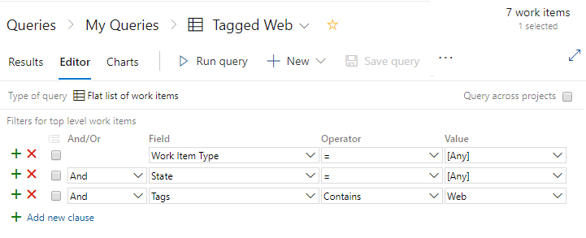

# Guidance to create high-performing queries  
 
[!INCLUDE [temp](../_shared/version-vsts-tfs-all-versions.md)]

While you can easily create a work item query, creating a high performing query requires a deeper understanding. Query performance can not only impact your individual productivity, but also dashboard performance and resource rate limits.  

> [!NOTE]   
> Reference to service or resource rate limits only applies to queries run against Azure DevOps Services. To learn more, see [Service limits and rate limits](../../user-guide/service-limits.md). 

This article provides some general guidelines on how to write a high performing query. These guidelines apply to both queries you create through the web portal as well as [REST API queries](/rest/api/azure/devops/wit/queries) and [az boards query](/cli/azure/ext/azure-devops/boards#ext-azure-devops-az-boards-query) command.

## Create focused, selective queries  

Apply all filters that are necessary for your query. The more selective the query is, the smaller the result set will be. The smaller the result set, the more targeted and selective your query is. 

Making your query more selective is always your first choice to create a high performing query. 
 
## Use tags

Use [work item tags](add-tags-to-work-items.md) to categorize your work items instead of a custom field. Queries that filter on tags usually perform faster over those that filter on string matches. 

Unlike matching or partial matching on a custom field, query with a `Tags Contains` predicate won't scan the entire work items tables. 

> [!div class="mx-imgBorder"]  
>   

## Use `Contains words` for string matches
 
When you want to filter on a string match, try using the `Contains Words` operator instead of `Contains`. The `Contains Words` operator performs a full-text search on the specified field, which is faster in most cases. 

While the `Contains` operator performs a table scan, which is not only slower, but also consumes more CPU cycles. These CPU cycles contribute towards your resource consuming rate limit. 
 
## Specify small groups when using the `In Group` operator 

The `In Group` operator supports matching a value that is a member of the group in the clause. Groups correspond to the name of a team, security group, or work tracking category. For example, you can create a query to find all work items that are assigned to members of the Contributors group or to a team. 

If you filter on a group that contains a large number of members, your result set will tend to be non-selective, returning a large result set. Also, if a group corresponds to a large Azure Active Directory (AAD) group, the query generates a fairly large cost to resolve that group from AAD.  

## Avoid use of negated operators 

Negated operators&mdash;such as `<>, Not In, Not Under, Not In Group`&mdash;are likely to make your query non-selective, which can result in a large result set. 

## Avoid string comparisons  

Comparing one string field with another string always performs a work item table scan, which is inefficient. Recommended guidance is to use tags or a specific custom field as alternatives, particularly when a query performs poorly. 
 
## Limit "Or" operators

Queries perform better when fewer `Or` operators are used. Too many `Or` operators can make your query non-selective. If your query runs slowly, try moving the `Or` operator clause towards the top of the query clauses.  
 

## Save your query 

Saved queries have a higher chance of performing better due to internal optimizations. Always save your query when you plan to reuse it.  Even when you execute the query by WIQL through a REST API, saving the WIQL through the web portal will make your REST API calls less prone to performance regressions in the future. 

[!INCLUDE [temp](../_shared/rest-apis-queries.md)]

## Related articles

- [Service limits and rate limits](../../user-guide/service-limits.md) 
- [Create managed queries](using-queries.md)
- [Query fields, operators & macros](query-operators-variables.md)
- [WIQL syntax](wiql-syntax.md)
- [Query quick reference](query-index-quick-ref.md)
- [az boards query command](/cli/azure/ext/azure-devops/boards#ext-azure-devops-az-boards-query)