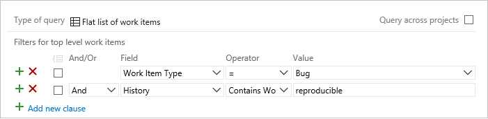

# Query by history   
 
[!INCLUDE [temp](../_shared/version-vsts-tfs-all-versions.md)]

The history of a work item tells you who opened the item, what changed, and why. This information helps you track how an item changes over time. When you enter information in the history field, provide as much information as possible to help the next work item owner understand what has happened and what they have to do.  


## Supported operators and macros 
Query clauses that specify the **History** field can use the **Contains Words** and **Does Not Contain Words** operators. Search against an exact phrase or to use the wildcard character, <b>*</b>. You can only use the wildcard character at the end of a partial word or phrase.

The **History** field is automatically indexed for full-text search when full-text search is available. See Full-Text and partial word searches 


## View the History of a work item 

You can use either the web portal or Team Explorer to view the history of a work item or find work items based on the contents of the **History** field. When you perform a search on the contents of the **History**  field, it returns only work items that have changes recorded in that field. That is, it doesn't register changes that were made to text in other fields.  

# [Browser](#tab/browser)

<a id="team-services" /> 
::: moniker range=">= tfs-2017"
 
::: moniker-end
::: moniker range=">= tfs-2013 <= tfs-2015"
 
::: moniker-end


# [Visual Studio 2015](#tab/visual-studio) 

<a id="tee-query-history" />
<a id="team-explorer" />
**Visual Studio 2015/Team Explorer and Team Explorer Everywhere**
 

---


## List items based on the contents of the History field  

::: moniker range=">= tfs-2017"
You use the query editor to add the **History** field to a [query clause](using-queries.md). Comments entered into the **Discussion** area are queryable. Change history entries, such as which fields were changed, aren't queryable. To quickly find items based on words entered into the Discussion area, or **Description** or other rich-text fields, consider using [work item search](../../project/search/work-item-search.md).
::: moniker-end
::: moniker range=">= tfs-2013 <= tfs-2015"
You use the query editor to add the **History** field to a [query clause](using-queries.md). Comments entered into the **History** field are queryable. Change history entries, such as which fields were changed, aren't queryable.
::: moniker-end

You can filter for work items by the date on which they were changed or for a specific time period. If you limit the scope of your query, it can help with performance by only returning those results that fit the date range that you want to include. 

<table width="100%">
<tbody valign="top">
<tr>
<th width="50%">Filter for</th>
<th width="50%">Include these query clauses</th>
</tr>
<tr>
<td>Items whose History field contains the word "reproducible"  
</td>
<td>
```History _ Contains Words _ reproducible```  
</td>
</tr>
<tr>
<td>Items whose History field doesn't contain the word "beta"
</td>
<td>
```History _ Does Not Contain Words _ beta```
</td>
</tr>
<tr>
<td>
Items that contain the phrase "stack traces" and were closed but reactivated
</td>
<td>
&nbsp;&nbsp;&nbsp;&nbsp;&nbsp;&nbsp;&nbsp;&nbsp;&nbsp;&nbsp;&nbsp;&nbsp;```History _ Contains Words _ stack traces```   
```And _ State _ Was Ever _ Closed```  
```And _ State _ <> _  Closed ```  
</td>
</tr>
<tr>
<td>
Items closed within a specified time period
</td>
<td>
&nbsp;&nbsp;&nbsp;&nbsp;&nbsp;&nbsp;&nbsp;&nbsp;&nbsp;&nbsp;&nbsp;&nbsp;```State _ = _ Done```  
```And _ Closed Date _ > _ 7/1/2015```  
```And _ Closed Date _ <= _ 7/21/2015```  
</td>
</tr>
<tr>
<td>
Items I've been associated with 
</td>
<td>
&nbsp;&nbsp;&nbsp;&nbsp;&nbsp;&nbsp;&nbsp;&nbsp;&nbsp;&nbsp;&nbsp;```History _ Contains Words _ MyName```  
```Or _ Assigned To _ Was Ever _ @Me```  
</td>
</tr>
</tbody>
</table>  

### Tips for using the query editor
<ul>
<li>Type the complete word or phrase that is specified in the **History** field of those work items that you want to find.</li>
<li>Enter the full text for the word that you want to search. The **History** field is indexed for full-text search. If you enter only a partial word, the query will not return work items that contain the full word. For example, if the **History** field contains the phrase *reproducible behavior* and you search for *repro*, the work item will not be found. However, if you search for the complete word *reproducible*, the work item will be found. You can also search for the string with a wild card, such as ```repro*```. </li>
<li>The query editor ignores common words or stop words as defined in [Configure and Manage Stopwords and Stoplists for Full-Text Search](https://msdn.microsoft.com/library/ms142551.aspx).</li>
<li>On the query editor toolbar, choose  or  icon and confirm that your query returns expected results.</li>
<li>If you don't receive the results you expect, adjust the word or phrase that you entered, and run the query again.</li> 
</ul> 


## View the history of work items  

An entry is made to the **History** field each time a work item is saved. To view the history of changes, open an existing work item, and then choose the  or **History** tab, or for some work item types, choose the **Details** tab. 

<a id="web-portal-explorer-tab" /> 
The history details shown depend on the platform, version, and client you user. 

# [Browser](#tab/browser)


<a id="team-services-tab" /> 
<a id="team-services-view" /> 
::: moniker range=">= tfs-2017"
     
  

The state change history diagram appears first. To see the entire history of state changes, choose **Show all**.


Choose an entry in the left pane to view the details of changes made.
     
  
::: moniker-end

::: moniker range="tfs-2017"
> [!NOTE]  
> With TFS 2017 and later versions, the **History** field is no longer a rich-text field. To annotate the work item history, add to the **Description** or **Discussion** fields. 
::: moniker-end


::: moniker range=">= tfs-2013 <= tfs-2015"
To view only the comments that were added to the log, choose the **Discussion Only** tab. To view all changes made to the item, choose the **All Changes** tab, and then choose the **show all changes** link for a specific date and time.  
 
 


::: moniker-end


# [Visual Studio](#tab/visual-studio) 

To view only the comments that were added to the log, choose the **Discussion Only** tab. To view all changes made to the item, choose the **All Changes** tab, and then choose the **show all changes** link for a specific date and time.  
 
 

---


## Fields that support history, auditing, and revision tracking 

You can use the following fields to filter queries and create reports. Several of these fields are populated with information as a work item progresses from one state to another. Other fields update when the work item is modified. Some fields don't appear on the work item form, but they are tracked for the WITs listed.  


<table width="100%">
<tbody valign="top">
<tr>
  <th width="18%">Field name</th>
  <th width="64%">Description</th>
  <th width="18%">Work item type</th>
</tr>

<tr>
<td>
<p>Changed By</p>
</td>
<td>
The name of the team member who modified the work item most recently.
	<p>Reference name=System.ChangedBy, Data type=String</p>
</td>
<td>All</td>
</tr>
<tr>
  <td>
    <p>Change Date</p>
  </td>
  <td>
    <p>The date and time when a work item was modified.</p>
	<p>Reference name=System.ChangedDate, Data type=DateTime</p>
  </td>
<td>All</td>
</tr>
<tr>
  <td>
    <p>Closed Date <sup>1</sup> </p>
  </td>
  <td>
    <p>The date and time when a work item was closed.</p>
	<p>Reference name=Microsoft.VSTS.Common.ClosedDate, Data type=DateTime</p>
  </td>
<td>All</td>
</tr>
<tr>
  <td>
    <p>Created Date</p>
  </td>
  <td>
    <p>The date and time when a work item was created.</p> 
	<p>Reference name=System.CreatedDate, Data type=DateTime</p>
  </td>
<td>All</td>
</tr>
<tr>
<td>History</td>
<td>
The record of changes that were made to the work item after it was created. Every time that the work item is updated, information is appended to the history, which specifies the date of the change, who made the changes, and which fields were changed. 
<p>You can't add formatted text to the history field. Once you've saved the work item, you can't alter the history. </p>
<p>The ```History``` field, along with the ```Description```, ```Steps to Repro``` and ```Title``` fields are automatically indexed for full-text search as described in [Query fields, operators, and macros](query-operators-variables.md). </p>

	<p>Reference name=System.History, Data type=History</p>

</td>
<td>
All
</td>
</tr>
<tr>
  <td>
    <p>Resolved Date <sup>1</sup> </p>
  </td>
  <td>
    <p>The date and time when the work item was moved into a Resolved state. </p>

	<p>Reference name=Microsoft.VSTS.Common.ResolvedDate, Data type=DateTime</p>
  </td>
  <td>Bug (Agile, CMMI) 
  </td>
</tr>

<tr>
<td>
<p>Rev</p>
</td>
<td>
<p>A number that is assigned to the historical revision of a work item. </p>
	<p>Reference name=System.Rev, Data type=Integer</p>
</td>
<td>All</td>
</tr>


<tr>
  <td>
    <p>State Change Date</p>
  </td>
  <td>
    <p>The date and time when the value of the State field changed.</p>
	<p>Reference name=Microsoft.VSTS.Common.StateChangeDate, Data type=DateTime</p>
  </td>
<td>All</td>
</tr>

<tr>
  <td>
<a id="test-suite-audit"/>Test Suite Audit
  </td>
  <td>
    <p>Tracks additional operations performed when modifying a test suite, for example: adding tests to a test suite or changing configurations. This field can be viewed through the History tab or through a separate query. There will be a consolidated history view, including changes performed to work items field and changes resulting from related artifacts such as test points and configurations.</p>
	<p>Reference name=Microsoft.VSTS.TCM.TestSuiteAudit, Data type=PlainText</p>

  </td>
  <td>
Test Suite
  </td>
</tr>

<tr>
  <td>
<a id="watermark"/>Watermark
  </td>
  <td>
    <p>A system managed field (not editable) that increments with changes made to a work item.</p>
	<p>Reference name=System.Watermark, Data type=Integer</p>

  </td>
  <td>
All
  </td>
</tr>

</tbody>
</table>

#### Notes: 
1. For these fields to be defined for a WIT, they must be included in the ```WORKFLOW``` section of the WIT definition. For example, this syntax is included within the ```FIELDS``` definition when transitioning to a Resolved state:  
 
	```xml
	<FIELD refname="Microsoft.VSTS.Common.ResolvedDate">  
	   <SERVERDEFAULT from="clock" />  
	</FIELD>  
	```

## Related articles
To learn more about creating and saving queries, see also: 

- [Query editor](using-queries.md)
- [Query fields, operators, and macros](query-operators-variables.md)   
- [Query by date or current iteration](query-by-date-or-current-iteration.md)


### Get history programmatically
See [Work item tracking](/rest/api/azure/devops/wit/)  for ways to extract history information programmatically.  

[!INCLUDE [temp](../_shared/rest-apis-queries.md)]
 
 
 
