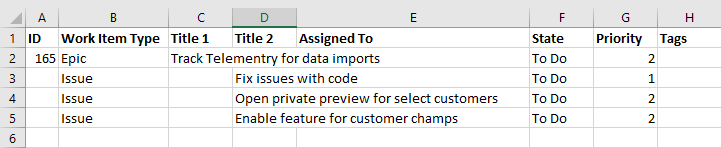
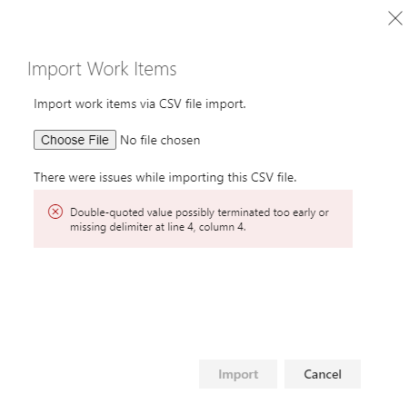

# Import/update bulk work items with CSV files

[!INCLUDE [version-gt-eq-2019](../../includes/version-gt-eq-2019.md)]

::: moniker range="> azure-devops-2019"
Import and export work items in bulk using a CSV formatted file in Azure DevOps. While you can continue to use Excel for bulk import and updates, you can use the native import/export feature that doesn't require Excel. For more information, see [Bulk add or modify work items with Excel](../backlogs/office/bulk-add-modify-work-items-excel.md).
::: moniker-end 

::: moniker range="azure-devops-2019"
You can export of work items in bulk using a CSV formatted file. While you continue to use Excel for bulk import and updates, you can use the native export feature from Queries that doesn't require Excel. For more information, see [Bulk add or modify work items with Excel](../backlogs/office/bulk-add-modify-work-items-excel.md).
::: moniker-end 

> [!NOTE]   
> The **export** feature is available with [Azure DevOps Server 2019 Update 1](https://go.microsoft.com/fwlink/?LinkId=2097609) and later versions. The **import** feature is available with Azure DevOps Server 2020 and Azure DevOps Services. 

::: moniker range=">= azure-devops-2020"

## Import new work items

All work items that you import get created in a *New* state. This rule means that you can't specify field values that don't meet the field rules for the new state. For example, when you create a new user story with the Agile process, the *State* = *New* and the *Reason* = *New*. You can't specify any other values.

1. Create a local ***import.csv*** file and open it in Visual Studio Code or Excel.

2. The file must contain the **Work Item Type** and the **Title** fields. You can include other fields as needed. For a list of default fields, see [Work item field index](../work-items/guidance/work-item-field.md).  

	In the following example, we include the **Priority** field.

   > [!div class="tabbedCodeSnippets"]
   ```CSV
   Work Item Type,Title,Priority
   Issue,Fix issues with code,1
   Issue,Merge testing modules,3
   Issue,Open private preview for select customers,2
   Issue,Enable feature for customer champs,2
   Issue,Remove old test code,2
   ```

3. From the web portal for your project, open **Boards** > **Queries**, and then select the **Import Work Items** option.

   :::image type="content" source="media/import-csv/open-queries-import.png" alt-text="Screenshot showing Boards - Queries, Import Work Items.":::

4. Select your CSV file and then choose **Import**.

   :::image type="content" source="media/import-csv/import-file.png" alt-text="Screenshot showing Import Work Items Button Image.":::

   The import process loads the imported work items into the queries view in an **unsaved** state. No IDs get assigned. 
   
5. Verify the results and then select **Save items** to save the work items.

   :::image type="content" source="media/import-csv/imported-file.png" alt-text="Screenshot showing Save button for imported work items.":::

	> [!NOTE]  
	> Don't assign IDs to new work items that you're adding, otherwise you receive an error message similar to the following if you do so. 
	> :::image type="content" source="media/import-csv/import-work-item-ids-assigned.png" alt-text="Screenshot of Error message of work item ID.":::

6. The system highlights those work items with data issues. Resolve the data issues before you save the work items. In this example, an invalid value has been entered into the Priority field. Fix the data by opening the work item directly. Instead, use [bulk edit](../backlogs/bulk-modify-work-items.md) to fix several work items with the same issue.

   :::image type="content" source="media/import-csv/imported-file-error.png" alt-text="Screenshot showing fix work items with data issues.":::

> [!TIP]   
> You can add parent-child links between work items you import by indenting the title columns as shown in the example later in this article, [Can I import a CSV file that have parent-child links?](#tree-items). However, you can't specify any other link types when importing or updating work items.  

## Update existing work items

1. To update work items, create a query that contains all the columns you want to export and possibly edit. Save your query and select **Export to CSV** to save the data.csv file to your local machine.

   :::image type="content" source="media/import-csv/export-query.png" alt-text="Screenshot showing export work items, CSV.":::

	The exported file should look similar to the following syntax:

	> [!div class="tabbedCodeSnippets"]
	```CSV
	ID,Work Item Type,State,Assigned To,Title,Tags
	"1043","Issue","To Do",,"Fix issues with code",
	"1044","Issue","To Do",,"Merge testing modules",
	"1045","Issue","To Do",,"Open private preview for select customers",
	"1046","Issue","To Do",,"Enable feature for customer champs",
	"1047","Issue","To Do",,"Remove old test code",
	```

2. Make the edits to your work items. Your CSV file must contain the **ID**, **Work Item Type**, **Title**, and **State** fields. Any other fields you want to include are optional.

> [!NOTE]   
> When you import identity fields, enter the name and email in the following format `"Display Name <email>"`. For example, to assign work to Jamal Hartnett, specify `"Jamal Hartnett <fabrikamfiber4@hotmail.com>"`. If you specify a value that isn't recognized as a valid user to the system, you may encounter problems with the import. 

   In the following example, we change several values on existing working items.

> [!div class="tabbedCodeSnippets"]
	```CSV
	ID,Work Item Type,State,Assigned To,Title,Tags
	"1043","Issue","To Do","Jamal Hartnett <fabrikamfiber4@hotmail.com>","Fix issues with code",architecture
	"1044","Issue","To Do","Jamal Hartnett <fabrikamfiber4@hotmail.com>","Merge testing modules",testing
	"1045","Issue","To Do","Raisa Pokrovskaya <fabrikamfiber5@hotmail.com>","Open private preview for select customers","customer focus"
	"1046","Issue","To Do","Raisa Pokrovskaya <fabrikamfiber5@hotmail.com>","Enable feature for customer champs","customer focus"
	"1047","Issue","To Do","Christie Church <fabrikamfiber1@hotmail.com>","Remove old test code",architecture
	```

3. Save the file and import (see steps 4-6 from the previous [import section](#import-new-work-items).)

4. The results list with work items that contain value changes appear highlighted in bold. Select **Save Items** to apply the changes.

   :::image type="content" source="media/import-csv/bulk-update-import.png" alt-text="Screenshot showing Import Work Items, Save Items.":::

5. Work items with data issues get highlighted in red and must be resolved before you can save them. In this example, an invalid value appears in the Assigned To field. Fix the data by opening the work item directly. You can use bulk edit if you have many work items with the same issue.

   :::image type="content" source="media/import-csv/import-update-error-1.png" alt-text="Screenshot showing Invalid value appearing in the Assigned To field.":::

::: moniker-end 

::: moniker range=">= azure-devops-2019"

## Export list as a CSV file

From any query, you can export a list of work items as a comma-delimited list. [Open the query](view-run-query.md), select the :::image type="icon" source="../../media/icons/actions-icon.png" border="false"::: actions icon, and then select **Export to CSV**.
::: moniker-end

::: moniker range="azure-devops-2019"
> [!NOTE]   
> Requires Azure DevOps Server 2019 Update 1 or later version. 
::: moniker-end

::: moniker range=">= azure-devops-2019"
:::image type="content" source="../work-items/media/email/export.png" alt-text="Screenshot showing Export a query as CSV."::: 

::: moniker-end 

::: moniker range=">= azure-devops-2020"

## Export and import work items to a different project

You can use this feature to export work items from one project and import them to another project. However, before you import them to another project, you must remove the work item ID. You get an error if you attempt to import new work items to a project with an ID specified. 

## Import or update rich-text fields 

You can update or import rich-text fields such as the **Description** or **Acceptance Criteria** fields. Rich-text fields are HTML formatted fields. Replace lines ending in CRLF by surrounding sentences with `<p>... </p>`. 

For example, you can import the following work item, which includes three lines of text in the Description field. 

> [!div class="tabbedCodeSnippets"]
```CSV
Work Item Type,Title,Description
"Product Backlog Item","Hello World Web Site - 8","<p><strong>&nbsp;You can include bold text</strong></p><p><em>&nbsp;And italic text</em></p><p><u>&nbsp;Underline text</u></p>"
```

::: moniker-end 

::: moniker range=">= azure-devops-2020"

## FAQs

### Q: Can I import new items and update existing items in the same CSV file?

A: Absolutely! Leave the ID field empty for any new work items. In the following example, the last entry for an Epic doesn't specify an ID.

> [!div class="tabbedCodeSnippets"]
```CSV
ID,Work Item Type,Title,Assigned To,State,Priority,Tags
"16504","Issue","Fix issues with code",,"To Do","1",
"16505","Issue","Merge testing modules",,"To Do","3",
"16506","Issue","Open private preview for select customers",,"To Do","2",
"16507","Issue","Enable feature for customer champs",,"To Do","2",
"16508","Issue","Remove old test code",,"To Do","2",
,"Epic","Track Telemetry for data imports",,"To Do","2",
```

### Q: How do I add multiple tags?

A: You can add multiple tags separated by a semicolon. For more information, see [Tasks you can and can't do with Excel](../backlogs/office/bulk-add-modify-work-items-excel.md). 

<a id="tree-items" /> 

### Q: Can I import a CSV file that has parent-child links?

A: Yes, you can add child work items by indenting title columns. The following example adds three child issues under the already defined Epic.

> [!div class="tabbedCodeSnippets"]
```CSV
ID,Work Item Type,Title 1,Title 2,Assigned To,State,Priority,Tags
"165","Epic","Track Telemetry for data imports",,,"To Do","2",
,"Issue",,"Fix issues with code",,"To Do","1",
,"Issue",,"Open private preview for select customers",,"To Do","2",
,"Issue",,"Enable feature for customer champs",,"To Do","2",
```

> [!div class="mx-imgBorder"]  
> 

### Q: How do I know if my imported file has errors?

A: You can test by adding tags with spaces and hyphens, for example, and include it in the export. The import should match the same format. Any problems with the formatting of your CSV file appear in the Results page of the import view. You can't import the work items until the formatting and syntax is correct.

> [!div class="mx-imgBorder"]  
> 

The work item results always list the data errors found for individual work items. Fix each error either from the web portal, or in the CSV file and import again.

### Q: Why am I getting errors for some identity values?

A: When you use the Web UI, the identity picker goes through extra steps to validate the user. First it checks to see if the person is a valid user in the org. If not, it searches on the identity in Azure Active Directory (Azure AD). If the user's in Azure AD but not in the org, that user gets added to the valid identities. When you import via CSV, for performance reasons, the identity picker doesn't go through these extra steps. It only checks to see if there's a matching UPN already in the org. If it doesn't find a matching UPN, it reports that the identity is unknown.

### Q: Does CSV import support all work item types?

A: No, the CSV import doesn't support the following work item types:

- Code Review Request
- Code Review Response
- Feedback Request
- Feedback Response
- Test Case
- Test Plan
- Test Suite
- Shared Parameter

For more information, see [Bulk import or export test cases](../../test/copy-clone-test-items.md#bulk-import-or-export-test-case).

::: moniker-end 

## Related articles

- [Work item field index](../work-items/guidance/work-item-field.md)
- [Bulk add or modify work items with Excel](../backlogs/office/bulk-add-modify-work-items-excel.md)
- [FAQs: Work in Excel connected to Azure Boards](../backlogs/office/faqs.yml)
