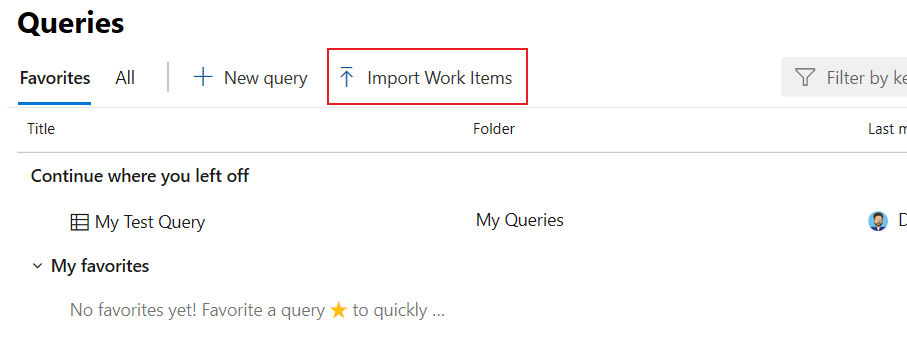
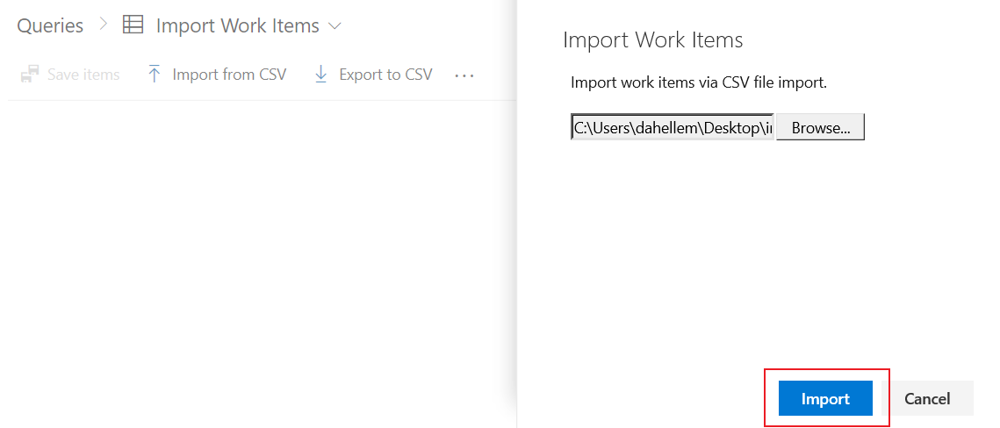
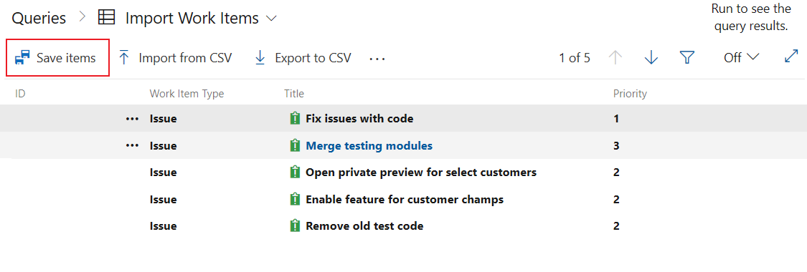
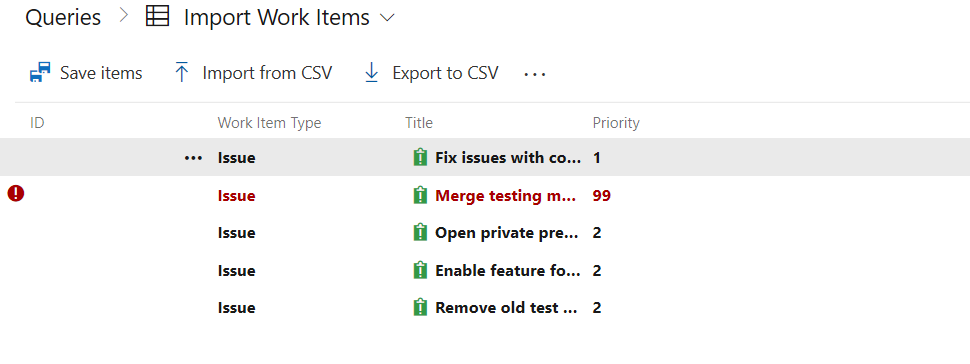
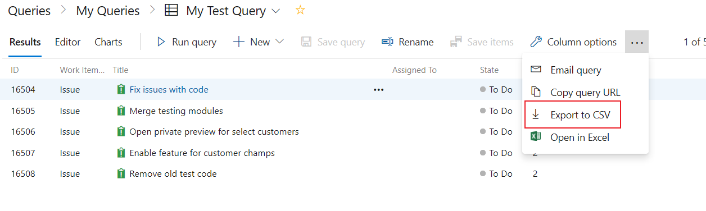
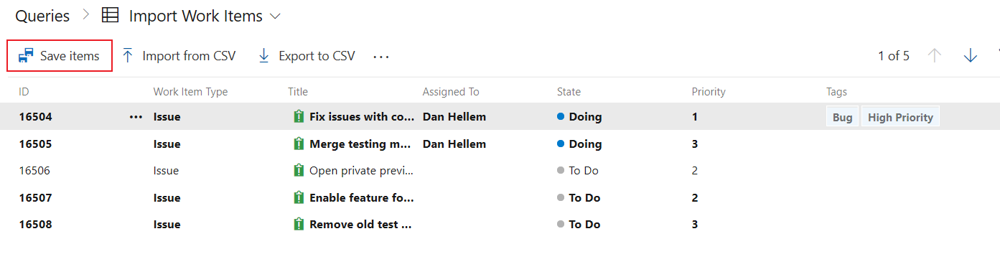
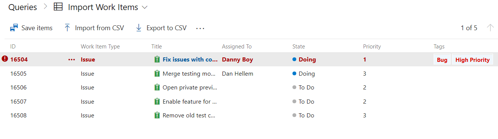
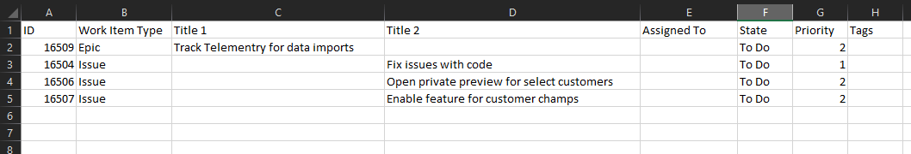
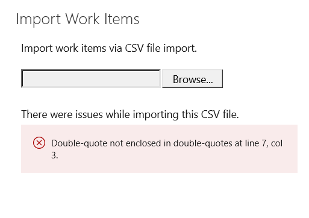

# Import work items

[!INCLUDE [temp](../_shared/version-vsts-only.md)]

Learn how to import new work items or update existing items from a CSV file. Import is now directly native to the Azure Boards product and the Excel plugin is no longer required.

> [!NOTE]  
> This feature is currently under private preview. <a href="mailto:dahellem@microsoft.com">Please email us directly</a> if you wish to enroll.

## Importing new work items

1. Create a local ***import.csv*** file and open it in VS Code or Excel

2. The file must contain the **Work Item Type** and the **Title** fields. You can include other columns as needed. In this example we also included the Priority field.

   ```
   Work Item Type,Title,Priority
   Issue,Fix issues with code,1
   Issue,Merge testing modules,3
   Issue,Open private preview for select customers,2
   Issue,Enable feature for customer champs,2
   Issue,Remove old test code,2
   ```

3. From the queries hub in Azure Boards, click on the "Import Work Items" option.

   

4. Select your CSV file and click the "Import" button.

   

5. The import process will load the imported work items into the queries view for review. The work items have **not** been saved yet. You must click "Save Items" to save the work items.

   

6. Work items with data issues will be highlighted and need to be resolved before they can be saved. In this example we have a bad value in the priority field. Fix the data by opening the work item directly. Alternatively, you can use bulk edit if you have many work items with the same issue.

   

## Updating existing work items

1. Create a query that contains all the columns you want to export and possibly edit. Save your query and select "Export to CSV" to save the data.csv file to your local machine.

   

   If you open the exported file, it should look simular to the following

   ```
   ID,Work Item Type,Title,Assigned To,State,Priority,Tags
   "16504","Issue","Fix issues with code",,"To Do","1",
   "16505","Issue","Merge testing modules",,"To Do","3",
   "16506","Issue","Open private preview for select customers",,"To Do","2",
   "16507","Issue","Enable feature for customer champs",,"To Do","2",
   "16508","Issue","Remove old test code",,"To Do","2",
   ```

2. Make the edits to your work items. When editing work items, the CSV file must contain the **ID**, **Work Item Type**, **Title**, and **State** fields. Plus any optional fields.

   In this example we are going to change several values on the existing working items.

   ```
   ID,Work Item Type,Title,Assigned To,State,Priority,Tags
   "16504","Issue","Fix issues with code",Dan Hellem,"Doing","1","Bug; High Priority"
   "16505","Issue","Merge testing modules",Dan Hellem,"Doing","3",
   "16506","Issue","Open private preview for select customers",,"To Do","2",
   "16507","Issue","Enable feature for champs and top customers",,"To Do","2",
   "16508","Issue","Remove old test code",,"To Do","3",
   ```

3. Save the file and import (see steps 4-6 above)

4. Any work items with value changes will be highlighted in bold. Click "Save Items" to apply the changes.

   

5. Work items with data issues will be highlighted and need to be resolved before they can be saved. In this example we have a bad value in the Assigned To field. Fix the data by opening the work item directly. Alternatively, you can use bulk edit if you have many work items with the same issue.

   

## Q&A

### Can I import new items and update existing items in the same CSV file?

Absolutely! Leave the ID field empty for any new work items. In the example below, note the Epic item is missing the ID.

```
ID,Work Item Type,Title,Assigned To,State,Priority,Tags
"16504","Issue","Fix issues with code",,"To Do","1",
"16505","Issue","Merge testing modules",,"To Do","3",
"16506","Issue","Open private preview for select customers",,"To Do","2",
"16507","Issue","Enable feature for customer champs",,"To Do","2",
"16508","Issue","Remove old test code",,"To Do","2",
,"Epic","Track Telementry for data imports",,"To Do","2",
```

### Can I import a CSV file that has a child parent relationship?

Yes, child work items can be created by having indented title columns. The below example creates 3 child Issues under an Epic.

```
ID,Work Item Type,Title 1,Title 2,Assigned To,State,Priority,Tags
"16509","Epic","Track Telementry for data imports",,,"To Do","2",
"16504","Issue",,"Fix issues with code",,"To Do","1",
"16506","Issue",,"Open private preview for select customers",,"To Do","2",
"16507","Issue",,"Enable feature for customer champs",,"To Do","2",
```

Here is a better visual in Excel



### How do I know if my imported file has errors?

Any problems with the formating of your CSV file will be shown to you on the import screen. You won't be able to import the work items untill the formatting and syntax is correct.



Data errors will be shown to you from the work items results (see above). From there you can fix the data in the UI or fix the CSV file and try to import again.
