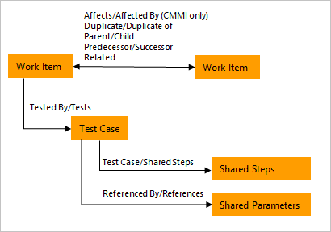
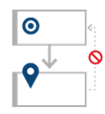
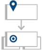
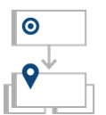
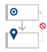
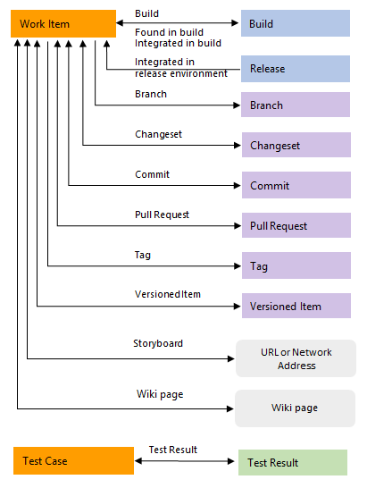
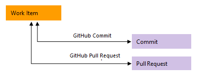

# Reference guide for link types used in Azure DevOps and Azure Boards

[!INCLUDE [version-lt-eq-azure-devops](../../includes/version-lt-eq-azure-devops.md)]

<a id="link-type-guidance"></a>

You can use different link types to manage the various relationships between work items and other artifacts, like builds, commits, pull requests, and more. 

You can link work items to other work items or artifacts using the following link types.

::: moniker range="azure-devops"

- [**Work link types**](#work-link-types): links work items including select test case management work items
- [**Hyperlink**](#hyperlink): connects a work item to any URL or network share
- [**External link types**](#external-link-types): connects a work item to an external object, such as a code object, build, or wiki page
- [**Remote work link types**](#remote-work-link-types): connects work items that are defined in different organizations
- [**GitHub link types**](#github-link-types): connects a work item to a GitHub repository commit, issue, or pull request.


A specific field maintains a count of links for the first four link types, such as *Related Link Count*, *Hyperlink Count*, *External Link Count*, and *Remote Link Count*.  

::: moniker-end 

::: moniker range=">= azure-devops-2019 < azure-devops"  

- [**Work link types**](#work-link-types): links work items including select test case management work items
- [**Hyperlink**](#hyperlink): connects a work item to any URL or network share
- [**External link types**](#external-link-types): connects a work item to an external object, such as a code object, build, or wiki page
- [**GitHub link types**](#github-link-types): connects a work item to a GitHub repository commit or pull request.     


A specific field maintains a count of links for the first three link types, such as *Related Link Count*, *Hyperlink Count*, and *External Link Count*.  

::: moniker-end 


::: moniker range="tfs-2018"  

- [**Work link types**](#work-link-types): links work items including select test case management work items
- [**Hyperlink**](#hyperlink): connects a work item to any URL or network share
- [**External link types**](#external-link-types): connects a work item to an external object, such as a code object, build, or storyboard.   

A specific field maintains a count of links for each of these link types, such as *Related Link Count*, *Hyperlink Count*, and *External Link Count*.  

::: moniker-end 

Link types you use to link work items are subject to certain restrictions based on their topology. Use the guidance provided in the following tables to choose which link type to use based on the types of queries and reports you'll want to create.  To learn more about the different topologies, see [Link type topologies and restrictions](/previous-versions/azure/devops/reference/xml/link-type-element-reference#topology).


<a id="work-link-types">  </a>

## Work link types 

Work link types are system-defined, process-defined, or user-defined (custom). The links listed in the following table are system defined. 

Each work link type defines the link labels, topology type, and restrictions that are used when links between work items are constructed. For example, the parent-child link type defines two labels: Parent and Child. The link type also supports a hierarchical or tree topology, and prevents circular references from being created between work items. 



A work item's [*Related Link Count*](linking-attachments.md#related-link-count) corresponds to the sum of all links defined with a work link type.

::: moniker range="< azure-devops"  

The following table describes the work item link types you can specify to scope a links control using the [**WorkItemLinksFilter** XML element](/previous-versions/azure/devops/reference/xml/linkscontroloptions-xml-elements?view=tfs-2017&preserve-view=true). 

::: moniker-end  


:::row:::
   :::column span="1":::
   **Name**
   :::column-end:::
   :::column span="3":::
   **Reference name**
   :::column-end:::
   :::column span="3":::
   **Usage**
   :::column-end:::
:::row-end:::
---
:::row:::
   :::column span="1":::
   **Affects-Affected by**  (CMMI only)     
    
   :::column-end:::
   :::column span="3":::
   Microsoft.VSTS.Common.Affects-Forward  
   Microsoft.VSTS.Common.Affects-Reverse  
   Topology type: Dependency  
   Link category: Process-defined  
   :::column-end:::
   :::column span="3":::
   
   Use this directional link to create links between any set of work items, but not ones that would create closed loops. Typically used to track change requests made to requirements.

   Restrictions and recommendations:
   
   - You can link a change request to only one requirement using Affects. You can link requirements to as many child change requests as needed using Affected by.

   
   - Only use Affects-Affected by links to link work items in the same project. This action is recommended if you plan to use Excel or Project to modify or update work item data.

    
   :::column-end:::
:::row-end:::
:::row:::
   :::column span="1":::
   **Child-Parent**  
     
    
   :::column-end:::
   :::column span="3":::
   System.LinkTypes.Hierarchy-Forward  
   System.LinkTypes.Hierarchy-Reverse  
   Topology type: Tree  
   Link category: System-defined  
   :::column-end:::
   :::column span="3":::
   
   Use this directional link to create one-to-many relationships between a single parent to one or more child items. Use to organize work item within a hierarchy. You can quickly create this hierarchy among backlog items using the [mapping function](../backlogs/organize-backlog.md) or among backlog items and tasks using the [sprint backlog](../sprints/assign-work-sprint.md) or [Taskboard](../sprints/task-board.md).

   Typical uses include:
 
   
   - Maintain task summary relationships. Parent-child links are created for summary tasks and their subordinate tasks.
   - Link tasks to PBIs, user stories, or requirements. Supports Backlog Overview, Stories Overview, and Requirements Overview reports.

   Restrictions and recommendations:
   - Use Excel to bulk edit both work items and parent-child links. See [Bulk add or modify work items with Excel](../backlogs/office/bulk-add-modify-work-items-excel.md).
   - A work item can have only one Parent. A parent work item can have many children.
   - Only use parent-child links to link work items in the same project. This action is recommended if you plan to use Excel to modify or update work item data.
 
   :::column-end:::
:::row-end:::
:::row:::
   :::column span="1":::
   **Duplicate-Duplicate of** 
    
    
   :::column-end:::
   :::column span="3":::
   System.LinkTypes.Duplicate-Forward  
   System.LinkTypes.Duplicate-Reverse  
   Topology type: Tree  
   Link category: System-defined  
   :::column-end:::
   :::column span="3":::
   
   Use this directional link to create one-to-many relationships between a single parent to one or more child items. Use to track tasks, bugs, or other work items that are duplicates of one another.  

   Restrictions and recommendations:

   - A work item can have only one Duplicate. 
   - Only use Duplicate or Duplicate Of links to link work items in the same project. This action is recommended if you plan to use Excel or Project to modify or update work item data.
 
   :::column-end:::
:::row-end:::
:::row:::
   :::column span="1":::
   **Referenced By-References**  
    
    
   :::column-end:::
   :::column span="3":::
   Microsoft.VSTS.TestCase.  
   SharedParameterReferencedBy  
   Topology type: Dependency  
   Link category: Process-defined  
   :::column-end:::
   :::column span="3":::
   
   Use to link test cases to shared parameters. Use to link Test Cases to Shared Parameters to support the ability to [repeat a test with different data](../../test/repeat-test-with-different-data.md). In general, you wouldn&#39;t add this link type to a scoped links control.  To learn more, see [Repeat a test with different data](../../test/repeat-test-with-different-data.md). 

   :::column-end:::

:::row-end:::
:::row:::
   :::column span="1":::
   **Related**  
    
   :::column-end:::
   :::column span="3":::
   System.LinkTypes.Related  
   Topology type: Network  
   Link category: System-defined  
   :::column-end:::
   :::column span="3":::
   Use this non-directional link to create links between any set of work items. Use to link work items that are at the same level, such as two user stories that define features that overlap one another. The Related link type creates simple relationships with few restrictions. 
   - Relate work items that are at the same level, such as two user stories that define features that overlap one another.
   - Link work items that are defined in different projects and managed by different teams.
   - Find and view work items and their related work items in a two-tiered view.
   - Create simple relationships with few restrictions.

   :::column-end:::
:::row-end:::
:::row:::
   :::column span="1":::
   **Successor-Predecessor**  
    
    
   :::column-end:::
   :::column span="3":::
   System.LinkTypes.Dependency  

   Topology type: Dependency  
   Link category: System-defined  
   Choose **Predecessor** link type when linking to a work item that should be completed before the work item you're linking from. Choose **Successor** link type when linking to a work item that should be completed *after* to the work item you're linking from.

   :::column-end:::
   :::column span="3":::
   Use this directional link to create links between any set of work items, but not ones that would create closed loops. Use to track tasks that must be completed before others can be started. When you plan work using Microsoft Project, linked tasks are represented as predecessor-successor links in Azure Boards. Typically used to track work that must be completed before beginning work on predecessor items. 

   - Track tasks that must be completed before others can be started. When you plan work using Project, linked tasks are represented as predecessor-successor links in TFS.
   - Supports one-to-many relationships.
   - Find and view predecessor work items and their successor work items in a two-tiered, direct links query view.

   Restrictions and recommendations:-  

   - An error appears when you attempt to create links that define circular relationships.
   - Create predecessor-successor links only to work items that are within the same project. 
     You can create predecessor-successor links between work items that are defined in different projects. However, if you export a query to Excel or Project, only those work items that are defined for the project for which the query is defined are imported.   
   :::column-end:::
:::row-end:::
:::row:::
   :::column span="1":::
   **Tested by-Tests**   
    
    
   :::column-end:::
   :::column span="3":::
   Microsoft.VSTS.Common.TestedBy-Forward  
   Microsoft.VSTS.Common.TestedBy-Reverse  
   Topology type: Dependency  
   Link category: Process-defined  
   :::column-end:::
   :::column span="3":::
   
   Link test cases to work items, such as bugs, user stories, requirements, and product backlog items. Use to track test cases that test user stories (Agile), product backlog items (Scrum), or requirements (CMMI). Can also link to other work item types such as bugs, issues, or tasks. For on-premises Azure DevOps, there are several SQL reports that depend on these links. See [Review team activities to support useful reports](/previous-versions/azure/devops/report/admin/review-team-activities-for-useful-reports#monitor-progress).

   :::column-end:::
:::row-end:::
:::row:::
   :::column span="1":::
   **Test Case-Shared Steps**  
    
    
   :::column-end:::
   :::column span="3":::
   Microsoft.VSTS.TestCase.  
   SharedStepReferencedBy  
   Topology type: Dependency  
   Link category: Process-defined  
   :::column-end:::
   :::column span="3":::
   
   Use to link test cases with shared steps. You [share steps between test cases](/previous-versions/azure/devops/test/mtm/share-steps-between-test-cases) to avoid having to create multiple entries of the same sequence of steps. To learn more, see [Share steps between test cases](/previous-versions/azure/devops/test/mtm/share-steps-between-test-cases).

   :::column-end:::
:::row-end:::

<a id="hyperlink">  </a>

## Hyperlink link type

There's one link type that tracks the number of hyperlinks&mdash;[*Hyperlink Count*](linking-attachments.md#hyper-link-count)&mdash;added to a work item. A hyperlink can link a work item to any URL. 

> [!div class="mx-imgBorder"]  
>  

:::row:::
   :::column span="1":::
   **Link name**
   :::column-end:::
   :::column span="1":::
   **Tool supported**
   :::column-end:::
   :::column span="1":::
   **Artifact type**
   :::column-end:::
   :::column span="1":::
   **Usage**
   :::column-end:::
:::row-end:::
---
:::row:::
   :::column span="1":::
   Hyperlink
   :::column-end:::
   :::column span="1":::
   Work item tracking
   :::column-end:::
   :::column span="1":::
   Hyperlink
   :::column-end:::
   :::column span="1":::
   Used to link a work item to a URL. **Workitem Hyperlink** is the name of this link type in the [Artifact Link Types API](/rest/api/azure/devops/wit/artifact-link-types/list). 
   :::column-end:::
:::row-end:::


<a id="external-link-types">  </a>

## External link types

External link types are system-defined link types that support linking work items to other objects stored within Azure DevOps as shown in the following image. A work item's [*External Link Count*](linking-attachments.md#external-link-count) corresponds to the sum of all links defined with an external link type. 

> [!div class="mx-imgBorder"]  
>  

> [!NOTE]   
> You can only use an external link type to link to an Azure DevOps object. To link work items to other objects outside of Azure DevOps, you can use the [Hyperlink](#hyperlink) link type. 

::: moniker range="azure-devops"  
The following table describes the external link types you can choose when adding a link type from a work item or test case. 
::: moniker-end  

::: moniker range="< azure-devops"  
The following table describes the external link types you can choose when adding a link type from a work item or test case. Also, you can use specify one of these link types to scope a links control using the [**ExternalLinksFilter** XML element](/previous-versions/azure/devops/reference/xml/linkscontroloptions-xml-elements?view=tfs-2017&preserve-view=true). 
::: moniker-end  


:::row:::
   :::column span="":::
      **Link name**
   :::column-end:::
   :::column span="":::
      **Tool supported**
   :::column-end:::
   :::column span="":::
      **Artifact type**
   :::column-end:::
   :::column span="":::
      **Usage**
   :::column-end:::
:::row-end:::
---
:::row:::
   :::column span="":::
      Branch
   :::column-end:::
   :::column span="":::
      Git
   :::column-end:::
   :::column span="":::
      Branch
   :::column-end:::
   :::column span="":::
      Used to link a work item to a branch.
   :::column-end:::
:::row-end:::
:::row:::
   :::column span="":::
      Pipelines/Build
   :::column-end:::
   :::column span="":::
      Build
   :::column-end:::
   :::column span="":::
      Build
   :::column-end:::
   :::column span="":::
      Used to link a work item to a build.
   :::column-end:::
:::row-end:::
:::row:::
   :::column span="":::
      Changeset (or Fixed in Changeset)
   :::column-end:::
   :::column span="":::
      VersionControl
   :::column-end:::
   :::column span="":::
      Changeset
   :::column-end:::
   :::column span="":::
      Used to link a work item to a changeset. 
   :::column-end:::
:::row-end:::
:::row:::
   :::column span="":::
      Commit (or Fixed in Commit)
   :::column-end:::
   :::column span="":::
      Git
   :::column-end:::
   :::column span="":::
      Commit
   :::column-end:::
   :::column span="":::
      Used to link a work item to a commit.
   :::column-end:::
:::row-end:::
:::row:::
   :::column span="":::
      Found in build
   :::column-end:::
   :::column span="":::
      Pipelines/Build
   :::column-end:::
   :::column span="":::
      Build
   :::column-end:::
   :::column span="":::
      Used to link a work item to a build.
   :::column-end:::
:::row-end:::
:::row:::
   :::column span="":::
      Integrated in build
   :::column-end:::
   :::column span="":::
      Build
   :::column-end:::
   :::column span="":::
      Build pipeline
   :::column-end:::
   :::column span="":::
      Used to link a work item to a build.
   :::column-end:::
:::row-end:::
:::row:::
   :::column span="":::
      Integrated in release environment
   :::column-end:::
   :::column span="":::
      Release
   :::column-end:::
   :::column span="":::
      Release pipeline
   :::column-end:::
   :::column span="":::
      Used to link a release to a work item. The system creates a link of this type when a user enables the **Report deployment status to Work** option for a release definition. To learn how to set this option, see [Release pipelines, How do I integrate and report release status?](../../pipelines/release/index.md#how-do-i-integrate-and-report-release-status) 
   :::column-end:::
:::row-end:::
:::row:::
   :::column span="":::
      Pull Request
   :::column-end:::
   :::column span="":::
      Git
   :::column-end:::
   :::column span="":::
      PullRequestId
   :::column-end:::
   :::column span="":::
      Used to link a work item to a pull request. 
   :::column-end:::
:::row-end:::
:::row:::
   :::column span="":::
      Result attachment  
   :::column-end:::
   :::column span="":::
      Test Management
   :::column-end:::
   :::column span="":::
      TcmResultAttachment
   :::column-end:::
   :::column span="":::
      Used to link a work item to an attachment associated with a test result. These links appear when you associate a work item with a test result from **Test** or Microsoft Test Manager. 
   :::column-end:::
:::row-end:::
:::row:::
   :::column span="":::
      Source Code File<
   :::column-end:::
   :::column span="":::
      VersionControl 
   :::column-end:::
   :::column span="":::
      LatestItemVersion
   :::column-end:::
   :::column span="":::
      Used to link a work item to a file under Team Foundation version control (TFVC).   
   :::column-end:::
:::row-end:::
:::row:::
   :::column span="":::
      Storyboard
   :::column-end:::
   :::column span="":::
      Requirements
   :::column-end:::
   :::column span="":::
      Storyboard
   :::column-end:::
   :::column span="":::
      Used to link a work item to a PowerPoint file or other file that contains story boarding information on a network. 
   :::column-end:::
:::row-end:::
:::row:::
   :::column span="":::
      Tag
   :::column-end:::
   :::column span="":::
      Git
   :::column-end:::
   :::column span="":::
      Tag
   :::column-end:::
   :::column span="":::
      Used to link a work item to a tag that&#39;s been defined for a git commit or git repository. For more information, see [Work from the Git command prompt](../../repos/git/command-prompt.md).
   :::column-end:::
:::row-end:::
:::row:::
   :::column span="":::
      Test Result
   :::column-end:::
   :::column span="":::
      Test Management
   :::column-end:::
   :::column span="":::
      TcmResult
   :::column-end:::
   :::column span="":::
      Used to link a work item to a test result. These links appear when you associate a work item with a test result from **Test** or Microsoft Test Manager.  
   :::column-end:::
:::row-end:::
:::row:::
   :::column span="":::
      Versioned item
   :::column-end:::
   :::column span="":::
      VersionControl 
   :::column-end:::
   :::column span="":::
      LatestItemVersion
   :::column-end:::
   :::column span="":::
      Used to link a work item to a file or changeset defined within a TFVC repository. **Source Code File** is the name of this link type in the [Artifact Link Types API](/rest/api/azure/devops/wit/artifact-link-types/list).   
   :::column-end:::
:::row-end:::
:::row:::
   :::column span="":::
      Wiki
   :::column-end:::
   :::column span="":::
      Wiki
   :::column-end:::
   :::column span="":::
      Wiki
   :::column-end:::
   :::column span="":::
      Used to link a work item to a wiki page. Supported for TFS 2018.2 and later versions.
   :::column-end:::
:::row-end:::


<a id="github-link-types">  </a>

::: moniker range=">= azure-devops-2019"

## GitHub link types

GitHub link types are system-defined link types. They support linking work items to GitHub objects as shown in the following image.  

::: moniker-end

::: moniker range=">= azure-devops-2020"

> [!div class="mx-imgBorder"]  
>   

::: moniker-end

::: moniker range="azure-devops-2019"

> [!div class="mx-imgBorder"]  
>  

::: moniker-end

::: moniker range=">= azure-devops-2019"

> [!IMPORTANT]  
> You can only link to GitHub artifacts whose repositories you have connected to Azure Boards. To create that connection, see [Connect Azure Boards to GitHub](../github/connect-to-github.md). To learn more about linking to GitHub artifacts, see [Link GitHub commits, pull requests, and issues to work items](../github/link-to-from-github.md).

The following table describes the GitHub link types you can choose when adding a link type from a work item. 

:::row:::
   :::column span="1":::
      **Link name**
   :::column-end:::
   :::column span="1":::
      **Artifact type**
   :::column-end:::
   :::column span="2":::
      **Usage**
   :::column-end:::
:::row-end:::
---
:::row:::
   :::column span="1":::
      GitHub Commit
   :::column-end:::
   :::column span="1":::
      GitHub repository commit
   :::column-end:::
   :::column span="2":::
      Used to link a work item to a GitHub commit.
   :::column-end:::
:::row-end:::
::: moniker-end
::: moniker range=">= azure-devops-2020"
:::row:::
   :::column span="1":::
      GitHub Issue
   :::column-end:::
   :::column span="1":::
      GitHub repository issue
   :::column-end:::
   :::column span="2":::
      Used to link a work item to a GitHub issue.
   :::column-end:::
:::row-end:::
::: moniker-end
::: moniker range=">= azure-devops-2019"
:::row:::
   :::column span="1":::
      GitHub Pull Request
   :::column-end:::
   :::column span="1":::
      GitHub repository pull request
   :::column-end:::
   :::column span="2":::
      Used to link a work item to a GitHub pull request.
   :::column-end:::
:::row-end:::
 
::: moniker-end

::: moniker range="azure-devops"   

<a id= "remote-work-link-types" />

## Remote work link types

Remote work link types are system-defined link types that support linking work items defined in different organizations. Organizations must be managed by the same Azure Active Directory as described in [Connect your organization to Azure Active Directory](../../organizations/accounts/connect-organization-to-azure-ad.md). 

A work item's [*Remote Link Count*](linking-attachments.md#remote-link-count) corresponds to the sum of all links defined with a remote work link type. 


:::row:::
   :::column span="":::
      **Name**
   :::column-end:::
   :::column span="":::
      **Reference name**
   :::column-end:::
   :::column span="":::
      **Usage**
   :::column-end:::
:::row-end:::
---
:::row:::
   :::column span="":::
      **Consumes From-Produced For**  
      (Dependency topology)
      
      
   :::column-end:::
   :::column span="":::
      System.LinkTypes.Remote.Dependency-Forward  
      System.LinkTypes.Remote.Dependency-Reverse  
      Topology type: Dependency  
      Link category: System-defined  
   :::column-end:::
   :::column span="":::
      Use this directional link to create links between work items that have dependencies and are defined in different organizations. Organizations must be managed by the same Azure Active Directory. Typically used to track change requests made to requirements.
   :::column-end:::
:::row-end:::
:::row:::
   :::column span="":::
      **Remote Related**  
      
   :::column-end:::
   :::column span="":::
      System.LinkTypes.Remote.Related  
      Topology type: Network  
      Link category: System-defined  
   :::column-end:::
   :::column span="":::
      Use this non-directional link to create links between work items defined in different organizations. Organizations must be managed by the same Azure Active Directory.
   :::column-end:::
:::row-end:::


::: moniker-end  

::: moniker range="< azure-devops" 

## Custom link types

You can create custom link types; export and import definitions of link types; and delete, activate, deactivate, and reactivate types of links. See the following articles:  
- [Link type element reference](/previous-versions/azure/devops/reference/xml/link-type-element-reference) 
- [Manage link types (`witadmin`)](/previous-versions/azure/devops/reference/witadmin/manage-link-types). 

::: moniker-end


## List link types

To get a list of link types, you can use one of the supported command-line tools. 

::: moniker range="azure-devops" 

### az boards work-item relation list-type  

You can list link types supported by your organization with the [az boards work-item relation list-type](/cli/azure/boards/work-item/relation#az-boards-work-item-relation-list-type) command or the [Work Item Relation Types - List](/rest/api/azure/devops/wit/work-item-relation-types/list) REST API command. To get started, see [Get started with Azure DevOps CLI](../../cli/index.md). 

```azurecli
az boards work-item relation list-type [--org]
```

#### Optional parameters

- **org**: Azure DevOps organization URL. You can configure the default organization using `az devops configure -d organization=ORG_URL`. Required if not configured as default or picked up using `git config`. Example: `--org https://dev.azure.com/MyOrganizationName/`.


#### Example

The following command lists the work item link types in table format that are defined for the fabrikam organization. For other formats, see [Output formats for Azure CLI commands](/cli/azure/format-output-azure-cli).  

```azurecli
az boards work-item relation list-type --org fabrikam --output table
Name                  ReferenceName                                                Enabled    Usage
--------------------  -----------------------------------------------------------  ---------  ------------
Produces For          System.LinkTypes.Remote.Dependency-Forward                   True       workItemLink
Consumes From         System.LinkTypes.Remote.Dependency-Reverse                   True       workItemLink
Duplicate             System.LinkTypes.Duplicate-Forward                           True       workItemLink
Duplicate Of          System.LinkTypes.Duplicate-Reverse                           True       workItemLink
Referenced By         Microsoft.VSTS.TestCase.SharedParameterReferencedBy-Forward  True       workItemLink
References            Microsoft.VSTS.TestCase.SharedParameterReferencedBy-Reverse  True       workItemLink
Tested By             Microsoft.VSTS.Common.TestedBy-Forward                       True       workItemLink
Tests                 Microsoft.VSTS.Common.TestedBy-Reverse                       True       workItemLink
Test Case             Microsoft.VSTS.TestCase.SharedStepReferencedBy-Forward       True       workItemLink
Shared Steps          Microsoft.VSTS.TestCase.SharedStepReferencedBy-Reverse       True       workItemLink
Successor             System.LinkTypes.Dependency-Forward                          True       workItemLink
Predecessor           System.LinkTypes.Dependency-Reverse                          True       workItemLink
Child                 System.LinkTypes.Hierarchy-Forward                           True       workItemLink
Parent                System.LinkTypes.Hierarchy-Reverse                           True       workItemLink
Related               System.LinkTypes.Related                                     True       workItemLink
Remote Related        System.LinkTypes.Remote.Related                              True       workItemLink
Attached File         AttachedFile                                                 True       resourceLink
Hyperlink             Hyperlink                                                    True       resourceLink
Artifact Link         ArtifactLink                                                 True       resourceLink
```

The default json format provides additional information about the attributes defined for the link types. For example, the information for the link types *Produces For* and *Consumes From* are listed as follows. 

```output
  {
    "attributes": {
      "acyclic": true,
      "directional": true,
      "editable": false,
      "enabled": true,
      "isForward": true,
      "oppositeEndReferenceName": "System.LinkTypes.Remote.Dependency-Reverse",
      "remote": true,
      "singleTarget": true,
      "topology": "dependency",
      "usage": "workItemLink"
    },
    "name": "Produces For",
    "referenceName": "System.LinkTypes.Remote.Dependency-Forward",
    "url": "https://dev.azure.com/mseng/_apis/wit/workItemRelationTypes/System.LinkTypes.Remote.Dependency-Forward"
  },
  {
    "attributes": {
      "acyclic": true,
      "directional": true,
      "editable": false,
      "enabled": true,
      "isForward": false,
      "oppositeEndReferenceName": "System.LinkTypes.Remote.Dependency-Forward",
      "remote": true,
      "singleTarget": true,
      "topology": "dependency",
      "usage": "workItemLink"
    },
    "name": "Consumes From",
    "referenceName": "System.LinkTypes.Remote.Dependency-Reverse",
    "url": "https://dev.azure.com/mseng/_apis/wit/workItemRelationTypes/System.LinkTypes.Remote.Dependency-Reverse"
  },

```

::: moniker-end

### `witadmin listlinktypes` 

You can list link types supported for your project collection using the [`witadmin listlinktypes`](/previous-versions/azure/devops/reference/witadmin/manage-link-types) command-line tool or the [Work Item Relation Types - List](/rest/api/azure/devops/wit/work-item-relation-types/list) REST API command. 

Here we list the link types for the fabrikam-sever default collection: 

```CLI
C:\Program Files (x86)\Microsoft Visual Studio\2019\Community\Common7\IDE\CommonExtensions\Microsoft\TeamFoundation\Team Explorer>witadmin listlinktypes /collection:http://fabrikam-server/DefaultCollection

Reference Name: Microsoft.VSTS.TestCase.SharedParameterReferencedBy
Names: Referenced By, References
Topology: Dependency
Is Active: True

Reference Name: Microsoft.VSTS.Common.TestedBy
Names: Tested By, Tests
Topology: Dependency
Is Active: True

Reference Name: Microsoft.VSTS.TestCase.SharedStepReferencedBy
Names: Test Case, Shared Steps
Topology: Dependency
Is Active: True

Reference Name: System.LinkTypes.Duplicate
Names: Duplicate, Duplicate Of
Topology: Tree
Is Active: True

Reference Name: System.LinkTypes.Dependency
Names: Successor, Predecessor
Topology: Dependency
Is Active: True

Reference Name: System.LinkTypes.Hierarchy
Names: Child, Parent
Topology: Tree
Is Active: True

Reference Name: System.LinkTypes.Related
Name: Related
Topology: Network
Is Active: True

```

### Link type attributes

The following table provides descriptions for each of the link type attributes returned by **Azure Boards** CLI or the REST API.  


:::row:::
   :::column span="":::
      **Attribute**
   :::column-end:::
   :::column span="2":::
      **Description**
   :::column-end:::
:::row-end:::
---
:::row:::
   :::column span="":::
      Names, `name`
   :::column-end:::
   :::column span="2":::
      Specifies the friendly name assigned to the link type(s). Directional links are defined in pairs, therefore  include a forward and reverse name. 
   :::column-end:::
:::row-end:::
:::row:::
   :::column span="":::
      Reference name, `referenceName`
   :::column-end:::
   :::column span="2":::
      Specifies the name assigned to the link type or link type pair.  
   :::column-end:::
:::row-end:::
:::row:::
   :::column span="":::
      `acyclic`
   :::column-end:::
   :::column span="2":::
      Indicates whether the link type allows or (`true`) or restricts (`false`) circular relationships. For example, tree type links restrict circular relationships. For more information, see [LinkTypes elements reference](/previous-versions/azure/devops/reference/xml/link-type-element-reference). 
   :::column-end:::
:::row-end:::
:::row:::
   :::column span="":::
      `directional`
   :::column-end:::
   :::column span="2":::
      Indicates whether the link type is directional (`true`) or not (`false`).  Directional link types are defined in pairs with a forward and reverse component. For more information, see [LinkTypes elements reference](/previous-versions/azure/devops/reference/xml/link-type-element-reference). 
   :::column-end:::
:::row-end:::
:::row:::
   :::column span="":::
      `editable`
   :::column-end:::
   :::column span="2":::
      Indicates whether the link type is editable (`true`) or not (`false`). You can only add and edit custom link types for on-premises deployments using [`witadmin` Manage link type](/previous-versions/azure/devops/reference/witadmin/manage-link-types) command-line tool. System link types always have `editable=false`.  
:::row-end:::
:::row:::
   :::column span="":::
      Is Active, `enabled`
   :::column-end:::
   :::column span="2":::
      Indicates whether the link type is active (`true`) or not (`false`). You can only custom link types for on-premises deployments using the [`witadmin` Manage link type](/previous-versions/azure/devops/reference/witadmin/manage-link-types) command-line tool. 
   :::column-end:::
:::row-end:::
:::row:::
   :::column span="":::
      `isForward`
   :::column-end:::
   :::column span="2":::
      Indicates whether the link type specifies the forward link  (`true`) or not (`False`) within a link type pair.
   :::column-end:::
:::row-end:::
:::row:::
   :::column span="":::
      `oppositeEndReferenceName`
   :::column-end:::
   :::column span="2":::
      Specifies the reference name of the link type that defines the link in the opposite direction of a link type pair. 
   :::column-end:::
:::row-end:::
:::row:::
   :::column span="":::
      `remote`
   :::column-end:::
   :::column span="2":::
      Indicates whether the link type supports linking to a remore work item  (`true`) or not (`False`). Link types with `remote=false` require that the target work item resides in the same organization or collection as the origin work item.   
   :::column-end:::
:::row-end:::
:::row:::
   :::column span="":::
      `singleTarget`
   :::column-end:::
   :::column span="2":::
      Indicates whether the link type allows for more than one target (`false`) or is restricted to a single target (`true`).  
   :::column-end:::
:::row-end:::
:::row:::
   :::column span="":::
      `topology`
   :::column-end:::
   :::column span="2":::
      Specifies the topology type&mdash;dependency`, `network`, and `tree`. For descriptions, see [Link type topologies and restrictions](/previous-versions/azure/devops/reference/xml/link-type-element-reference#topology). 
   :::column-end:::
:::row-end:::
:::row:::
   :::column span="":::
      `usage`
   :::column-end:::
   :::column span="2":::
      Specifies the usage type&mdash;resourceLink or `workItemLink`. The workItemLink` value indicates a link type that links two work items. The `resourceLink` value indicates a link type used to link a work item to a resource, such as a URL or attachment.  
   :::column-end:::
:::row-end:::
:::row:::
   :::column span="":::
      `url`
   :::column-end:::
   :::column span="2":::
      Lists the attributes of the link type in json format.  
   :::column-end:::
:::row-end:::

## Related articles

- [Link work items to track dependencies](link-work-items-support-traceability.md)    
- [Add link to multiple work items](../backlogs/add-link.md)  
- [Query FAQs](query-faqs.yml)
- [Track dependencies using Delivery Plans](../plans/track-dependencies.md)
- [Use mapping to link backlog items to features and epics](../backlogs/organize-backlog.md)
- [Bulk modify links using Excel](../backlogs/office/bulk-add-modify-work-items-excel.md)  
- [Link type topologies and restrictions](/previous-versions/azure/devops/reference/xml/link-type-element-reference#link-type-topologies-and-restrictions)
- [Artifact Link Types API](/rest/api/azure/devops/wit/artifact-link-types/list)
