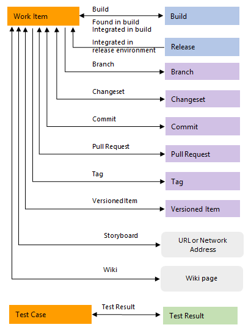

# Link type reference 

[!INCLUDE [temp](../../_shared/version-vsts-tfs-all-versions.md)]

Different link types are used to manage the different relationships that you can make among work items or between work items and other artifacts, such as builds, commits, pull requests, and more. 

You can link work items to other work items or artifacts using the following link types.

::: moniker range="azure-devops"

- [**Work link types**](#work-link-types): links work items including select test case management work items
- [**Hyperlink**](#hyperlink): connects a work item to any URL or network share
- [**External link types**](#external-link-types): connects a work item to an external object, such as a code object, build, or wiki page
- [**Remote work link types**](#remote-work-link-types): connects work items that are defined in different organizations
- [**GitHub link types**](#github-link-types): connects a work item to a GitHub repository commit, issue, or pull request.

A specific field maintains a count of links for the first four link types, such as <em>Related Link Count</em>, <em>Hyperlink Count</em>, <em>External Link Count</em>, and <em>Remote Link Count</em>.  

::: moniker-end 

::: moniker range="azure-devops-2019"  

- [**Work link types**](#work-link-types): links work items including select test case management work items
- [**Hyperlink**](#hyperlink): connects a work item to any URL or network share
- [**External link types**](#external-link-types): connects a work item to an external object, such as a code object, build, or wiki page
- [**GitHub link types**](#github-link-types): connects a work item to a GitHub repository commit or pull request.     

A specific field maintains a count of links for the first three link types, such as <em>Related Link Count</em>, <em>Hyperlink Count</em>, and <em>External Link Count</em>.  

::: moniker-end 

::: moniker range="<= tfs-2018"  

- [**Work link types**](#work-link-types): links work items including select test case management work items
- [**Hyperlink**](#hyperlink): connects a work item to any URL or network share
- [**External link types**](#external-link-types): connects a work item to an external object, such as a code object, build, or storyboard.   

A specific field maintains a count of links for each of these link types, such as <em>Related Link Count</em>, <em>Hyperlink Count</em>, and <em>External Link Count</em>.  

::: moniker-end 

Link types you use to link work items are subject to certain restrictions based on their topology. Use the guidance provided in the following tables to choose which link type to use based on the types of queries and reports you'll want to create.  To learn more about the different topologies, see [Link type topologies and restrictions](../../reference/xml/link-type-element-reference.md#topology).

## Work link types

Work link types are system-defined, process-defined, or user-defined (custom). The links listed in the following table are system defined. 

Each work link type defines the link labels, topology type, and restrictions that are used when links between work items are constructed. For example, the parent-child link type defines two labels (Parent and Child), supports a hierarchical or tree topology, and prevents circular references from being created between work items. 

A work item's [*Related Link Count*](linking-attachments.md#related-link-count) corresponds to the sum of all links defined with a work link type.

::: moniker range=">= tfs-2017 <= azure-devops-2019"  

The following table describes the work item link types you can specify to scope a links control using the [**WorkItemLinksFilter** XML element](../../reference/xml/linkscontroloptions-xml-elements.md). 

::: moniker-end  

::: moniker range=">= tfs-2013 <= tfs-2015"  

The following table describes the work item link types you can specify to scope a links control using the [**WorkItemLinksFilter** XML element](../../reference/xml/linkscontroloptions-elements.md). 

::: moniker-end  

<table>
<tbody valign="top">
<tr>
<th width="20%">Name</th>
<th width="17%">Reference name</th>
<th width="63%">Usage</th>
</tr>
<tr>
<td><strong>Affects-Affected by</strong> (CMMI only)   
 
</td>
<td>
Microsoft.VSTS.Common.Affects-Forward 
Microsoft.VSTS.Common.Affects-Reverse

Topology type: Dependency 
Link category: Process-defined

</td>
<td>

Use this directional link to create links between any set of work items, but not ones that would create closed loops. Typically used to track change requests made to requirements.

Restrictions and recommendations:
<ul>
<li>
You can link a change request to only one requirement using Affects. You can link requirements to as many child change requests as needed using Affected by.

</li>
<li>
Only use Affects-Affected by links to link work items in the same project. This action is recommended if you plan to use Excel or Project to modify or update work item data.
</li>
</ul> </td>
</tr>
<tr>
<td><strong>Child-Parent</strong> 
 
 
</td>
<td>
System.LinkTypes.Hierarchy-Forward 
System.LinkTypes.Hierarchy-Reverse

Topology type: Tree 
Link category: System-defined
</td>
<td>
Use this directional link to create one-to-many relationships between a single parent to one or more child items. Use to organize work item within a hierarchy. You can quickly create this hierarchy among backlog items using the <a href="../backlogs/organize-backlog.md" data-raw-source="[mapping function](../backlogs/organize-backlog.md)">mapping function</a> or among backlog items and tasks using the <a href="../sprints/assign-work-sprint.md" data-raw-source="[sprint backlog](../sprints/assign-work-sprint.md)">sprint backlog</a> or <a href="../sprints/task-board.md" data-raw-source="[task board](../sprints/task-board.md)">task board</a>.

Typical uses include:
 
<ul>
<li>
Create a work breakdown structure (WBS). See <a href="../backlogs/office/create-your-backlog-tasks-using-project.md" data-raw-source="[Schedule tasks and assign resources using Microsoft Project](../backlogs/office/create-your-backlog-tasks-using-project.md)">Schedule tasks and assign resources using Microsoft Project</a>.
</li><li>
Map backlog items to portfolio backlog items. Mapping items automatically creates parent-child links between the items. To learn about mapping, see <a href="../backlogs/organize-backlog.md" data-raw-source="[Organize your backlog](../backlogs/organize-backlog.md)">Organize your backlog</a>.
</li><li>
Maintain task summary relationships. Parent-child links are created for summary tasks and their subordinate tasks.
</li><li>
Link tasks to PBIs, user stories, or requirements. Supports Backlog Overview, Stories Overview, and Requirements Overview reports.
</li></ul>Restrictions and recommendations:<ul><li>
Use Excel to bulk edit both work items and parent-child links. See <a href="../backlogs/office/bulk-add-modify-work-items-excel.md" data-raw-source="[Bulk add or modify work items with Excel](../backlogs/office/bulk-add-modify-work-items-excel.md)">Bulk add or modify work items with Excel</a>.
</li><li>
A work item can have only one Parent. A parent work item can have many children.
</li><li>
Only use parent-child links to link work items in the same project. This action is recommended if you plan to use Excel or Project to modify or update work item data.
</li></ul> </td>
</tr>
<tr>
<td><strong>Duplicate-Duplicate of</strong> 1  
 
 
</td>
<td>
System.LinkTypes.Duplicate-Forward 
System.LinkTypes.Duplicate-Reverse

Topology type: Tree 
Link category: System-defined

</td>
<td>

Use this directional link to create one-to-many relationships between a single parent to one or more child items. Use to track tasks, bugs, or other work items which are duplicates of one another.  

Restrictions and recommendations:

<ul><li>
A work item can have only one Duplicate. 
</li><li>
Only use Duplicate/Duplicate Of links to link work items in the same project. This action is recommended if you plan to use Excel or Project to modify or update work item data.
</li></ul> </td>
</tr>
<tr>
<td><strong>Referenced By-References</strong> 
 
 
</td>
<td>
Microsoft.VSTS.TestCase. SharedParameterReferencedBy

Topology type: Dependency 
Link category: Process-defined
</td>
<td>

Use to link test cases to shared parameters. Use to link Test Cases to Shared Parameters to support the ability to <a href="../../test/repeat-test-with-different-data.md" data-raw-source="[repeat a test with different data](../../test/repeat-test-with-different-data.md)">repeat a test with different data</a>. In general, you wouldn&#39;t add this link type to a scoped links control.  To learn more, see <a href="../../test/repeat-test-with-different-data.md" data-raw-source="[Repeat a test with different data](../../test/repeat-test-with-different-data.md)">Repeat a test with different data</a>. 

</td>
</tr>
</tr>
<tr>
<td><strong>Related</strong> 
 
</td>
<td>
System.LinkTypes.Related

Topology type: Network 
Link category: System-defined
</td>
<td>Use this non-directional link to create links between any set of work items. Use to link work items that are at the same level, such as two user stories that define features that overlap one another. The Related link type creates simple relationships with few restrictions. 
<ul><li>
Relate work items that are at the same level, such as two user stories that define features that overlap one another.
</li><li>
Link work items that are defined in different projects and managed by different teams.
</li><li>
Find and view work items and their related work items in a two-tiered view.
</li><li>
Create simple relationships with few restrictions.
</li></ul></td>
</tr>
<tr>
<td><strong>Successor-Predecessor</strong> 
 
 
</td>
<td>
System.LinkTypes.Dependency

Topology type: Dependency 
Link category: System-defined

Choose <strong>Predecessor</strong> link type when linking to a work item that should be completed <em>prior</em> to the work item you are linking from. Choose <strong>Successor</strong> link type when linking to a work item that should be completed <em>after</em> to the work item you are linking from.

</td>
<td>
Use this directional link to create links between any set of work items, but not ones that would create closed loops. Use to track tasks that must be completed before others can be started. When you plan work using Microsoft Project, linked tasks are represented as predecessor-successor links in Azure Boards. Typically used to track work that must be completed prior to beginning work on predecessor items. 

<ul><li>
Track tasks that must be completed before others can be started. When you plan work using Project, linked tasks are represented as predecessor-successor links in TFS.
</li><li>
Supports one-to-many relationships.
</li><li>
Find and view predecessor work items and their successor work items in a two-tiered, direct links query view.
</li></ul>Restrictions and recommendations:<ul><li>
An error appears when you attempt to create links that define circular relationships.
</li><li>
Create predecessor-successor links only to work items that are within the same project. 
You can create predecessor-successor links between work items that are defined in different projects. However, if you export a query to Excel or Project, only those work items that are defined for the project for which the query is defined are imported.
</li></ul> </td>
</tr>
<tr>
<td><strong>Tested by-Tests</strong>  
 
 
</td>
<td>
Microsoft.VSTS.Common.TestedBy-Forward 
Microsoft.VSTS.Common.TestedBy-Reverse

Topology type: Dependency 
Link category: Process-defined
</td>
<td>

Link test cases to work items, such as bugs, user stories, requirements, and product backlog items. Use to track test cases that test user stories (Agile), product backlog items (Scrum), or requirements (CMMI). Can also link to other work item types such as bugs, issues, or tasks. For on-premises TFS, there are several SQL reports that depend on these links. See <a href="../../report/admin/review-team-activities-for-useful-reports.md#monitor-progress" data-raw-source="[Review team activities to support useful reports](../../report/admin/review-team-activities-for-useful-reports.md#monitor-progress)">Review team activities to support useful reports</a>

</td>
</tr>
<tr>
<td><strong>Test Case-Shared Steps</strong> 
 
 
</td>
<td>
Microsoft.VSTS.TestCase. SharedStepReferencedBy

Topology type: Dependency 
Link category: Process-defined
</td>
<td>

Use to link test cases with shared steps. You <a href="../../test/mtm/share-steps-between-test-cases.md" data-raw-source="[share steps between test cases](../../test/mtm/share-steps-between-test-cases.md)">share steps between test cases</a> to avoid having to create multiple entries of the same sequence of steps.To learn more, see <a href="../../test/mtm/share-steps-between-test-cases.md" data-raw-source="[Share steps between test cases](../../test/mtm/share-steps-between-test-cases.md)">Share steps between test cases</a>.

</td>
</tr>
</tbody>
</table>

**Notes:**
1. Available from TFS 2017 and later versions. 

## Hyperlink type

There is one link type that tracks the number of hyperlinks&mdash;[*Hyperlink Count*](linking-attachments.md#hyper-link-count)&mdash; added to a work item. A hyperlink can link a work item to any URL. 

> [!div class="mx-imgBorder"]  
>  

<table width="100%"> 
<tbody valign="top">
<tr>
<th width="15%">Link name</th>
<th width="12%">Tool supported</th>
<th width="12%">Artifact type</th>
<th width="60%">Usage</th>
</tr>
<tr>
<td>Hyperlink</td>
<td>Work item tracking</td>
<td>Hyperlink</td>
<td>Used to link a work item to a URL. Note that <strong>Workitem Hyperlink</strong> is the name of this link type in the <a href="/rest/api/azure/devops/wit/artifact%20link%20types/list" data-raw-source="[Artifact Link Types API](/rest/api/azure/devops/wit/artifact%20link%20types/list)">Artifact Link Types API</a>. </td>
</tr>
</tbody>
</table>

## External link types

External link types are system-defined link types. They support linking work items to other objects as shown in the following image. A work item's [*External Link Count*](linking-attachments.md#external-link-count) corresponds to the sum of all links defined with a external link type. 

> [!div class="mx-imgBorder"]  
>  

::: moniker range="azure-devops"  
The following table describes the external link types you can choose when adding a link type from a work item or test case. 
::: moniker-end  

::: moniker range=">= tfs-2017 <= azure-devops-2019"  
The following table describes the external link types you can choose when adding a link type from a work item or test case. Also, you can use specify one of these link types to scope a links control using the [**ExternalLinksFilter** XML element](../../reference/xml/linkscontroloptions-xml-elements.md). 
::: moniker-end  

::: moniker range=">= tfs-2013 <= tfs-2015"  
The following table describes the external link types you can choose when adding a link type from a work item or test case. Also, you can use specify one of these link types to scope a links control using the [**ExternalLinksFilter** XML element](../../reference/xml/linkscontroloptions-elements.md). 
::: moniker-end   

<table width="100%"> 
<tbody valign="top">
<tr>
<th width="15%">Link name</th>
<th width="12%">Tool supported</th>
<th width="12%">Artifact type</th>
<th width="60%">Usage</th>
</tr>
<tr>
<td>Branch</td>
<td>Git</td>
<td>Branch</td>
<td>Used to link a work item to a branch.</td>
</tr>
<tr>
<td>Pipelines/Build</td>
<td>Build</td>
<td>Build</td>
<td>Used to link a work item to a build.</td>
</tr>
<tr>
<td>Changeset (or Fixed in Changeset)</td>
<td>VersionControl</td>
<td>Changeset</td>
<td>Used to link a work item to a changeset. </td>
</tr>
<tr>
<td>Commit (or Fixed in Commit)</td>
<td>Git</td>
<td>Commit</td>
<td>Used to link a work item to a commit.</td>
</tr>
<tr>
<td>Found in build</td>
<td>Pipelines/Build</td>
<td>Build</td>
<td>Used to link a work item to a build.</td>
</tr>
<tr>
<td>Integrated in build</td>
<td>Build</td>
<td>Build pipeline</td>
<td>Used to link a work item to a build.</td>
</tr>
<tr>
<td>Integrated in release environment</td>
<td>Release</td>
<td>Release pipeline</td>
<td>Used to link a release to a work item. The system creates a link of this type when a user enables the <strong>Report deployment status to Work</strong> option for a release definition. To learn how to set this option, see <a href="../../pipelines/release/index.md#how-do-i-integrate-and-report-release-status">Release pipelines, How do I integrate and report release status?</a>. 
</td>
</tr>
<tr>
<td>Model Link</td>
<td>ArchitectureTools</td>
<td>ModelLink</td>
<td>(Not supported within the web portal) Used to link a work item to a diagram&mdash;such as an Activity, Component, Layer, Use Case, or other diagram&mdash;stored within the system. You can link diagrams to work items only from the Visual Studio client. </td>
</tr>
<tr>
<td>Pull Request</td>
<td>Git</td>
<td>PullRequestId</td>
<td>Used to link a work item to a pull request. </td>
</tr>
<tr>
<td>Result attachment   </td>
<td>Test Management</td>
<td>TcmResultAttachment</td>
<td>Used to link a work item to an attachment associated with a test result. These links appear when you associate a work item with a test result from <strong>Test</strong> or Microsoft Test Manager. </td>
</tr>
<tr>
<td>Source Code File</td>
<td>VersionControl </td>
<td>LatestItemVersion</td>
<td>Used to link a work item to a file under Team Foundation version control (TFVC).   </td>
</tr>
<tr>
<td>Storyboard</td>
<td>Requirements</td>
<td>Storyboard</td>
<td>Used to link a work item to a PowerPoint file on a network. See <a href="../backlogs/office/storyboard-your-ideas-using-powerpoint.md#link-storyboard" data-raw-source="[Storyboard your ideas using PowerPoint](../backlogs/office/storyboard-your-ideas-using-powerpoint.md#link-storyboard)">Storyboard your ideas using PowerPoint</a> for details.  </td>
</tr>
<tr>
<td>Tag</td>
<td>Git</td>
<td>Tag</td>
<td>Used to link a work item to a tag that&#39;s been defined for a git commit or git repository. See <a href="../../repos/git/command-prompt.md" data-raw-source="[Work from the Git command prompt](../../repos/git/command-prompt.md)">Work from the Git command prompt</a> for more information. </td>
</tr>
<tr>
<td>Test Result </td>
<td>Test Management</td>
<td>TcmResult</td>
<td>Used to link a work item to a test result. These links appear when you associate a work item with a test result from <strong>Test</strong> or Microsoft Test Manager.    </td>
</tr>
<tr>
<td>Versioned item</td>
<td>VersionControl </td>
<td>LatestItemVersion</td>
<td>Used to link a work item to a file or changeset defined within a TFVC repository. Note that <strong>Source Code File</strong> is the name of this link type in the <a href="/rest/api/azure/devops/wit/artifact%20link%20types/list" data-raw-source="[Artifact Link Types API](/rest/api/azure/devops/wit/artifact%20link%20types/list)">Artifact Link Types API</a>.   </td>
</tr>
<tr>
<td>Wiki</td>
<td>Wiki</td>
<td>Wiki</td>
<td>Used to link a work item to a wiki page. Supported for TFS 2018.2 and later versions.</td>
</tr>
</tbody>
</table>

::: moniker range=">= azure-devops-2019"

## GitHub link types

GitHub link types are system-defined link types. They support linking work items to GitHub objects as shown in the following image.  

::: moniker-end

::: moniker range="azure-devops"

> [!div class="mx-imgBorder"]  
>  

::: moniker-end

::: moniker range="azure-devops-2019"

> [!div class="mx-imgBorder"]  
>  

::: moniker-end

::: moniker range="azure-devops"
> [!IMPORTANT]  
> You can only link to GitHub artifacts whose repositories you have connected to Azure Boards. To create that connection, see [Install and configure the Azure Boards app for GitHub](../github/install-github-app.md). To learn more about linking to GitHub artifacts, see [Link GitHub commits, pull requests, and issues to work items](../github/link-to-from-github.md).

::: moniker-end

::: moniker range="azure-devops-2019"
> [!IMPORTANT]  
> You can only link to GitHub artifacts whose repositories you have connected to Azure Boards. To create that connection, see [Install and configure the Azure Boards app for GitHub](../github/install-github-app.md). To learn more about linking to GitHub artifacts, see [Link GitHub commits and pull requests to work items](../github/link-to-from-github.md).

::: moniker-end

::: moniker range=">= azure-devops-2019"

The following table describes the GitHub link types you can choose when adding a link type from a work item. 

::: moniker-end

::: moniker range="azure-devops"

<table width="100%"> 
<tbody valign="top">
<tr>
<th width="25%">Link name</th>
<th width="35%">Artifact type</th>
<th width="40%">Usage</th>
</tr>
<tr>
<td>GitHub Commit </td>
<td>GitHub repository commit </td>
<td>Used to link a work item to a GitHub commit.</td>
</tr>
<tr>
<td>GitHub Issue</td>
<td>GitHub repository issue</td>
<td>Used to link a work item to a GitHub issue. </td>
</tr>
<tr>
<td>GitHub Pull Request</td>
<td>GitHub repository pull request</td>
<td>Used to link a work item to a GitHub pull request. </td>
</tr>
</tbody>
</table>

::: moniker-end

::: moniker range="azure-devops-2019"

<table width="100%"> 
<tbody valign="top">
<tr>
<th width="25%">Link name</th>
<th width="35%">Artifact type</th>
<th width="40%">Usage</th>
</tr>
<tr>
<td>GitHub Commit </td>
<td>GitHub repository commit </td>
<td>Used to link a work item to a GitHub commit.</td>
</tr>
<tr>
<td>GitHub Pull Request</td>
<td>GitHub repository pull request</td>
<td>Used to link a work item to a GitHub pull request. </td>
</tr>
</tbody>
</table>

::: moniker-end

::: moniker range="azure-devops"   

<a id= "remote-work-link-types" />

## Remote work link types

Remote work link types are system-defined link types that support linking work items defined in different organizations. Organizations must be managed by the same Azure Active Directory.  

A work item's [*Remote Link Count*](linking-attachments.md#remote-link-count) corresponds to the sum of all links defined with a remote work link type. 

<table width="100%"> 
<tbody valign="top">
<tr>
<th width="20%">Name</th>
<th width="17%">Reference name</th>
<th width="63%">Usage</th>
</tr>
<tr>
<td><strong>Consumes From-Produced For</strong> (Dependency topology)  
 </td>
<td>
Microsoft.VSTS.Common.ProducedFor.Forward 
Microsoft.VSTS.Common.ConsumesFrom.Reverse

Topology type: Dependency 
Link category: System-defined

</td>
<td>

Use this directional link to create links between work items that have dependencies and are defined in different organizations. Organizations must be managed by the same Azure Active Directory. Typically used to track change requests made to requirements.

 </td>
</tr>
<tr>
<td><strong>Remote Related</strong> 
 
</td>
<td>
System.LinkTypes.RemoteRelated

Topology type: Network 
Link category: System-defined

</td>
<td>Use this non-directional link to create links between work items defined in different organizations. Organizations must be managed by the same Azure Active Directory. </td>
</tr>
</tbody>
</table>

::: moniker-end  

::: moniker range="<= azure-devops-2019" 

## Custom link types

You can create custom link types; export and import definitions of link types; and delete, activate, deactivate, and reactivate types of links. See the following topics:  
- [Link type element reference](../../reference/xml/link-type-element-reference.md) 
- [Manage link types (witadmin)](../../reference/witadmin/manage-link-types.md) 

::: moniker-end

## Related articles

- [Link work items to track dependencies](link-work-items-support-traceability.md)    
- [Add link to multiple work items](../backlogs/add-link.md)  
- [Use mapping to link backlog items to features and epics](../backlogs/organize-backlog.md)
- [Bulk modify links using Excel](../backlogs/office/bulk-add-modify-work-items-excel.md)  
- [Link type topologies and restrictions](../../reference/xml/link-type-element-reference.md#topology)
- [Artifact Link Types API](/rest/api/azure/devops/wit/artifact%20link%20types/list)

