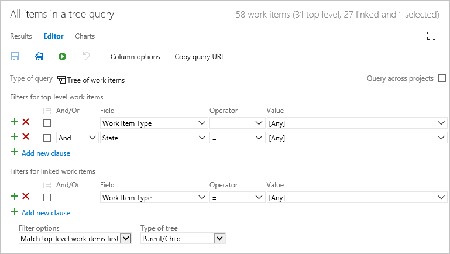

# Query by link or attachment count  

[!INCLUDE [temp](../_shared/version-vsts-tfs-all-versions.md)]

You can [link work items to track related work and dependencies](link-work-items-support-traceability.md) and [attach files to share information with your team](share-plans.md#attachments). You can then list work items based on one or more of the following integer fields:

::: moniker range="azure-devops"  
- Attachment File Count
- (Discussion) Comment Count 
- External Link count
- Hyperlink Count
- Link Comment
- Related Link Count
- Remote Link Count
::: moniker-end 


::: moniker range=">= tfs-2017 <= azure-devops-2019" 
- Attachment File Count
- (Discussion) Comment Count 
- External Link count
- Hyperlink Count
- Link Comment
- Related Link Count
::: moniker-end 


::: moniker range=">= tfs-2013 <= tfs-2015" 
- Attachment File Count
- External Link count
- Hyperlink Count
- Link Comment
- Related Link Count
::: moniker-end 

For descriptions of each of these fields, see the [table provided later in this article](#table-field). 


## Supported operators and macros 
Query clauses that specify an integer field can use the operators listed below.
- = , <> , > , < , >= , <= , 
- =[Field], <>[Field], >[Field], <[Field], >=[Field], <=[Field], 
- In, Not In, 
- Was Ever

## Link or attachment count queries

<p>You can filter for work items by the link type, link count, or attachment count.  </p>

<table valign="top">
<tbody valign="top">
<tr>
  <th>
    <p>Filter for</p>
  </th>
  <th>
    <p>Include these query clauses</p>
  </th>
</tr>
<tr>
  <td>
    <p>Items with attachments</p>
  </td>
  <td>
    <p>
      ```Attached File Count >= 1```
    </p>
  </td>
</tr>
<tr>
  <td>
    <p>Items with 2 or more hyperlinks</p>
  </td>
  <td>
    <p>
      ```Hyperlink Count >= 2```
    </p>
  </td>
</tr>
<tr>
  <td>
    <p>Items containing external links, links to objects other than work items</p>
  </td>
  <td>
    <p>
      ```External Link Count >=1```
    </p>
  </td>
</tr>
<tr>
  <td>
    <p>Items that contain between 3 and 7 Related links</p>
  </td>
  <td>
    <p>
      &#160;&#160;&#160;```Related Link Count >=3```
    </p>
    <p>
      ```And```
    </p>
    <p>
      &#160;&#160;&#160;```Related Link Count <=7```
    </p>
  </td>
</tr>
</tbody>
</table>

<!---
## List work items containing remote links 
-->


<a id="tree" />
## List hierarchical items in a tree view  

Add a query and select **Tree of work items** to begin your query. You should see something similar to the following: 

  

> [!NOTE]    
> You can't construct a query that shows a hierarchical view of Test Plans, Test Suites, and Test Cases. These items aren't linked together using parent-child link types. You can [view the hierarchy through the Test>Test Plans page](../../test/create-a-test-plan.md). 

From there, you can add additional query clauses or change the Filter options for linked work items. 


<table width="100%">
<tbody valign="top">
<tr>
<th width="50%">Filter for</th>
<th width="50%">Include these query clauses</th>
</tr>
<tr>
<td>View only child items of work item 645  
</td>
<td>Add to Filters for top level work items: 
```ID  =  645```  
</td>
</tr>
<tr>
<td>Tasks or bugs  
</td>
<td>
Add to Filters for linked work items: 
```Work Item Type  In  Task,Bug```  
</td>
</tr>
<tr>
<td>
Items assigned to my team (Web)
</td>
<td>
Add to both top and bottom filters: 
```Assigned to  In Group  [Fabrikam Fiber]\Web```  
</td>
</tr>

<tr>
<td>
Parent items of tasks assigned to me:  
</td>
<td>
Change Filter options to **Match linked work items first**  
Add to Filters for linked work items:  
```Assigned To  =  @Me```  
</td>
</tr>

</tbody>
</table>  

<a id="dependents" />
## List items based on linked dependents  

The following example shows a dependent linked query that returns items with dependencies on work managed by other teams and other projects. Use this query to see all dependent work items that link to active Product Backlog Items or Bugs that have not been removed, closed, or completed. Only those dependent work items that are under a product area other than the **Phone Save\\Phone Customers** are returned.

   

**Why this works:**

-   Removing the **Team Project = @Project** clause enables all dependent linked work items that match the filter criteria to be listed, no matter which project they belong to in the collection.

-   Grouping each of two clauses returns all **Product Backlog Item**s on the backlog or in progress, and the second grouped clause returns all **Bug**s on the backlog or in progress.

-   Grouping the two clauses with the **OR** operator at the start of the second clause returns work items that match either of the two filter criteria.

-   Choosing the **Only return items that have the specified links** returns only top-level work items that have dependencies.

-   Choosing **Return links of any type** returns all linked work items that match the filter criteria for linked work items, in this case, returning all work items that are not under the **Phone Saver\\Phone Customers** area path, and aren't completed or removed.

The following image shows the query results that are returned.

  

<a id="table-field"/>
## Link and attachment count and comment fields 

The following table describes fields associated with links and attachments. Most of these fields do not appear on the work item forms but are tracked for all work item types. 

<table><thead>
<tr>
<th width="20%"><p><strong>Field name</strong></p></th>
<th width="62%"><p><strong>Description</strong></p></th>
<th width="18%"><p><strong>Work item type</strong></p></th>
</thead>
<tbody valign="top">
<tr>
<td><p>Attachment File Count</p></td>
<td><p>The number of files attached to the work item and stored in the work item tracking database..</p>
<p>Reference Name=System.AttachedFileCount, Data type=Integer</p>

<blockquote>
For Azure Boards (cloud service), you can add up to 100 attachments to a work item. Attempts to add more result in an error message upon saving the work item.    
</blockquote> 
</td>
<td><p>All</p></td>
</tr>

<tr>
<td><p>Comment Count</p></td>
<td><p>Available for TFS 2017 with the new work item form which supports the Discussion section and later versions. The number of comments added to the **Discussion** section of the work item.</p>
<p>Reference Name=System.CommentCount, Data type=Integer</p>

</td>
<td><p>All</p></td>
</tr>

<tr>
<td><a id="external-link-count"/>
<p>External Link Count</p></td>
<td><p>The number of links from the work item to artifacts that are not work items. such as pull requests, commits, changesets, or other link types.</p>
<p>Reference Name=System.ExternalLinkCount, Data type=Integer</p></td>
<td><p>All</p></td>
</tr>
<tr>
<td><a id="hyper-link-count"/>
<p>Hyperlink Count</p></td>
<td><p>The number of hyperlinks that are defined for the work item.</p><p>Reference Name=System.HyperLinkCount, Data type=Integer</p></td>
<td>All</td>
</tr>
<tr>
<td><p>Link Comment</p></td>
<td><p>Contains comments from the team member who created the link. You can configure this field to appear as a column in a list of links on a work item form. (Not supported in query editor.)  </p><p>Reference Name=System.Links.Comment, Data type=PlainText</p>
</td>
<td>All</td>
</tr>
<tr>
<td><p>Link Description</p></td>
<td><p>Contains the work item type, ID, and title of the work item that is the target of the link. You can configure this field to appear as a column in a list of links on a work item form. (Not supported in query editor.) </p>
<p>Reference Name=System.Links.Description, Data type=PlainText</p></td>
<td>All</td>
</tr>
<tr>
<td><a id="related-link-count"/>
<p>Related Link Count</p></td>
<td><p>The number of links defined for a work item which use a work link type, such as Parent-Child, Predecessor-Successor, and Related. For a full list, see  [Link type reference](link-type-reference.md#work-link-types)</p>
<p>Reference Name=System.RelatedLinkCount, Data type=Integer</p>
</td>
<td>All</td>
</tr>
<tr>
<td><a id="remote-link-count"/>
<p>Remote Link Count</p></td>
<td><p>Available for Azure DevOps Services only. The number of links from a work item to work items defined in another organization. Organizations must be managed by the same Azure Active Directory. Supported link types include Consumes From, Produced For, and Remote Related. To learn more, see [Add link to work items, Link to a remote work item](../backlogs/add-link.md#remote-link).</p>
<p>Reference Name=System.RemoteLinkCount, Data type=Integer</p></td>
<td><p>All</p></td>
</tr>
</tbody>
</table>


## Related articles

- [Add a link to multiple work items](../backlogs/add-link.md) 
- [Linking, traceability, and managing dependencies](link-work-items-support-traceability.md) 
- [Query quick reference](query-index-quick-ref.md)
- [Query editor](using-queries.md)   
- [Query fields, operators, and macros](query-operators-variables.md)   
- [Add work items](../backlogs/add-work-items.md)  
- [Work item field index](../work-items/guidance/work-item-field.md) 

 
::: moniker range=">= tfs-2015 <= azure-devops-2019" 
### Visualize related work and other objects 

You can view related work items and object within a work item form by installing the [Work item visualization extension](https://marketplace.visualstudio.com/items?itemName=ms-devlabs.WorkItemVisualization) available from the Visual Studio Marketplace, Azure DevOps tab. 
::: moniker-end 

::: moniker range=">= tfs-2013 <= azure-devops-2019" 

### Add custom link types or customize the links controls 

To add link types, see [Manage link types [witadmin]](../../reference/witadmin/manage-link-types.md). 

All tabs that support creating links between work items are implemented by using the **LinksControl** element on the work item form. This element controls filtering and restricting the types of work items to which you can link, the types of links that you can create, and whether you can link to work items in another project. To customize the link controls and restrictions, you modify the definition of the `LinksControlOptions` for a work item type, see [LinksControlOptions XML elements](../../reference/xml/linkscontroloptions-xml-elements.md).  

### Default data fields in lists of links

You can add or remove columns from the list of links, and you can customize the default columns and the column order. For more information, see [LinksControlOptions XML elements](../../reference/xml/linkscontroloptions-xml-elements.md).

::: moniker-end 


