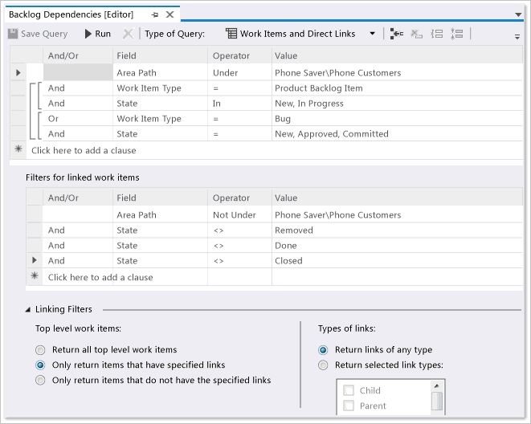
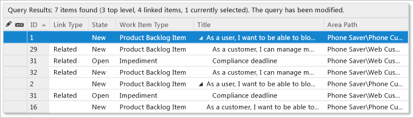

# Query by link or attachment count  

[!INCLUDE [temp](../includes/version-all.md)]

You can [link work items to track related work and dependencies](link-work-items-support-traceability.md) and [attach files to share information with your team](share-plans.md#attachments). You can then list work items based on one or more of the following fields:

::: moniker range="azure-devops"  
- Attachment File Count
- (Discussion) Comment Count 
- External Link count
- Hyperlink Count
- Link Comment
- Related Link Count
- Remote Link Count
::: moniker-end 

::: moniker range=">= tfs-2017 < azure-devops" 
- Attachment File Count
- (Discussion) Comment Count 
- External Link count
- Hyperlink Count
- Link Comment
- Related Link Count
::: moniker-end 

::: moniker range="<= tfs-2015" 
- Attachment File Count
- External Link count
- Hyperlink Count
- Link Comment
- Related Link Count
::: moniker-end 

For descriptions of each of these fields, see the [table provided later in this article](#table-field). 

## Supported operators and macros 

Query clauses that specify an integer field can use the operators listed below.

`= , <> , > , < , >= , <= ,`  
`=[Field], <>[Field], >[Field], <[Field], >=[Field], <=[Field],`   
`In, Not In,`   
`Was Ever`  

## Link or attachment count queries

You can filter for work items by the link type, link count, or attachment count.  

---
:::row:::
   :::column span="":::
     **Filter for**
   :::column-end:::
   :::column span="":::
      **Include these query clauses**
   :::column-end:::
:::row-end:::
---
:::row:::
   :::column span="":::
     Items with attachments
   :::column-end:::
   :::column span="":::
      `Attached File Count >= 1`
   :::column-end:::
:::row-end:::
---
:::row:::
   :::column span="":::
     Items with two or more hyperlinks
   :::column-end:::
   :::column span="":::
      `Hyperlink Count >= 2`
   :::column-end:::
:::row-end:::
---
:::row:::
   :::column span="":::
     Items containing external links, links to objects other than work items
   :::column-end:::
   :::column span="":::
      `External Link Count >= 1`
   :::column-end:::
:::row-end:::
---
:::row:::
   :::column span="":::
     Items that contain between three and seven related links
   :::column-end:::
   :::column span="":::
      `Related Link Count >= 3`
      `And`
      `Related Link Count <= 7`
   :::column-end:::
:::row-end:::
---
::: moniker range="azure-devops"  
:::row:::
   :::column span="":::
     Items that contain remote links
   :::column-end:::
   :::column span="":::
      `Remote Link Count > 0`
   :::column-end:::
:::row-end:::
---
::: moniker-end 

<a id="tree" />

## List hierarchical items in a tree view  

Add a query and select **Tree of work items** to begin your query. You should see something similar to the following: 

#### [Browser](#tab/browser/)

:::image type="content" source="media/query-link-attach-all-items-tree-query.png" alt-text="Screenshot of Query Editor, Tree Query, web portal.":::

#### [Visual Studio 2015](#tab/visual-studio/)

:::image type="content" source="media/link-attachments/tree-query-te.png" alt-text="Screenshot of Query Editor, Tree Query, Team Explorer.":::

* * *

> [!NOTE]
> You can't construct a query that shows a hierarchical view of Test Plans, Test Suites, and Test Cases. These items aren't linked together using parent-child link types. However, you can create a Direct links query that lists test-related work items. Also, you can, [view the hierarchy through the Test>Test Plans page](../../test/create-a-test-plan.md). 

From there, you can add query clauses or change the filter options for linked work items. 
 
:::row:::
   :::column span="":::
     **Filter for**
   :::column-end:::
   :::column span="":::
      **Include these query clauses**
   :::column-end:::
:::row-end:::
:::row:::
   :::column span="":::
     View only child items of work item 645
   :::column-end:::
   :::column span="":::
      **Add to Filters for top-level work items:**  
      `ID  =  645`
   :::column-end:::
:::row-end:::
:::row:::
   :::column span="":::
     Tasks or bugs
   :::column-end:::
   :::column span="":::
      **Add to Filters for linked work items:**  
      `Work Item Type  In  Task,Bug`
   :::column-end:::
:::row-end:::
:::row:::
   :::column span="":::
     Items assigned to my team (Web)
   :::column-end:::
   :::column span="":::
      **Add to both top and bottom filters:**  
      `Assigned to  In Group  [Fabrikam Fiber]\Web`  
   :::column-end:::
:::row-end:::
:::row:::
   :::column span="":::
     Parent items of tasks assigned to me
   :::column-end:::
   :::column span="":::
      Change Filter options to **Match linked work items first**  
      **Add to Filters for linked work items:**  
      `Assigned To = @Me`
   :::column-end:::
:::row-end:::

  

<a id="dependents" />

## List items based on linked dependents  

The following example shows a dependent linked query that returns items with dependencies on work managed by other teams and projects. 

#### [Browser](#tab/browser/)

The following query finds work items in all projects that are linked to work items under the **Fabrikam** area path and project using Predecessor and Successor link types.

:::image type="content" source="media/link-attachments/direct-links-query-web-portal.png" alt-text="Screenshot of Query Editor, Work items and direct links, Web portal.":::

**Why this works:**

- Checking the **Query across projects** checkbox enables all dependent linked work items that match the filter criteria to be listed, no matter which project they belong to.

- Specifying the **Area Path Under Fabrikam** clause indicates to find only work items that are linked to work items defined under the Fabrikam project.   

- Specifying **Only return items that have matching links**, and **Return selected link types** causes the query to return only work items that are linked based on the **Predecessor** and **Successor** link types.  

#### [Visual Studio 2015](#tab/visual-studio/)

Use this type of query to list all dependent work items that link to active Product Backlog Items or Bugs that haven't been removed, closed, or completed. Only those dependent work items that are under a product area other than the **Phone Save\Phone Customers** are returned.

   

**Why this works:**

- Removing the <strong>Team Project = @Project</strong> clause enables all dependent linked work items that match the filter criteria to be listed, no matter which project they belong to in the collection.

- Grouping each of two clauses returns all **Product Backlog Item**s on the backlog or in progress, and the second grouped clause returns all **Bug**s on the backlog or in progress.

- Grouping the two clauses with the **OR** operator at the start of the second clause returns work items that match either of the two filter criteria.

- Choosing the **Only return items that have the specified links** returns only top-level work items that have dependencies.

- Choosing **Return links of any type** returns all linked work items that match the filter criteria for linked work items, in this case, returning all work items that are not under the **Phone Saver\\Phone Customers** area path, and aren't completed or removed.

The following image shows the query results that are returned.

  

* * * 

<a id="orphan-stories" />

## List orphan user stories 

If you typically organize your user stories under features, you can quickly find  user stories that are orphan by opening the product backlog, enable **Parents On** view option, and scroll down to the section that lists **Unparented Stories** (Agile) or **Unparented Backlog items** (Scrum).

> [!div class="mx-imgBorder"]  
>  

Or, you can find unparented backlog items using a **Work items and direct links** query. For example, the following query lists active user stories for the Azure DevOps team that don't have a Parent link. 

:::image type="content" source="media/link-attachments/unparented-work-items.png" alt-text="Screenshot of Query Editor, Work items and direct links, Web portal, unparented user stories.":::
  
<a id="table-field"/>

## Link and attachment count and comment fields 

The following table describes fields associated with links and attachments. Most of these fields don't appear within the work item form, but are tracked for all work item types. 

<table><thead>
<tr>
<th width="20%">
<strong>Field name</strong>
</th>
<th width="62%">
<strong>Description</strong>
</th>
<th width="18%">
<strong>Work item type</strong>
</th>
</thead>
<tbody valign="top">
<tr>
<td>
Attachment File Count
</td>
<td>
The number of files attached to the work item and stored in the work item tracking database..

Reference Name=System.AttachedFileCount, Data type=Integer

<blockquote>
For Azure Boards (cloud service), you can add up to 100 attachments to a work item. Attempts to add more result in an error message upon saving the work item. </blockquote> 
</td>
<td>
All
</td>
</tr>

<tr>
<td>
Comment Count
</td>
<td>
Available for TFS 2017 with the new work item form which supports the Discussion section and later versions. The number of comments added to the <strong>Discussion</strong> section of the work item.

Reference Name=System.CommentCount, Data type=Integer

</td>
<td>
All
</td>
</tr>

<tr>
<td><a id="external-link-count"/>

External Link Count
</td>
<td>
The number of links from the work item to artifacts that are not work items. such as pull requests, commits, changesets, or other link types.

Reference Name=System.ExternalLinkCount, Data type=Integer
</td>
<td>
All
</td>
</tr>
<tr>
<td><a id="hyper-link-count"/>

Hyperlink Count
</td>
<td>
The number of hyperlinks that are defined for the work item.

Reference Name=System.HyperLinkCount, Data type=Integer
</td>
<td>All</td>
</tr>
<tr>
<td>
Link Comment
</td>
<td>
Contains comments from the team member who created the link. You can configure this field to appear as a column in a list of links on a work item form. (Not supported in query editor.)  

Reference Name=System.Links.Comment, Data type=PlainText

</td>
<td>All</td>
</tr>
<tr>
<td>
Link Description
</td>
<td>
Contains the work item type, ID, and title of the work item that is the target of the link. You can configure this field to appear as a column in a list of links on a work item form. (Not supported in query editor.) 

Reference Name=System.Links.Description, Data type=PlainText
</td>
<td>All</td>
</tr>
<tr>
<td><a id="parent"/>

Parent
</td>
<td>
When included as a column option in a backlog or query results list, the Title of the parent work item is displayed. Internally, the system stores the ID of the work item within an Integer field. 

<blockquote>The Parent field is available from Azure DevOps Services and Azure DevOps Server 2020. You can't specify this field within a query clause. </blockquote> 

Reference Name=System.Parent, Data type=Integer

</td>
<td>All</td>
</tr>
<tr>
<td><a id="related-link-count"/>

Related Link Count
</td>
<td>
The number of links defined for a work item which use a work link type, such as Parent-Child, Predecessor-Successor, and Related. For a full list, see  <a href="link-type-reference.md#work-link-types" data-raw-source="[Link type reference](link-type-reference.md#work-link-types)">Link type reference</a>

Reference Name=System.RelatedLinkCount, Data type=Integer

</td>
<td>All</td>
</tr>
<tr>
<td><a id="remote-link-count"/>

Remote Link Count
</td>
<td>
Available for Azure DevOps Services only. The number of links from a work item to work items defined in another organization. Organizations must be managed by the same Azure Active Directory. Supported link types include Consumes From, Produced For, and Remote Related. To learn more, see <a href="../backlogs/add-link.md" data-raw-source="[Add link to work items, Link to a remote work item](../backlogs/add-link.md)">Add link to work items, Link to a remote work item</a>.

Reference Name=System.RemoteLinkCount, Data type=Integer
</td>
<td>
All
</td>
</tr>
</tbody>
</table>

## Related articles

- [Add a link to multiple work items](../backlogs/add-link.md) 
- [Linking, traceability, and managing dependencies](link-work-items-support-traceability.md) 
- [Track dependencies using Delivery Plans](../plans/track-dependencies.md)
- [Query quick reference](query-index-quick-ref.md)
- [Query editor](using-queries.md)   
- [Query fields, operators, and macros](query-operators-variables.md)   
- [Add work items](../backlogs/add-work-items.md)  
- [Work item field index](../work-items/guidance/work-item-field.md) 

::: moniker range=">= tfs-2015 < azure-devops" 

### Visualize related work and other objects 

You can view related work items and object within a work item form by installing the [Work item visualization extension](https://marketplace.visualstudio.com/items?itemName=ms-devlabs.WorkItemVisualization) available from the Visual Studio Marketplace, Azure DevOps tab. 
::: moniker-end 

::: moniker range=">= tfs-2013 < azure-devops" 

### Add custom link types or customize the links controls 

To add link types, see [Manage link types [witadmin]](../../reference/witadmin/manage-link-types.md). 

All tabs that support creating links between work items are implemented by using the **LinksControl** element on the work item form. This element controls filtering and restricting the types of work items to which you can link, the types of links that you can create, and whether you can link to work items in another project. To customize the link controls and restrictions, you modify the definition of the `LinksControlOptions` for a work item type, see [LinksControlOptions XML elements](../../reference/xml/linkscontroloptions-xml-elements.md).  

### Default data fields in lists of links

You can add or remove columns from the list of links, and you can customize the default columns and the column order. For more information, see [LinksControlOptions XML elements](../../reference/xml/linkscontroloptions-xml-elements.md).

::: moniker-end 

