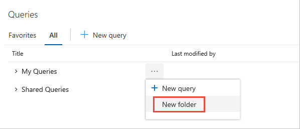

# Organize queries, add a query folder    

[!INCLUDE [temp](../_shared/version-vsts-tfs-all-versions.md)]

Organize your personal or shared queries by adding a query folder. You can then add queries to or move existing queries into those folders.
 
[!INCLUDE [temp](../_shared/prerequisites-queries.md)]

## Open Queries 

[!INCLUDE [temp](../_shared/open-queries.md)] 

## Add a query folder, move items into a folder 

::: moniker range=">= azure-devops-2019"

You add query folders from the **Boards>Queries>All** page.
 
0. Choose **All**. Expand **My Queries** or Shared Queries depending on where you want to add a query folder. 
 
0. To add a folder, choose the  actions icon for an existing folder or the top container folder, and choose **New folder**. 

	> [!div class="mx-imgBorder"]  
	> 

0. Enter the name for the folder in the New folder dialog. If you want to change the location of the folder, select it from the Folder drop down menu.  

	

0. To move items into a folder, drag-and-drop a query onto the folder. 

	Optionally, you can click the   for an existing query, choose **Edit**, and then choose **Save As**. In the Save query as dialog, choose the folder you want to save the query in. 

	
  
::: moniker-end

::: moniker range=">= tfs-2013 <= tfs-2018"

You add query folders from the **Boards>Queries** page.

0. To add a folder, choose the  context menu for an existing folder or the top container folder and select **New query folder**. 

	Enter the name for the folder in the New query folder dialog.  

	   

0. To move items into a folder, drag-and-drop a query onto the folder. 

	Optionally, you can choose the  context icon for an existing query and choose **Rename**. In the Rename query dialog, select the folder you want to save the query in. 

	 

::: moniker-end

::: moniker range=">= tfs-2015"

## Add a query to the dashboard or share it with your team 

To add a query to the home page or a dashboard, open the  actions icon (or  context icon) menu for the query and [add it to a specific dashboard](../../report/dashboards/dashboards.md) or as a team favorite. 

Share queries with your team by adding them to a folder under the **Shared Queries** container.  To save a query to a Shared Queries folder, get added to the [project administrators group](../../organizations/security/set-project-collection-level-permissions.md) or have your [permissions set for a folder under Shared Queries](set-query-permissions.md). 

You can only add shared queries to dashboards or as team favorites, and only if you have [team administrator or project administrator permissions](../../organizations/settings/manage-teams.md). 

::: moniker-end

## Q & A   
<!-- BEGINSECTION class="md-qanda" -->

### Q: Can I change the owner of a query or folder?

::: moniker range=">= tfs-2017"
**A:** No. You can only enable permissions for users and groups from the permissions window for the query or folder.
::: moniker-end

::: moniker range="<= tfs-2015"
**A:** Yes. This is a supported feature from the [query Security dialog](set-query-permissions.md). 
::: moniker-end

### Q: Can I add folders to team favorites?

**A:** No. You can only add folders under **My Queries** and under **Shared Queries**.

### Q: Are the queries and folders I create from the web portal the same as in Team Explorer?

**A:** Yes. You might have to refresh your browser or client to see changes you make in another client.

### Q: Can I move a query or a folder?  

**A:** Yes. In the web portal, choose **Rename** from the context menu. In Visual Studio Team Explorer, simply drag the folder to the new location.  

In Team Explorer for Eclipse, choose **Move** from the context menu and select the folder to which you want to move the item.

<!-- ENDSECTION --> 

## Related articles
- [Query keyboard shortcuts](queries-keyboard-shortcuts.md)
- [Set query permissions](set-query-permissions.md)
- [Set project-level permissions](../../organizations/security/set-project-collection-level-permissions.md)

