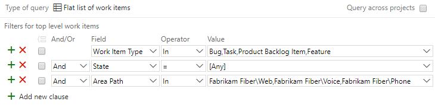

# Query by area or iteration path 

[!INCLUDE [temp](../_shared/version-vsts-tfs-all-versions.md)]

The Area Path and Iteration Path are two fields that appear on the work tracking form for all work item types. You define them for a project&mdash;[area paths](../../organizations/settings/set-area-paths.md) and [iteration paths](../../organizations/settings/set-iteration-paths-sprints.md)&mdash;and then select the ones you want to associate with a team. 

To better understand how to work with area and iteration paths, see [About teams and Agile tools](../../organizations/settings/about-teams-and-settings.md).

## Supported operators and macros 
When creating queries and specifying the Area Path and Iteration Path fields, you can use the following operators: 

> [!div class="mx-tdCol2BreakAll"]  
> |Operator     | Use when you want to...| 
> |-------------|--------------|
> | **=**           | Specify one specific area or iteration path  |
> | **<>**          | Filter out one, specific area or iteration path. |
> | **In**          | Filter for a set of area or iteration paths.  |
> | **Not In**      | Exclude items that are assigned to a set of area or iteration paths. |
> | **Under**       | Specify all paths under a select area or iteration path. |
> | **Not Under**   | Exclude items assigned under a specific area or iteration path.  |


In addition to these operators, you can use the following macros when you select the Iteration Path. For examples, see [Query by date or current iteration](query-by-area-iteration-path.md). 

> [!div class="mx-tdCol2BreakAll"]  
> |Macro   | Use when you want to...|
> |-------------|--------------|
> | **@CurrentIteration**    | Specify the current iteration associated with the selected team context.  |
> | **@CurrentIteration +/- n**&nbsp;&nbsp;&nbsp;| Filter items based on assignment to a sliding window of sprints associated with the selected team context.  |
> | **@TeamAreas**   | Filter items based on area path(s) assigned to a specific team.  |

> [!NOTE]   
> The **@CurrentIteration** macro is supported for Azure Boards and TFS 2015 and later versions. The **@CurrentIteration +/- n** and **@TeamAreas** macros are supported for Azure DevOps Services and Azure DevOps Server 2019 and later versions. 

## Area path queries 

You can specify to filter for work items assigned to several area paths by using the **In** operator as shown in the following example.  
 
> [!div class="mx-imgBorder"]
> 


## Node Name and keyword based queries  

Using the **Node Name** field, you can filter on work items assigned to area paths based on a keyword using the **Contains** operator. The **Node Name** specifies the leaf node of an **Area Path**, which corresponds to the last node in the tree hierarchy.  

The following query yields the same result as the previous example.  

> [!div class="mx-imgBorder"]
> 

In this example, the filter will return any work items assigned to an area path whose leaf node contains the word "Azure".

> [!div class="mx-imgBorder"]
> 

Here's another example which uses the **Node Name** and the **In** operator. 

> [!div class="mx-imgBorder"]
> 


::: moniker range=">= azure-devops-2019"
<a id="team-area-path" /> 
## Team area path queries  

Use the **@TeamAreas** macro to quickly find items assigned to the area paths assigned to a specific team. Specify the **=** operator. The Query Editor automatically prompts for you to enter the name of the team. You can add it by typing the name of the team and choosing the team value that appears in the search filter criteria.   

> [!div class="mx-imgBorder"]
> 

::: moniker-end

<a name="field-reference"></a>
## Classification field reference 


> [!div class="mx-tdCol2BreakAll"]  
> |**Field name**|**Description**|**Reference name**|
> |---|---|---|
> |**Area Path**|Groups work items into product feature or team areas. The area must be a valid node in the project hierarchy.|System.AreaPath |
> |**Iteration Path**|Groups work items by named sprints or time periods. The iteration must be a valid node in the project hierarchy.|System.IterationPath |

For each field, data path=```TreePath```, reportable type=```Dimension```, index attribute=```True```. 
 
If you define a path name that is longer than 256 characters, you will not be able to specify it in Microsoft Project. To avoid this problem, define path names of no more than 10 characters, and do not nest nodes more than 14 levels deep.

You can't apply most field rules to the System.AreaPath and System.IterationPath fields. To learn more, see [Apply a field rule](../../reference/xml/apply-rule-work-item-field.md).

The following fields do not appear on work item forms but are tracked for each work item type. These fields provide a numeric value for each classification value that is defined for a project. You can use these fields to filter queries and create reports.

> [!div class="mx-tdCol2BreakAll"]  
> |**Field name**|**Description**|**Reference name**|**Data type**|
> |---|---|---|---|
> |Area ID|The unique ID of the area to which this work item is assigned.|System.AreaId|Integer|
> |Iteration ID|The unique ID of the iteration to which this work item is assigned.|System.IterationId|Integer|
> |Node Name|The name of the leaf node of an area path. For example, if the area path is Project\A1\B2\C3, the node name is C3.|System.NodeName|String|

The default reportable type is none. Area ID and Iteration ID are indexed, Node Name is not. To learn more about field attributes, see [Work item fields and attributes](../work-items/work-item-fields.md).


## Related articles 
- [Query quick reference](query-index-quick-ref.md)
- [Define area paths and assign to a team](../../organizations/settings/set-area-paths.md)
- [Define iteration paths (aka sprints) and configure team iterations](../../organizations/settings/set-iteration-paths-sprints.md)
- [Set permissions and access for work tracking](../../organizations/security/set-permissions-access-work-tracking.md) 

::: moniker range="<= azure-devops-2019"
<a name="field-rules"></a>
### Supported field rules  

For the On-premises XML process model, you can apply rules to fields. However, for system fields (System.XXX), such as the Area Path and Iteration Path, you can [specify only a small subset of rules](../../reference/xml/apply-rule-work-item-field.md#system), such as ```HELPTEXT``` and ```READONLY``` to  fields. 

::: moniker-end


[!INCLUDE [temp](../_shared/rest-apis-queries.md)]
 
 