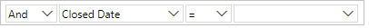
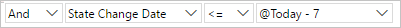
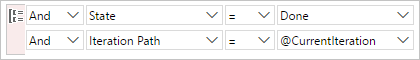
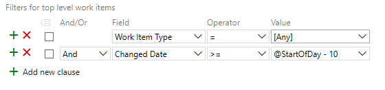
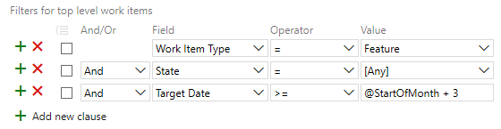
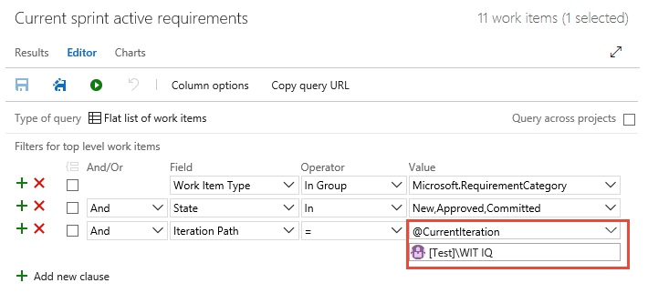
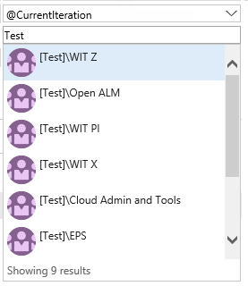
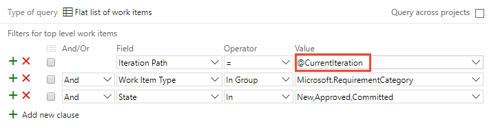
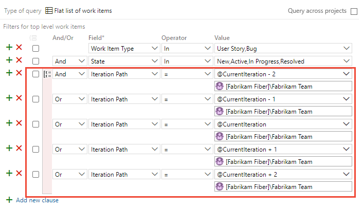

# Query by date or current iteration

[!INCLUDE [temp](../includes/version-all.md)]

The **\@Today** and **\@CurrentIteration** macros are useful for listing work items based on relative dates or their assignment to a team's current iteration. To list work items based on when they were created, closed, resolved, or changed state&mdash;use **\@Today** or specify dates. For queries that list work items based on their assignment to a team's current sprint, use **\@CurrentIteration**. 

For example, you can find work items that were modified in the last 3 days with the following query.

::: moniker range=">= azure-devops-2019"
:::image type="content" source="media/example-work-item-queries/query-changed-date-last-3-days.png" alt-text="Screenshot of Query Editor, Changed Date >= 3.":::
::: moniker-end
::: moniker range="<= tfs-2018"
  
::: moniker-end
::: moniker range=">= azure-devops-2019"
In addition, you can use  the <b>@CurrentIteration +/- <i>n</i></b> macro to create queries based on a sliding window of team iterations. 
::: moniker-end


## Supported operators and macros 

Query clauses that specify a **DateTime** field or the **Iteration Path** can use the operators and macros listed in the following table.
 

---
:::row:::
   :::column span="1":::
      **Data type**
   :::column-end::: 
   :::column span="3":::
      **Supported operators and macros**
   :::column-end:::
:::row-end:::
---
::: moniker range=">= azure-devops-2019"
:::row:::
   :::column span="1":::
      **DateTime**   
   :::column-end::: 
   :::column span="3":::
      = , &lt;&gt; , &gt; , &lt; , &gt;= , &lt;= , =[Field], &lt;&gt;[Field], &gt;[Field], &lt;[Field], &gt;=[Field], &lt;=[Field], In, Not In, Was Ever  
      **Macros**:  **@StartOfDay**, **@StartOfWeek**, **@StartOfMonth**, **@StartOfYear**, and **@Today**; each of these macros can be specified with a <strong> +/- n</strong> integer.
   :::column-end:::
:::row-end:::
 ---
:::row:::
   :::column span="1":::
      **TreePath**
   :::column-end::: 
   :::column span="3":::
      = , <> , Under, Not Under
      **Macros**: **@CurrentIteration**<sup>2</sup> and **@CurrentIteration +/- n**<sup>3</sup> valid with the **Iteration Path** field
   :::column-end:::
:::row-end:::
---
::: moniker-end
::: moniker range="<= tfs-2018"
:::row:::
   :::column span="1":::
      **DateTime**   
   :::column-end::: 
   :::column span="3":::
      = , &lt;&gt; , &gt; , &lt; , &gt;= , &lt;= , =[Field], &lt;&gt;[Field], &gt;[Field], &lt;[Field], &gt;=[Field], &lt;=[Field], In, Not In, Was Ever  
      **Macros**: **@Today** which can be specified with ** +/- n** integer.
   :::column-end:::
:::row-end:::
 ---
:::row:::
   :::column span="1":::
      **TreePath**
   :::column-end::: 
   :::column span="3":::
      = , <> , Under, Not Under
      **Macros**: **@CurrentIteration**<sup>2</sup> is valid with the **Iteration Path** field
   :::column-end:::
:::row-end:::
---
::: moniker-end
 


#### Notes:

1. The  **@StartOfDay**, **@StartOfWeek**, **@StartOfMonth**, **@StartOfYear**  macros are supported for Azure DevOps Server 2019.1 and later versions, and only when run from the web portal.
2. The **@CurrentIteration** macro is supported for TFS 2015 and later versions, and only when run from the web portal. 
2. The **@CurrentIteration +/- n** macro is supported for Azure DevOps Server 2019 and later versions, and only when run from the web portal. 

> [!TIP]    
> The **WasEver** operator can be used with the **Iteration Path** field but only when defined through the WIQL syntax. For an example, see TBC.
 

<a id="team_view">  </a>
<a id="current_sprint_restrict"> </a> 

## Client restrictions on the use of the @CurrentIteration macros 

You can use the <strong>@CurrentIteration</strong> in a query from the following clients:

- Web portal that connects to Azure Boards 
- Web portal that connects to an on-premises Azure DevOps 2015 or later version 
- Visual Studio 2015 or Team Explorer 2015 or later versions connected to Azure Boards or TFS 2015 or later versions. 
- Using the REST API

You can use the <b>@CurrentIteration +/- <i>n</i></b> macro in a query against Azure Boards, Azure DevOps Server 2019 and later versions, and with a REST API which includes the team as a parameter, for example, `@CurrentIteration('[Project]/Team')`.
  

An error occurs if you open a query that contains the <strong>@CurrentIteration</strong> macro in earlier versions of Visual Studio, or from Excel or Project. Also, you can't use the macro when [copying or cloning test suites and test cases](/previous-versions/azure/devops/test/mtm/copying-and-cloning-test-suites-and-test-cases), [defining alerts](../../notifications/about-notifications.md), or with [REST APIs](/rest/api/azure/devops/).


## Date based queries  

You can filter for work items by the date on which they were changed or for a specific time period. If you limit the scope of your query, it can help with performance by only returning those results that fit the date range that you want to include. If you're new to creating queries, see [Use the query editor to list and manage queries](using-queries.md). 

Not all fields are valid for all work item types (WITs). Jump to [date fields](#date_fields) for the set of fields you can include in queries and which WITs they apply to. 


---
:::row:::
   :::column span="1":::
      **Filter for**
   :::column-end::: 
   :::column span="2":::
      **Include these query clauses**
   :::column-end:::
:::row-end:::
---
:::row:::
   :::column span="1":::
      Items created in the last 30 days
   :::column-end::: 
   :::column span="2":::
      
   :::column-end:::
:::row-end:::
---
:::row:::
   :::column span="1":::
      Items modified on a specific date
   :::column-end::: 
   :::column span="2":::
      
   :::column-end:::
:::row-end:::
---
:::row:::
   :::column span="1":::
      Items resolved today
   :::column-end::: 
   :::column span="2":::
      
   :::column-end:::
:::row-end:::
---
:::row:::
   :::column span="1":::
      Items closed within a specified time period
   :::column-end::: 
   :::column span="2":::
      
   :::column-end:::
:::row-end:::
---
:::row:::
   :::column span="1":::
      Items that haven't been closed (Closed Date is null)
   :::column-end::: 
   :::column span="2":::
      
   :::column-end:::
:::row-end:::
---
:::row:::
   :::column span="1":::
      Items whose status was updated within the last week
   :::column-end::: 
   :::column span="2":::
      
   :::column-end:::
:::row-end:::
---
:::row:::
   :::column span="1":::
      Items closed during the current sprint (the <code><xref href="CurrentIteration" data-throw-if-not-resolved="False" data-raw-source="@CurrentIteration"></xref></code> macro references the sprint defined for the current team context)
   :::column-end::: 
   :::column span="2":::
      
   :::column-end:::
:::row-end:::
---

[!INCLUDE [temp](../includes/query-clause-tip.md)]

[!INCLUDE [date-time-pattern](../includes/date-time-pattern.md)]

::: moniker range=">= azure-devops-2019"

## Start of Day, Week, Month, or Year date-based queries

The following examples show how to use the <strong>StartOf...</strong> macros to filter for work items with various offsets. For additional examples for using these macros, see [WIQL syntax](wiql-syntax.md#start-of). 
::: moniker-end

::: moniker range="azure-devops-2019"
> [!NOTE]   
> Requires Azure DevOps Server 2019 Update 1 or later version. 
::: moniker-end

::: moniker range=">= azure-devops-2019"

:::row:::
   :::column span="1":::
      **Filter for**
   :::column-end::: 
   :::column span="2":::
      **Include these query clauses**
   :::column-end:::
:::row-end:::
---
:::row:::
   :::column span="1":::
      Bugs closed in the last 2 weeks
   :::column-end::: 
   :::column span="2":::
      
   :::column-end:::
:::row-end:::
---
:::row:::
   :::column span="1":::
      Items modified in the last 10 days
   :::column-end::: 
   :::column span="2":::
      
   :::column-end:::
:::row-end:::
---
:::row:::
   :::column span="1":::
      Features scheduled to be completed in the next 3 months
   :::column-end::: 
   :::column span="2":::
      
   :::column-end:::
:::row-end:::
---


Not all fields are valid for all work item types. Jump to [date fields](#date_fields) for the set of fields you can include in queries and which work item types they apply to. Enter dates in the **Date Pattern** you set for your personal profile. (See [Set personal preferences](../../organizations/settings/set-your-preferences.md) for details.)   

::: moniker-end

<a id="current-iteration">  </a>

## Team's current iteration queries  
 
If your team follows Scrum processes, you [schedule work to be completed in sprints](../sprints/define-sprints.md). You can track the progress of requirements, bugs, and other work to be completed in the current sprint using the **@CurrentIteration** macro.  

Any item assigned to a sprint which corresponds to the current iteration path for the team will be found.  For example, if a team is on Sprint 5, then the query will return items assigned to Sprint 5. Later, when the team is working in Sprint 6, the same query will return items assigned to Sprint 6.  

> [!NOTE]
> For the **@CurrentIteration** macro to work, the team must have selected an **Iteration Path** whose date range encompasses the current date. For details, see [Define iteration paths (also referred to as sprints) and configure team iterations](../../organizations/settings/set-iteration-paths-sprints.md#activate). Also, queries that contain this macro are only valid when run from the web portal.
> 
> See also [Client restrictions on the use of the @CurrentIteration macros](#current_sprint_restrict) later in this article.

::: moniker range=">= azure-devops-2019"

Azure Boards adds a team parameter when you select the <strong>@CurrentIteration</strong> or <b>@CurrentIteration +/- <i>n</i></b> macros. The team parameter is derived from your current [team context](#team_view). 

> [!div class="mx-imgBorder"]
>   

> [!TIP]  
> If the **@CurrentIteration** macro isn't working, check that the [expected iteration is selected for your team and that dates have been set for it](../../organizations/settings/set-iteration-paths-sprints.md#activate). 

To change the team parameter the system automatically sets, you choose it by typing the name of the team into the parameter field added below the **@CurrentIteration** macro.  

> [!div class="mx-imgBorder"]
> 

::: moniker-end

::: moniker range="<= tfs-2018"

Prior to creating or updating a query to use the **@CurrentIteration** macro, make sure you [select your team](#team_view). The **@CurrentIteration** macro references the current team selected in the web portal.  

> [!div class="mx-imgBorder"]
>   

::: moniker-end


::: moniker range=">= azure-devops-2019"

<a id="current-iteration-plus-minus-n">  </a>

## Sliding window of team iterations query 

Use the **@CurrentIteration +/- <i>n</i>** macro when you want to track the work a team has planned for upcoming sprints and for understanding work that wasn't completed in previous sprints. 

> [!NOTE]
> For the **@CurrentIteration +/- <i>n</i>** macro to work, the team must have selected **Iteration Paths** that meet the <b>+/- <i>n</i></b>
> criteria and date ranges encompass the current date for the **@CurrentIteration**. For details about team selection of Iteration Paths, see [Define iteration (sprint) paths and configure team iterations](../../organizations/settings/set-iteration-paths-sprints.md#activate). 
> 
> See also [Client restrictions on the use of the @CurrentIteration macros](#current_sprint_restrict) later in this article.

Here we show how to list all User Stories and Bugs assigned to the sliding window that spans the last two, the current, and the next two sprints selected for the *Cloud Admin and Tools* team. 

> [!div class="mx-imgBorder"]
> 

To use this macro, the specified team must have [selected a set of sprints](../../organizations/settings/set-iteration-paths-sprints.md) that span the <b>+/- <i>n</i></b> value entered for the macro.  

::: moniker-end


<a id="list-work-items-moved-out-sprint">  </a>

## List work items moved out of a sprint 

You can list work items that were defined for a sprint but later moved out using a query with a clause that contains the **Was Ever** operator for the **Iteration Path**. You can only construct this query using the [WIQL syntax](wiql-syntax.md). You can edit the WIQL syntax in the Query Editor by installing the [Wiql Editor Marketplace extension](https://marketplace.visualstudio.com/items?itemName=ottostreifel.wiql-editor). 

For example, the following syntax queries for work items that meet the following criteria: 
1. Defined in the current project 
2. Work item type equals User Story or Bug
3. Work items are under the Fabrikam Fiber Web team Area Path 
4. Work items are not in a Closed, Complted, Cut, or Resolved state
5. Not in the current iteration path for the Fabrikam Fiber Web team
6. But were assigned to the  current iteration path for the Fabrikam Fiber Web team
7. Are now assigned to the Current iteration +1 for the Fabrikam Fiber Web team
8. And were changed within the last 30 days (the length of the sprint) 


> [!div class="tabbedCodeSnippets"]
```WIQL
SELECT
    [System.Id],
    [System.WorkItemType],
    [System.AssignedTo],
    [System.Title],
    [System.State],
    [System.Tags],
    [System.IterationPath],
    [System.AreaPath]
FROM workitems
WHERE
    [System.TeamProject] = @project
    AND [System.WorkItemType] IN ('User Story', 'Bug')
    AND [System.AreaPath] UNDER 'FabrikamFiber\Web'
    AND NOT [System.State] IN ('Completed', 'Closed', 'Cut', 'Resolved')
    AND NOT [System.IterationPath] = @currentIteration('[FabrikamFiber]\Web <id:cdf5e823-1179-4503-9fb1-a45e2c1bc6d4>')
    AND (
        EVER (
            [System.IterationPath] = @currentIteration('[FabrikamFiber]\Web <id:cdf5e823-1179-4503-9fb1-a45e2c1bc6d4>')
        )
        AND [System.IterationPath] = @currentIteration('[FabrikamFiber]\Web <id:cdf5e823-1179-4503-9fb1-a45e2c1bc6d4>') + 1
        AND [System.ChangedDate] >= @today - 30
    )
ORDER BY [System.Id]
```


The Query Editor view of the syntax appears as shown. 

> [!NOTE]   
> The Query Editor displays a :::image type="icon" source="../../media/icons/required-icon.png" border="false"::: information icon next to the **Was Ever** operator, indicating an issue with the clause. However, the query will still run and you can create query charts. However, to modify the query, you need to use the [WIQL editor](https://marketplace.visualstudio.com/items?itemName=ottostreifel.wiql-editor. 

:::image type="content" source="media/example-work-item-queries/query-work-items-moved-out-of-sprint.png" alt-text="Screenshot of Query Editor, Work Items moved out of a sprint.":::


<a id="list-work-items-added-to-a-sprint" />

## List work items added to a sprint after the start date 

To list newly created work items added to a sprint after it's start date, you can use a query similar to the one shown in the following image. This query works by filtering for work items assigned to the current sprint but were created after the start of the sprint date. In this example, this is achieved with the clause **created Date = @Today - 28**. 

:::image type="content" source="media/example-work-item-queries/query-work-items-added-to-sprint.png" alt-text="Screenshot of Query Editor, Work Items newly created and added to a sprint after it's start date.":::

For other options for quering changes to sprint scope, see [About Sprints, Scrum and project management, Sprint scope change](../sprints/scrum-overview.md#sprint-scope-change).

<a id="date_fields">  </a>

## Date and Iteration Path fields

You can use date fields to filter your queries. Some of these fields are populated with information as a work item progresses from one state to another. Several of these fields do not appear on the work item form, but they are tracked for those WITs listed in the following table.


:::row:::
   :::column span="1":::
      **Field name**
   :::column-end:::
   :::column span="2":::
      **Description**
   :::column-end:::
   :::column span="1":::
      **Work item types**
   :::column-end:::
:::row-end:::
:::row:::
   :::column span="1":::
      Activated Date (Notes 1, and 2)
   :::column-end:::
   :::column span="2":::
      The date and time when the work item was created or when its status was changed from closed, completed, or done to a new or active state.   
      Reference name=Microsoft.VSTS.Common.ActivatedDate, Data type=DateTime</p>
   :::column-end:::
   :::column span="1":::
      Bug, Change Request, Epic, Feature, Issue, Product Backlog Item, Requirement, Review, Risk, Shared Step, Task, Test Case, User Story  
   :::column-end:::
:::row-end:::
:::row:::
   :::column span="1":::
      Change Date 
   :::column-end:::
   :::column span="2":::
      The date and time when a work item was modified.  
      Reference name=System.ChangedDate, Data type=DateTime  
   :::column-end:::
   :::column span="1":::
      All
   :::column-end:::
:::row-end:::
:::row:::
   :::column span="1":::
      Closed Date (Note 2)
    :::column-end:::
    :::column span="2":::
      The date and time when a work item was closed.  
      Reference name=Microsoft.VSTS.Common.ClosedDate, Data type=DateTime
   :::column-end:::
   :::column span="1":::
      All</p>
   :::column-end:::
:::row-end:::
:::row:::
   :::column span="1":::
      Created Date
    :::column-end:::
    :::column span="2":::
      The date and time when a work item was created.  
      Reference name=System.CreatedDate, Data type=DateTime
   :::column-end:::
   :::column span="1":::
      All 
   :::column-end:::
:::row-end:::
:::row:::
   :::column span="1":::
      Due Date
    :::column-end:::
    :::column span="2":::
      The forecasted due date for an issue to be resolved.  
      Reference name=Microsoft.VSTS.Scheduling.DueDate, Data type=DateTime
   :::column-end:::
   :::column span="1":::
      Issue (Agile) 
   :::column-end:::
:::row-end:::
:::row:::
   :::column span="1":::
      Finish Date (Note 3)
    :::column-end:::
    :::column span="2":::
      The date and time when the schedule indicates that the task will be completed.  
      Reference name=Microsoft.VSTS.Scheduling.FinishDate, Data type=DateTime
   :::column-end:::
   :::column span="1":::
      Requirement, Task, Test Plan, User Story
   :::column-end:::
:::row-end:::
:::row:::
   :::column span="1":::
      Iteration Path
    :::column-end:::
    :::column span="2":::
      Groups work items by named sprints or time periods. The iteration must be a valid node in the project hierarchy. You [define iteration paths for a project and select iteration paths for a team](../../organizations/settings/set-iteration-paths-sprints.md) define iteration paths for a project and select iteration paths for a team.   
      Reference name=System.IterationPath, Data type=TreePath
   :::column-end:::
   :::column span="1":::
      All
   :::column-end:::
:::row-end:::
:::row:::
   :::column span="1":::
      Resolved Date (Notes 1 and 2)
    :::column-end:::
    :::column span="2":::
      The date and time when the work item was moved into a Resolved state.  
      Reference name=Microsoft.VSTS.Common.ResolvedDate, Data type=DateTime
   :::column-end:::
   :::column span="1":::
      Bug, Change Request, Epic, Feature, Issue, Product Backlog Item, Requirement, Review, Risk, Shared Step, Task, Test Case, User Story
   :::column-end:::
:::row-end:::
:::row:::
   :::column span="1":::
      Start Date (Note 3)
    :::column-end:::
    :::column span="2":::
      The date and time when the schedule indicates that the task will start.  </p>
<p>Reference name=Microsoft.VSTS.Scheduling.StartDate, Data type=DateTime
   :::column-end:::
   :::column span="1":::
      Epic, Feature, Requirement, Task, Test Plan, User Story
   :::column-end:::
:::row-end:::
:::row:::
   :::column span="1":::
      State Change Date
    :::column-end:::
    :::column span="2":::
      The date and time when the value of the State field changed.  
      Reference name=Microsoft.VSTS.Common.StateChangeDate, Data type=DateTime
   :::column-end:::
   :::column span="1":::
      All
   :::column-end:::
:::row-end:::	
:::row:::
   :::column span="1":::
      Target Date
    :::column-end:::
    :::column span="2":::
      The date by which a feature or work item is expected to be completed.  
      ::: moniker range="azure-devops"
      > [!NOTE]   
      > [Delivery Plans](../plans/review-team-plans.md) uses the Start Date and Target Date to show the span of Features, Epics, and other portfolio backlog items. 
      ::: moniker-end
      Reference name=Microsoft.VSTS.Scheduling.TargetDate, Data type=DateTime
   :::column-end:::
   :::column span="1":::
      Epic, Feature
   :::column-end:::
:::row-end:::


#### Notes:
 
1. See also [Query by assignment or workflow changes, Date and Identity fields](query-by-workflow-changes.md).

1. For these fields to be defined for a WIT, they must be included in the ```WORKFLOW``` section of the WIT definition. For example, this syntax is included within the ```FIELDS``` definition when transitioning to a Resolved state:  
	```xml
	<FIELD refname="Microsoft.VSTS.Common.ResolvedDate" />  
	   <SERVERDEFAULT from="clock"  />  
	</FIELD >  
    ```

2. **Start Date** and **Finish Date** fields are calculated if you create a project plan in Microsoft Project and then synchronize that plan with tasks that are stored in Azure Boards. These fields may not appear on the work item form, but they are calculated for those backlog items and tasks that are linked to backlog items. You can view their read-only values in results from a query or from Microsoft Excel.  

	[!INCLUDE [temp](../includes/deprecate-project.md)]


## Related articles

To query for items based on text entered in the History field, see [History and auditing](history-and-auditing.md). 

- [Query by assignment or workflow changes](query-by-workflow-changes.md)
- [Query quick reference](query-index-quick-ref.md)
- [Define iteration (sprint) paths and configure team iterations](../../organizations/settings/set-iteration-paths-sprints.md)
- [Create managed queries with the query editor](using-queries.md)  
- [Query operators & macros](query-operators-variables.md)  
- [Work item field index](../work-items/guidance/work-item-field.md) 
- [Query permissions](set-query-permissions.md)


[!INCLUDE [temp](../includes/rest-apis-queries.md)]

