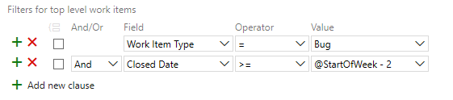
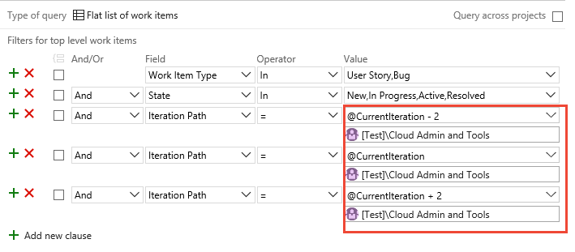

---
title: Query by date or current iteration 
titleSuffix: Azure Boards
description: Query for work items based on a date, a team's current iteration, or a sliding window of sprints in Azure Boards, Azure DevOps, & Team Foundation Server 
ms.custom: boards-queries
ms.technology: devops-agile
ms.prod: devops
ms.assetid: 95D9F558-E3C4-4D5F-BB69-76A3BD7625D8
ms.manager: jillfra
ms.author: kaelli
author: KathrynEE
ms.topic: sample
monikerRange: '>= tfs-2013'
ms.date: 04/08/2019
--- 

# Query by date or current iteration

[!INCLUDE [temp](../../_shared/version-vsts-tfs-all-versions.md)]

The **@Today** and **@CurrentIteration** macros are useful for listing work items based on relative dates or their assignment to a team's current iteration. To list work items based on when they were created, closed, resolved, or changed state&mdash;use **@Today** or specify dates. For queries that list work items based on their assignment to a team's current sprint, use **@CurrentIteration**. 

For example, you can find work items that were modified in the last 3 days with the following query.

  

::: moniker range=">= azure-devops-2019"
In addition, you can use  the <b>@CurrentIteration +/- <i>n</i></b> macro to create queries based on a sliding window of team iterations. 
::: moniker-end


## Supported operators and macros 
Query clauses that specify a <strong>DateTime</strong> field or the <strong>Iteration Path</strong> can use the operators and macros listed in the following table.


::: moniker range="azure-devops"

<table valign="top">
<thead>
<tr>
<th width="10%"><p>Data type</p></th>
<th width="78%"><p>Supported operators and macros</p></th>
</tr>
</thead>
<tbody valign="top">
<tr>
	<td><p><strong>DateTime</strong> </p></td>
	<td>= , <> , > , < , >= , <= , =[Field], <>[Field], >[Field], <[Field], >=[Field], <=[Field], In, Not In, Was Ever
	<p><strong>Macros</strong>:  <strong>@StartOfDay</strong>, <strong>@StartOfWeek</strong>, <strong>@StartOfMonth</strong>, <strong>@StartOfYear</strong>, and <strong>@Today</strong>; each of these macros can be specified with a <strong> +/- n</strong> interger.</p></td>
</tr>
<tr>
	<td><p> <strong>TreePath</strong> </p></td>
	<td>= , <> , Under, Not Under
	<p><strong>Macros</strong>: <strong>@CurrentIteration</strong><sup>1</sup> and <strong>@CurrentIteration +/- n</strong><sup>2</sup> valid with the <strong>Iteration Path</strong> field</p></td>
</tr>
</tbody>
</table>

::: moniker-end


::: moniker range="<= azure-devops-2019"

<table valign="top">
<thead>
<tr>
<th width="10%"><p>Data type</p></th>
<th width="78%"><p>Supported operators and macros</p></th>
</tr>
</thead>
<tbody valign="top">
<tr>
	<td><p><strong>DateTime</strong> </p></td>
	<td>= , <> , > , < , >= , <= , =[Field], <>[Field], >[Field], <[Field], >=[Field], <=[Field], In, Not In, Was Ever
	<p><strong>Macros</strong>:  <strong>@Today</strong>, <strong>@Today +/- n</strong> are valid with any <strong>DateTime</strong> field</p></td>
</tr>
<tr>
	<td><p> <strong>TreePath</strong> </p></td>
	<td>= , <> , Under, Not Under
	<p><strong>Macros</strong>: <strong>@CurrentIteration</strong><sup>1</sup> and <strong>@CurrentIteration +/- n</strong><sup>2</sup> valid with the <strong>Iteration Path</strong> field</p></td>
</tr>
</tbody>
</table>

::: moniker-end


####Notes:
1. The **@CurrentIteration** macro is supported for TFS 2015 and later versions, and only when run from the web portal. 
2. The **@CurrentIteration +/- n** macro is supported for Azure DevOps Server 2019 and later versions, and only when run from the web portal. 


## Date based queries  

You can filter for work items by the date on which they were changed or for a specific time period. If you limit the scope of your query, it can help with performance by only returning those results that fit the date range that you want to include. If you're new to creating queries, see [Use the query editor to list and manage queries](using-queries.md). 

Not all fields are valid for all work item types (WITs). Jump to [date fields](#date_fields) for the set of fields you can include in queries and which WITs they apply to. Enter dates in the **Date Pattern** you set for your personal profile. (See [Set personal preferences](../../organizations/settings/set-your-preferences.md) for details.)   

<table valign="top">
<tbody valign="top">
<tr>
  <th width="40%">
    <p>Filter for</p>
  </th>
  <th width="60%">
    <p>Include these query clauses</p>
  </th>
</tr>
<tr>
  <td>
    <p>Items created in the last 30 days</p>
  </td>
  <td>
     
  </td>
</tr>
<tr>
  <td>
    <p>Items modified on a specific date</p>
  </td>
  <td>
     
  </td>
</tr>
<tr>
  <td>
    <p>Items resolved today</p>
  </td>
  <td>
  </td>
</tr>
<tr>
  <td>
    <p>Items closed within a specified time period</p>
  </td>
  <td>
  </td>
</tr>
<tr>
  <td>
    <p>Items whose status was updated within the last week</p>
  </td>
  <td>
  </td>
</tr>
<tr>
  <td>
    <p>Items closed during the current sprint (the `@CurrentIteration` macro references the sprint defined for the current team context) </p>
  </td>
  <td>
  </td>
</tr>
</tbody>
</table>

::: moniker range="azure-devops"

## Start of Day, Week, Month, or Year date-based queries

The following examples show how to use the <strong>StartOf...</strong> macros to filter for work items with various offsets. For additional examples for using these macros, see [WIQL syntax](wiql-syntax.md#start-of). 


<table valign="top">
<tbody valign="top">
<tr>
  <th width="40%">
    <p>Filter for</p>
  </th>
  <th width="60%">
    <p>Include these query clauses</p>
  </th>
</tr>
<tr>
  <td>
    <p>Bugs closed in the last 2 weeks</p>
  </td>
  <td>
     
  </td>
</tr>
<tr>
  <td>
    <p>Items modified in the last 10 days</p>
  </td>
  <td>
     
  </td>
</tr>
<tr>
  <td>
    <p>Features scheduled to be completed in the next 3 months</p>
  </td>
  <td>
  </td>
</tr>
</tbody>
</table>


Not all fields are valid for all work item types (WITs). Jump to [date fields](#date_fields) for the set of fields you can include in queries and which WITs they apply to. Enter dates in the **Date Pattern** you set for your personal profile. (See [Set personal preferences](../../organizations/settings/set-your-preferences.md) for details.)   

::: moniker-end

<a id="current-iteration">  </a>

## Team's current iteration queries  
 
If your team follows Scrum processes, you [schedule work to be completed in sprints](../sprints/define-sprints.md). You can track the progress of requirements, bugs, and other work to be completed in the current sprint using the **@CurrentIteration** macro.  

Any item assigned to a sprint which corresponds to the current iteration path for the team will be found.  For example, if a team is on Sprint 5, then the query will return items assigned to Sprint 5. Later, when the team is working in Sprint 6, the same query will return items assigned to Sprint 6.  

> [!NOTE]
> For the **@CurrentIteration** macro to work, the team must have selected an **Iteration Path** whose date range encompasses the current date. For details, see [Define iteration paths (aka sprints) and configure team iterations](../../organizations/settings/set-iteration-paths-sprints.md#activate). Also, queries that contain this macro are only valid when run from the web portal.
> 
> See also [Client restrictions on the use of the @CurrentIteration macros](#current_sprint_restrict) later in this article.

::: moniker range=">= azure-devops-2019"

Azure Boards adds a team parameter when you select the **@CurrentIteration** or <b>@CurrentIteration +/- <i>n</i></b> macros. The team parameter is derived from your current [team context](#team_view). 

> [!div class="mx-imgBorder"]
>   

To change the team parameter the system automatically sets, you choose it by typing the name of the team into the parameter field added below the **@CurrentIteration** macro.  

> [!div class="mx-imgBorder"]


::: moniker-end

::: moniker range="<= tfs-2018"

Prior to creating or updating a query to use the **@CurrentIteration** macro, make sure you [select your team](#team_view). The **@CurrentIteration** macro references the current team selected in the web portal.  

> [!div class="mx-imgBorder"]
>   

::: moniker-end


::: moniker range=">= azure-devops-2019"

<a id="current-iteration-plus-minus-n">  </a>
## Sliding window of team iterations query 

Use the <b>@CurrentIteration +/- <i>n</i></b> macro when you want to track the work a team has planned for upcoming sprints and for understanding work that wasn't completed in previous sprints. 

> [!NOTE]
> For the <b>@CurrentIteration +/- <i>n</i></b> macro to work, the team must have selected **Iteration Paths** that meet the <b>+/- <i>n</i></b>
> criteria and date ranges encompass the current date for the **@CurrentIteration**. For details about team selection of Iteration Paths, see [Define iteration paths (aka sprints) and configure team iterations](../../organizations/settings/set-iteration-paths-sprints.md#activate). 
> 
> See also [Client restrictions on the use of the @CurrentIteration macros](#current_sprint_restrict) later in this article.

Here we show how to list all User Stories and Bugs assigned to the sliding window that spans the last two, the current, and the next two sprints selected for the *Cloud Admin and Tools* team. 

> [!div class="mx-imgBorder"]


To use this macro, the specified team must have [selected a set of sprints](../../organizations/settings/set-iteration-paths-sprints.md) that span the <b>+/- <i>n</i></b> value entered for the macro.  

::: moniker-end

<a id="date_fields">  </a>
## Date and Iteration Path fields
<p>You can use date fields to filter your queries. Some of these fields are populated with information as a work item progresses from one state to another. Several of these fields do not appear on the work item form, but they are tracked for those WITs listed in the following table.</p>

<table>
<tbody valign="top">
<tr>
  <th width="20%">Field name</th>
  <th width="55%">Description</th>
  <th width="25%">Work item type</th>
</tr>
<tr>
  <td>
    <p>Activated Date <sup>1</sup>  </p>
  </td>
  <td>
    <p>The date and time when the work item was created or when its status was changed from closed, completed, or done to a new or active state.  </p>
	<p>Reference name=Microsoft.VSTS.Common.ActivatedDate, Data type=DateTime</p>
  </td>
  <td>
    <p>All</p>
  </td>
</tr>
<tr>
  <td>
    <p>Change Date</p>
  </td>
  <td>
    <p>The date and time when a work item was modified.</p>
	<p>Reference name=System.ChangedDate, Data type=DateTime</p>
  </td>
  <td>
    <p>All</p>
  </td>
</tr>
<tr>
  <td>
    <p>Closed Date <sup>1</sup> </p>

  </td>
  <td>
    <p>The date and time when a work item was closed.</p>
	<p>Reference name=Microsoft.VSTS.Common.ClosedDate, Data type=DateTime</p>
  </td>
  <td>
    <p>All</p>
  </td>
</tr>
<tr>
  <td>
    <p>Created Date</p>
  </td>
  <td>
    <p>The date and time when a work item was created.</p>
	<p>Reference name=System.CreatedDate, Data type=DateTime</p>
  </td>
  <td>
    <p>All</p>
  </td>
</tr>
<tr>
  <td>
    <p>Due Date</p>
  </td>
  <td>
    <p>The forecasted due date for an issue to be resolved.</p>
<p>Reference name=Microsoft.VSTS.Scheduling.DueDate, Data type=DateTime</p>
  </td>
  <td>
    <p>Issue (Agile)</p>
  </td>
</tr>

<tr>
  <td>
    <p>Finish Date <sup>2</sup> </p>
  </td>
  <td>
    <p>The date and time when the schedule indicates that the task will be completed. </p>
<p>Reference name=Microsoft.VSTS.Scheduling.FinishDate, Data type=DateTime</p>
  </td>
  <td>
    <p>Task, Bug</p>
  </td>
</tr>
<tr>
  <td>Iteration Path</td>
  <td>Groups work items by named sprints or time periods. The iteration must be a valid node in the project hierarchy. You [define iteration paths for a project and select iteration paths for a team](../../organizations/settings/set-iteration-paths-sprints.md). 
<p>Reference name=System.IterationPath, Data type=TreePath</p>
  </td>
  <td>All</td>
</tr>
<tr>
  <td>
    <p>Resolved Date <sup>1</sup> </p>
  </td>
  <td>
    <p>The date and time when the work item was moved into a Resolved state. </p>
	<p>Reference name=Microsoft.VSTS.Common.ResolvedDate, Data type=DateTime</p>
  </td>
  <td>
    <p>Bug (Agile, CMMI)</p>
  </td>
</tr>
<tr>
  <td>
    <p>Start Date <sup>2</sup> </p>
  </td>
  <td>
    <p>The date and time when the schedule indicates that the task will start.  </p>
<p>Reference name=Microsoft.VSTS.Scheduling.StartDate, Data type=DateTime</p>
  </td>
  <td>
    <p>Task, Bug</p>
  </td>
</tr>
<tr>
  <td>
    <p>State Change Date</p>
  </td>
  <td>
    <p>The date and time when the value of the State field changed.</p>
	<p>Reference name=Microsoft.VSTS.Common.StateChangeDate, Data type=DateTime</p>
  </td>
  <td>
    <p>All</p>
  </td>
</tr>
<tr>
  <td>
    <p>Target Date</p>
  </td>
  <td>
    <p>The date by which a feature should be completed. </p>
<p>Reference name=Microsoft.VSTS.Scheduling.TargetDate, Data type=DateTime</p>
  </td>
  <td>
    <p>Feature</p>
  </td>
</tr>
</tbody>
</table>

#### Notes:
 
1. For these fields to be defined for a WIT, they must be included in the ```WORKFLOW``` section of the WIT definition. For example, this syntax is included within the ```FIELDS``` definition when transitioning to a Resolved state:  
	```xml
	<FIELD refname="Microsoft.VSTS.Common.ResolvedDate" />  
	   <SERVERDEFAULT from="clock"  />  
	</FIELD >  
	```

2. Start and Finish Date fields are calculated if you create a project plan in Microsoft Project and then synchronize that plan with tasks that are stored in Azure Boards. These fields do not appear on the work item form, but they are calculated for those backlog items and tasks that are linked to backlog items. You can view their read-only values in results from a query or from Microsoft Excel or Project. For more information, see [Create your backlog and tasks using Project](../backlogs/office/create-your-backlog-tasks-using-project.md).

<a id="team_view">  </a>
<a id="current_sprint_restrict"> </a> 

## Client restrictions on the use of the @CurrentIteration macros 
You can use the **@CurrentIteration** in a query from the following clients:  

- Web portal that connects to Azure Boards 
- Web portal that connects to an on-premises TFS 2015 or later version 
- Visual Studio 2015 or Team Explorer 2015 or later versions connected to Azure Boards or TFS 2015 or later versions. 
- Using the REST API

You can use the <b>@CurrentIteration +/- <i>n</i></b> macro in a query against Azure Boards, Azure DevOps Server 2019 and later versions, and with a REST API which includes the team as a parameter, for example, `@CurrentIteration('[Project]/Team')`.
  

An error occurs if you open a query that contains the **@CurrentIteration** macro in earlier versions of Visual Studio, or from Excel or Project. Also, you can't use the macro when [copying or cloning test suites and test cases](../../test/mtm/copying-and-cloning-test-suites-and-test-cases.md), [defining alerts](../../notifications/index.md), or with [REST APIs](../../integrate/get-started/rest/basics.md).


## Related articles
To query for items based on text entered in the History field, see [History and auditing](history-and-auditing.md). 

- [Query quick reference](query-index-quick-ref.md)
- [Define iteration paths (aka sprints) and configure team iterations](../../organizations/settings/set-iteration-paths-sprints.md)
- [Create managed queries with the query editor](using-queries.md)  
- [Query operators & macros](query-operators-variables.md)  
- [Work item field index](../work-items/guidance/work-item-field.md) 
- [Query permissions](set-query-permissions.md)


[!INCLUDE [temp](../_shared/rest-apis-queries.md)]

 