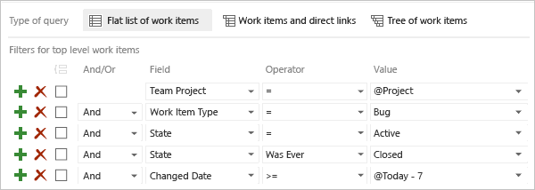
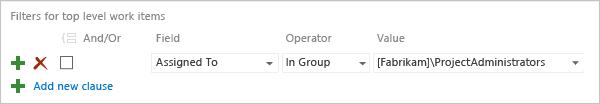
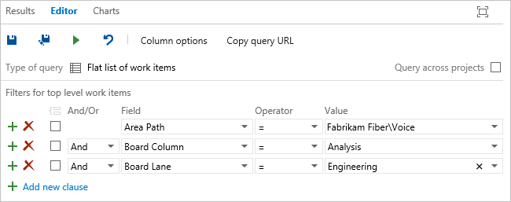

# Query by assignment or workflow changes
 
[!INCLUDE [temp](../_shared/version-vsts-tfs-all-versions.md)]

Workflow states support tracking the status of work as it moves from a new state to a closed or a done state. Kanban query fields support tracking the status of work as it moves from one column or swimlane to another on the Kanban board.  

Each workflow consists of a set of states,  valid transitions between  states, and reasons for transitioning the work item to the selected state. [Workflow states and reasons](../work-items/guidance/choose-process.md#workflow-states) differ among the work item types (WITs) and default processes used to create your project. 

Most work items move from a New, Active, or Proposed state to a Done or Closed state. As each work item moves from one state to another, the item might also be reassigned to various members of the team. For example, a tester might create a bug that is assigned to another team member during triage. When the other team member resolves the bug, it is reassigned to the tester who created it.  

<a id="reactivated"/> 

For example, you can find all work items that were closed but then reactivated. By specifying the Changed Date field, you can focus on reactivations that occurred today, yesterday, or in the last week.

  

You can also use the Activated By and Activated Date fields, or other workflow fields.

> [!TIP]  
>Not all fields are valid for all WITs. Jump to [Workflow and Kanban query fields](#workflow-fields) for the set of fields you can include in queries and which WITs they apply to.  

If you're new to creating queries, see [Use the query editor to list and manage queries](using-queries.md).  


## Supported operators and macros 
Query clauses that specify an Identity or workflow-associated field can use the operators and macros listed in the following table. To learn what the field data type is, see the [Workflow and Kanban board fields](#workflow-fields) provided later in this article. 

<table valign="top">
<thead>
<tr>
<th width="22%"><p>Data type</p></th>
<th width="78%"><p>Supported operators and macros</p></th>
</tr>
</thead>
<tbody valign="top">
<tr>
	<td><p><strong>Boolean <sup>1</sup></strong> </p></td>
	<td>= , <> , =[Field] , <>[Field]</td>
</tr>
<tr>
	<td><p><strong>DateTime</strong> </p></td>
	<td>= , <> , > , < , >= , <= , =[Field], <>[Field], >[Field], <[Field], >=[Field], <=[Field], In, Not In, Was Ever
	<p>**Macros**: **@Today**, **@Today +/- n** valid with any **DateTime** field</p></td>
</tr>
<tr>
	<td>**Identity**</td>
	<td>= , <> , > , < , >= , <= , =[Field], <>[Field], >[Field], <[Field], >=[Field], <=[Field], Contains, Does Not Contain, In, Not In, In Group, Not In Group, Was Ever
	<p>**Macros**: **@me** valid for all Identity fields</p></td>
</tr>
<tr>
	<td><strong>Single text (String)</strong> </td>
	<td>= , <> , > , < , >= , <= , =[Field], <>[Field], >[Field], <[Field], >=[Field], <=[Field], Contains, Does Not Contain, In, Not In, In Group, Not In Group, Was Ever
	</td>
</tr>
</tbody>
</table>
 
####Notes:
1. The **Boolean** data type field is supported for TFS 2017 and later versions.  

Use the **In** and **Not In** operators when you want to filter for or exclude two or more picklist entries or a delimited set of items. Use the **In Group** or **Not In Group** operators to filter for items that belong or don't belong within a category group, team security group, or other security group. For more information, see [Query fields, operators, and macros](query-operators-variables.md). 

<a id="me"/>
## Identity based queries  

You can use the search box or query editor to quickly find work items based on an assignment made to an **Identity** field. Also, you can filter for work items based on who changed, resolved, or closed a work item. By specifying a time period, you can scope your query even further which can help with performance. 

Use **=** to find current assignments, **Was Ever** to list items based on past assignments, and **@Me** to scope to your user identity. 

<table valign="top">
<tbody valign="top">
<tr>
  <th>
    <p>Filter for</p>
  </th>
  <th>
    <p>Include these query clauses</p>
  </th>
</tr>
<tr>
  <td>
    <p>Active items assigned to me</p>
  </td>
  <td>
    <p style="margin-bottom:0px">
&#160;&#160;&#160;&#160;&#160;&#160;&#160;&#160;&#160;&#160;&#160;&#160;```Assigned To _ = _ @Me```</p>
<p style="margin-bottom:0px">```And _ State _ = _ Active```</p>
</td>
</tr>
<tr>
<tr>
  <td>
    <p>Closed items that at some point was assigned to me</p>
  </td>
  <td>
    <p style="margin-bottom:0px">
&#160;&#160;&#160;&#160;&#160;&#160;&#160;&#160;&#160;&#160;&#160;&#160;```Assigned To _ Was Ever _ @Me```</p>
<p style="margin-bottom:0px">```And _ State _ = _ Closed```</p>
  </td>
</tr>
<tr>
  <td>
    <p>Active user stories assigned to my (Web) team</p>
  </td>
  <td>
    <p style="margin-bottom:0px">
&#160;&#160;&#160;&#160;&#160;&#160;&#160;&#160;&#160;&#160;&#160;&#160;```Work Item Type = User Story```</p>
<p style="margin-bottom:0px">```And _ State _ = _ Active```</p>
<p style="margin-bottom:0px">```And _ Assigned To _ In Group _ [FabrikamFiber]\Web```</p>
  </td>
</tr>
<tr>
  <td>
    <p>Items I've modified in the last 30 days</p>
  </td>
  <td>
    <p style="margin-bottom:0px">
&#160;&#160;&#160;&#160;&#160;&#160;&#160;&#160;&#160;&#160;&#160;&#160;```Changed By _ = _ @Me```</p>
<p style="margin-bottom:0px">```And _ Changed Date _ >= _   @Today-30```</p>
  </td>
</tr>

<tr>
  <td>
    <p>Unassigned items (leave the Value blank)</p>
  </td>
  <td>
    <p style="margin-bottom:0px">
&#160;&#160;&#160;&#160;&#160;&#160;&#160;&#160;&#160;&#160;&#160;&#160;```Assigned To _ = _  ```</p>
  </td>
</tr>

</tbody>
</table>

<!---

-->

<a id="group" /> 

## Team or group membership queries  

To filter on items assigned to someone who belongs to a team or security group, use the **In Group** operator.

  

You can use the **In Group** or **Not In Group** operators to filter a query based on several values that are members of a group, or that are not members of a group. Examples of groups are teams, built-in security groups, custom security groups, Azure Active Directory and Active Directory groups, and work item categories.

<a id="workflow-change"/> 

## Workflow change based queries

You use the State, Reason, and Resolved Reason fields to query for items based on workflow changes. 

<table valign="top">
<tbody valign="top">
<tr>
  <th>Filter for</th>
  <th>Include these query clauses</th>
</tr>
<tr>
  <td>
    <p>Resolved stories
    </p>
</td>
  <td>
    <p style="margin-bottom:0px">
&#160;&#160;&#160;&#160;&#160;&#160;&#160;&#160;&#160;&#160;&#160;&#160;```Work Item Type _ = _ User Story```</p>
<p style="margin-bottom:0px">```And _ State _ = _ Resolved```</p>
  </td>
</tr>
<tr>
  <td>
    <p>Stories, bugs, and tasks that are new or active
    </p>
</td>
  <td>
    <p style="margin-bottom:0px">
&#160;&#160;&#160;&#160;&#160;&#160;&#160;&#160;&#160;&#160;&#160;&#160;```Work Item Type _ In _ User Story,Bug,Task```</p>
<p style="margin-bottom:0px">```And _ State _ In _ New,Active```</p>
  </td>
</tr>
<tr>
  <td>
    <p>Items removed as they're duplicate  </p>
  </td>
  <td>
    <p style="margin-bottom:0px">
&#160;&#160;&#160;&#160;&#160;&#160;&#160;&#160;&#160;&#160;&#160;&#160;```State _ = _ Removed```</p>
<p style="margin-bottom:0px">```And _ Reason _ = _ Duplicate```</p>
  </td>
</tr>

<tr>
  <td>
    <p>Items failing acceptance tests  </p>
  </td>
  <td>
    <p style="margin-bottom:0px">
      ```Resolved Reason = Acceptance tests fail```
    </p>
  </td>
</tr>
<tr>
  <td>
    <p>Items closed within the last 15 days</p>
  </td>
  <td>
    <p style="margin-bottom:0px">
&#160;&#160;&#160;&#160;&#160;&#160;&#160;&#160;&#160;&#160;&#160;&#160;```State _ = _ Closed```</p>
<p style="margin-bottom:0px">```And _ Closed Date  _ >  _ @Today-15```</p>
  </td>
</tr>
</tbody>
</table>

<a id="workflow-change-who"/> 
## Workflow changes and Identity based queries

You can quickly find items that you changed, resolved or closed. You can also find items that were changed by other team members. Several fields&mdash;such as the Created By, Changed By, Resolved By, and Closed By&mdash;are populated based on changes to the workflow.  

<table valign="top">
<tbody valign="top">
<tr>
  <th>Filter for</th>
  <th>Include these query clauses</th>
</tr>
<tr>
  <td>
    <p>User Stories that I closed </p>
</td>
  <td>
    <p style="margin-bottom:0px">
&#160;&#160;&#160;&#160;&#160;&#160;&#160;&#160;&#160;&#160;&#160;&#160;```Work Item Type _ = _ User Story```</p>
<p style="margin-bottom:0px">```And _ Closed By _ = _ @Me```</p>
  </td>
</tr>
<tr>
  <td>
    <p>Items I resolved in the last week</p>
  </td>
  <td>
    <p style="margin-bottom:0px">
&#160;&#160;&#160;&#160;&#160;&#160;&#160;&#160;&#160;&#160;&#160;&#160;```Resolved By _ = _ @Me```</p>
<p style="margin-bottom:0px">```And _ Resolved Date _ >= _ @Today-7```</p>
  </td>
</tr>
</tbody>
</table>


<a id="kanban_query_fields">  </a>
::: moniker range=">= tfs-2015"
## Kanban board change queries 
Using the Kanban query fields&mdash;Board Column, Board Column Done, and Board Lane&mdash;you can list work items according to their flow status on the Kanban board. And, you can create a [status or trend chart](../../report/dashboards/charts.md) based on these queries. 
::: moniker-end

::: moniker range="tfs-2015"
> [!NOTE]   
> Kanban query fields are available with TFS 2015.1 or later versions. 
::: moniker-end

::: moniker range=">= tfs-2015"

For example, you can list items based on the team area path, and if they are in a specific custom Kanban column and swimlane. If you rename a column or swimlane, you'll need to update the query filters to reflect the new name. For more ideas, see this blog post: [New fields bring Kanban goodness to queries, and more](https://blogs.msdn.microsoft.com/devops/2015/10/19/new-fields-bring-kanban-goodness-to-queries-and-more/)  

  

> [!NOTE]    
> Queries are now scoped to the current project by default. Check the **Query across projects** to find work items defined in other projects within the collection.  


<table valign="top">
<tbody valign="top">
<tr>
  <th>Filter for</th>
  <th>Include these query clauses</th>
</tr>
<tr>
  <td>
    <p>User Stories in the Code/Doing column</p>
</td>
  <td>

    <p style="margin-bottom:0px">
&#160;&#160;&#160;&#160;&#160;&#160;&#160;&#160;&#160;&#160;&#160;&#160;```Work Item Type = User Story```</p>
<p style="margin-bottom:0px">```And _ Board Column _ = _ Code```</p>
<p style="margin-bottom:0px">```And _ Board Column Done _ = _ False```</p>

  </td>
</tr>
<tr>
  <td>
    Items in the Expedite swimlane
  </td>
  <td>
      ```Board Lane _ = _ Expedite```
  </td>
</tr>
<tr>
  <td>
Items in any swimlane that contains "Test"
  </td>
  <td>
      ```Board Lane _ Contains _ Test```
  </td>
</tr>
</tbody>
</table>


<a id="kanban-query-results">  </a>

> [!IMPORTANT] 
> Work items that appear on more then one team's Kanban board can yield query results that don't meet your expectations. Because each team can customize the Kanban board columns and swimlanes, the values assigned to work items which appear on different boards may not be the same. The primary work around for this issue is to maintain single ownership of work items by [team area path](../../organizations/settings/set-area-paths.md). Another option is to [add custom workflow states](../../reference/customize-work.md) which all teams can use.  

::: moniker-end

<a id="workflow-fields">  </a>


::: moniker range=">= tfs-2015"

## Workflow and Kanban board fields
You can use the following fields to filter your queries or build reports. Some of these fields are populated with information as a work item progresses from one state to another, or you move an item in the [Kanban board](../boards/kanban-basics.md) to a different column or swimlane. Several of these fields do not appear on the work item form, but they are tracked for those WITs listed in the following table.

For more information about field attributes, see [Work item fields and attributes](../work-items/work-item-fields.md).


<table width="100%">
<thead>
<tr>
  <th width="20%">Field name</th>
  <th width="46%">Description</th>
  <th width="12%">Data type </th>
  <th width="22%">Work item type</th>
</tr>
</thead>
<tbody valign="top">
<tr>
  <td>Activated By<sup>1,&nbsp;2</sup> </td>
  <td>The name of the team member who created the work item or changed its status from closed, completed, or done state to a new or active state. 
<p>Reference name=Microsoft.VSTS.Common.ActivatedBy</p></td>
  <td>String (Identity)</td>
  <td>All</td>
</tr>

<tr>
  <td>Activated Date <sup>2</sup></td>
  <td>The date and time when the work item was created or when its status was changed from closed, completed, or done to a new or active state. 
<p>Reference name=Microsoft.VSTS.Common.ActivatedDate</p></td>
  <td>DateTime</td>
  <td>All</td>
</tr>

<tr>
  <td>Assigned To<sup>1,&nbsp;2,&nbsp;3</sup> </td>
  <td>The name of the team member who currently owns the work item. For additional information, see [Note 1 on synchronization and person-name fields](#sync). 
<p>Reference name=System.AssignedTo</p></td>
  <td>String (Identity)</td>
  <td>All</td>
</tr>
<tr>
  <td>Board Column </td>
  <td>The current Kanban board column assignment of the work item, for example: Active, Closed, Committed, Done, or other custom column assignment. 
<p>Reference name=System.BoardColumn</p></td>
  <td>String</td>
  <td>Requirement Category<sup>4</sup> </td>
</tr>
<tr>
  <td>Board Column Done </td>
  <td>
    <p>The current assignment of the work item to Doing (False) or Done (True) Kanban column. Only assigned when [split-columns](../boards/split-columns.md) has been enabled for a Kanban board column. </p>
<p>Reference name=System.BoardColumnDone</p></td>
  <td>Boolean</td>
  <td>Requirement Category<sup>4</sup> </td>
</tr>
<tr>
  <td>
    <p>Board Lane </p>
  </td>
  <td><p>The current Kanban board swimlane assignment of the work item, for example: Default, Expedite, Blocked, or other custom swimlane assignment.</p>
<p>Reference name=System.BoardLane</p></td>
  <td>String</td>
  <td>Requirement Category<sup>4</sup>  </td>
</tr> 
<tr>
  <td>Closed By<sup>1,&nbsp;2</sup>  </td>
  <td><p>The name of the team member who set the state to closed, completed, or done. </p>
<p>Reference name=System.ClosedBy</p></td>
  <td>String</td>
  <td>All</td>
</tr>

<tr>
  <td>Closed Date</td>
  <td><p>The date and time when a work item was closed.</p>
<p>Reference name=Microsoft.VSTS.Common.ClosedDate</p></td>
  <td>DateTime</td>
  <td>All</td>
</tr>

<tr>
  <td>Created By<sup>1,&nbsp;2</sup> </td>
  <td><p>The name of the team member who created the work item.</p>
<p>Reference name=Microsoft.VSTS.Common.CreatedBy</p></td>
  <td>String (Identity)</td>
  <td>All</td>
</tr>

<tr>
  <td>Created Date</td>
  <td><p>The date and time when a work item was created.</p>
<p>Reference name=Microsoft.VSTS.Common.CreatedDate</p></td>
  <td>DateTime</td>
  <td>All</td>
</tr>

<tr>
  <td>Reason <sup>2,&nbsp;3</sup> </td>
  <td>The reason why the work item is in the current state.
<p>Values are defined within the ```WORKFLOW``` section of the WIT definition using the ```REASON``` element. To modify the defined reasons, see Change the workflow for a work item type.</p>
<p>Reference name=System.Reason</p></td>
  <td>String</td>
  <td>All (except Test Case and Shared Steps)</td>
</tr>

<tr>
  <td>Resolved By <sup>1,&nbsp;2</sup>  </td>
  <td><p>The date and time when the work item was moved into a resolved or done state.</p>
<p>Reference name=Microsoft.VSTS.Common.ResolvedBy</p></td>
  <td>String (Identity)</td>
  <td>All</td>
</tr>

<tr>
  <td>Resolved Date <sup>2</sup>  </td>
  <td>The date and time when the work item was moved into a resolved or done state.
<p>Reference name=Microsoft.VSTS.Common.ResolvedDate</p></td>
  <td>DateTime</td>
  <td>All</td>
</tr>

<tr>
  <td>Resolved Reason  <sup>2</sup>  </td>
  <td>The reason why a work item was resolved. For example, the user story is code complete or the bug is fixed.
<p>This field is read-only and only valid for Agile and CMMI work item types.</p>
<p>Reference name=Microsoft.VSTS.Common.ResolvedReason</p></td>
  <td>String</td>
  <td>All (Agile, CMMI)</td>
</tr>


<tr>
  <td>Reviewed By </td>
  <td>The name of the team member who responded to a code review request and is cataloged in the code review response. </p>
	<p>Reference name=Microsoft.VSTS.Common.ReviewedBy</p>
  </td>
  <td>String (Identity)</td>
  <td>Code Review Response
  </td>
</tr>

<tr>
  <td>State <sup>2, 3</sup>  </td>
  <td>The current state of the work item. This field allows you to update the status of a work item as it progresses from new or active to a done or closed state.  
   <p>Values are defined within the ```WORKFLOW``` section of the WIT definition using the ```STATE``` element. To add a custom state to Azure Boards, see [Customize the workflow for a process](../../organizations/settings/work/customize-process-workflow.md). To add or modify States or the workflow for TFS, see [Change the workflow for a work item type](../../reference/xml/change-workflow-wit.md).</p>
<p>Reference name=System.State</p></td>
  <td>String</td>
  <td>All</td>
</tr>


<tr>
  <td>State Changed Date</td>
  <td>The date and time when the value of the State field changed.
<p>Reference name=Microsoft.VSTS.Common.StateChangeDate</p></td>
  <td>DateTime</td>
  <td>All</td>
</tr>

</tbody>
</table>

#### Notes
  
<a id="sync">  </a>
1.  By default, the server synchronizes system-defined person-name fields with Active Directory or Azure Active Directory, if these are configured. These fields include: Activated By, Assigned To, Closed By, Created By, and Resolved By. You can grant access to a project by adding security groups that you created in AD or Azure AD or by adding accounts to existing or custom groups defined from the collection setting **Security** page. See [Set up Active Directory or Azure Active Directory](../../organizations/security/setup-ad-aad.md).
	
	For on-premises deployments, you can enable or disable synchronization for a person-name field by using the **witadmin changefields** command-line tool. You can also synchronize custom person-name fields by specifying the **syncnamechanges** attribute. See [Manage work item fields](../../reference/witadmin/manage-work-item-fields.md) and [FIELD (Definition) element reference](../../reference/xml/field-definition-element-reference.md).  
2.  Reportable field with attribute set to Dimension. Reportable data is exported to the data warehouse and can be included in Excel or SQL Server reports. For on-premises TFS, use the [**witadmin changefield**](../../reference/witadmin/manage-work-item-fields.md) command to change the reportable attribute for a field.  
3.  Indexed field. Enabling indexing for a field may increase the performance of finding work items whose queries specify that field. For on-premises TFS, use the [**witadmin indexfield** command](../../reference/witadmin/manage-work-item-fields.md) to change the index attribute for a field.  
4. This field applies to all work item types that appear on the Kanban board. This includes all WITs added to the Requirement Category and may include those added to the Bug Category based on the team setting for [Show bugs on boards and backlogs](../../organizations/settings/show-bugs-on-backlog.md). 
	If you want to modify a board-related field, such as Board Column or Board Lane, from the work item form, you must add it to the form. For more information, see [Add and manage fields (Inheritance process model)](../../organizations/settings/work/customize-process-field.md) or [Add or modify a work item field (On-premises XML process model)](../../reference/add-modify-field.md).

::: moniker-end


::: moniker range="tfs-2013"

## Workflow fields
You can use the following fields to filter your queries or build reports. Some of these fields are populated with information as a work item progresses from one state to another. Several of these fields do not appear on the work item form, but they are tracked for those WITs listed in the following table. For more information about field attributes, see [Work item fields and attributes](../work-items/work-item-fields.md).


<table width="100%">
<thead>
<tr>
  <th width="20%">Field name</th>
  <th width="48%">Description</th>
  <th width="12%">Data type </th>
  <th width="20%">Work item type</th>
</tr>
</thead>
<tbody valign="top">
<tr>
  <td>Activated By <sup>1,&nbsp;2</sup> </td>
  <td>The name of the team member who created the work item or changed its status from closed, completed, or done state to a new or active state. 
<p>Reference name=Microsoft.VSTS.Common.ActivatedBy</p></td>
  <td>String (Identity)</td>
  <td>All</td>
</tr>

<tr>
  <td>Activated Date <sup>2</sup></td>
  <td>The date and time when the work item was created or when its status was changed from closed, completed, or done to a new or active state. 
<p>Reference name=Microsoft.VSTS.Common.ActivatedDate</p></td>
  <td>DateTime</td>
  <td>All</td>
</tr>

<tr>
  <td>Assigned To <sup>1,&nbsp;2,&nbsp;3</sup> </td>
  <td>The name of the team member who currently owns the work item. For additional information, see [Note 1 on synchronization and person-name fields](#sync). 
<p>Reference name=System.AssignedTo</p></td>
  <td>String (Identity)</td>
  <td>All</td>
</tr>
<tr>
  <td>Closed By <sup>1,&nbsp;2</sup>  </td>
  <td><p>The name of the team member who set the state to closed, completed, or done. </p>
<p>Reference name=System.ClosedBy</p></td>
  <td>String</td>
  <td>All</td>
</tr>

<tr>
  <td>Closed Date</td>
  <td><p>The date and time when a work item was closed.</p>
<p>Reference name=Microsoft.VSTS.Common.ClosedDate</p></td>
  <td>DateTime</td>
  <td>All</td>
</tr>

<tr>
  <td>Created By <sup>1,&nbsp;2</sup>   </td>
  <td><p>The name of the team member who created the work item.</p>
<p>Reference name=Microsoft.VSTS.Common.CreatedBy</p></td>
  <td>String (Identity)</td>
  <td>All</td>
</tr>

<tr>
  <td>Created Date</td>
  <td><p>The date and time when a work item was created.</p>
<p>Reference name=Microsoft.VSTS.Common.CreatedDate</p></td>
  <td>DateTime</td>
  <td>All</td>
</tr>

<tr>
  <td>Reason <sup>2,&nbsp;3</sup> </td>
  <td>The reason why the work item is in the current state.
<p>Values are defined within the ```WORKFLOW``` section of the WIT definition using the ```REASON``` element. To modify the defined reasons, see Change the workflow for a work item type.</p>
<p>Reference name=System.Reason</p></td>
  <td>String</td>
  <td>All (except Test Case and Shared Steps)</td>
</tr>

<tr>
  <td>Resolved By <sup>1,&nbsp;2</sup>  </td>
  <td><p>The date and time when the work item was moved into a resolved or done state.</p>
<p>Reference name=Microsoft.VSTS.Common.ResolvedBy</p></td>
  <td>String (Identity)</td>
  <td>All</td>
</tr>
<tr>
  <td>Resolved Date <sup>2</sup>  </td>
  <td>The date and time when the work item was moved into a resolved or done state.
<p>Reference name=Microsoft.VSTS.Common.ResolvedDate</p></td>
  <td>DateTime</td>
  <td>All</td>
</tr>
<tr>
  <td>Resolved Reason  <sup>2</sup>  </td>
  <td>The reason why a work item was resolved. For example, the user story is code complete or the bug is fixed.
<p>This field is read-only and only valid for Agile and CMMI work item types.</p>
<p>Reference name=Microsoft.VSTS.Common.ResolvedReason</p></td>
  <td>String</td>
  <td>All (Agile, CMMI)</td>
</tr>
<tr>
  <td>Reviewed By </td>
  <td>The name of the team member who responded to a code review request and is cataloged in the code review response. </p>
	<p>Reference name=Microsoft.VSTS.Common.ReviewedBy</p>
  </td>
  <td>String (Identity)</td>
  <td>Code Review Response
  </td>
</tr>
<tr>
  <td>State <sup>2, 3</sup>  </td>
  <td>The current state of the work item. This field allows you to update the status of a work item as it progresses from new or active to a done or closed state.  
   <p>Values are defined within the ```WORKFLOW``` section of the WIT definition using the ```STATE``` element. To add a custom state to Azure Boards, see [Customize the workflow for a process](../../organizations/settings/work/customize-process-workflow.md). To add or modify States or the workflow for an on-premises server, see [Change the workflow for a work item type](../../reference/xml/change-workflow-wit.md).</p>
<p>Reference name=System.State</p></td>
  <td>String</td>
  <td>All</td>
</tr>
<tr>
  <td>State Changed Date</td>
  <td>The date and time when the value of the State field changed.
<p>Reference name=Microsoft.VSTS.Common.StateChangeDate</p></td>
  <td>DateTime</td>
  <td>All</td>
</tr>

</tbody>
</table>

#### Notes
  
<a id="sync">  </a>
1.  By default, the server synchronizes system-defined person-name fields with Active Directory or Azure Active Directory, if these are configured. These fields include: Activated By, Assigned To, Closed By, Created By, and Resolved By. You can grant access to a project by adding security groups that you created in AD or Azure AD or by adding accounts to existing or custom groups defined from the collection setting **Security** page. See [Set up Active Directory or Azure Active Directory](../../organizations/security/setup-ad-aad.md).
    
	You can enable or disable synchronization for a person-name field by using the **witadmin changefields** command-line tool. You can also synchronize custom person-name fields by specifying the **syncnamechanges** attribute. See [Manage work item fields](../../reference/witadmin/manage-work-item-fields.md) and [FIELD (Definition) element reference](../../reference/xml/field-definition-element-reference.md).

2.  Reportable field with attribute set to Dimension. Reportable data is exported to the data warehouse and can be included in Excel or SQL Server reports. For on-premises server, use the [**witadmin changefield**](../../reference/witadmin/manage-work-item-fields.md) command to change the reportable attribute for a field.  

3.  Indexed field. Enabling indexing for a field may increase the performance of finding work items whose queries specify that field. For on-premises server, use the [**witadmin indexfield** command](../../reference/witadmin/manage-work-item-fields.md) to change the index attribute for a field.  

::: moniker-end


## Related articles

- [Query quick reference](query-index-quick-ref.md) 
- [Work item fields and attributes](../work-items/work-item-fields.md)

[!INCLUDE [temp](../_shared/rest-apis-queries.md)]
 
 