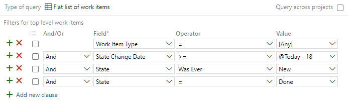
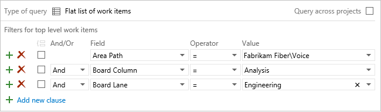

# Query by assignment or workflow changes

[!INCLUDE [temp](../includes/version-all.md)]

Workflow states support tracking the status of work as it moves from a new state to a closed or done state. Kanban query fields support tracking the status of work as it moves from one column or swimlane to another on the Kanban board.  

Each workflow consists of a set of states, valid transitions between  states, and reasons for transitioning the work item to the selected state. [Workflow states and reasons](../work-items/guidance/choose-process.md#workflow-states) differ among the work item types (WITs) and default processes used to create your project. 

Most work items move from a New, Active, or Proposed state to a Done or Closed state. As each work item moves from one state to another, the item might also be reassigned to various members of the team. For example, a tester might create a bug that is assigned to another team member during triage. When the other team member resolves the bug, it is reassigned to the tester who created it.  

<a id="reactivated"/> 

For example, you can find all work items that were closed but then reactivated. By specifying the Changed Date field, you can focus on reactivations that occurred today, yesterday, or in the last week.

  

You can also use the Activated By and Activated Date fields, or other workflow fields.

> [!TIP]  
> Not all fields are valid for all WITs. Jump to [Workflow and Kanban query fields](#workflow-fields) for the set of fields you can include in queries and which WITs they apply to.  

If you're new to creating queries, see [Use the query editor to list and manage queries](using-queries.md).  
## Supported operators and macros 

Query clauses that specify an Identity or workflow-associated field can use the operators and macros listed in the following table. To learn about the field data type, see [Workflow and Kanban board fields](#workflow-fields) provided later in this article. 

---
:::row:::
   :::column span="1":::
      **Data type**
   :::column-end:::
   :::column span="3":::
      **Supported operators and macros**
   :::column-end:::
:::row-end:::
---
:::row:::
   :::column span="1":::
      **Boolean** <sup>1</sup>
   :::column-end:::
   :::column span="3":::
      = , &lt;&gt; , =[Field] , &lt;&gt;[Field]
   :::column-end:::
:::row-end:::
---
:::row:::
   :::column span="1":::
      **DateTime**
   :::column-end:::
   :::column span="3":::
      = , &lt;&gt; , &gt; , &lt; , &gt;= , &lt;= , =[Field], &lt;&gt;[Field], &gt;[Field], &lt;[Field], &gt;=[Field], &lt;=[Field], In, Not In, Was Ever  
      **Macros**: **@Today**, **@Today +/- n** valid with any DateTime field 
   :::column-end:::
:::row-end:::
---
:::row:::
   :::column span="1":::
      **Identity**
   :::column-end:::
   :::column span="3":::
      = , &lt;&gt; , &gt; , &lt; , &gt;= , &lt;= , =[Field], &lt;&gt;[Field], &gt;[Field], &lt;[Field], &gt;=[Field], &lt;=[Field], Contains, Does Not Contain, In, Not In, In Group, Not In Group, Was Ever  
      **Macros**: **@me** valid for all Identity fields 
   :::column-end:::
:::row-end:::
---
:::row:::
   :::column span="1":::
     **Single text (String)** <sup>2</sup>
   :::column-end:::
   :::column span="3":::
      = , &lt;&gt; , &gt; , &lt; , &gt;= , &lt;= , =[Field], &lt;&gt;[Field], &gt;[Field], &lt;[Field], &gt;=[Field], &lt;=[Field], Contains, Does Not Contain, In, Not In, In Group, Not In Group, Was Ever
   :::column-end:::
:::row-end:::
---
 

#### Notes:
1. The **Boolean** data type field is supported for TFS 2017 and later versions.  
2. The **Was Ever** operator is only valid for Kanban board columns for Azure DevOps Services at this time.  


Use the **In** and **Not In** operators to filter for or exclude two or more picklist entries or a delimited set of items. Use the **In Group** or **Not In Group** operators to filter for items that belong or don't belong within a category group or  security group. For more information, see [Query fields, operators, and macros](query-operators-variables.md). 

<a id="me"/>

## Identity-based queries  

Use the search box or query editor to quickly find work items based on an assignment made to an **Identity** field. Also, you can filter for work items based on who changed, resolved, or closed a work item. By specifying a time period, you can scope your query even further, which can help with performance. 

Use **=** to find current assignments, **Was Ever** to list items based on past assignments, and <strong>@Me</strong> to scope to your user identity. 

<table valign="top">
<tbody valign="top">
<tr>
  <th>
    <p>Filter for</p>
  </th>
  <th>
    <p>Include these query clauses</p>
  </th>
</tr>
<tr>
  <td>
    <p>Active items assigned to me</p>
  </td>
  <td>
    <p style="margin-bottom:0px">
&#160;&#160;&#160;&#160;&#160;&#160;&#160;&#160;&#160;&#160;&#160;&#160;<code>Assigned To <em> = </em> <xref href="Me" data-throw-if-not-resolved="False" data-raw-source="@Me"></xref></code></p>
<p style="margin-bottom:0px"><code>And <em> State </em> = <em> Active</code></p>
</td>
</tr>
<tr>
<tr>
  <td>
    <p>Closed items that at some point was assigned to me</p>
  </td>
  <td>
    <p style="margin-bottom:0px">
&#160;&#160;&#160;&#160;&#160;&#160;&#160;&#160;&#160;&#160;&#160;&#160;<code>Assigned To </em> Was Ever <em> <xref href="Me" data-throw-if-not-resolved="False" data-raw-source="@Me"></xref></code></p>
<p style="margin-bottom:0px"><code>And </em> State <em> = </em> Closed</code></p>
  </td>
</tr>
<tr>
  <td>
    <p>Active user stories assigned to my (Web) team</p>
  </td>
  <td>
    <p style="margin-bottom:0px">
&#160;&#160;&#160;&#160;&#160;&#160;&#160;&#160;&#160;&#160;&#160;&#160;<code>Work Item Type = User Story</code></p>
<p style="margin-bottom:0px"><code>And <em> State </em> = <em> Active</code></p>
<p style="margin-bottom:0px"><code>And </em> Assigned To <em> In Group </em> [FabrikamFiber]\Web</code></p>
  </td>
</tr>
<tr>
  <td>
    <p>Items I&#39;ve modified in the last 30 days</p>
  </td>
  <td>
    <p style="margin-bottom:0px">
&#160;&#160;&#160;&#160;&#160;&#160;&#160;&#160;&#160;&#160;&#160;&#160;<code>Changed By <em> = </em> <xref href="Me" data-throw-if-not-resolved="False" data-raw-source="@Me"></xref></code></p>
<p style="margin-bottom:0px"><code>And <em> Changed Date </em> &gt;= <em>   <xref href="Today-30" data-throw-if-not-resolved="False" data-raw-source="@Today-30"></xref></code></p>
  </td>
</tr>

<tr>
  <td>
    <p>Unassigned items (leave the Value blank)</p>
  </td>
  <td>
    <p style="margin-bottom:0px">
&#160;&#160;&#160;&#160;&#160;&#160;&#160;&#160;&#160;&#160;&#160;&#160;<code>Assigned To </em> = _</code></p>
  </td>
</tr>

</tbody>
</table>

<!---

-->

<a id="group" /> 

## Team or group membership queries  

To filter on items assigned to someone who belongs to a team or security group, use the **In Group** operator.

  

You can use the **In Group** or **Not In Group** operators to filter a query based on several values that are members of a group, or that are not members of a group. Examples of groups you can specify include the following items: 
- teams
- built-in and custom security groups
- Azure Active Directory and Active Directory security groups
- work item categories.

<a id="workflow-change"/> 

## Workflow change based queries

You use the State, Reason, and Resolved Reason fields to query for items based on workflow changes. 

<table valign="top">
<tbody valign="top">
<tr>
  <th>Filter for</th>
  <th>Include these query clauses</th>
</tr>
<tr>
  <td>
    <p>Resolved stories
    </p>
</td>
  <td>
    <p style="margin-bottom:0px">
&#160;&#160;&#160;&#160;&#160;&#160;&#160;&#160;&#160;&#160;&#160;&#160;<code>Work Item Type <em> = </em> User Story</code></p>
<p style="margin-bottom:0px"><code>And <em> State </em> = <em> Resolved</code></p>
  </td>
</tr>
<tr>
  <td>
    <p>Stories, bugs, and tasks that are new or active
    </p>
</td>
  <td>
    <p style="margin-bottom:0px">
&#160;&#160;&#160;&#160;&#160;&#160;&#160;&#160;&#160;&#160;&#160;&#160;<code>Work Item Type </em> In <em> User Story,Bug,Task</code></p>
<p style="margin-bottom:0px"><code>And </em> State <em> In </em> New,Active</code></p>
  </td>
</tr>
<tr>
  <td>
    <p>Items removed as they&#39;re duplicate  </p>
  </td>
  <td>
    <p style="margin-bottom:0px">
&#160;&#160;&#160;&#160;&#160;&#160;&#160;&#160;&#160;&#160;&#160;&#160;<code>State <em> = </em> Removed</code></p>
<p style="margin-bottom:0px"><code>And <em> Reason </em> = <em> Duplicate</code></p>
  </td>
</tr>

<tr>
  <td>
    <p>Items failing acceptance tests  </p>
  </td>
  <td>
    <p style="margin-bottom:0px">
      <code>Resolved Reason = Acceptance tests fail</code>
    </p>
  </td>
</tr>
<tr>
  <td>
    <p>Items closed within the last 15 days</p>
  </td>
  <td>
    <p style="margin-bottom:0px">
&#160;&#160;&#160;&#160;&#160;&#160;&#160;&#160;&#160;&#160;&#160;&#160;<code>State </em> = <em> Closed</code></p>
<p style="margin-bottom:0px"><code>And </em> Closed Date  <em> &gt;  </em> <xref href="Today-15" data-throw-if-not-resolved="False" data-raw-source="@Today-15"></xref></code></p>
  </td>
</tr>
</tbody>
</table>

<a id="workflow-change-who"/> 

## Workflow changes and Identity-based queries

You can quickly find items that you changed, resolved, or closed. You can also find items that were changed by other team members. Several fields&mdash;such as the Created By, Changed By, Resolved By, and Closed By&mdash;are populated based on changes to the workflow.  

<table valign="top">
<tbody valign="top">
<tr>
  <th>Filter for</th>
  <th>Include these query clauses</th>
</tr>
<tr>
  <td>
    <p>User Stories that I closed </p>
</td>
  <td>
    <p style="margin-bottom:0px">
&#160;&#160;&#160;&#160;&#160;&#160;&#160;&#160;&#160;&#160;&#160;&#160;<code>Work Item Type <em> = </em> User Story</code></p>
<p style="margin-bottom:0px"><code>And <em> Closed By </em> = <em> <xref href="Me" data-throw-if-not-resolved="False" data-raw-source="@Me"></xref></code></p>
  </td>
</tr>
<tr>
  <td>
    <p>Items I resolved in the last week</p>
  </td>
  <td>
    <p style="margin-bottom:0px">
&#160;&#160;&#160;&#160;&#160;&#160;&#160;&#160;&#160;&#160;&#160;&#160;<code>Resolved By </em> = <em> <xref href="Me" data-throw-if-not-resolved="False" data-raw-source="@Me"></xref></code></p>
<p style="margin-bottom:0px"><code>And </em> Resolved Date <em> &gt;= </em> <xref href="Today-7" data-throw-if-not-resolved="False" data-raw-source="@Today-7"></xref></code></p>
  </td>
</tr>
</tbody>
</table>


## Query changes in work item state 

To list work items that have changed state within a specific date range, you can use the **State Change Date** field to narrow the search and then add clauses for changes to the **State** field. An example is shown in the following image.  
 
> [!div class="mx-imgBorder"] 
> 


<a id="kanban_query_fields">  </a>

::: moniker range=">= tfs-2015"

## Kanban board change queries 

Using the Kanban query fields&mdash;Board Column, Board Column Done, and Board Lane&mdash;you can list work items according to their flow status on the Kanban board. And, you can create a [status or trend chart](../../report/dashboards/charts.md) based on these queries. 
::: moniker-end

::: moniker range="tfs-2015"
> [!NOTE]   
> Kanban query fields are available with TFS 2015.1 or later versions. 
::: moniker-end

::: moniker range=">= tfs-2015"

For example, you can list items based on the team area path, and if they are in a specific custom Kanban column and swimlane. If you rename a column or swimlane, you'll need to update the query filters to reflect the new name. For more ideas, see this blog post: [New fields bring Kanban goodness to queries, and more](https://blogs.msdn.microsoft.com/devops/2015/10/19/new-fields-bring-kanban-goodness-to-queries-and-more/)  

  

> [!NOTE]    
> Queries are now scoped to the current project by default. Check the **Query across projects** to find work items defined in other projects within the collection.  

::: moniker-end

::: moniker range=">= tfs-2015"
---
:::row:::
   :::column span="2":::
      **Filter for**
   :::column-end:::
   :::column span="2":::
      **Include these query clauses**
   :::column-end:::
:::row-end:::
---
:::row:::
   :::column span="2":::
      User Stories in the **Code/Doing** column
   :::column-end:::
   :::column span="2":::
      `      Work Item Type = User Story`  
      `And` `Board Column = Code`   
      `And` `Board Column Done  = False`  
   :::column-end:::
:::row-end:::
---
:::row:::
   :::column span="2":::
      Items in the **Expedite** swimlane 
   :::column-end:::
   :::column span="2":::
      `Board Lane = Expedite`  
   :::column-end:::
:::row-end:::
---
:::row:::
   :::column span="2":::
      Items in any swimlane whose label contains "Test"  
   :::column-end:::
   :::column span="2":::
      `Board Lane Contains Test`  
   :::column-end:::
:::row-end:::
---
::: moniker-end
::: moniker range="azure-devops"
:::row:::
   :::column span="2":::
      Items that were ever in the "In Review" column 
   :::column-end:::
   :::column span="2":::
      `Board Column Was Ever In Review`  
   :::column-end:::
:::row-end:::
---
::: moniker-end


<a id="kanban-query-results">  </a>

[!INCLUDE [temp](../includes/note-kanban-boards-teams.md)]
 

<a id="workflow-fields">  </a>


::: moniker range=">= tfs-2015"

## Workflow and Kanban board fields

The following fields are useful to filter queries. Some of these fields get updated as a work item progresses from one state to another. Or they are updated as you  move a work item in the [Kanban board](../boards/kanban-basics.md) to a different column or swimlane. Several of these fields don't appear on the work item form, but they are tracked for those work item types listed in the following table.

For more information about field attributes, see [Work item fields and attributes](../work-items/work-item-fields.md).

::: moniker-end 


::: moniker range="tfs-2013"

## Workflow fields

You can use the following fields to filter your queries or build reports. Some of these fields are populated with information as a work item progresses from one state to another. Several of these fields do not appear on the work item form, but they are tracked for those WITs listed in the following table. For more information about field attributes, see [Work item fields and attributes](../work-items/work-item-fields.md).

::: moniker-end

---
:::row:::
   :::column span="1":::
      **Field name**
   :::column-end:::
   :::column span="2":::
      **Description**
   :::column-end:::
   :::column span="1":::
      **Work item type**
   :::column-end:::
:::row-end:::
---
:::row:::
   :::column span="1":::
      Activated By <sup> 1,&nbsp;2, 3</sup> 
   :::column-end:::
   :::column span="2":::
      ::: moniker range="azure-devops"
      The name of the team member who changed the status of a work item to an *In Progress* category state. 
      ::: moniker-end 
      ::: moniker range="< azure-devops"
      The name of the team member who changed the status of a work item from *New* to *Active* or re-activated a work item after it had been closed, completed, or done. 
      ::: moniker-end 
      Reference name=`Microsoft.VSTS.Common.ActivatedBy`  
      Data type=String (Identity)
   :::column-end:::
   :::column span="1":::
      Bug, Change Request, Epic, Feature, Issue, Product Backlog Item, Requirement, Review, Risk, Shared Step, Task, Test Case, User Story 
   :::column-end:::
:::row-end:::
---
:::row:::
   :::column span="1":::
      Activated Date <sup> 1, 3</sup> 
   :::column-end:::
   :::column span="2":::
      ::: moniker range="azure-devops"
      The date and time when the work item was changed to an *In Progress* category state. 
      ::: moniker-end 
      ::: moniker range="< azure-devops"
      The date and time when the work item was changed from *New* to *Active* or re-activated after it had been closed, completed, or done. 
      ::: moniker-end 
      Reference name=`Microsoft.VSTS.Common.ActivatedDate`  
      Data type=DateTime
   :::column-end:::
   :::column span="1":::
      All
   :::column-end:::
:::row-end:::
---
:::row:::
   :::column span="1":::
      ::: moniker range="azure-devops"
      Assigned To&nbsp;<sup> 2</sup>
      ::: moniker-end 
      ::: moniker range="< azure-devops"
      Assigned To&nbsp;<sup> 2,&nbsp;3,&nbsp;4</sup>
      ::: moniker-end
   :::column-end:::
   :::column span="2":::
      The name of the team member who currently owns the work item. For more information, see [Note 1 on synchronization and person-name fields](#sync).  
        
      Reference name=`System.AssignedTo`  
      Data type=String (Identity)
   :::column-end:::
   :::column span="1":::
      All
   :::column-end:::
:::row-end:::
---
:::row:::
   :::column span="1":::
      Board Column
   :::column-end:::
   :::column span="2":::
      The current Kanban board column assignment of the work item, for example: Active, Closed, Committed, Done, or other custom column assignment. 
        
      Reference name=`System.BoardColumn`  
      Data type=String  
   :::column-end:::
   :::column span="1":::
      ::: moniker range="azure-devops"
      Requirement Category<sup> 4</sup>  
      ::: moniker-end 
      ::: moniker range="< azure-devops"
      Requirement Category<sup> 5</sup> 
      ::: moniker-end 
   :::column-end:::
:::row-end:::
---
:::row:::
   :::column span="1":::
      Board Column Done 
   :::column-end:::
   :::column span="2":::
      The current assignment of the work item to Doing (False) or Done (True) Kanban column. Only assigned when [split-columns](../boards/split-columns.md) is enabled for a Kanban board column.  
      
      Reference name=`System.BoardColumnDone`  
      Data type=Boolean  
   :::column-end:::
   :::column span="1":::
      ::: moniker range="azure-devops"
      Requirement Category<sup> 4</sup>  
      ::: moniker-end 
      ::: moniker range="< azure-devops"
      Requirement Category<sup> 5</sup> 
      ::: moniker-end
   :::column-end:::
:::row-end:::
---
:::row:::
   :::column span="1":::
      Board Lane
   :::column-end:::
   :::column span="2":::
      The current Kanban board swimlane assignment of the work item, for example: Default, Expedite, Blocked, or other custom swimlane assignment.  
      
      Reference name=`System.BoardLane`  
      Data type=String  
   :::column-end:::
   :::column span="1":::
      ::: moniker range="azure-devops"
      Requirement Category<sup> 4</sup>  
      ::: moniker-end 
      ::: moniker range="< azure-devops"
      Requirement Category<sup> 5</sup> 
      ::: moniker-end
   :::column-end:::
:::row-end:::
---
:::row:::
   :::column span="1":::
      ::: moniker range="azure-devops"
      Closed By <sup> 1,&nbsp;2</sup> 
      ::: moniker-end 
      ::: moniker range="< azure-devops"
      Closed By <sup> 1,&nbsp;2, 3</sup> 
      ::: moniker-end
   :::column-end:::
   :::column span="2":::
      The name of the team member who set the state to closed, completed, or done.   
      
      Reference name=`Microsoft.VSTS.Common.ClosedBy`  
      Data type=String (Identity)
   :::column-end:::
   :::column span="1":::
      All
   :::column-end:::
:::row-end:::
---
:::row:::
   :::column span="1":::
      Closed Date 
   :::column-end:::
   :::column span="2":::
      The date and time when a work item was closed.  
      
      Reference name=`Microsoft.VSTS.Common.ClosedDate`  
      Data type=DateTime
   :::column-end:::
   :::column span="1":::
      All
   :::column-end:::
:::row-end:::
---
:::row:::
   :::column span="1":::
      ::: moniker range="azure-devops"
      Created By <sup> 1,&nbsp;2</sup> 
      ::: moniker-end 
      ::: moniker range="< azure-devops"
      Created By <sup> 1,&nbsp;2, 3</sup> 
      ::: moniker-end
   :::column-end:::
   :::column span="2":::
      The name of the team member who created the work item.  
      
      Reference name=`System.CreatedBy  
      Data type=String (Identity)
   :::column-end:::
   :::column span="1":::
      All
   :::column-end:::
:::row-end:::
---
:::row:::
   :::column span="1":::
      Created Date 
   :::column-end:::
   :::column span="2":::
      The date and time when a work item was created.  
      
      Reference name=`System.CreatedDate`  
      Data type=DateTime
   :::column-end:::
   :::column span="1":::
      All
   :::column-end:::
:::row-end:::
---
:::row:::
   :::column span="1":::
      ::: moniker range="azure-devops"
      Reason 
      ::: moniker-end 
      ::: moniker range="< azure-devops"
      Reason <sup> 3,&nbsp;4</sup>
      ::: moniker-end
   :::column-end:::
   :::column span="2":::
      The reason why the work item is in the current state. Each transition from one workflow state to another is associated with a corresponding reason.  
      ::: moniker range="< azure-devops-2019"
      For On-premises XML process models, the reason values are defined within the `WORKFLOW` section of the work item type definition using the `REASON` element. To modify the defined reasons, see [Change the workflow for a work item type](../../reference/xml/change-workflow-wit.md).
      ::: moniker-end 
      Reference name=`System.Reason`  
      Data type=String
   :::column-end:::
   :::column span="1":::
      All (except Test Case and Shared Steps)
   :::column-end:::
:::row-end:::
---
:::row:::
   :::column span="1":::
      ::: moniker range="azure-devops"
      Resolved By <sup> 1,&nbsp;2</sup>  
      ::: moniker-end 
      ::: moniker range="< azure-devops"
      Resolved By <sup> 1,&nbsp;2,&nbsp;3</sup>  
      ::: moniker-end
   :::column-end:::
   :::column span="2":::
      ::: moniker range="azure-devops"
      The name of the team member who changed the status of a work item to a *Resolved* category state. 
      ::: moniker-end 
      ::: moniker range="< azure-devops"
      The name of the team member who changed the status of a work item to *Resolved* or done workflow state. 
      ::: moniker-end 
      Reference name=`Microsoft.VSTS.Common.ResolvedBy`, Data type=String (Identity)
   :::column-end:::
   :::column span="1":::
      All
   :::column-end:::
:::row-end:::
---
:::row:::
   :::column span="1":::
      ::: moniker range="azure-devops"
      Resolved Date 
      ::: moniker-end 
      ::: moniker range="< azure-devops"
      Resolved Date<sup> 1, 2</sup> 
      ::: moniker-end
   :::column-end:::
   :::column span="2":::
      ::: moniker range="azure-devops"
      The date and time when the work item was changed to an *In Resolved* category state. 
      ::: moniker-end 
      ::: moniker range="< azure-devops"
      The date and time when the work item was moved into a *Resolved* or done workflow state. 
      ::: moniker-end 
      Reference name=`Microsoft.VSTS.Common.ResolvedDate`, Data type=DateTime
   :::column-end:::
   :::column span="1":::
      All
   :::column-end:::
:::row-end:::
---
:::row:::
   :::column span="1":::
      ::: moniker range="azure-devops"
      Resolved Reason 
      ::: moniker-end 
      ::: moniker range="< azure-devops"
      Resolved Reason <sup> 3</sup>
      ::: moniker-end
   :::column-end:::
   :::column span="2":::
      The reason why a work item was resolved. For example, the user story is code complete or the bug is fixed. This field is read-only and only valid for Agile and CMMI work item types.  
      
      Reference name=`Microsoft.VSTS.Common.ResolvedReason`  
      Data type=String 
   :::column-end:::
   :::column span="1":::
      All (Agile, CMMI)
   :::column-end:::
:::row-end:::
---
:::row:::
   :::column span="1":::
      Reviewed By 
   :::column-end:::
   :::column span="2":::
      The name of the team member who responded to a code review request and is cataloged in the code review response.  
       
      Reference name=`Microsoft.VSTS.Common.ReviewedBy`  
      Data type=String (Identity)
   :::column-end:::
   :::column span="1":::
      Code Review Response
   :::column-end:::
:::row-end:::
---
:::row:::
   :::column span="1":::
      ::: moniker range="azure-devops"
      State  
      ::: moniker-end 
      ::: moniker range="< azure-devops"
      State <sup> 3, 4</sup>
      ::: moniker-end
   :::column-end:::
   :::column span="2":::
      The current state of the work item. This field allows you to update the status of a work item as it progresses from new or active to a done or closed state.  
      ::: moniker range="azure-devops"
      To modify the workflow states, see [Customize the workflow for a process](../../organizations/settings/work/customize-process-workflow.md). 
      ::: moniker-end 
      ::: moniker range=">= azure-devops-2019 < azure-devops"
      To modify the workflow states, see the following articles:  
      - For Inherited process model: see [Customize the workflow for a process](../../organizations/settings/work/customize-process-workflow.md) 
      - For On-premises XML process models: see [Change the workflow for a work item type](../../reference/xml/change-workflow-wit.md).
      ::: moniker-end 
      ::: moniker range="< azure-devops-2019"
      To modify the workflow states, see [Change the workflow for a work item type](../../reference/xml/change-workflow-wit.md).
      ::: moniker-end  
      Reference name=`System.State`  
      Data type=String
   :::column-end:::
   :::column span="1":::
      All
   :::column-end:::
:::row-end:::
---
:::row:::
   :::column span="1":::
      State Changed Date 
   :::column-end:::
   :::column span="2":::
      The date and time when the value of the State field changed.  
      
      Reference name=`Microsoft.VSTS.Common.StateChangeDate`  
      Data type=DateTime
   :::column-end:::
   :::column span="1":::
      All
   :::column-end:::
:::row-end:::
---

#### Notes:  

<a id="sync">  </a>

::: moniker range="azure-devops"

1. See [Date and Identity fields](#date-identity).  
2.  By default, the server synchronizes system-defined person-name or Identity-based fields with Active Directory or Azure Active Directory. These fields include: **Activated By**, **Assigned To**, **Closed By**, **Created By**, and **Resolved By**. You can grant access to a project by adding security groups that you created in AD or Azure AD or by adding accounts to existing or custom groups defined from the collection setting **Security** page. See set up [Active Directory or Azure Active Directory](../../organizations/security/about-permissions.md#aad). 
3. See [Activated By/Date and Resolved By/Date fields](#activated-resolved-fields).   
3. The Requirement Category applies to all work item types that appear on the product backlog and Kanban board, and may include those added to the Bug Category based on the team setting for [Show bugs on boards and backlogs](../../organizations/settings/show-bugs-on-backlog.md). For more information on work item type categories, see [Use categories to group work item types](../../reference/xml/use-categories-to-group-work-item-types.md). 
	> [!NOTE]  
	> Even if you add a board-related field, such as Board Column or Board Lane, to a work item form, you can't modify the field from the form.  

::: moniker-end


::: moniker range="> tfs-2013 < azure-devops"

1. See [Date and Identity fields](#date-identity).

2.  By default, the server synchronizes system-defined person-name or Identity-based fields with Active Directory or Azure Active Directory. These fields include: Activated By, Assigned To, Closed By, Created By, and Resolved By. You can grant access to a project by adding security groups that you created in AD or Azure AD or by adding accounts to existing or custom groups defined from the collection setting **Security** page. See set up [Active Directory or Azure Active Directory](../../organizations/security/about-permissions.md#aad).

    For on-premises deployments, you can enable or disable synchronization for a person-name field by using the **witadmin changefields** command-line tool. You can also synchronize custom person-name fields by specifying the **syncnamechanges** attribute. See [Manage work item fields](../../reference/witadmin/manage-work-item-fields.md) and [FIELD (Definition) element reference](../../reference/xml/field-definition-element-reference.md).  
3.  Reportable field with attribute set to Dimension. Only valid when the collection is configured to support the On-premises XML model. Reportable data is exported to the data warehouse and can be included in Excel or SQL Server reports. For on-premises Azure DevOps, use the [**witadmin changefield**](../../reference/witadmin/manage-work-item-fields.md) command to change the reportable attribute for a field.  
4.  Indexed field. Enabling indexing for a field may increase the performance of finding work items whose queries specify that field. For on-premises Azure DevOps, use the [**witadmin indexfield** command](../../reference/witadmin/manage-work-item-fields.md) to change the index attribute for a field.  
5. The Requirement Category applies to all work item types that appear on the product backlog and Kanban board, and may include those added to the Bug Category based on the team setting for [Show bugs on boards and backlogs](../../organizations/settings/show-bugs-on-backlog.md). For more information on work item type categories, see [Use categories to group work item types](../../reference/xml/use-categories-to-group-work-item-types.md). 
	> [!NOTE]  
	> Even if you add a board-related field, such as Board Column or Board Lane, to a work item form, you can't modify the field from the form.  

::: moniker-end

::: moniker range="tfs-2013"

1.  By default, the server synchronizes system-defined person-name fields with Active Directory or Azure Active Directory, if these are configured. These fields include: Activated By, Assigned To, Closed By, Created By, and Resolved By. You can grant access to a project by adding security groups that you created in AD or Azure AD or by adding accounts to existing or custom groups defined from the collection setting **Security** page. See set up [Active Directory or Azure Active Directory](../../organizations/security/about-permissions.md#aad).

    You can enable or disable synchronization for a person-name field by using the **witadmin changefields** command-line tool. You can also synchronize custom person-name fields by specifying the **syncnamechanges** attribute. See [Manage work item fields](../../reference/witadmin/manage-work-item-fields.md) and [FIELD (Definition) element reference](../../reference/xml/field-definition-element-reference.md).

2.  Reportable field with attribute set to Dimension. Reportable data is exported to the data warehouse and can be included in Excel or SQL Server reports. For on-premises server, use the [**witadmin changefield**](../../reference/witadmin/manage-work-item-fields.md) command to change the reportable attribute for a field.  

3.  Indexed field. Enabling indexing for a field may increase the performance of finding work items whose queries specify that field. For on-premises server, use the [**witadmin indexfield** command](../../reference/witadmin/manage-work-item-fields.md) to change the index attribute for a field.  

::: moniker-end
 

### People picker 

The **Assigned To** field is supported by the people picker feature. For example, when you choose the **Assigned To** field from within a work item form, the people picker is activated. As shown in the following image, you simply start typing the name of the user you want to select, and search until you find a match. Users that you've previously selected appear in the list automatically. To select users that you haven't selected previously, simply enter their entire name or search against the full directory.  
 
> [!div class="mx-imgBorder"]  
>   

For organizations that manage their users and groups using Azure Active Directory (Azure AD) or Active Directory, people pickers provide support for searching all users and groups added to the AD, not just those added to the project. 

::: moniker range="azure-devops"

To limit the scope of identities available for selection to just those users added to the project, you can do so using the **Project-Scoped Users** group. To learn how, see [Manage your project, Limit identity search and selection](../../user-guide/project-admin-tutorial.md#limit-identity-selection). 
 

::: moniker-end

::: moniker range=">= tfs-2015"

<a id="date-identity" />

### Date and Identity fields 

Several date and identity fields are set based on workflow states or transitions. Some fields, such as **Created By** and **Created Date**, are set by the system when a work item is added. Other fields, such as **Closed Date** and **Closed By**, are set through the workflow definition of the work item type. Additionally, customized work item types may have additional rules defined that impact the date and identity field assignments.   

::: moniker-end

[!INCLUDE [date-time-pattern](../includes/date-time-pattern.md)]

::: moniker range="< azure-devops"

#### State changes

The following XML syntax example illustrates rules that may be defined for a work item type that govern the values for select fields. 
Here, the **Resolved Date**, **Resolved By**, **Closed Date**, **Closed By**, **Activated Date**, and **Activated By** fields are set to `EMPTY` when a State value is set to New. The State value assignments are evaluated first, and then the transition assignments are evaluated next. 

> [!div class="tabbedCodeSnippets"]
```XML
   <WORKFLOW>
      <STATES>
        <STATE value="New">
          <FIELDS>
            <FIELD refname="Microsoft.VSTS.Common.ResolvedDate">
              <EMPTY />
            </FIELD>
            <FIELD refname="Microsoft.VSTS.Common.ResolvedBy">
              <EMPTY />
            </FIELD>
            <FIELD refname="Microsoft.VSTS.Common.ResolvedReason">
              <EMPTY />
            </FIELD>
            <FIELD refname="Microsoft.VSTS.Common.ClosedDate">
              <EMPTY />
            </FIELD>
            <FIELD refname="Microsoft.VSTS.Common.ClosedBy">
              <EMPTY />
            </FIELD>
            <FIELD refname="Microsoft.VSTS.Common.ActivatedDate">
              <EMPTY />
            </FIELD>
            <FIELD refname="Microsoft.VSTS.Common.ActivatedBy">
              <EMPTY />
            </FIELD>
          </FIELDS>
        </STATE>
        <STATE value="Active">
          <FIELDS>
            <FIELD refname="Microsoft.VSTS.Common.ResolvedDate">
              <EMPTY />
            </FIELD>
            <FIELD refname="Microsoft.VSTS.Common.ResolvedBy">
              <EMPTY />
            </FIELD>
            <FIELD refname="Microsoft.VSTS.Common.ResolvedReason">
              <EMPTY />
            </FIELD>
            <FIELD refname="Microsoft.VSTS.Common.ClosedDate">
              <EMPTY />
            </FIELD>
            <FIELD refname="Microsoft.VSTS.Common.ClosedBy">
              <EMPTY />
            </FIELD>
          </FIELDS>
        </STATE>
        <STATE value="Resolved">
          <FIELDS>
            <FIELD refname="Microsoft.VSTS.Common.ClosedDate">
              <EMPTY />
            </FIELD>
            <FIELD refname="Microsoft.VSTS.Common.ClosedBy">
              <EMPTY />
            </FIELD>
          </FIELDS>
        </STATE>
        <STATE value="Closed" />
      </STATES>
```

#### Activated By and Activated Date transition assignments 

When the following transitions occur for a Bug work item: 

> [!div class="tabbedCodeSnippets"]
```XML
<TRANSITION from="" to="New">
<TRANSITION from="New" to="Active">
<TRANSITION from="New" to="Resolved">
<TRANSITION from="New" to="Closed">
<TRANSITION from="Resolved" to="Active">
<TRANSITION from="Closed" to="Active">
```

then the following assignments are made to the Activated By and Activated Date fields. 

> [!div class="tabbedCodeSnippets"]
```XML
<FIELDS>
   <FIELD refname="Microsoft.VSTS.Common.ActivatedBy">
       <COPY from="currentuser" />
           <VALIDUSER />
           <REQUIRED />
    </FIELD>
    <FIELD refname="Microsoft.VSTS.Common.ActivatedDate">
        <SERVERDEFAULT from="clock" />
   </FIELD>
</FIELDS>
```

And when the following transitions occur for the Bug work item: 

> [!div class="tabbedCodeSnippets"]
```XML
<TRANSITION from="Active" to="New">
<TRANSITION from="Active" to="Closed">
<TRANSITION from="Resolved" to="Closed">
```

Then the Activated By and Activated Date fields are set to `READONLY`.

> [!div class="tabbedCodeSnippets"]
```XML
<FIELD refname="Microsoft.VSTS.Common.ActivatedDate">
   <READONLY />
</FIELD>
<FIELD refname="Microsoft.VSTS.Common.ActivatedBy">
   <READONLY />
</FIELD>
```

::: moniker-end


[!INCLUDE [activated-resolved-by-fields](../includes/activated-resolved-by-fields.md)]


## Related articles

- [How workflow states and state categories are used in Backlogs and Boards](../work-items/workflow-and-state-categories.md) 
- [Query by date or current iteration](query-by-date-or-current-iteration.md)
- [Query quick reference](query-index-quick-ref.md) 
- [Work item fields and attributes](../work-items/work-item-fields.md)
- [Query permissions](set-query-permissions.md)


[!INCLUDE [temp](../includes/rest-apis-queries.md)]

