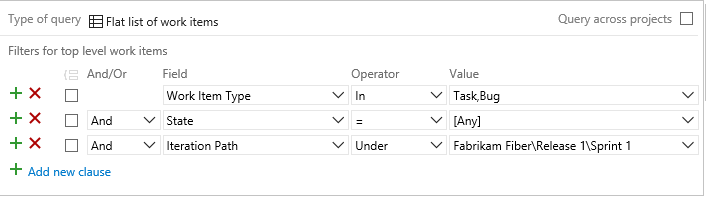

# Query by numeric fields    

[!INCLUDE [temp](../_shared/version-vsts-tfs-all-versions.md)]

How do I determine how much work each developer has completed on my team? Is there a way to sum up the effort or story points for an iteration? 

The most common numeric fields track effort for items in the Requirements category or estimated, remaining, and completed work for items in the Task category. With queries you can list the work items of interest, and then define a chart that shows either a count of work items or a sum of a numeric field. 


## Supported operators and macros 
Query clauses that specify a numeric field can use the operators listed below.
- = , <> , > , < , >= , <=  
- =[Field], <>[Field], >[Field], <[Field], >=[Field], <=[Field] 
- In, Not In 
- Was Ever

## Tips for developing chart-based-queries: 

- You can only add charts for flat-list queries  
- Chart options reference either query filters or fields displayed through column options
- Save changes you make to your query prior to adding or modifying a chart. 
- To group one or more clauses, select them and then choose the  group clauses icon. To ungroup, click on the grouped clause. 

For additional details on creating queries and chart-based-queries, see [Use the query editor to list and manage queries](using-queries.md) and [Charts](../../report/dashboards/charts.md).  If you want to add a custom field to track and generate sums of other numeric values, see [Add or modify a field](../../reference/add-modify-field.md).

### Useful filters 
<table width="100%">
<tbody valign="top">
<tr>
<th width="36%">Filter for</th>
<th width="64%">Include these query clauses</th>
</tr>
<tr>
<td>User stories or bugs  
</td>
<td>
```Work Item Type _ In _ User Story,Bug```  
</td>
</tr>
<tr>
<td>Tasks or bugs
</td>
<td>
```Work Item Type _ In _ Task,Bug```  
</td>
</tr>
<tr>
<td>
Items that are Active or Closed
</td>
<td>
```State _ In _ Active,Closed```  
</td>
</tr>

<tr>
<td>
Items in the Requirements category 
</td>
<td>
```Work Item Type _ In Group _ Microsoft.RequirementCategory```  
</td>
</tr>


<tr>
<td>
Unestimated user stories 
</td>
<td>
```Story Points _ <> _ (leave Value field blank) ```  
</td>
</tr>

</tbody>
</table>  


<a id="counts"/>
## Work item count queries and charts

All queries show a count of items when you run the query. Here we define a flat-list query that filters for bugs in any state.  

  

In addition, all charts contain a Values selection designed to display a count of work items within the chart. 

### Count of bugs per developer
 
Create an  active bugs query and modify the column options to show Assigned To and State. Then, add a pivot chart that displays the assignments and state. 

::: moniker range=">= azure-devops-2019"
> [!div class="mx-imgBorder"]  
>   
::: moniker-end

::: moniker range="<= tfs-2018"
  
::: moniker-end

### Count of bugs by state and area 

Using the same flat-list query that filters for bugs shown in the previous section, you can show a count based on area. Modify the column options to show the Area Path. Then, add a pivot chart that displays the state and area path. 

::: moniker range=">= azure-devops-2019"
> [!div class="mx-imgBorder"]  
>   
::: moniker-end

::: moniker range="<= tfs-2018"

::: moniker-end


<a id="effort"/>
## Effort or story point queries and charts  

You can assign Story Points to user stories or bugs when you work in an Agile process. Or, Effort to product backlog items and bugs when you work in a Scrum process. For more information, see [Basic](../get-started/track-issues-tasks.md), [Agile](../work-items/guidance/agile-process.md), [Scrum](../work-items/guidance/scrum-process.md), or [CMMI](../work-items/guidance/cmmi-process.md) work item types and workflow topics.  

### Sum of story points and their status   

Create a query that filters for User Story as the work item type and modify the column options to show Story Points and State. 


Then, add a stacked bar chart that sums the Story Points. 

::: moniker range=">= azure-devops-2019"
> [!div class="mx-imgBorder"]  
>   
::: moniker-end

::: moniker range="<= tfs-2018"

::: moniker-end

::: moniker range="tfs-2013"
> [!NOTE]    
> The **Sum** feature is supported for TFS 2013.4 and later versions.
::: moniker-end

For information on system-defined cumulative flow diagrams, see [Cumulative flow](../../report/dashboards/cumulative-flow.md).

###Burnup chart of user stories for an iteration 

Create a query that filters for User Story as the work item type and in the Active or Closed state. Modify the column options to show Story Points. 


Then, add a stacked area trend chart that sums the Story Points. 

::: moniker range=">= azure-devops-2019"
> [!div class="mx-imgBorder"]  
>   
::: moniker-end

::: moniker range="<= tfs-2018"

::: moniker-end


<a id="work"/>
##Remaining and completed work queries and charts  

Based on the process your project references, you can assign the following fields to tasks or bugs. 

| Process | Available fields   |
|---------|---------|---------|
| Agile | Original Estimate, Remaining Work, Completed Work  |
| Scrum | Remaining Work |
| CMMI  | Original Estimate, Remaining Work, Completed Work  |


### Sum of remaining work per developer 

If you follow Scrum practices and estimate Remaining Work for your tasks and bugs, you can get a roll up of the amount of work remaining for each developer with the following query and chart. By using the In operator and including both Task and Bug, you include any bugs that are being tracked as tasks. 

  

Add Remaining Work as a column option to the query and save. To view a sum of the remaining work, add a pivot chart as shown. 

::: moniker range=">= azure-devops-2019"
> [!div class="mx-imgBorder"]  
>   
::: moniker-end

::: moniker range="<= tfs-2018"
 
::: moniker-end

::: moniker range="tfs-2013"
> [!NOTE]    
> The **Sum** feature is supported for TFS 2013.4 and later versions.
::: moniker-end
 
For information on system-defined sprint burndown charts, see [Sprint burndown](../sprints/sprint-burndown.md).


## Fields used to estimate and track work

The following table describes the activity-based and numeric fields that you can use to track work. For information on date-related fields, such as Start Date, Finish Date, and Target Date, see [Query by date or current iteration](query-by-date-or-current-iteration.md).  


<table width="100%">
<thead>
<tr>
  <th width="20%">Field name</th>
  <th width="55%">Description</th>
  <th width="25%">Work item type</th>
</tr>
</thead>
<tbody valign="top">
<tr>
	<td><p>Activity <sup>1, 2</sup></p></td>
	<td><p>The type of activity that is required to perform a task.To learn more about how this field is used, see [Capacity planning](../sprints/set-capacity.md). Allowed values are:</p><ul><li><p>Deployment</p></li><li><p>Design</p></li><li><p>Development</p></li><li><p>Documentation</p></li><li><p>Requirements</p></li><li><p>Testing</p></li></ul>

<p>The Activity field is assigned to <code>type=&quot;Activity&quot;</code> in the ProcessConfiguration file.<sup>3</sup></p>
<p>Reference name=Microsoft.VSTS.Common.Activity, Data type=String</p>
</td>
	<td>Task, Bug<sup>4</sup> (Agile and Scrum)</td>

</tr>
<tr>
	<td><p>Business Value</p></td>
	<td><p>A subjective unit of measure that captures the relative business value of a product backlog item or feature compared to other items of the same type. An item that is assigned a higher number should be considered as having more business value than an item that is assigned a lower number.</p><p>Reference name=Microsoft.VSTS.Common.BusinessValue, Data type=Integer</p>  </td>
	<td>Epic, Feature</td>
</tr>

<tr>
	<td><p>Completed Work</p></td>
	<td><p>The amount of work that has been spent implementing a task. You can specify work in hours or in days. There are no inherent time units associated with this field.</p>
<p>Reference name=Microsoft.VSTS.Scheduling.CompletedWork, Data type=Double</p>
</td>
<td>Task, Bug<sup>4</sup></td>
</tr>
<tr>
	<td><p>Discipline <sup>1, 2</sup></p></td>
	<td><p>The type of activity or discipline that is assigned to a task. To learn more about how this field is used, see [Capacity planning](../sprints/set-capacity.md). Allowed values are:</p><ul><li><p>Analysis</p></li><li><p>Development</p></li><li><p>Test</p></li><li><p>User Education</p></li><li><p>User Experience</p></li></ul>
<p>The Discipline field is assigned to <code>type=&quot;Activity&quot;</code> in the ProcessConfiguration file.<sup>3</sup></p>

<p>Reference name=Microsoft.VSTS.Common.Discipline, Data type=String</p>
</td>
<td>Task, Bug <sup>4</sup> (CMMI)</td>
</tr>

<tr>
	<td><p>Effort</p></td>
	<td><p>A subjective unit of measure that captures the size of a bug or product backlog item. If you assign more effort to an item, you indicate that more work is required to implement it. </p><p>This field <sup>3</sup> is also used to calculate team velocity and forecasting. It is assigned to <code>type=&quot;Effort&quot;</code> in the ProcessConfiguration file.</p>
<p>Reference name=Microsoft.VSTS.Scheduling.Effort, Data type=Double</p>
</td>
<td>Product Backlog Item, Bug <sup>4</sup> (Scrum)<p>Feature, Epic</p></td>
</tr>
<tr>
	<td><p>Story Points</p></td>
	<td><p>A subjective unit of measure that captures the size of a user story. If you assign more points to a user story, you indicate that more work is required to implement it.</p><p>This field <sup>3</sup> is also used to calculate team velocity and forecasting. It is assigned to <code>type=&quot;Effort&quot;</code> in the ProcessConfiguration file. </p>
<p>Reference name=Microsoft.VSTS. Scheduling.StoryPoints, Data type=Double</p>
</td>
<td>User Story, Bug <sup>4</sup> (Agile)</td>
</tr>
<tr>
	<td><p>Size </p></td>
	<td><p>A subjective unit of measure that captures the size of a requirement. The larger the size, the more work is required to implement it. </p><p>This field<sup>3</sup>  is also used to calculate team velocity and forecasting. It is assigned to <code>type=&quot;Effort&quot;</code> in the ProcessConfiguration file. </p>
<p>Reference name=Microsoft.VSTS. Scheduling.Size, Data type=Double</p>
</td>
	<td>Requirement, Bug <sup>4</sup> (CMMI)</td>
</tr>
<tr>
	<td><p>Original Estimate</p></td>
	<td><p>The amount of work required to complete a task. You can specify work in hours or in days. There are no inherent time units associated with this field. </p>
<p>Reference name=Microsoft.VSTS.Scheduling.OriginalEstimate, Data type=Double</p>
</td>
	<td>Task, Bug <sup>4</sup> (Agile and CMMI)</td>
<tr>
	<td><p>Remaining Work</p></td>
	<td><p>The amount of work that remains to finish a task. You can specify work in hours or in days. There are no inherent time units associated with this field.</p>
<p>This field <sup>3</sup> is also used to calculate burn down. It is assigned to <code>type=&quot;RemainingWork&quot;</code> in the ProcessConfiguration file.</p>
<blockquote>
<b>Note:</b> For Azure Boards, the taskboard always shows "h" for hours in relationship to Remaining Work. For TFS, you can modify the ProcessConfiguration file for the Remaining Work type field to specify "d" for days, or other preferred label.  
</blockquote>
<p>Reference name=Microsoft.VSTS.Scheduling.RemainingWork, Data type=Double</p>
</td>
	<td>Task, Bug<sup>4</sup></td>
</tr>

<tr>
	<td><p>Requires Review</p></td>
	<td><p>Indicates the task requires review. You can specify <strong>Yes</strong> or <strong>No</strong> (default).</p>

<p>Reference name=Microsoft.VSTS.CMMI.RequiresReview, Data type=String</p>
</td>
	<td>Task (CMMI)</td>
</tr>

<tr>
	<td><p>Requires Test</p></td>
	<td><p>Indicates the task requires a test. You can specify <strong>Yes</strong> or <strong>No</strong> (default).</p>

<p>Reference name="Microsoft.VSTS.CMMI.RequiresTest, Data type=String</p>
</td>
	<td>Task (CMMI)</td>
</tr>


<tr>
	<td><p>Task Type<sup>1</sup></p></td>
	<td><p>Specifies the kind of task to implement. Allowed values are:</p><ul><li><p>Corrective Action</p></li><li><p>Mitigation Action</p></li><li><p>Planned</p></li></ul>
<p>Reference name=Microsoft.VSTS.CMMI.TaskType, Data type=String</p>
</td>
	<td>Task, Bug<sup>4</sup> (CMMI process)</td>
</tr>


</tbody>
</table>

**Notes:**

1.  To change the menu selection (on-premises deployments only), see [Add or modify a field, customize a picklist](../../reference/add-modify-field.md).   
2.  The values displayed in the [Capacity page](../sprints/set-capacity.md) for Activity(Agile or Scrum) or Discipline (CMMI) reflect a union of all values defined for the field in all projects within the project collection instance. Therefore, to restrict the values that appear for Capacity on the sprint backlog pages, you must make the values match in all the projects for the field assigned to `type="Activity"`.</p>

3.  To change the ProcessConfiguration field assignment (on-premises TFS only), see [Process configuration XML element reference](../../reference/xml/process-configuration-xml-element.md).

4. Each team can configure their Agile tools to determine if [bugs are treated similar to requirements or tasks](#show-bugs). Since bugs can appear either with requirements or tasks, fields used to estimate effort at the requirement-level and the task-level are included in the work item form. 

## Related articles 
For information on adding custom fields, see [Customize your work tracking experience](../../reference/customize-work.md).  

The main tools you use to plan and track work are described here: 
- [Create your backlog](../backlogs/create-your-backlog.md)
- [Sprint planning](../sprints/assign-work-sprint.md)
- [Capacity planning](../sprints/set-capacity.md)
- [taskboard](../sprints/task-board.md)
- [Kanban board](../boards/kanban-basics.md)

For more information on using work items and queries, see: 
- [Query editor](using-queries.md)   
- [Query fields, operators, and macros](query-operators-variables.md)   
- [Add work items](../backlogs/add-work-items.md)  
- [Work item field index](../work-items/guidance/work-item-field.md) 
- [Create managed queries](example-queries.md)  

<a id="show-bugs"/>

<a id="rollup"/>
### Rollup numeric values across work item types  

Rollup provides summed values of select fields for all child work items of a parent. Natively, Azure Boards and TFS provide rollup of Remaining Work for tasks on the taskboard. For other rollup requirements, see the following topics: 
- [Support rollup of work and other fields](../../reference/xml/support-rollup-of-work-and-other-fields.md)  
-[Rollup estimated and actual work using Project](../backlogs/office/rollup-estimated-and-actual-work-using-project.md)  
- [Create rollup charts with Power BI](../../report/powerbi/create-rollup-charts.md)

<a id="category"/>
### What items appear in the Requirement or Task categories? 

The default assignments of work item types to each category are listed below for each process.  

| Process | Requirement category | Task category |
|---------|---------|---------|
| Agile | User Story | Task |
| Scrum | Product Backlog Item | Task |
| CMMI | Requirement | Task |

However, each team can determine if the Bug work item type appears in either the Requirement or Task category. See [Show bugs on backlogs and boards](../../organizations/settings/show-bugs-on-backlog.md). 

Also, you can add custom work item types to a backlog. For details, see [Add or modify a work item type, Add a custom WIT to a backlog or board](../../reference/add-modify-wit.md). 

[!INCLUDE [temp](../_shared/rest-apis-queries.md)]
