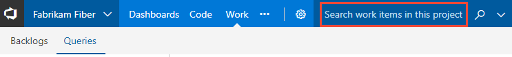
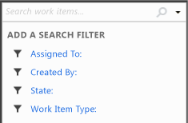
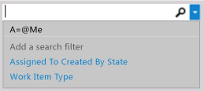

# Run a semantic work item search in Azure Boards and Azure DevOps

[!INCLUDE [version-lt-eq-azure-devops](../../includes/version-lt-eq-azure-devops.md)]

<a id="search-box"/>

You can find work items by using shortcut filters or by specifying keywords or phrases. You can also use specific fields/field values, assignment or date modifications, or using Equals, Contains, and Not operators. Searching isn't case-sensitive. Use semantic searches when you want to do the following tasks:

- Find a specific work item using its ID or a keyword
- Find one or more work items across all projects in a fast, flexible manner
- Run a full text search across all work item fields
- Review work items assigned to a specific team member
- Search against specific work item fields to quickly narrow down a list of work items
- Determine what key words will support a managed search

You can run a powerful [semantic search](#start-search) from the web portal for Azure DevOps Services or for on-premises deployments when the [server instance has been configured with the work item search extension](../../project/search/get-started-search.md).
 

::: moniker range="< azure-devops"
> [!TIP]   
> If semantic search has been configured, you'll notice that the search box moves into the blue bar as shown in the following image.  
> 
>  
::: moniker-end     

## Start a semantic search for work items

With semantic search you can search: 
- Across one or more projects  
- Across all work item fields using free text  
- Against specific work item fields  

Free text search easily searches across all work item fields, including custom fields, which enables more natural searches. Search results are displayed in a snippet view where the search matches found are highlighted. Semantic search also integrates with work item tracking, providing familiar controls to view, edit, comment, and share information within a work item form. 

::: moniker range=">= azure-devops-2019"

1. Choose any **Boards** page, enter a keyword or phrase in the search box, and press *Enter* or choose the :::image type="icon" source="../../project/search/media/shared/start-search-icon.png" border="false"::: start search icon. 

   :::image type="content" source="../../project/search/media/get-started/work-item-search-vert.png" alt-text="Work Item Search box":::

2. Search results are displayed in a snippet view where the matches found are shown in bold.

   

   This search is a full text search that uses simple search strings for words or phrases.
   Work item search matches derived forms of your search terms; for example, a search for
   "updating" will also find instances of the word "updated" and "update". Searches _aren't_ case-sensitive.

3. Select a snippet of a work item to display it in the right window. 

   Open the search results in a new browser tab from a search box by
   pressing _Ctrl_ + _Enter_ or by holding _Ctrl_ and clicking  the
    icon.
   In Google Chrome, press _Ctrl_ + _Shift_ + _Enter_ to switch the focus
   to the new browser tab. 

::: moniker-end

::: moniker range="tfs-2018"

1. In the search box, check that the text says _Search work items_. If it doesn't, use the selector to select it.

      

1. Enter a search string in the text box, and press _Enter_ (or choose the 
    icon) to start your search. 

1. Search results are displayed in a snippet view where the matches found are shown in bold.

   

   This search is a full text search that uses simple search strings for words or phrases.
   Work item search matches derived forms of your search terms; for example, a search for
   "updating" will also find instances of the word "updated" and "update". Searches _aren't_ case-sensitive.

1. Select a snippet of a work item to display it in the right window. 

   Open the search results in a new browser tab from a search box by
   pressing _Ctrl_ + _Enter_ or by holding _Ctrl_ and clicking  the
    icon.
   In Google Chrome, press _Ctrl_ + _Shift_ + _Enter_ to switch the focus
   to the new browser tab. 

::: moniker-end

::: moniker range="azure-devops-2019"
[!INCLUDE [temp](../../includes/previous-navigation-not-supported-azd.md)] 
::: moniker-end

### Fine-tune semantic search results 

::: moniker range=">= azure-devops-2019"
1. Fine-tune your search by specifying the fields to search. Enter `a:` and a user name
   to search for all items assigned to that user.

   :::image type="content" source="../../project/search/media/get-started/search-work-vert.png" alt-text="Search from the title bar":::   

   The quick filters you can use are:

   * `a:` for **Assigned to:** 
   * `c:` for **Created by:** 
   * `s:` for **State** 
   * `t:` for **Work item type**

2. Start typing the name of a field in your work items; for example, type `ta`.

       

   The dropdown list shows work item field name suggestions 
   that match user input and help the user to complete the search faster. For example, a search such as 
   `tags:Critical` finds all work items tagged "Critical". 

3. Add more filters to further narrow your search, and use Boolean operators
   to combine terms if necessary. For example, 
   `a: Chris t: Bug s: Active` finds all active bugs assigned
   to a user named "Chris".

4. Narrow your search to specific types
   and states, by using the drop-down selector lists at the top of the results page.

::: moniker-end

::: moniker range="tfs-2018"
1. Fine-tune your search by specifying the fields to search. Enter `a:` and a user name
   to search for all items assigned to that user.

   :::image type="content" source="../../project/search/media/get-started/work-item-search-filters.png" alt-text="Title bar Search":::

   The quick filters you can use are:

   * `a:` for **Assigned to:** 
   * `c:` for **Created by:** 
   * `s:` for **State** 
   * `t:` for **Work item type**

2. Start typing the name of a field in your work items; for example, type `ta`.

       

   The dropdown list shows work item field name suggestions 
   that match user input and help the user to complete the search faster. For example, a search such as 
   `tags:Critical` finds all work items tagged "Critical". 

3. Add more filters to further narrow your search, and use Boolean operators
   to combine terms if necessary. For example, 
   `a: Chris t: Bug s: Active` finds all active bugs assigned
   to a user named "Chris".

4. Narrow your search to specific types
   and states, by using the drop-down selector lists at the top of the results page.
::: moniker-end

<a id="start-an-improvised-search-and-use-shortcut-filters" />
 
### From the web portal 

::: moniker range="azure-devops"
Improvised search isn't available from Azure DevOps Services. Only [semantic search](#start-search). 

::: moniker-end
::: moniker range="<= azure-devops-2019"

> [!div class="mx-imgBorder"]  
>    

::: moniker-end

### From Visual Studio Team Explorer

Open the  context menu and select an option.

> [!div class="mx-imgBorder"]  
>  

Finding work items using the search box (Team Explorer)

  

You can combine shortcuts and use search operators within the search box.

Use the  **Clear** button to remove content from the search box. To switch your context to the search box from within Visual Studio, enter **Ctrl+'**.

<a id="keywords" /> 

## Find items based on keywords or phrases

Keywords or phrases that you type into the search box return a list of work items that contain those keywords or phrases in the **Description**, **Repro Steps**, or **Title** fields. Enclose each phrase in quotation marks.

In the **Search work items** box, type a keyword or phrase that appears in the **Title**, **Description**, or **Repro Steps** fields for the work items of interest.

Enclose multiple words in quotation marks.

For example, to find work items with the specified keywords in the **Title** or **Description** fields:

-   For the keyword "duplication", enter **duplication**.  
-   For the phrase "Getting Started", enter **"Getting Started"**.  
-   For the phrase "Getting Started" or the keyword "feature", enter **feature "Getting Started"**.

|Filter for items that contain these keywords or phrases:|Type the following string:|
|---|---|
|Duplication|`duplication`|
|Getting Started|`"Getting Started"`|
|Feature and Getting Started|`feature "Getting Started"`|

You can run partial or exact match queries on a keyword or a phrase contained within any text field. Or, you can run a full-text search query by filtering on keywords and phrases contained within the full-text search index. Team Foundation automatically indexes all long-text fields with a data type of **PlainText** and **HTML** and the **Title** field for full-text search.

## Find items based on specific fields and field values

To find work items based on a keyword or phrase contained within other text string fields, specify either the friendly name or the reference name of the field. Enclose each phrase in quotation marks. You can determine the friendly name of a field by hovering over the field within a work item form. To determine the reference name of commonly used fields or to find a field that isn't listed on the form, see [Work item field index](../work-items/guidance/work-item-field.md).

|Filter for items that meet this criteria:|Type the following string:|  
|---|---|  
|Contains one attached file.|`System.AttachedFileCount=1`|  
|Cut user stories.|`T:Story Reason=Cut` Or `T="User Story" System.Reason=Cut`|  
|Resolved by Peter.|`"Resolved By":Peter`  Or `Microsoft.VSTS.Common.ResolvedBy:Peter` |  
|Modified today.|`"Changed Date"=@Today`|  
|Created yesterday as a test activity.|`"Created Date"=@Today-1 Activity=Test`|  

> [!NOTE]     
> Some fields, such as **History** and **Description**, do not support partial word text searches. For example, if the **History** field contains the phrase `reproducible behavior` and you search for `History:repro` the work item will not be found. However, if you search for the complete string `History:reproducible` the work item will be found.

## Use @Me or @Today macros

The <strong>@Me</strong> macro expands to the full name of the current user in any work item search. The <strong>@Me</strong> macro is especially useful for creating a search that you can share with other users, and it can simplify your work by reducing the number of characters you must type to specify your own user name. For a description of all macros, see [Query fields, operators, and macros, Query macros or variables](query-operators-variables.md#macros). 

---
:::row:::
   :::column span="2":::
      **Filter for**
   :::column-end::: 
   :::column span="2":::
      **Type the following string**
   :::column-end:::
:::row-end:::
---
:::row:::
   :::column span="2":::
      Currently assigned to you
   :::column-end::: 
   :::column span="2":::
      `A=@Me`
   :::column-end:::
:::row-end:::
---
:::row:::
   :::column span="2":::
      Created by you
   :::column-end::: 
   :::column span="2":::
      `C=@Me`
   :::column-end:::
:::row-end:::
---
:::row:::
   :::column span="2":::
      Resolved yesterday
   :::column-end::: 
   :::column span="2":::
      `Resolved Date=@Today-1`
   :::column-end:::
:::row-end:::
---
:::row:::
   :::column span="2":::
      Modified seven days ago
   :::column-end::: 
   :::column span="2":::
      `System.ChangedDate=@Today-7`
   :::column-end:::
:::row-end:::
---
:::row:::
   :::column span="2":::
      Created yesterday under the Phone Saver team
   :::column-end::: 
   :::column span="2":::
      `Created Date=@Today-1 And Area Path=FabrikamFiber\Phone Saver`
   :::column-end:::
:::row-end:::
---

## Use Equals, Contains, and Not operators

Use the following search operators to specify search criteria:

**=** (EQUALS) to search for exact matches of text.  
**:** (CONTAINS) to search for partial matches of text.  
**-** (NOT) to exclude work items that contain certain text. The **NOT** operator can only be used with field names.

The following examples show how to use operators when you create a search string.  

|Filter for items that meet this criteria:|Type the following string:|  
|-----------------------------------------|--------------------------|
|Assigned to Peter and not Active.|`A:Peter -S=Active`|
|In which the Activity field wasn't `Development`.|`- Activity=Development`|
|Resolved by Peter.|`"Resolved By":Peter`|
|Contain the keyword `triage` in the title or description, aren't assigned to you, and aren't closed.|`triage -A=@me -S=Closed`|
|Active bugs that are assigned to you that don't contain the keyword `bugbash` in the title.|`S=Active T=bug A=@Me -Title:bugbash`

## Related articles

- [About managed queries](about-managed-queries.md)  
- [Define a query](using-queries.md)   
- [Query fields, operators, and macros](query-operators-variables.md)   
- [Work item field index](../work-items/guidance/work-item-field.md)

## Q & A

### Q: Does the search box support less than/greater than operators?

**A:** No. The search box doesn't recognize comparison operators such as greater than (>) or less than (<). It translates queries with these operators into a search phrase.

