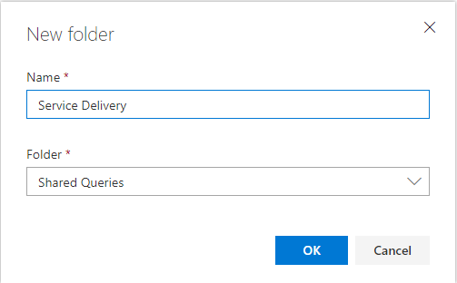
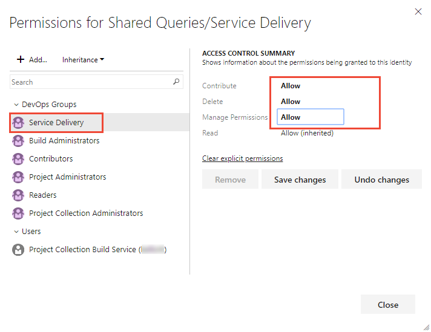
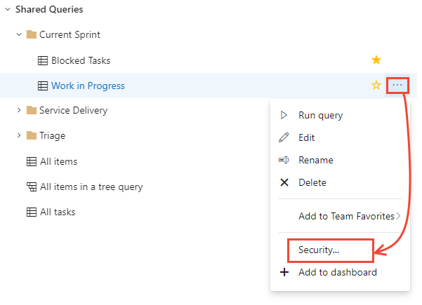
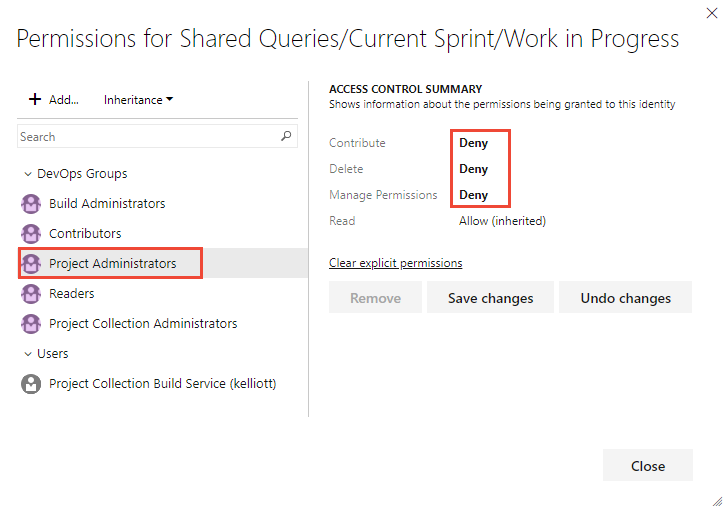

# Set permissions on queries and query folders

[!INCLUDE [temp](../_shared/version-vsts-tfs-all-versions.md)]

As with most project objects, you can control who has access by setting permissions. With queries, you can configure users and groups to create, delete, view, and manage permissions of shared queries and shared query folders. 

All users can create and edit their own queries and save them under **My Queries**.

By default, only project administrators can create and edit queries and folders under **Shared Queries**, or change the permissions for a query or folder. 

By creating folders under Shared Queries, you can grant permissions to users for each folder. For example, if you have several teams contributing to a project, then you might want to create a folder under Shared Queries for each team to manage their own set of shared queries.  

## Prerequisites
- You must be a member of the Project Collection Administrators or Project Administrators groups to create or edit a shared query or manage permissions.
- Or to create a query or folder under a shared query folder, you must have the  **Contribute** permission set explicitly to **Allow** to  
- Or to change permissions of a query or query folder, you must have the  **Manage Permissions** permission set explicitly to **Allow**. 

> [!TIP]    
> Consider creating a query folder for each team and give the team administrators or the team group query permissions to manage their folder. 

## Default query permissions

A  checkmark in the following table indicates that the corresponding access level or security group has access to a feature by default. 

[!INCLUDE [temp](../../organizations/security/_shared/boards-queries.md)]

## Set permissions on a new query folder

You set permissions from the web portal. To open **Queries**, see [View, run, or email a query](view-run-query.md).

If you're not a member of the project administrators group, [get added](../../organizations/security/set-project-collection-level-permissions.md), or have your **Contribute** permission set to **Allow** for the Shared query folder.  

::: moniker range=">= azure-devops-2019"

0. Choose **All**. Expand **Shared Queries**. 
 
0. To add a folder, choose the  actions icon for an existing folder or the top container folder, and choose **New folder**. 

	> [!div class="mx-imgBorder"]  
	> 

0. Enter the name for the folder. If you want to change the location of the folder, select it from the Folder drop down menu.  

	Here we name the folder *Service Delivery* with the intention that it will be used by the Service Delivery team.

	> [!div class="mx-imgBorder"]  
	> 

0.  To set permissions for the folder you just added, choose the  actions icon and select **Security**.

0.  Change the permissions so that the team member or group can contribute and manage permissions for the folder. Choose the **Add...** menu to add a user identity or group. 

	Here we add the Service Delivery team and grant them permissions to create and manage permissions to all queries and folders under the Service Delivery folder.  

	> [!div class="mx-imgBorder"]  
	>  

    **Contribute** allows team members to create and edit queries and folders under the folder where the permissions were granted. And, **Manage Permissions** allows team members to manage the permission settings on queries and subfolders.

0. (Optional) Turn inheritance off. Default is **On**. By turning inheritance off for a folder, you disallow inheritance of permissions that exist up the chain of query folders. To learn more, see [Permissions, Inheritance](../../organizations/security/about-permissions.md#inheritance).  
  
::: moniker-end

::: moniker range="<= tfs-2018"

0. Add a query folder under **Shared queries** or a sub-folder. Choose the  context menu icon for the folder and choose **New query folder**.  

	  

0.  To set permissions for the folder, choose the  context menu icon for the folder you just added and choose **Security**.

	

0.  Change the permissions so that the team member or group can contribute and manage permissions for the folder.  

	Here we add the Web team and grant them permissions to create and manage permissions to all queries and folders under the Triage folder.  

	    

    Choose the **Add...** menu to add a user identity or group.

    **Contribute** allows team members to create and edit queries and folders under the folder where the permissions were granted. And, **Manage Permissions** allows team members to manage the permission settings on queries and subfolders.

0. (Optional) Turn inheritance off. Default is On. By turning inheritance off for a folder, you disallow inheritance of permissions that exist up the chain of query folders. To learn more, see [Permissions, Inheritance](../../organizations/security/about-permissions.md#inheritance).  

::: moniker-end

## Set permissions on a shared query 

To keep anyone else from modifying a shared query that you create, you may want to set permissions on a specific query. You can do this by opening the permissions dialog for the specific query.  

::: moniker range=">= azure-devops-2019"

0.  Choose  the  actions icon and select **Security**.  

	> [!div class="mx-imgBorder"]  
	> 

0.  Change the permissions so that the team member or group can't edit, delete, or change permissions for the query.  

	Here we deny permissions for project admins.  

	> [!div class="mx-imgBorder"]  
	> 

::: moniker-end

::: moniker range="<= tfs-2018"

0.  Choose the  context menu icon and select **Security**. 

	

0.  Change the permissions so that the team member or group can't edit, delete, or change permissions for the query.  

	Here we deny permissions for project admins.  

	

::: moniker-end

## Related articles  

With queries, you can not only list work items, you can create status and trend charts and add them to dashboards. You can learn more about permissions and working with queries from these resources: 

- [Create and save managed queries](using-queries.md)  
- [Dashboards](../../report/dashboards/dashboards.md)  
- [Add a chart to a dashboard](../../report/add-charts-to-dashboard.md)   
- [Permissions and access](../../organizations/security/permissions-access.md)  

### Q & A   
<!-- BEGINSECTION class="md-qanda" -->

#### Q: Can I change the owner of a query or folder?

**A:** No. This feature was removed for TFS 2015. You can only enable permissions for users and groups from the permissions window for the query or folder.

#### Q: Can I add folders to team favorites?

**A:** No. You can only add folders under **My Queries** and under **Shared Queries**.

::: moniker range="<= tfs-2018"
#### Q: Are the queries and folders I create from the web portal the same as in Team Explorer?

**A:** Yes. You might have to refresh your browser or client to see changes you make in another client.

::: moniker-end

#### Q: Can I move a query or a folder?  

**A:** Yes. In the web portal, choose **Rename** from the context menu. In Team Explorer for Visual Studio, simply drag the folder to the new location.  

In Team Explorer for Eclipse, choose **Move** from the context menu and select the folder to which you want to move the item.

<!-- ENDSECTION --> 

