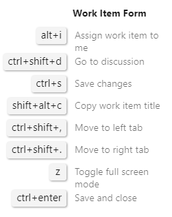
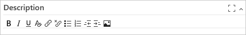
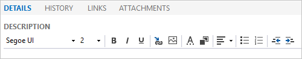
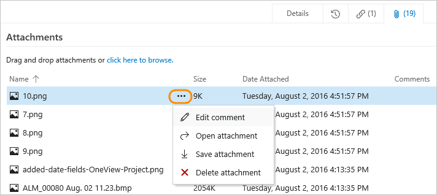
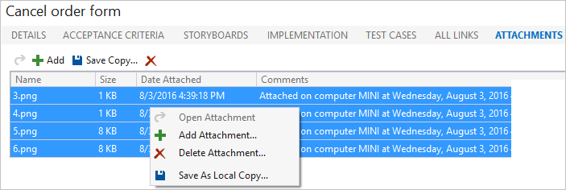
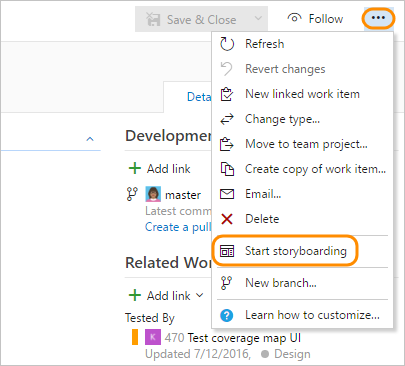

# Share information within work items and social tools in Azure Boards

[!INCLUDE [version-lt-eq-azure-devops](../../includes/version-lt-eq-azure-devops.md)]
[!INCLUDE [version-vs-gt-eq-2019.md](../../includes/version-vs-gt-eq-2019.md)]

Using work items to track your work provides a host of benefits, including the ability to easily share information. You can capture most information within the work item *Description* or other rich-text formatted fields. If you need to maintain the information in a different format, you can easily link to or attach a file.  

Other ways to share information include using dashboards, README files, and project Wikis. 

Using work items, you can share information in the following ways: 

- Add information to the Description or other rich-text field
- Link to a web site or file, or attach files 
- Link to a storyboard file 

> [!TIP]    
> If you have stakeholders who don't contribute code but want to contribute to the discussion and review progress, make sure you provide them [stakeholder access](../../organizations/security/get-started-stakeholder.md) so that they can view work items and dashboards.  

## Rich text fields  

To convey detailed information, you can format text and insert images inline within any HTML field type. By default, the following fields are HTML fields and many others not listed here for the CMMI process. 

- *Acceptance Criteria* 
- *Description* 
- *Steps* 
- *System Info*

 You can add custom HTML fields to support your business processes. To learn more about each field, look it up in the [Work item field index](../work-items/guidance/work-item-field.md)

The specific set of formatting features differs depending on the client you use. In all clients, you can bold, italicize, and underline text. You can also add and remove hyperlinks, format text as ordered or unordered lists, and add images. 

#### [Browser](#tab/browser/)

::: moniker range=">= azure-devops-2020"

The editor toolbar appears below each text box that accepts formatted text. It only becomes active when you move your cursor within the text box.

> [!div class="mx-imgBorder"]  
>  

You can use the :::image type="icon" source="../../media/icons/rtf-clear.png" border="false"::: clear format icon or **CTRL+Spacebar** to remove formatting from highlighted text.

For the **Discussion** section, the tool bar comes with a few extra icons&mdash;:::image type="icon" source="../../media/icons/at-mention.png" border="false"::: at-mention, :::image type="icon" source="../../media/icons/work-id.png" border="false"::: #-work-item-id, and  :::image type="icon" source="../../media/icons/pr-id.png" border="false"::: pull-request id—to help bring others into the discussion or link to work items or pull requests. Choose one of these icons and a menu displays with the most recent options that you've worked with. 

> [!div class="mx-imgBorder"]  
>   

**Keyboard shortcuts**  

You can copy and paste HTML text or an image from another application directly into the text box using **Ctrl+c** and **Ctrl+v** shortcuts. You can also use the keyboard shortcuts listed in [Keyboard shortcuts](../../project/navigation/keyboard-shortcuts.md).

> [!TIP]    
> Enter **Shift-?** to view additional Keyboard shortcuts for the work item form. 
> >[!div class="mx-imgBorder"]  
> >

::: moniker-end

::: moniker range="< azure-devops-2020"

The rich text formatting toolbar appears above each text box that can be formatted. It only becomes active when you click within the text box. 

You can use the following shortcut keys to format your text:  
- **Bold**: **Ctrl+B**  
- *Italic*: **Ctrl+I**  
- <u>Underscore</u>: **Ctrl+U** 

You can copy and paste HTML text or an image from another application directly into the text box using **Ctrl+C** and **Ctrl+V** shortcuts. You can also use the  icon or **CTRL+Spacebar** to remove formatting from highlighted text.

::: moniker-end

<a id="tfs-portal-rich-text" />

#### [Visual Studio](#tab/visual-studio/)

<a id="team-explorer-rich-text" />

**Visual Studio 2017-2019/Team Explorer** 

The work item form opens in the web portal for Visual Studio 2017. Work items aren't available from Visual Studio 2019 under the following conditions:   
* If you're connected to a GitHub or third-party Git repository. 
* If you're set to use the new Git Tool for Visual Studio 2019 as described in [Git experience in Visual Studio](/visualstudio/ide/git-with-visual-studio).  

From the work item form you can choose the font, font size, and text and background colors.

  

You can copy and paste HTML text or an image from another application directly into the text box using **Ctrl+C** and **Ctrl+V** shortcuts. You can use the following shortcut keys to format your text:  
- **Bold**: **Ctrl+B**  
- *Italic*: **Ctrl+I**  
- <u>Underscore</u>: **Ctrl+U** 

[!INCLUDE [temp](../../includes/images-not-appearing-vs.md)] 

* * *

## Link items to work items or objects

To support traceability and add context to work items, you can link items to other work items or objects. From a links control tab, you can choose from various link types to based on the objects you want to link to. 

Your link options differ depending on the client you use. For specific guidance, see these resources:

- [Add link to work items](../backlogs/add-link.md)  
- [Link items to support traceability and manage dependencies](link-work-items-support-traceability.md)  

## Attach files to work items

You and your team can centralize reference materials by attaching files to your work items. That way they're always readily accessible when you need them. For example, you can attach a screen image that illustrates a problem, a line of code in a text file, a log, an e-mail thread, or a product feature's specification.

::: moniker range="azure-devops"

You can add up to 100 attachments to a work item. Attachments are limited to 60 MB. Attempts to add more result in an error message upon saving the work item.
::: moniker-end  

::: moniker range="< azure-devops"

You can add up to 100 attachments to a work item. Attachments are limited to 60 MB. 

By default, the size of work item attachments is limited to 4 MB. You can use the web service to [increase the size of files you attach up to 2 GB](/previous-versions/azure/devops/reference/xml/change-maximum-attachment-size-work-items).

::: moniker-end 
 
Choose the  or **Attachments** tab to attach a file with supplemental information. The following file types support preview as attachments.  
- **Image types**: jpg, jpeg, png, jif, jfif, jpx, fpx, pcd, bmp, img, eps, psd, wmf, gif, svg, webp
- **Video types**: mp4, mov, m4v, webm
- **Text & code types**:  sql, java, jsp, jar, asp, aspx, css, scss, sass, less, html, htm, xhtml, js, jsx, cs, csv, vb, cpp, cxx, c++, hpp, hxx, h, f#, ts, tsx, py, md, rs, rb, xml, c, php, swift, tex, json, yml, yaml, sbl, asm, d, f, for, go, m, p, pas, r, bat, sh, pl, awk, cmd, lua, sln, proj, txt, log, wiql

<a id="attach-browser" />

#### [Browser](#tab/browser/)

::: moniker range=">= azure-devops-2019"

Choose the :::image type="icon" source="../backlogs/media/icon-attachments-tab-wi.png" border="false"::: Attachment tab icon to attach a file to the work item. 

You can drag and drop a file onto the tab or anywhere on the work item form. 

::: moniker-end 

::: moniker range="azure-devops-2019"
> [!NOTE]  
> Some features require upgrade to Azure DevOps Server 2019.1. 
::: moniker-end 

::: moniker range=">= azure-devops-2019"

You can continue viewing the attachments as a list or switch to a grid view to show a thumbnail preview. Double-click or right-click on the file to open a preview and cycle through them to quickly find the information you need. 

 

You can drag and drop files into the attachment area. From the browse menu, you can multi-select several files and attach within a single action. You can add attachments to your pull request comments. You can also add attachments in pull request comments by drag-and-drop or by browsing. For more information, see [Syntax support for Markdown files, widgets, and pull request comments, Attachments](../../project/wiki/markdown-guidance.md#attach).  

> [!TIP]  
> To get the URL of an image file you've attached, choose to preview it, right-click the image and choose the copy image address. Paste the address into a text editor and discard everything starting with **&download** to the end. 

::: moniker-end 

::: moniker range="tfs-2018"

Choose the :::image type="icon" source="../backlogs/media/icon-attachments-tab-wi.png" border="false"::: Attachment tab icon to attach a file to the work item. 

You can drag and drop a file onto the tab or anywhere on the work item form. 

  

You can edit, open, save, or delete an attachment by choosing an attachment and opening its  :::image type="icon" source="../media/icons/actions-icon.png" border="false":::  actions menu. 

   

::: moniker-end 

<a id="attach-team-explorer" />

#### [Visual Studio](#tab/visual-studio/)

Choose the  plus icon to add an attachment. Or, drag and drop files into the attachment area. 

To open the menu options to download or delete several attachments, choose one or more items and then right-click. 

* * *

::: moniker range="azure-devops"

## Copy URL of attached file 

To quickly copy the URL of an attachment, you can select **Copy attachment link** option from the attachment's :::image type="icon" source="../../media/icons/more-actions.png" border="false"::: **More actions** menu.

:::image type="content" source="media/share-plans/copy-url-attachment-menu-option.png" alt-text="Screenshot of work item form, Attachments tab, Copy attachment link  attachment menu option."::: 
::: moniker-end 

<a id="storyboard" />

## Storyboard your information

Storyboarding your ideas and goals increases visual understanding. With [PowerPoint Storyboarding](/previous-versions/azure/devops/boards/backlogs/office/storyboard-your-ideas-using-powerpoint) you can bring your ideas to life with storyboard shapes, text, animation, and all the other features that PowerPoint provides.  

> [!NOTE]  
> Starting with Visual Studio 2019, the Team Foundation plug-in for Office deprecated support for Storyboarding with PowerPoint. Also, the Visual Studio Gallery for PowerPoint Storyboarding is deprecated. You can still use the **Storyboard** link type to link to network share objects to share information, however, you can't link from PowerPoint to Azure DevOps using the link feature.

::: moniker range="tfs-2018"
> [!NOTE]  
> Storyboarding with PowerPoint requires [Office PowerPoint 2007 or later](https://www.microsoftstore.com/store/msstore/pd/PowerPoint-2010/productID.216564300) and the TFS Storyboarding add-in. You install the TFS Storyboarding add-in for PowerPoint by installing one of the latest editions of [Visual Studio](https://visualstudio.microsoft.com/downloads/download-visual-studio-vs) or [Team Foundation Server Standalone Office Integration](https://visualstudio.microsoft.com/downloads). 
::: moniker-end 

By linking your storyboard to a work item, you provide your team access to the shared file where they can add their comments. From the , **Links**, or a **Storyboards** tab, you can link storyboards that you created using PowerPoint Storyboarding or other application. When you make changes to a linked storyboard, the work item continues to link to the file with the latest changes.

To open PowerPoint with storyboarding, see [Storyboard your ideas using PowerPoint](/previous-versions/azure/devops/boards/backlogs/office/storyboard-your-ideas-using-powerpoint).

#### [Browser](#tab/browser/)

You can open Storyboarding with PowerPoint from the  :::image type="icon" source="../media/icons/actions-icon.png" border="false"::: actions menu within a work item form. 

  

To link to an existing storyboard, click the  Links tab and add a storyboard link.  

#### [Visual Studio](#tab/visual-studio/)

From the **Storyboards** tab, click **Start Storyboarding** to open Storyboarding with PowerPoint. Or, you can link to an existing storyboard.

* * *

## Email a work item query list

A common way teams share information is by sharing a list of work items. You can email a formatted list or share a link to a query. 

#### [Browser](#tab/browser/) 

You can quickly generate a formatted list using the **Copy as HTML** or **Copy to clipboard** options. See [Copy list](../backlogs/copy-clone-work-items.md#copy-a-list-of-work-items).

> [!IMPORTANT]
> If you use the built-in email feature, you can only send the email to individual address for a project member that is recognized by the system. Adding a team group or security group to the to line isn't supported. If you add an email account that the system doesn't recognize, you receive a message that one or more recipients of your email don't have permissions to read the mailed work items.  

#### [Visual Studio](#tab/visual-studio/)

You can email a formatted query list by choosing the **Send to Microsoft Outlook** option from the context menu.  

:::image type="content" source="media/view-run-queries/send-to-outlook-team-explorer.png" alt-text="Screenshot of Team Explorer, choose Send to Microsoft Outlook query option.":::

> [!NOTE]
> This feature requires you to have Microsoft Outlook installed. For on-premises Azure DevOps, all email actions require an [SMTP server to be configured](/azure/devops/server/admin/setup-customize-alerts). If you don't have an SMTP server configured, you can work around this by using **Copy as HTML** from the web portal. 

* * *

## Share data with team dashboards 

You can share progress and status with your team using configurable team dashboards. Dashboards provide easy-to-read, easy access, real-time information. You can add widgets to provide Markdown information, query charts, and more. 

For more information, see [Manage dashboards](../../report/dashboards/dashboards.md). 

## Share information with a project wiki 

You can use your project wiki to share information with other team members. Each wiki corresponds to its own git repository and supports collaborative editing of its content and structure.  

For more information, see [Create a wiki for your project](../../project/wiki/wiki-create-repo.md). 

## Marketplace extensions  

You may find more ways to share information by exporting work items to other applications such as Microsoft Word. For more information, review the [Marketplace extensions that support Microsoft Word](https://marketplace.visualstudio.com/search?term=word&target=AzureDevOps&category=Azure%20Boards&sortBy=Relevance). 

## Related articles  

As you can see, there are many ways to share information using work items alone. See these other tools and features to support planning, tracking, and sharing information with your team.   

- [Dashboards](../../report/dashboards/dashboards.md)
- [Add and edit a wiki](../../project/wiki/add-edit-wiki.md)
- [Work tracking, process, and project limits](../../organizations/settings/work/object-limits.md)