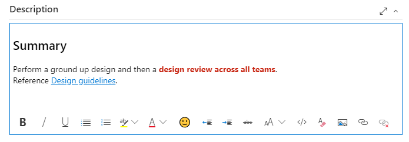
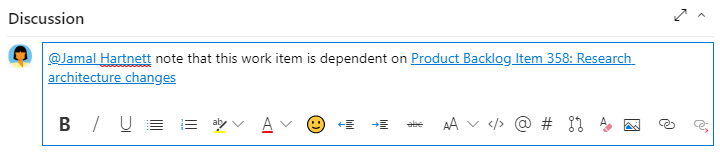
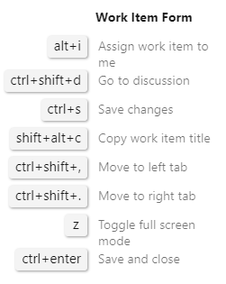
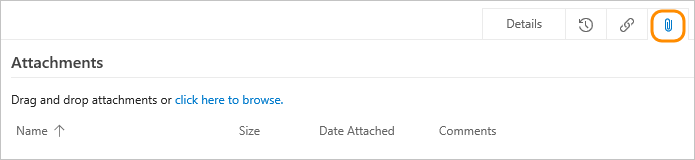
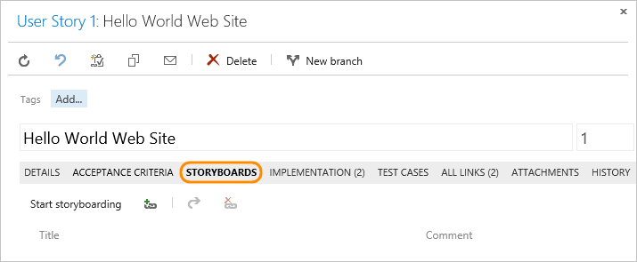
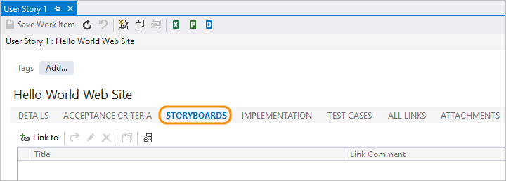

# Share information within work items and social tools

**Azure Boards | Azure DevOps Server 2019 | TFS 2018 | TFS 2017 | TFS 2015 | TFS 2013 | Visual Studio | Team Explorer Everywhere**

Using work items to track your work provides a host of benefits, including the ability to easily share information. You can capture most information within the work item *Description* or other rich-text formatted fields. If you need to maintain the information in a different format, you can easily link to or attach a file.  

::: moniker range=">= tfs-2018"

Additional ways to share information include using dashboards, README files, and project Wikis. 

::: moniker-end

::: moniker range=">= tfs-2013 <= tfs-2017"

Additional ways to share information include using dashboards, and SharePoint portals. 

::: moniker-end

Using work items, you can share information in the following ways: 

- Add information to the Description or other rich-text field
- Link to a web site or file, or attach files 
- Link to a storyboard file 

> [!TIP]    
> If you have stakeholders who don't contribute code but want to contribute to the discussion and review progress, make sure you provide them [stakeholder access](../../organizations/security/get-started-stakeholder.md) so that they can view work items and dashboards.  

## Rich text fields  

To convey detailed information, you can format text and insert images inline within any HTML field type. By default, the following fields are HTML fields (as well as many others not listed here for the CMMI process). 

::: moniker range=">= tfs-2017"

- *Acceptance Criteria* 
- *Description* 
- *Steps* 
- *System Info*

::: moniker-end

::: moniker range="tfs-2017"

> [!NOTE]  
> The *History* field is no longer a rich-text field. To annotate the work item history, add your content to the Description or Discussion fields. 

::: moniker-end

::: moniker range=">= tfs-2013 <= tfs-2015"

- *Acceptance Criteria* 
- *Description* 
- *History*
- *Steps* 
- *System Info*

::: moniker-end

In addition, you can add custom HTML fields to support your business processes. To learn more about each field, look it up in the [Work item field index](../work-items/guidance/work-item-field.md)

The specific set of formatting features differs depending on the client you use. In all clients, you can bold, italicize, and underline text. You can also add and remove hyperlinks, format text as ordered or unordered lists, and add images. 

# [Browser](#tab/browser)

::: moniker range="azure-devops"

The editor toolbar appears below each text box that accepts formatted text. It only becomes active when you move your cursor within the text box.

> [!div class="mx-imgBorder"]  
>  

You can use the  clear format icon or **CTRL+Spacebar** to remove formatting from highlighted text.

For the **Discussion** section, the tool bar comes with a few extra icons&mdash; at-mention,  #-work-item-id, and   pull-request id &mdash;to facilitate bringing others into the discussion or linking to work items or pull requests. Choose one of these icons and a menu displays with the most recent options that you've worked with. 

> [!div class="mx-imgBorder"]  
>   

**Keyboard shortcuts**  

You can copy and paste HTML text or an image from another application directly into the text box using **Ctrl+c** and **Ctrl+v** shortcuts. You can also use the keyboard shortcuts listed in [Keyboard shortcuts for work item forms](../work-items/work-item-form-keyboard-shortcuts.md).

> [!TIP]    
> Enter **Shift-?** to view additional Keyboard shortcuts for the work item form. 
> >[!div class="mx-imgBorder"]  
> >

::: moniker-end

::: moniker range=">= tfs-2017 <= azure-devops-2019"

The rich text formatting toolbar appears above each text box that can be formatted. It only becomes active when you click within the text box. 

You can use the following shortcut keys to format your text:  
- **Bold**: **Ctrl+B**  
- *Italic*: **Ctrl+I**  
- <u>Underscore</u>: **Ctrl+U** 

You can copy and paste HTML text or an image from another application directly into the text box using **Ctrl+C** and **Ctrl+V** shortcuts. You can also use the  icon or **CTRL+Spacebar** to remove formatting from highlighted text.

::: moniker-end

<a id="tfs-portal-rich-text" />

::: moniker range=">= tfs-2013 <= tfs-2015"

The rich text formatting toolbar appears above each text box that can be formatted. It only becomes active when you click within the text box.  

::: moniker-end

# [Visual Studio](#tab/visual-studio)

<a id="team-explorer-rich-text" />

From Team Explorer you can choose the font, font size, and text and background colors.

  

You can copy and paste HTML text or an image from another application directly into the text box using **Ctrl+C** and **Ctrl+V** shortcuts. You can use the following shortcut keys to format your text:  
- **Bold**: **Ctrl+B**  
- *Italic*: **Ctrl+I**  
- <u>Underscore</u>: **Ctrl+U** 

[!INCLUDE [temp](../../_shared/images-not-appearing-vs.md)] 

# [Team Explorer Everywhere](#tab/tee)

From Team Explorer Everywhere you can exercise only basic format operations.

 

You can use the following shortcut keys to format your text:  
- **Bold**: **Ctrl+B**  
- *Italic*: **Ctrl+I**  
- <u>Underscore</u>: **Ctrl+U** 

You can copy and paste HTML text or an image from another application directly into the text box using **Ctrl+C** and **Ctrl+V** shortcuts.

---

## Link items

To support traceability and add context to work items, you can link items to other work items or objects. From a links control tab, you can choose from various link types to based on the objects you want to link to. 

Again, your link options will differ depending on the client you use. For specific guidance, see these resources:

- [Add link to work items](../backlogs/add-link.md)  
- [Link items to support traceability and manage dependencies](link-work-items-support-traceability.md)  

## Attach files

You and your team can centralize reference materials by attaching files to your work items. That way they are always readily accessible when you need them. For example, you can attach a screen image that illustrates a problem, a line of code in a text file, a log, an e-mail thread, or a product feature's specification.

Choose the  or **Attachments** tab to attach a file with supplemental information. 

<a id="attach-browser" />

# [Browser](#tab/browser)

::: moniker range=">= azure-devops-2019"

Choose the  Attachment tab icon to attach a file to the work item. 

You can drag and drop a file onto the tab or anywhere on the work item form. 

You can continue viewing the attachments as a list or switch to a grid view to show a thumbnail preview. Double-click or right-click on the file to open a preview and cycle through them to quickly find the information you need. 

 

> [!TIP]  
> To get the URL of an image file you've attached, choose to preview it, right-click the image and choose the copy image address. Paste the address into a text editor and discard everything starting with **&download** to the end. 

::: moniker-end 

::: moniker range="azure-devops"

You can add up to 100 attachments to a work item. Attempts to add more result in an error message upon saving the work item.

::: moniker-end 

::: moniker range=">= tfs-2017 <= tfs-2018"

Choose the  Attachment tab icon to attach a file to the work item. 

You can drag and drop a file onto the tab or anywhere on the work item form. 

  

> [!TIP]    
> You can drag and drop files into the attachment area. From the browse menu, you can multi-select several files and attach within a single action. Also, you can add attachments to your pull request comments. You can also add attachments in pull request comments by drag-and-drop or by browsing. For details, see [Syntax support for Markdown files, widgets, and pull request comments, Attachments](../../project/wiki/markdown-guidance.md#attach).  

You can edit, open, save, or delete an attachment by clicking an attachment and opening it's  actions menu. 

   

::: moniker-end 

::: moniker range=">= tfs-2013 <= tfs-2015"

Choose the **Attachments** tab icon to attach a file to the work item. 

  

Choose the  plus icon to add an attachment. Choose an item and then choose  the open icon to open the attachment or  download icon to save a copy.  

::: moniker-end 

<a id="attach-team-explorer" />

# [Visual Studio](#tab/visual-studio)

Choose the  plus icon to add an attachment. Or, drag and drop files into the attachment area. 

To open the menu options to download or delete several attachments, choose one or more items and then right-click. 

# [Team Explorer Everywhere](#tab/tee)

Choose the  plus icon to add an attachment.Or, drag and drop files into the attachment area.

 

To open the menu options to download or delete several attachments, choose one or more items and then right-click. 

---

::: moniker range="<= azure-devops-2019"

### Attachment size

By default, the size of work item attachments is limited to 4 MB. You can use the TFS web service to [increase the size of files you attach up to 2GB](../../reference/xml/change-maximum-attachment-size-work-items.md).

::: moniker-end 

## Storyboard 

Storyboarding your ideas and goals increases visual understanding. With [PowerPoint Storyboarding](../backlogs/office/storyboard-your-ideas-using-powerpoint.md) you can bring your ideas to life with storyboard shapes, text, animation, and all the other features that PowerPoint provides.  

> [!NOTE]  
> Storyboarding with PowerPoint requires [Office PowerPoint 2007 or later](http://www.microsoftstore.com/store/msstore/pd/PowerPoint-2010/productID.216564300) and the TFS Storyboarding add-in. You install the TFS Storyboarding add-in for PowerPoint by installing one of the latest editions of [Visual Studio](https://visualstudio.microsoft.com/downloads/download-visual-studio-vs) or [Team Foundation Server Standalone Office Integration](https://visualstudio.microsoft.com/downloads). 

By linking your storyboard to a work item, you provide your team access to the shared file where they can add their comments. From the , **Links**, or a **Storyboards** tab, you can link storyboards that you created using PowerPoint Storyboarding or other application. When you make changes to a linked storyboard, the work item continues to link to the file with the latest changes.

<a id="team-services-storyboard" />

# [Browser](#tab/browser)

::: moniker range=">= tfs-2017"

You can open Storyboarding with PowerPoint from the  actions menu within a work item form. 

  

To link to an existing storyboard, click the  Links tab and add a storyboard link.  

::: moniker-end 

::: moniker range=">= tfs-2013 <= tfs-2015"  

From the **Storyboards** tab, click **Start Storyboarding** to open Storyboarding with PowerPoint. Or, you can link to an existing storyboard.

  

::: moniker-end 

# [Visual Studio](#tab/visual-studio)

<a id="team-explorer-storyboard" />

From the **Storyboards** tab, click **Start Storyboarding** to open Storyboarding with PowerPoint. Or, you can link to an existing storyboard.

**Storyboards tab control** 

 
# [Team Explorer Everywhere](#tab/tee)
 
From the **Storyboards** tab, click **Start Storyboarding** to open Storyboarding with PowerPoint. Or, you can link to an existing storyboard.

**Storyboards tab control**  

---

To open PowerPoint with storyboarding, see [Storyboard your ideas using PowerPoint](../backlogs/office/storyboard-your-ideas-using-powerpoint.md).

 
## Email a work item query list

A common way teams share information is through a list of work items. You can quickly generate a formatted list using the **Copy as HTML** or **Copy to clipboard** options. See [Copy list](../backlogs/copy-list.md).

> [!IMPORTANT]     
> If you use the built-in email feature, you can only send the email to individual address for a project member that is recognized by the system. Adding a team group or security group to the to line isn't supported. If you add an email account that the system doesn't recognize, you receive a message that one or more recipients of your email don't have permissions to read the mailed work items.  

::: moniker range=">= tfs-2015"

## Team dashboards 

You can share progress and status with your team using configurable team dashboards. Dashboards provide easy-to-read, easy access, real-time information. You can add widgets to provide markdown information, query charts, and more. 

For details, see [Manage dashboards](../../report/dashboards/dashboards.md). 

::: moniker-end

::: moniker range=">= tfs-2018"

## Project wiki 

You can use your project wiki to share information with other team members. Each wiki corresponds to its own git repository and supports collaborative editing of its content and structure.  

To learn more, see [Create a wiki for your project](../../project/wiki/wiki-create-repo.md). 

::: moniker-end

::: moniker range="<= tfs-2017"

## SharePoint project portal

You can use a SharePoint site to share and access documents from your project. Your team can use the SharePoint site, also referred to as the project portal, to share information in the following ways:  
- Share data contained in reports or dashboards  
- Share team progress using predefined or customized SharePoint dashboards  
- Share documents, files, images  
- Share team knowledge and processes using the SharePoint wiki.    

To learn more, see [Share information using the project portal](../../report/sharepoint-dashboards/share-information-using-the-project-portal.md).  

::: moniker-end

## Related articles  

As you can see, there are many ways to share information using work items alone. See these additional tools and features to support planning, tracking, and sharing information with your team.   

- [Dashboards](../../report/dashboards/dashboards.md)
- [Add and edit a wiki](../../project/wiki/add-edit-wiki.md)

::: moniker range=">= tfs-2017"  

### Marketplace extensions  

You may find additional ways to share information and collaborate as a team by adding a [Marketplace extension](https://marketplace.visualstudio.com/?targetId=754f8691-19ce-47a2-a1e8-ebeab1e67955#VSTS). 

::: moniker-end

 