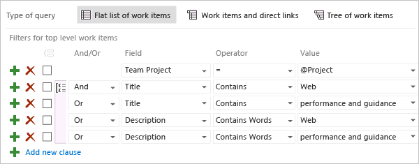
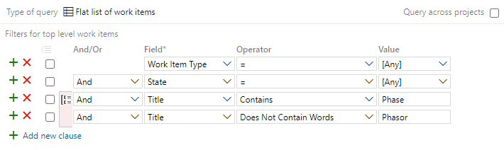
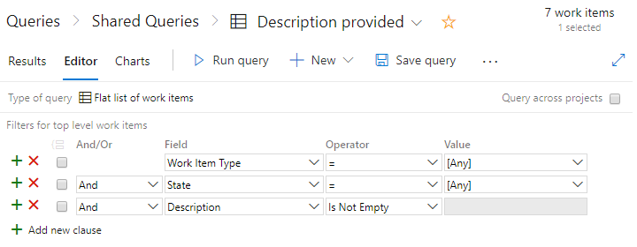
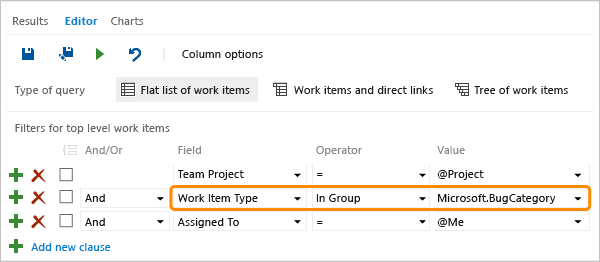

# Query by titles, IDs, and rich-text fields

[!INCLUDE [version-lt-eq-azure-devops](../../includes/version-lt-eq-azure-devops.md)]

Filter work items by keywords, IDs, or empty text fields by using single-line text (String), multi-line text (PlainText), and rich-text (HTML) fields. If queries take too long to return, see [Create a query, Best practices](using-queries.md#best-practices).

## Prerequisites

[!INCLUDE [prerequisites-queries](../includes/prerequisites-queries.md)]

## Supported operators and macros

Use the operators and macros listed for text and rich-text fields.

---
:::row:::
   :::column span="1":::
      **Data type**
   :::column-end::: 
   :::column span="3":::
      **Supported operators and macros**
   :::column-end:::
:::row-end:::
---
:::row:::
   :::column span="1":::
      **Rich-text (HTML)**  
      **Multi-line text strings (PlainText)**
   :::column-end::: 
   :::column span="3":::
      `Contains Words`, `Does Not Contain Words`, `Is Empty`1, `Is Not Empty`1
   :::column-end:::
:::row-end:::
--- 
:::row:::
   :::column span="1":::
      **Single text (String)**
   :::column-end::: 
   :::column span="3":::
      `= , <> , > , < , >= , <= , =[Field], <>[Field], >[Field], <[Field], >=[Field], <=[Field], Contains, Does Not Contain, In, Not In, In Group, Not In Group, Was Ever`  
      **Macros**: `[Any]` valid with the **Work Item Type** field and `@Project`2, valid with the **Team Project** field. 
   :::column-end:::
:::row-end:::
---
:::row:::
   :::column span="1":::
      **ID**
   :::column-end::: 
   :::column span="3":::
      `= , <> , > , < , >= , <= , =[Field], <>[Field], >[Field], <[Field], >=[Field], <=[Field], In, Not In, Was Ever`  
      **Macros**: `@Follows`, `@MyRecentActivity`, `@RecentMentions`, `@RecentProjectActivity` valid with the **ID** field and `In` and `Not In` operators.  
      `@Project`2, valid with the **Team Project** field.
   :::column-end:::
:::row-end:::
---
:::row:::
   :::column span="1":::
      **State** and **Work Item Type** fields
   :::column-end::: 
   :::column span="3":::
      `= , <> , > , < , >= , <= , =[Field], <>[Field], >[Field], <[Field], >=[Field], <=[Field], Contains, Does Not Contain, In, Not In, In Group, Not In Group, Was Ever`  
      **Macros**: `[Any]` valid with both fields.
   :::column-end:::
:::row-end:::
---

> [!NOTE]  
> 1. The `Is Empty` and `Is Not Empty` operators are supported for Azure DevOps Server 2020 and later versions.  
> 2. The system defaults to filtering based on the current project. For more information, see [Query across projects](using-queries.md#query-across-or-within-projects).

## Use `Contains Words` for string matches

When you want to filter on a string match, prefer the `Contains Words` operator over `Contains`. `Contains Words` uses the full-text index and is typically faster. Text strings are limited to 100 characters.

The `Contains` operator runs a table scan; it's slower and consumes more CPU resources, which can affect your rate limits.

> [!NOTE]
> The `Contains Words` operator uses SQL full-text search indexing. When a new value is saved to a long-text field, SQL Server:
>
> - Splits the phrase into words
> - Removes common stop words (for example, "a" or "is")
> - Converts words to their common stem (for example, running → run)
> - Stores the resulting keywords in an index
>
> Queries that use `Contains Words` search the index, giving faster results for long-text fields. For more information and server/collation requirements, see [Query fields, operators, values, and variables - Full-text and partial word searches](query-operators-variables.md#full-text).

## Keyword or phrase query with wildcards

Use `Contains` or `Contains Words` to find items that partially or exactly match words or phrases.

Choose `Contains` or `Does Not Contain` to search exact or partial matches. Choose `Contains Words` or `Does Not Contain Words` to use the full-text index and wildcard character `*`.

For example, `Contains Words` with `inform*` matches `inform`, `information`, and `informational`.

> [!div class="mx-imgBorder"]
> 

[!INCLUDE [temp](../includes/query-clause-tip.md)]

## Query for specific words and not others

Use `Contains Words` and `Does Not Contain Words` to include exact words or phrases and exclude others. Combine these operators and use `*` for wildcard matching.

The following example shows a filter that includes the work "Phase" but excludes "Phasor."

> [!div class="mx-imgBorder"]
> 

> [!NOTE]
> Certain reserved SQL words, such as `WHERE`, `THEN`, and `AND`, don't return results when used as standalone search terms with `Contains Words` or `Does Not Contain Words`.

## Undefined field value queries

Find work items with an undefined (blank) field value by using the "equals" operator `=` and leaving the Value blank. For example, the following filters list all tasks whose Activity field is blank.

To find items where a field isn't blank, use the "not" operator `<>` and leave the Value blank.

## Empty or not empty HTML field queries

Use `Is Empty` or `Is Not Empty` with an HTML field to list work items with empty or nonempty rich-text fields. You don't specify a value for these operators.

> [!div class="mx-imgBorder"]
> 

## Filter for special characters

Escape special characters like `/` or `-` with a backslash when filtering URLs or phrases.

- Filter for a URL:
  - Query: `Title ~ "https:\/\/example.com\/path-to-resource"`
  - Results: Returns work items with the exact URL.

- Filter for a phrase with a dash:
  - Query: `Title ~ "feature-update\-2023"`
  - Results: Returns work items that contain the exact phrase with dashes.

> [!NOTE]
> You can't query for work items that don't have any tags attached. To upvote this feature request, visit Developer Community: [Be able to search for empty tags](https://developercommunity.visualstudio.com/t/be-able-to-search-for-empty-tags/907425).

## Category-based queries

To filter by category, use the `In Group` operator. The example below returns items in the current project assigned to the team member and in the Bug category.

### What items appear in the Requirement or Task categories?

Default work item type assignments for each process:

| Process | Requirement category | Task category |
|---------|----------------------|---------------|
| Basic   | Issue                | Task          |
| Agile   | User Story           | Task          |
| Scrum   | Product Backlog Item, Bug | Task     |
| CMMI    | Requirement          | Task          |

Teams can choose whether the Bug work item type appears in the Requirement or Task category. See [Show bugs on backlogs and boards](../../organizations/settings/show-bugs-on-backlog.md). To add custom work item types to a backlog, see [Add or modify a work item type](../../reference/add-modify-wit.md).

## Query for work items that you're following

Use the `@Follows` macro with the ID field and the `In` operator to list work items you follow, across projects if needed.

:::image type="content" source="../work-items/media/follow-work/query-follows.png" alt-text="Screenshot that shows the Query Editor with ID In @Follows query clause":::

## Query for recent work item activity

Use these macros to list items based on recent activity:

- `@MyRecentActivity`: Items you recently viewed or modified.
- `@RecentMentions`: Items with an `@mention` for you in the last 30 days.
- `@RecentProjectActivity`: Items recently created or modified in your project.

Use the ID field with `In` or `Not In`.

:::image type="content" source="media/titles-ids/my-recent-activity-macro-query.png" alt-text="Screenshot that shows the Query Editor with ID In @MyRecentActivity macro query":::

## Common fields for most work item types

This table describes common fields used in queries. The ID uniquely identifies a work item. Use Title to distinguish items of the same type. Description and other rich-text fields provide detailed implementation info. After creation, you can modify all fields except ID; the system assigns the ID when the work item is created.

> [!NOTE]   
> The system indexes long-text fields of type `PlainText` and `HTML` for full-text search, including `Title`, `Description`, and `Steps to Repro`. For details and server/collation requirements applicable to on-premises Azure DevOps, see [Query fields, operators, values, and variables - Full-text and partial word searches](query-operators-variables.md#full-text).

:::row:::
     :::column span="1":::
   **Field name**
   :::column-end:::
     :::column span="2":::
   **Description**
   :::column-end:::
     :::column span="1":::
   **Work item type**
   :::column-end:::
:::row-end:::
---
:::row:::
   :::column span="1":::
   Acceptance Criteria  1
   :::column-end:::
   :::column span="2":::
   A description of the criteria that must be met before the bug or product backlog item can be closed.

   Before work begins, record clear acceptance criteria so the team and customers share expectations. Acceptance criteria help define acceptance tests and confirm whether the item is complete.

   Reference name=Microsoft.VSTS.Common.AcceptanceCriteria, Data type=HTML
   :::column-end:::     
   :::column span="1":::
   Bug, Epic, Feature, Product backlog item (Scrum)
   :::column-end:::
:::row-end:::
:::row:::
     :::column span="1":::
   Description 1, 2
   :::column-end:::
     :::column span="2":::
   Use this field to provide in-depth information about a work item.

   Reference name=System.Description, Data type=HTML
   :::column-end:::
   :::column span="1":::
   All
   :::column-end:::
:::row-end:::
:::row:::
   :::column span="1":::
   ID
   :::column-end:::
   :::column span="2":::
   The unique identifier assigned to a work item. IDs are unique across projects within a project collection.

   Reference name=System.Id, Data type=Integer
   :::column-end:::
   :::column span="1":::
   All
   :::column-end:::
:::row-end:::
:::row:::
     :::column span="1":::
   Repro Steps (or Steps to reproduce) 1 
   :::column-end:::
     :::column span="2":::
   Steps required to reproduce unexpected behavior. Capture enough detail so others can reproduce and validate fixes.

   Reference name=Microsoft.VSTS.TCM.ReproSteps, Data type=HTML
   :::column-end:::
   :::column span="1":::
   Bug
   :::column-end:::
:::row-end:::
:::row:::
   :::column span="1":::
   Resolution
   :::column-end:::
   :::column span="2":::
   Describes how an impediment was resolved.

   Reference name=Microsoft.VSTS.Common.Resolution, Data type=HTML
   :::column-end:::     
   :::column span="1":::
   Impediment (Scrum)
   :::column-end:::
:::row-end:::
:::row:::
     :::column span="1":::
   System Info1 
   :::column-end:::
     :::column span="2":::
   Information about software and system configuration relevant to the bug or feedback.

   Reference name=Microsoft.VSTS.TCM.SystemInfo, Data type=HTML
   :::column-end:::
     :::column span="1":::
   Bug, Code Review Request, Feedback Request    
   :::column-end:::
:::row-end:::
:::row:::
   :::column span="1":::
   Team Project
   :::column-end:::
   :::column span="2":::
   The project that owns the work item. Add this field to a query to filter by one or more projects. For details, see [Query across projects](using-queries.md#query-across-or-within-projects).

   Reference name=System.TeamProject, Data type=String
   :::column-end:::
   :::column span="1":::
   All
   :::column-end:::
:::row-end:::
     :::column span="1":::
   Title
   :::column-end:::
     :::column span="2":::
   A short description that summarizes the work item and helps team members distinguish it from others.

   Reference name=System.Title, Data type=String
   :::column-end:::
   :::column span="1":::
   All
   :::column-end:::
:::row-end:::
     :::column span="1":::
   Work Item Type
   :::column-end:::
     :::column span="2":::
   The work item type name, defined by the process used when the project was created. For more information, see [About processes and process templates](../work-items/guidance/choose-process.md) and [Add or modify a work item type](../../reference/add-modify-wit.md).

   To filter by category assignment, use the `In Group` and `Not In Group` operators and select a category from the drop-down.

   Reference name=System.WorkItemType, Data type=String
   :::column-end:::
   :::column span="1":::
   All
   :::column-end:::
:::row-end:::

## Related content

- [Query editor](using-queries.md)   
- [Add work items](../backlogs/add-work-items.md)  
- [Work item field index](../work-items/guidance/work-item-field.md)  
- [About managed queries](about-managed-queries.md)   

[!INCLUDE [temp](../includes/rest-apis-queries.md)]

