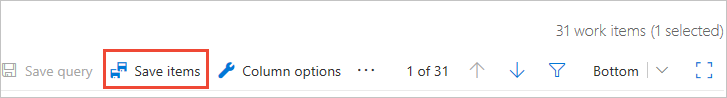

# Triage work items with a work item query in Azure Boards and Azure DevOps

[!INCLUDE [version-lt-eq-azure-devops](../../includes/version-lt-eq-azure-devops.md)]
**Visual Studio 2019 | Visual Studio 2015 | Visual Studio 2013**  

Using a work item query you can quickly review and update work items. Teams often use the triage mode for a query to complete the following tasks: 
- Set the priority of a bug or work item 
- Assign a work item to a sprint or team member 
- Add details to the description, acceptance criteria, or repo steps 
- Link-related work items 
- Update the status of work items 

In this article you'll learn how to:

>[!div class="checklist"]      
> * Use triage query mode to update a list of work items   
> * Bulk save work items that you've updated  

[!INCLUDE [temp](../includes/prerequisites-queries.md)]

## Open Queries 

[!INCLUDE [temp](../includes/open-queries.md)] 

## Use triage buttons and save work items

#### [Browser](#tab/browser/)

::: moniker range=">= azure-devops-2019"

The buttons to move up or down within the query results list are outside the work item form. Choose **Bottom** to cycle through the choices for where the work item form appears: **Bottom**, **Right**, or **Off**. 

You can save each work item as you change it. Or, you can update multiple work items and save them all at once with  :::image type="icon" source="../media/icons/save-items.png" border="false"::: **Save Items**. 

:::image type="content" source="media/triage-queries/save-items-web-portal.png" alt-text="Screenshot of Web portal, Queries Results, and Save Items.":::

If you don't see :::image type="icon" source="../media/icons/save-items.png" border="false"::: **Save Items**, choose the :::image type="icon" source="../media/icons/actions-icon.png" border="false"::: **More commands**   and select the **Save Items** option.

> [!div class="mx-imgBorder"]  
>  

::: moniker-end

::: moniker range="tfs-2018"

The buttons to move up or down within the query results list are inside the work item form. Choose **Bottom** to cycle through the choices for where the work item form appears: **Bottom**, **Right**, or **Off**.

You can save each work item as you change it. Or, you can update multiple work items and save them all at once with  :::image type="icon" source="../media/icons/save-items.png" border="false"::: **Save Items**. 

::: moniker-end

#### [Visual Studio](#tab/visual-studio/)

> [!NOTE]   
> Triage mode isn't available from Visual Studio 2017. 

When you choose **View Results** for a query, it opens in triage mode displaying the first item in the list. You can switch from vertical and horizontal views or expand or collapse the triage window using the :::image type="icon" source="media/triage-buttons.png" border="false"::: **Vertical Split**, **Horizontal Split**, **Collapse Bottom Panel**, or **Collapse Top Panel** icons. 

Choose **Previous** or **Next** to move up or down within the query results list.

:::image type="content" source="media/triage-queries/triage-mode-visual-studio-2019.png" alt-text="Screenshot of View Results and triage mode, Visual Studio.":::
 
After making several changes to work items, choose **Save Results** to save all changes. 

:::image type="content" source="media/triage-queries/triage-mode-save-results-visual-studio-2019.png" alt-text="Screenshot of Save Results for triage mode, Visual Studio.":::

* * * 

<a id="save-bulk-changes" />

## Bulk update and save changes to work items 
 
From the web portal, you can update several work items through the triage process, and then do a bulk save when you're finished. 

Multi-select the work items you want to update, choose :::image type="icon" source="../../media/icons/actions-icon.png" border="false"::: **More commands**, and then select the option you want from the menu of options.

 

Work items shown in bold text indicate that local changes haven't yet been saved to the data store.   

::: moniker range=">= azure-devops-2019"
Choose **Save items** to save all work items you've modified. 

::: moniker-end

::: moniker range="tfs-2018"

Choose the  double-save icon to save all work items you've modified.

  

::: moniker-end

 

## Related articles

- [Best tool to add, update, and link work items](../work-items/best-tool-add-update-link-work-items.md)  
- [Manage bugs](../backlogs/manage-bugs.md) 
- [Create a query](using-queries.md) 

