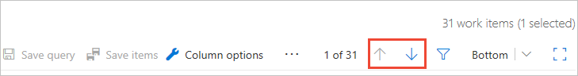
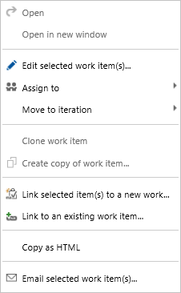

# Triage work items  

[!INCLUDE [temp](../_shared/version-vsts-tfs-all-versions.md)]

Using a work item query you can quickly review and update work items. Oftentimes team use the triage mode for a query to perform the following tasks: 
- Set the priority of a bug or work item 
- Assign a work item to a sprint or team member 
- Add details to the description, acceptance criteria, or repo steps 
- Link related work items 
- Update the status of work items 

In this article you'll learn how to:

>[!div class="checklist"]      
> * Use triage query mode to update a list of work items   
> * Bulk save work items that you've updated  

[!INCLUDE [temp](../_shared/prerequisites-queries.md)]

## Open Queries 

[!INCLUDE [temp](../_shared/open-queries.md)] 

::: moniker range=">= azure-devops-2019"

The buttons to move up or down within the query results list are outside the work item form. Choose **Bottom** to cycle through the choices for where the work item form appears: **Bottom**, **Right**, or **Off**. 

::: moniker-end

::: moniker range=">= tfs-2013 <= tfs-2018"

The buttons to move up or down within the query results list are inside the work item form. Choose **Bottom** to cycle through the choices for where the work item form appears: **Bottom**, **Right**, or **Off**.

> [!TIP]    
> The same buttons to move up or down within a work item list are available from a **Work Items** page when you choose a work item. See 
::: moniker-end

<a id="save-bulk-changes" />

## Bulk update and save changes to work items 

You can update several work items through the triage process, and then do a bulk save when you're finished. 

::: moniker range=">= tfs-2018"

Multi-select the work items you want to update, choose the  actions icon, and then select the option you want from the menu of options.

 
::: moniker-end

::: moniker range="tfs-2017" 

Multi-select the work items you want to update, choose the  context icon, and then select the option you want from the menu of options.

   

::: moniker-end

::: moniker range=">= tfs-2013 <= tfs-2015"

Multi-select the work items you want to update, choose the  context icon, and then select the option you want from the menu of options.

  

::: moniker-end

Work items shown in bold text indicate that local changes have not yet been saved to the data store.   

::: moniker range=">= azure-devops-2019"
Choose **Save items** to save all work items you've modified. 

 

::: moniker-end

::: moniker range=">= tfs-2013 <= tfs-2018"

Choose the  double-save icon to save all work items you've modified.

  

::: moniker-end

## Related articles

- [Best tool to add, update, and link work items](../work-items/best-tool-add-update-link-work-items.md)  
- [Manage bugs](../backlogs/manage-bugs.md) 
- [Create a query](using-queries.md) 

