# Define a query

[!INCLUDE [temp](../includes/version-all.md)]
[!INCLUDE [temp](../includes/version-visual-studio.md)]

Work item queries generate lists of work items based on the filter criteria you provide. You can then save and share these managed queries with others. In contrast, semantic searches list work items, but can't be saved or shared. 

You can create queries from the web portal or from a supported client, such as Visual Studio Team Explorer and Team Explorer Everywhere. Also, you can open a query in [Excel](../backlogs/office/bulk-add-modify-work-items-excel.md) to perform bulk additions and modifications.  

#### [Browser](#tab/browser/) 

> [!div class="mx-imgBorder"]  
> 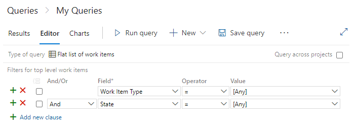  
 
#### [Visual Studio](#tab/visual-studio/)

> [!div class="mx-imgBorder"]  
> 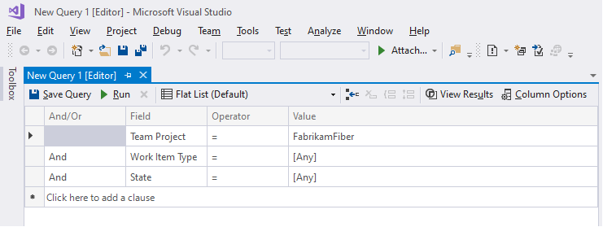 

> [!NOTE]  
> To define queries in Visual Studio 2019, you need to [Set the Work Items experience](../work-items/set-work-item-experience-vs.md) to the legacy option. 

* * *

If you find that your queries take too long to return results, review the [Guidance to create high-performing queries](high-performing-queries.md).  

In this article you'll learn:  

> [!div class="checklist"]    
> * How to add or create a query 
> * How to query across projects   
> * How to group and ungroup query clauses 
> * How to create a tree of work items or a direct-links query 
 
For quick access to all query tasks, supported operators&mdash;such as, `Contains`, `In`, `In Group`, and `<>`(not operator) &mdash; based on field data type, and query examples, see [Query quick reference](query-index-quick-ref.md).  
 
## Query filters

From the Query Editor, you can exercise the following filter functions. Choose the filter to jump to an article with sample queries. 
In addition to the query filters, you can [interactively apply filters to query results](../backlogs/filter-backlogs-boards-plans.md).

::: moniker range=">= azure-devops-2019"
> [!NOTE] 
> Managed queries don't support proximity searches, however semantic searches do. In addition, semantic searches supports both `*` and `?` as wildcard characters and you can use more than one wildcard character to match more than one character. To learn more, see [Functional work item search](../../project/search/functional-work-item-search.md).
::: moniker-end

---
:::row:::
   :::column span="2":::
      **Filter features**
   :::column-end::: 
   :::column span="2":::
      **Macros**
   :::column-end:::
:::row-end:::
---
:::row:::
   :::column span="1":::
      ::: moniker range=">= azure-devops-2019"
      - [Compare fields](./query-field-value.md) 
      - [Key words](./titles-ids-descriptions.md)  
      - [Linked work items](./linking-attachments.md)  
      - [Logical groupings](#logical-groupings)  
      - [Query macros](./about-managed-queries.md#macros)  
      - [Tags](./add-tags-to-work-items.md#query)  
      - [Was Ever](./query-by-workflow-changes.md)  
      - [Was Ever (Board Column)](./query-by-workflow-changes.md#kanban_query_fields)  
      - [Wildcard](./titles-ids-descriptions.md)  
      ::: moniker-end
      ::: moniker range="tfs-2018"
      - [Compare fields](./query-field-value.md) 
      - [Key words](./titles-ids-descriptions.md)  
      - [Linked work items](./linking-attachments.md)  
      - [Logical groupings](#logical-groupings)  
      - [Query macros](./about-managed-queries.md#macros)  
      - [Tags](./add-tags-to-work-items.md#query)  
      - [Was Ever](./query-by-workflow-changes.md)  
      - [Wildcard](./titles-ids-descriptions.md)  
      ::: moniker-end
      ::: moniker range="tfs-2017"
      - [Compare fields](./query-field-value.md) 
      - [Key words](./titles-ids-descriptions.md)  
      - [Linked work items](./linking-attachments.md)  
      - [Logical groupings](#logical-groupings)  
      - [Query macros](./about-managed-queries.md#macros)  
      - [Tags](./add-tags-to-work-items.md#query)  
      - [Was Ever](./query-by-workflow-changes.md)  
      - [Wildcard](./titles-ids-descriptions.md)  
      ::: moniker-end
      ::: moniker range="tfs-2015"
      - [Compare fields](./query-field-value.md)
      - [Key words](./titles-ids-descriptions.md)   
      - [Linked work items](./linking-attachments.md)  
      - [Logical groupings](#logical-groupings)  
      - [Query macros or variables](./about-managed-queries.md#macros) 
      ::: moniker-end
      ::: moniker range="tfs-2013"
      - [Compare fields](./query-field-value.md)
      - [Key words](./titles-ids-descriptions.md)   
      - [Linked work items](./linking-attachments.md)  
      - [Logical groupings](#logical-groupings)  
      - [Query macros or variables](./about-managed-queries.md#macros) 
      ::: moniker-end
   :::column-end::: 
   :::column span="1":::
      ::: moniker range=">= azure-devops-2019"
      - [Blank or empty fields](./titles-ids-descriptions.md#empty-or-not-empty-html-field-queries)
      - [Boolean searches](./query-by-workflow-changes.md#kanban-board-change-queries) 
      - [History and Discussion](./history-and-auditing.md) 
      - [Kanban board fields](./query-by-workflow-changes.md#kanban-board-change-queries)
      - [In and Not In Group searches](./planning-ranking-priorities.md) 
      - [Search across projects](#across-projects)
      ::: moniker-end
      ::: moniker range="tfs-2018"
      - [Boolean searches](./query-by-workflow-changes.md#kanban-board-change-queries) 
      - [History and Discussion](./history-and-auditing.md) 
      - [In and Not In Group searches](./planning-ranking-priorities.md) 
      - [Search across projects](#across-projects)
      - [In and Not In Group searches](./planning-ranking-priorities.md) 
      ::: moniker-end
      ::: moniker range="tfs-2017"
      - [Boolean searches](./query-by-workflow-changes.md#kanban-board-change-queries) 
      - [History and Discussion](./history-and-auditing.md) 
      - [Search across projects](#across-projects)
      ::: moniker-end
      ::: moniker range="tfs-2015"
      - [Search across projects](#across-projects)
      - [Tags](./add-tags-to-work-items.md#query)
      - [Was Ever](./query-by-workflow-changes.md) 
      - [Wildcard](./titles-ids-descriptions.md)
      ::: moniker-end
      ::: moniker range="tfs-2013"
      - [Tags](./add-tags-to-work-items.md#query)
      - [Was Ever](./query-by-workflow-changes.md) 
      - [Wildcard](./titles-ids-descriptions.md)
      ::: moniker-end
   :::column-end:::
   :::column span="2":::
      ::: moniker range=">= azure-devops-2019"
      - [[Any]](titles-ids-descriptions.md)
      - [@Me](query-by-workflow-changes.md)
      - [@Today](query-by-date-or-current-iteration.md) 
      - [@CurrentIteration, @CurrentIteration +/-n](query-by-date-or-current-iteration.md)   
      - [@Follows](titles-ids-descriptions.md#following)
      - [@MyRecentActivity, @RecentMentions, @RecentProjectActivity](titles-ids-descriptions.md#recent-macros)
      - [@StartOfDay, @StartOfMonth, @StartOfWeek, @StartOfYear](query-by-date-or-current-iteration.md)   
      - [@TeamAreas](query-by-area-iteration-path.md)
      ::: moniker-end
      ::: moniker range="tfs-2018"
      - [[Any]](titles-ids-descriptions.md)
      - [@Me](query-by-workflow-changes.md)
      - [@Today](query-by-date-or-current-iteration.md) 
      - [@CurrentIteration](query-by-date-or-current-iteration.md)   
      - [@Follows](titles-ids-descriptions.md#following)
      - [@MyRecentActivity, @RecentMentions, @RecentProjectActivity](titles-ids-descriptions.md#recent-macros)
      ::: moniker-end
      ::: moniker range="tfs-2017"
      - [[Any]](titles-ids-descriptions.md)
      - [@Me](query-by-workflow-changes.md)
      - [@Today](query-by-date-or-current-iteration.md) 
      - [@CurrentIteration](query-by-date-or-current-iteration.md)   
      - [@Follows](titles-ids-descriptions.md#following)
      ::: moniker-end
      ::: moniker range="tfs-2013 || tfs-2015"
      - [[Any]](titles-ids-descriptions.md)
      - [@Me](query-by-workflow-changes.md)
      - [@Today](query-by-date-or-current-iteration.md) 
      - [@CurrentIteration](query-by-date-or-current-iteration.md)   
      ::: moniker-end
   :::column-end:::
:::row-end:::
---

In addition to the filters you use from the Query Editor, you can interactively filter a query result using the :::image type="icon" source="../../media/icons/filter-icon.png" border="false"::: **Filter** function. To learn how, see [Interactively filter backlogs, boards, queries, and plans](../backlogs/filter-backlogs-boards-plans.md).

[!INCLUDE [temp](../includes/prerequisites-queries.md)]

## Open Queries 

[!INCLUDE [temp](../includes/open-queries.md)] 

<a id="flat-list" />

## Define a flat-list query

You can start a fresh, new query from the **Queries** tab in the web portal or the **Work Items** tab in Team Explorer.  

#### [Browser](#tab/browser/) 

::: moniker range=">= azure-devops-2019"  

> [!div class="mx-imgBorder"]  
> 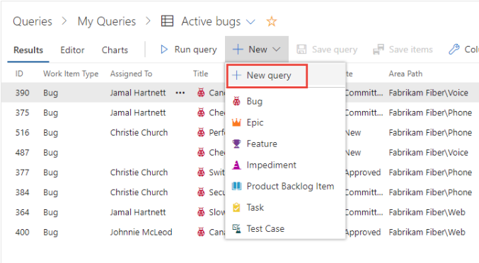  

The Query Editor displays with the following default settings: **Flat list of work items**, **Work Item Type=[Any]**, and **State=[Any]**. 

:::image type="content" source="media/using-queries/new-query-web-portal.png" alt-text="Screenshot of Query Editor with flat list of work items selected."::: 

You can modify the **Values** and [add or remove clauses](define-clause). Or, change the **Type of query** to [Work items and direct links](#directs-link-query) or to a [Tree of work items](#tree-query). 
::: moniker-end  

::: moniker range=">= tfs-2015 <= tfs-2018"  

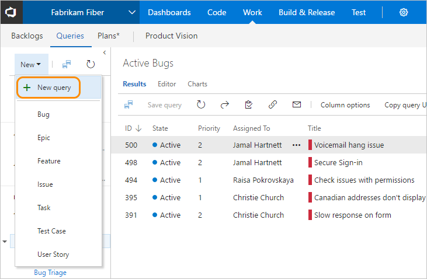  

The Query Editor displays with the following default settings: **Flat list of work items**, **Team Project=@Project** (the current project), **Work Item Type=[Any]**, and **State=[Any]**. 

:::image type="content" source="media/using-queries/new-query-flat-list-tfs.png" alt-text="Screenshot of Query Editor with flat list of work items selected, TFS 2018 and earlier versions."::: 

You can modify the **Values** and [add or remove clauses](define-clause). Or, change the **Type of query** to [Work items and direct links](#directs-link-query) or to a [Tree of work items](#tree-query). 

::: moniker-end  

 
#### [Visual Studio](#tab/visual-studio/)

Choose **New Query** from the **Work Items** page. 

:::image type="content" source="media/using-queries/new-query-visual-studio-2019.png" alt-text="Screenshot of Work Items, choose New Query."::: 
The Query Editor displays with the following default settings: **Flat list (Default)**, **Team Project=current project**, **Work Item Type=[Any]**, and **State=[Any]**. 

:::image type="content" source="media/using-queries/visual-studio-new-query-editor.png" alt-text="Screenshot of Visual Studio Query Editor, flat-list query."::: 

You can modify the **Values** and [add or remove clauses](define-clause). Or, change the **Type of query** to [Work items and direct links](#directs-link-query) or to a [Tree of work items](#tree-query). 

* * * 

<a id="query-across-projects" /> 

<a id="across-projects" />  

## Query across or within projects 

By default, new queries are scoped to the current project. However, you can create queries to find work items defined within the organization or project collection. All queries that you save, however, are saved under a specific project. 

#### [Browser](#tab/browser/) 

::: moniker range=">= tfs-2015"  

To list work items defined in two or more projects, checkmark **Query across projects**. For example, the following query finds all features created in all projects within the last 30 days.
 
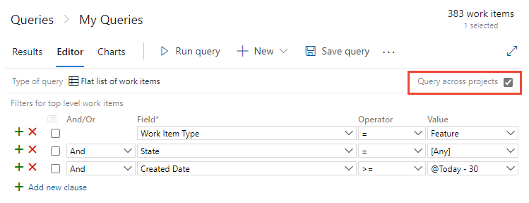 

::: moniker-end

::: moniker range="tfs-2015"  

> [!NOTE]  
> The **Query across projects** feature is supported from TFS 2015.1 and later versions.  

::: moniker-end  

::: moniker range=">= tfs-2015"  

With the **Query across projects** checked, you can add the **Team Project** field to filter to a select number of projects.   

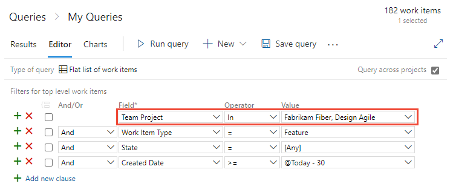

> [!NOTE]
> Separate multiple project names with the list separator that corresponds to the regional settings defined for your client computer, for example, a comma (,). 

The **Team Project** field becomes available only after you check  **Query across projects**.  Moreover, when **Query across projects** is unchecked, only those fields from those work item types defined in the current project appear in the **Field** drop-down menu. When **Query across projects** is checked, all fields from all work item types defined in all projects in the collection appear in the **Field** drop-down menu.  

::: moniker-end  

::: moniker range="tfs-2013"   

To find all features created in all projects within the last 30 days, remove the **Team Project=@Project** clause from the query.  

All fields from all work item types defined in all projects in the collection always appear in the **Field** drop-down menu.  

Use **Team Project=@Project** to scope the query to find only those work items defined for the current project. 

::: moniker-end  

#### [Visual Studio](#tab/visual-studio/)

To list work items defined in two or more projects, change the clause for the **Team Project** using the **In** operator, and enter the names of the projects to search in. For example, the following query finds work items defined in the *Fabrikam Fiber* and *Design Agile* projects.  

:::image type="content" source="media/using-queries/visual-studio-query-multiple-projects.png" alt-text="Screenshot of Visual Studio Query Editor, flat-list query, specify two projects clause":::  

To query across all projects, delete the clause with the **Team Project** field. 

* * *

 
<a id="define-clause" />

## Define a clause

You create a query by defining one or more clauses. Each clause defines a filter criteria for a single field. 

#### Sample query clause 

|And/Or|Field|Operator|Value|
|------|-----|--------|-----|
|**And**|**Assigned To**|**=**|**&#64;Me**|

For a quick reference of the operators available based on the field data type, see [Query index quick reference](query-index-quick-ref.md#fields-operators-macros). 

All clauses you add are added as an **And** statement. Choose **Or** to change the grouping. You group clauses to ensure that the clause statements are executed in the sequence required. 

#### [Browser](#tab/browser/) 

Choose **Add new clause** to add another clause at then end of the query, and then choose the **Field**, **Operator**, and **Value** for that clause.  

> [!div class="mx-imgBorder"]  
> 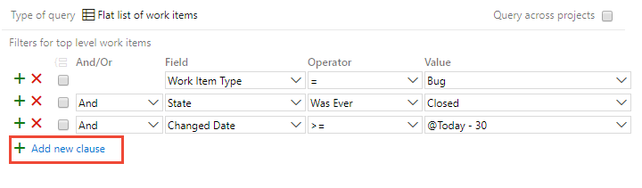  

For example, you can search for all work items assigned to you by specifying the **Assigned To** field, the equals (**=**) operator, and the **@Me** macro which represents your user identity.

#### [Visual Studio](#tab/visual-studio/)

Choose **Click here to add a clause** to add another clause at then end of the query, and then choose the **Field**, **Operator**, and **Value** for that clause.  

:::image type="content" source="media/using-queries/visual-studio-add-new-clause.png" alt-text="Screenshot of Visual Studio Query Editor, add new clause.":::  

To insert a clause within the existing set of query clauses, place your cursor on the clause below where you want to insert the clause, and then choose **Insert Clause**. Then choose the **Field**, **Operator**, and **Value** for that clause.  

:::image type="content" source="media/using-queries/visual-studio-add-new-clause.png" alt-text="Screenshot of Visual Studio Query Editor, insert clause.":::  

Or, open the context menu for the clause and choose **Insert Clauses**. 

:::image type="content" source="media/using-queries/visual-studio-insert-delete-clauses.png" alt-text="Screenshot of Visual Studio Query Editor, context-menu for insert clauses and delete clause."::: 

To delete a clause, choose the clause you want to delete, and choose :::image type="icon" source="../media/icons/icon-delete-clause-visual-studio.png" border="false"::: **Delete Clause**.

When finished, choose :::image type="icon" source="../media/icons/run_query.png" border="false"::: **Run** or :::image type="icon" source="../media/icons/icon-save-visual-studio.png" border="false"::: **Save Query**.
 

* * *

[!INCLUDE [temp](../includes/tip-wiql-extension.md)]

### Checklist for how to define a query clause

1. In the first empty row, under the **Field** column heading, choose the down arrow to display the list of available fields, and choose an item in the list.

	For more information, see [Query Fields and Values](query-operators-variables.md#field-values).

2. In the same row, under the **Operator** column heading, choose the down arrow to display the list of available operators, and choose an item in the list.

	For more information, see [Operators](query-operators-variables.md#operators).

3. In the same row, under the **Value** column heading, either type a value, or choose the down arrow, and choose an item in the list.

	For more information about how to use a macro or variable to specify the current project, user, date, or other selection, see [Variables](query-operators-variables.md#variables).

5. To add a clause, choose **Add new clause**.

	You can add a clause to the end of the query, insert a clause after an existing clause (), and remove (), group (), and ungroup () clauses as needed.

<a id="tree-query" />

## Use a tree of work items to view hierarchies  

Use the :::image type="icon" source="media/11.png" border="false"::: **Tree of Work Items** query to view a multi-tiered, nested list of work items. For example, you can view all backlog items and their linked tasks.  Expand (Expand node () or collapse () nodes to focus on different parts of the tree.  

> [!NOTE]    
> You can't construct a query that shows a hierarchical view of Test Plans, Test Suites, and Test Cases. These items aren't linked together using parent-child link types. However, you can create a direct links query that lists test-related work items. Also, you can, [view the hierarchy through the Test>Test Plans page](../../test/create-a-test-plan.md). 

Define the filter criteria for both parent and child work items. To find linked children, select **Match top-level work items first**. To find linked parents, select **Match linked work items first**.

#### [Browser](#tab/browser/)

::: moniker range=">= azure-devops-2019"  

> [!div class="mx-imgBorder"]  
> 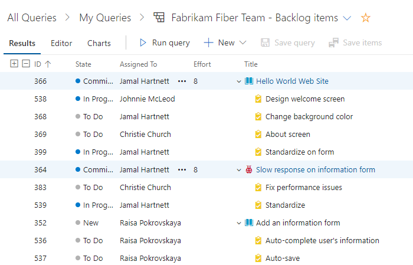  

::: moniker-end  

::: moniker range=">= tfs-2017 <= tfs-2018"  

> [!div class="mx-imgBorder"]  
> 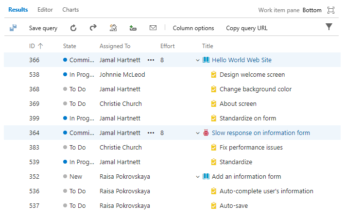  

::: moniker-end  

::: moniker range=">= tfs-2013 <= tfs-2015"  

  

::: moniker-end  

::: moniker range=">= tfs-2017"  

> [!div class="mx-imgBorder"]  
>   

::: moniker-end  

::: moniker range="<= tfs-2015"  

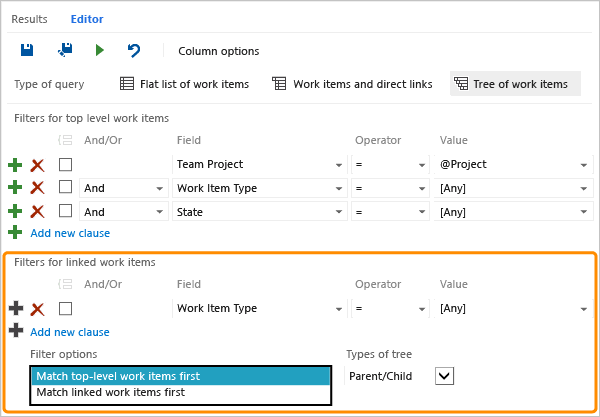  

::: moniker-end  

#### [Visual Studio](#tab/visual-studio/)

:::image type="content" source="media/using-queries/tree-backlog-te.png" alt-text="Screenshot, Query Editor, Tree Query, Team Explorer. ":::

* * * 
 

<a id="directs-link-query" />

## Use direct links to view dependencies

Use the :::image type="icon" source="media/16.png" border="false"::: **Work items and Direct links** query to track work items that depend on other tracked work, such as tasks, bugs, issues, or features. For example, you can view backlog items that depend on other items being implemented or a bug being fixed. 

Use the direct links query to track dependencies your team has that other teams work on, or manage commitments your team has made to other teams. Specify the filter criteria for both top and linked work items, and select the types of links used to filter the dependencies. 

#### [Browser](#tab/browser/)

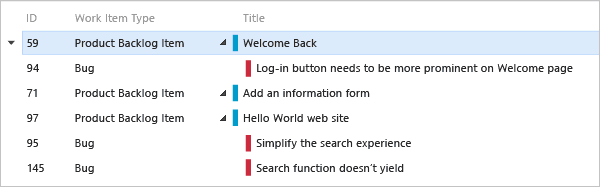

::: moniker range=">= tfs-2017"  

> [!div class="mx-imgBorder"]  
> 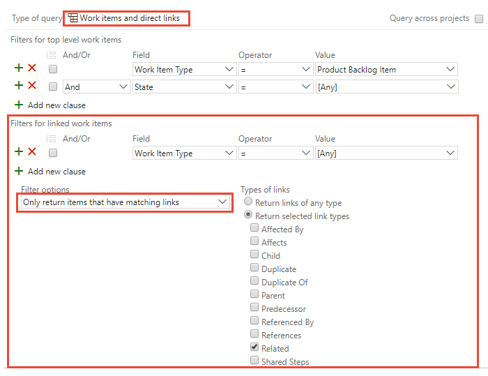  

::: moniker-end  

::: moniker range=">= tfs-2013 <= tfs-2015"  

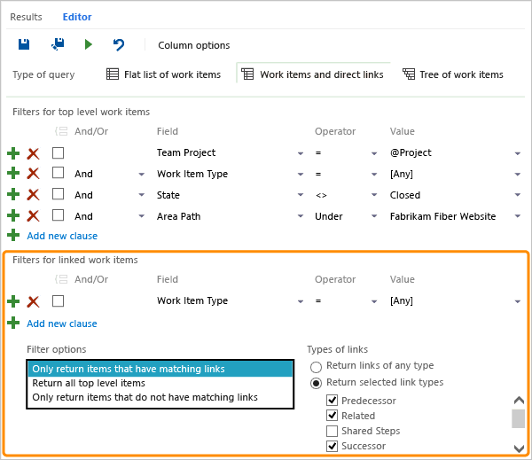  

::: moniker-end  

Filter your first-tier list of work items by choosing one of these options:

- **Only return items that have matching links**: First-tier work items are returned, but only if they have links to work items specified by the linked work items filter criteria. 

- **Return all top level items**: All first-tier work items are returned regardless of the linked work items filter criteria. Second-tier work items that are linked to the first tier are returned if they match the linked work items filter criteria.

- **Only return items that do not have matching links**: First-tier work items are returned, but only if they do not have links to work items specified by the linked work items filter criteria.
 

#### [Visual Studio](#tab/visual-studio/)

:::image type="content" source="media/using-queries/direct-links-te.png" alt-text="Screenshot, Query Editor, Direct Links Query, Team Explorer.":::

Filter your first-tier list of work items by choosing one of these options:

- **Return all top level work items**: All first-tier work items are returned regardless of the linked work items filter criteria. Second-tier work items that are linked to the first tier are returned if they match the linked work items filter criteria.

- **Only return items that have the specified links**: First-tier work items are returned, but only if they have links to work items specified by the linked work items filter criteria. 

- **Only return items that do not have the specified links**: First-tier work items are returned, but only if they do not have links to work items specified by the linked work items filter criteria.
 
* * * 

To learn more about each link type, see [Linking, traceability, and managing dependencies](link-work-items-support-traceability.md).

<a id="and-or" /> 
<a id="logical-groupings" /> 

## And/Or logical expression

You specify **And** or **Or** to create logical expressions of your query clauses. Specify **And** to find work items that meet the criteria in both the current clause and the previous clause. Specify **Or** to find work items that meet the criterion in either the current clause or the previous clause.

You can add one new clause for each work item field in order to refine your search criteria, so that it returns only the set of work items that you want. If you do not receive the results that you expect from your query, you can add, remove, group, or ungroup query clauses to refine your query results.

You can group query clauses to operate as a single unit separate from the rest of the query, similar to putting parentheses around an expression in a mathematical equation or logic statement. When you group clauses, the **AND** or **OR** for the first clause in the group applies to the whole group.

<a id="group-clauses" /> 

### Group clauses

Grouped clauses operate as a single unit separate from the rest of the query, similar to putting parentheses around a mathematical equation or logic expression. The **And** or **Or** operator for the first clause in the group applies to the whole group.

As the following examples show, the grouped clauses are translated to the corresponding logical expression.

> [!TIP]   
> To view the WIQL syntax for a query, install the [WIQL query editor extension](https://marketplace.visualstudio.com/items?itemName=ottostreifel.wiql-editor) which will allow you to see the WIQL version of any Query UI entry. This extension allows you to see just how AND/OR grouped clauses are treated. 

> [!div class="mx-tdCol2BreakAll"]
> |Query| Grouped clauses|Logical expression|
> |---|---|---|
> |**1** |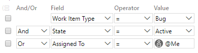||
> |**2**| |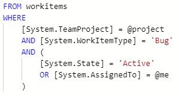|
> |**3**| 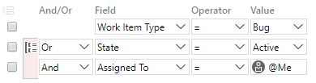|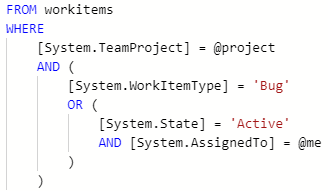|

These queries return work items that are type Bug and meet the following logical expressions:  
- **Query 1**: AND State=Active OR Assigned to @Me  
- **Query 2**: AND (State=Active OR Assigned to @Me)  
- **Query 3**: OR (State=Active AND Assigned to @Me)  

To group one or more clauses, select them and then choose the :::image type="icon" source="../media/icons/group-clauses-icon.png" border="false"::: group clauses icon.

> [!div class="mx-imgBorder"]  
> 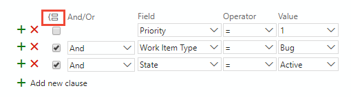  

You can also group several grouped clauses by checking the boxes of each clause that has already been grouped, and then choose the :::image type="icon" source="../media/icons/group-clauses-icon.png" border="false"::: group clauses icon.

> [!div class="mx-imgBorder"]  
> 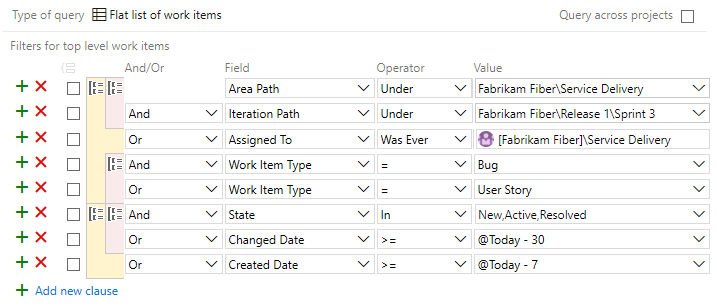

If your query results don't return expected results, follow these steps: 

- Make sure that each clause is defined as you intended.  
- Verify And/Or assignments to each clause. If your results contain more work items than expected, often an Or clause is present instead of an And clause.  
- Determine if you need to group or change the grouping of the query clauses and the And/Or assignments of each grouped clause.  
- Add more query clauses to refine your query filter criteria.  
- Review the options available to specify [fields, operators, and values](query-operators-variables.md).  

<a id="ungroup-clause" />

### Ungroup a clause

#### [Browser](#tab/browser/) 

To ungroup a clause, choose the :::image type="icon" source="../media/icons/ungroup-clause.png" border="false"::: ungroup clauses icon for the grouped clause. 

#### [Visual Studio](#tab/visual-studio/)

To ungroup a clause, choose the :::image type="icon" source="../media/icons/ungroup-clause-visual-studio.png" border="false"::: ungroup clauses icon for the grouped clause, Visual Studio. 

* * *

## Related articles

That's the basics about defining queries. For an index of query examples, see [Query quick reference](query-index-quick-ref.md).  

- [Query FAQs](query-faqs.yml)
- [Chart a flat-list query](../../report/dashboards/charts.md)  
- [Change column options](../backlogs/set-column-options.md?toc=/azure/devops/boards/queries/toc.json&bc=/azure/devops/boards/queries/breadcrumb/toc.json)
- [Work item field index](../work-items/guidance/work-item-field.md) 
- [Keyboard shortcuts](../../project/navigation/keyboard-shortcuts.md)