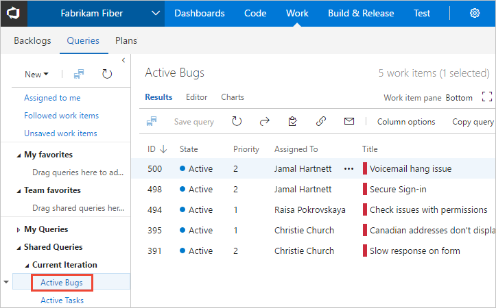

# Create and save managed queries with the query editor

[!INCLUDE [temp](../_shared/version-vsts-tfs-all-versions.md)]

Managed queries generate a list of work items based on the filter criteria you provide. You can create queries from the web portal or from a supported client, such as Visual Studio Team Explorer and Team Explorer Everywhere.  Also, you can open a query in [Excel](../backlogs/office/bulk-add-modify-work-items-excel.md) to perform bulk additions and modifications.  

In this article you'll learn:  

> [!div class="checklist"]    
> * How to open and edit a query   
> * How to add or create a query 
> * How to group query clauses 
> * Understand when to use a flat-list, tree, or direct-links query 
> * How to query across projects    

For quick access to all query tasks, supported operators&mdash;such as, `Contains`, `In`, `In Group`, and `<>`(not operator) &mdash; based on field data type, and query examples, see [Query quick reference](query-index-quick-ref.md).  

[!INCLUDE [temp](../_shared/prerequisites-queries.md)]

## Open Queries 

[!INCLUDE [temp](../_shared/open-queries.md)] 

<a id="flat-list-query"/>

## Open, edit, and save a query  

The easiest way to define a query is to start with an existing shared query. 
The following example shows how to find all closed bugs by modifying the 
*Active Bugs* shared query provided with the Agile process template. Examples are based on the user interface provided through the web portal. 

::: moniker range=">= azure-devops-2019"  

0.	Open a shared query. For example, from the web portal, open the *Active Bugs* or similar flat list query.   

	> [!div class="mx-imgBorder"]  
	>   

	> [!TIP]  
	> If you're working in Visual Studio Team Explorer, open the **Work** page to access your queries and shared queries. If Team Explorer isn't visible, choose **View>Team Explorer** from the top level menu.   

0.	Edit the query to find closed bugs and then run the query. 
	Use  to insert a clause above the current clause. Use  to delete a clause.  Queries are automatically scoped to the current project. To find work items defined in several projects, see [Query across projects](using-queries.md#across-projects). 

	> [!div class="mx-imgBorder"]
	>  

0.	Save the query to your **My Queries** folder.  

	> [!div class="mx-imgBorder"]  
	>   

	To save a query to the **Shared Queries** folder, you need to be a member of the [Project Administrators group](../../organizations/security/add-users-team-project.md), or have your **Contribute** permissions on the folder set to **Allow**. To learn more, see [Set query permissions](set-query-permissions.md).  

::: moniker-end

::: moniker range="<= tfs-2018"  

0.	Open a shared query. For example, from the web portal, open the *Active Bugs* or similar flat list query.   

	  

	> [!TIP]  
	> If you're working in Visual Studio Team Explorer, open the **Work** page to access your queries and shared queries. If Team Explorer isn't visible, choose **View>Team Explorer** from the top level menu.   

0.	Edit the query to find closed bugs and then run the query. 
	Use  to insert a clause above the current clause. Use  to delete a clause.  Queries are automatically scoped to the current project. To find work items defined in several projects, see [Query across projects](using-queries.md#across-projects).   	
	
	  

0.	Save the query to your **My Queries** folder.  
	
	  

	To save a query to the **Shared Queries** folder, you need to be a member of the [Project Administrators group](../../organizations/security/add-users-team-project.md), or have your **Contribute** permissions on the folder set to **Allow**. To learn more, see [Set query permissions](set-query-permissions.md).  

::: moniker-end  

<a id="flat-list" />

## Create a query

You can start a fresh, new query from the **Queries** tab in the web portal or the **Work Items** tab in Team Explorer.  

::: moniker range=">= azure-devops-2019"  

> [!div class="mx-imgBorder"]  
>   

::: moniker-end  

::: moniker range=">= tfs-2015 <= tfs-2018"  

  

::: moniker-end  

<a id="define-clause" />

## Define a clause
You create a query by defining one or more clauses. Each clause defines a filter criteria for a single field. Choose **Add new clause** to add another clause and then choose the **Field**, **Operator**, and **Value** for that clause.  

> [!div class="mx-imgBorder"]  
>   

For example, you can search for all work items assigned to you by specifying the **Assigned To** field, the equals (=) operator, and the **@Me** macro which represents your user identity.

### Sample query clause 

<table>
<tr>
	<th>And/Or</th>
	<th>Field</th>
	<th>Operator</th>
	<th>Value</th></tr>
<tr>
	<td>
<strong>And</strong>
</td>
	<td>
<strong>Assigned To</strong>
</td>
	<td>
<strong>=</strong>
</td>
	<td>
<strong>&#64;Me</strong>
</td>
</tr>
</table>

For a quick reference of the operators available based on the field data type, see [Query index quick reference](query-index-quick-ref.md#fields-operators-macros). 

All clauses you add are added as an **And** statement. Choose **Or** to change the grouping. You group clauses to ensure that the clause statements are executed in the sequence required.  

### Checklist for how to define a query clause

1. In the first empty row, under the **Field** column heading, choose the down arrow to display the list of available fields, and choose an item in the list.

	For more information, see [Query Fields and Values](query-operators-variables.md#field-values).

2. In the same row, under the **Operator** column heading, choose the down arrow to display the list of available operators, and choose an item in the list.

	For more information, see [Operators](query-operators-variables.md#operators).

3. In the same row, under the **Value** column heading, either type a value, or choose the down arrow, and choose an item in the list.

	For more information about how to use a macro or variable to specify the current project, user, date, or other selection, see [Variables](query-operators-variables.md#variables).

5. To add a clause, choose **Click here to add a new clause** or **Add a new clause**.

	You can add a clause to the end of the query, insert a clause after an existing clause (), and remove (), group (), and ungroup () clauses as needed.

<a id="and-or" /> 

## And/Or logical expression

You specify **And** or **Or** to create logical expressions of your query clauses. Specify **And** to find work items that meet the criteria in both the current clause and the previous clause. Specify **Or** to find work items that meet the criterion in either the current clause or the previous clause.

You can add one new clause for each work item field in order to refine your search criteria, so that it returns only the set of work items that you want. If you do not receive the results that you expect from your query, you can add, remove, group, or ungroup query clauses to refine your query results.

Query clauses can be grouped to operate as a single unit separate from the rest of the query, similar to putting parentheses around an expression in a mathematical equation or logic statement. When you group clauses, the **AND** or **OR** for the first clause in the group applies to the whole group.

As the following example shows, the grouped clauses are translated to the corresponding logical expression. The first expression returns work items that are priority 1, as well as all active bugs of any priority. The second expression returns all active priority 1 work items, plus all priority 1 bugs whether they are active or not.

> [!div class="mx-tdCol2BreakAll"]
> |Grouped clauses|Logical expression|
> |---|---|
> ||Priority=1 OR (Work Item Type=Bug AND State=Active)|
> ||Priority=1 AND (Work Item Type=Bug OR State=Active)|

<a id="group-clauses" /> 

## Group clauses

Grouped clauses operate as a single unit separate from the rest of the query, similar to putting parentheses around a mathematical equation or logic expression. The And or Or operator for the first clause in the group applies to the whole group.

In the next example, the first expression returns all work items that are priority 1 and all active bugs of any priority. The second expression returns all active priority 1 work items and all priority 1 bugs, whether they are active or not.

> [!div class="mx-tdCol2BreakAll"]
> |Grouped clauses  | Logical expression         |
> | ----------------- | --------------------|
> |  | Priority = 1 OR (Work Item Type=Bug AND State=Active) |
> |  | Priority = 1 AND (Work Item Type=Bug OR State=Active) |

To group one or more clauses, select them and then choose the  group clauses icon.

> [!div class="mx-imgBorder"]  
>   

You can also group several grouped clauses by checking the boxes of each clause that has already been grouped, and then choose the  group clauses icon.

> [!div class="mx-imgBorder"]  
> 

If your query results do not return your expected set of work items, follow these steps: 

- Make sure that each clause is defined as you intended.  
- Verify And/Or assignments to each clause. If your results contain more work items than expected, often an Or clause is present instead of an And clause.  
- Determine if you need to group or change the grouping of the query clauses and the And/Or assignments of each grouped clause.  
- Add more query clauses to refine your query filter criteria.  
- Review the options available to specify [fields, operators, and values](query-operators-variables.md).  

<a id="ungroup-clause" />

## Ungroup a clause

To ungroup a clause, choose the  ungroup clauses icon for the grouped clause. 

<a id="tree-query" />

## Use a tree query to view hierarchies  

Use the tree query () to view a multi-tiered, nested list of work items. For example, you can view all backlog items and their linked tasks.  Expand (Expand node () or collapse () leaf nodes to focus on different parts of the tree.  

::: moniker range=">= azure-devops-2019"  

> [!div class="mx-imgBorder"]  
>   

::: moniker-end  

::: moniker range=">= tfs-2017 <= tfs-2018"  

> [!div class="mx-imgBorder"]  
>   

::: moniker-end  

::: moniker range=">= tfs-2013 <= tfs-2015"  

  

::: moniker-end  

Define the filter criteria for both parent and child work items. To find linked children, select **Match top-level work items first**. To find linked parents, select **Match linked work items first**.

::: moniker range=">= tfs-2017"  

> [!div class="mx-imgBorder"]  
>   

::: moniker-end  

::: moniker range=">= tfs-2013 <= tfs-2015"	 

  

::: moniker-end  

> [!NOTE] 
> You can't construct a query that shows a hierarchical view of Test Plans, Test Suites, and Test Cases. These items aren't linked together using parent-child link types. You can [view the hierarchy through the Test>Test Plans page](../../test/create-a-test-plan.md). 

<a id="directs-link-query" />

## Use direct links to view dependencies

Use the direct links query () to track work items that depend on other tracked work, such as tasks, bugs, issues, or features. For example, you can view backlog items that depend on other items being implemented or a bug being fixed. 

Use the direct links query to track dependencies your team has that other teams work on, or manage commitments your team has made to other teams. Specify the filter criteria for both top and linked work items, and select the types of links used to filter the dependencies. 

::: moniker range=">= tfs-2017"  

> [!div class="mx-imgBorder"]  
>   

::: moniker-end  

::: moniker range=">= tfs-2013 <= tfs-2015"  

  

::: moniker-end  

Filter your first-tier list of work items by choosing one of these options:

- **Only return work items that have the specified links**: First-tier work items are returned, but only if they have links to work items specified by the linked work items filter criteria. 

- **Return all top level work items**: All first-tier work items are returned regardless of the linked work items filter criteria. Second-tier work items that are linked to the first tier are returned if they match the linked work items filter criteria.

- **Only return work items that do not have the specified links**: First-tier work items are returned, but only if they do not have links to work items specified by the linked work items filter criteria.

To learn more about each link type, see [Linking, traceability, and managing dependencies](link-work-items-support-traceability.md).

<a id="across-projects" />  

## Query across projects  

By default, shared queries and new queries are scoped to the current project. However, you can create queries to find work items defined within the project collection. You save cross-project queries under a specific project. 

::: moniker range=">= tfs-2015"  

To list work items defined in two or more projects, checkmark **Query across projects**. For example, the following query finds all features created in all projects within the last 30 days.
 
 

::: moniker-end

::: moniker range="tfs-2015"  

> [!NOTE]  
> The **Query across projects** feature is supported from TFS 2015.1 and later versions.  

::: moniker-end  

::: moniker range=">= tfs-2015"  

With the **Query across projects** checked, you can add the Team Project field to filter to a select number of projects.   

> [!NOTE]
> Separate multiple project names with the list separator that corresponds to the regional settings defined for your client computer, for example, a comma (,). 

The *Team Project* field becomes available only after you check  **Query across projects**.  Moreover, when **Query across projects** is unchecked, only those fields from those WITs defined in the current project appear in the Field drop-down menu. When **Query across projects** is checked, all fields from all WITs defined in all projects in the collection appear in the Field drop-down menu.  

::: moniker-end  

::: moniker range="tfs-2013"   

To find all features created in all projects within the last 30 days, remove the **Team Project=@Project** clause from the query.  

All fields from all WITs defined in all projects in the collection always appear in the Field drop-down menu.  

Use **Team Project=@Project** to scope the query to find only those work items defined for the current project. 

::: moniker-end  

## Taskboard versus query list items

You may notice and wonder why the contents of the taskboard differ from those listed with its created query? To learn more, see [taskboard items versus query list items](../backlogs/backlogs-boards-plans.md#task-board-items).

<a id="export-query" />  

## Export a query  

From the query editor in Team Explorer, use the File menu to save a query as a .wiq file. When you create a project, the shared queries are created based on [.wiq files defined in a process](../../reference/process-templates/define-work-item-query-process-template.md). 

See also:
- [Syntax for the Work Item Query Language (WIQL)](wiql-syntax.md)  
- [Wiql Editor, a Marketplace extension](https://marketplace.visualstudio.com/items?itemName=ottostreifel.wiql-editor)  
 

::: moniker range="azure-devops"  

> [!NOTE]  
> The WIQL length must not exceed 32K characters. The system won't allow you to create or run queries that exceed that length.  

::: moniker-end  

## Related articles

That's the basics about using queries. For an index of query examples, see [Create managed queries](example-queries.md#examples). To add a custom field to track additional data, see [Customize your work tracking experience](../../reference/customize-work.md). 

- [Ad hoc versus managed queries](adhoc-vs-managed-queries.md)  
- [Add work items](../backlogs/add-work-items.md)  
- [Chart a flat-list query](../../report/dashboards/charts.md)  
- [Change column options](../backlogs/set-column-options.md?toc=/azure/devops/boards/queries/toc.json&bc=/azure/devops/boards/queries/breadcrumb/toc.json)
- [Define a query as a hyperlink](define-query-hyperlink.md) 
- [Work item field index](../work-items/guidance/work-item-field.md) 
- [Query keyboard shortcuts](queries-keyboard-shortcuts.md)

If you want to export a query to Excel, you can do that from [Excel or Visual Studio/Team Explorer](../backlogs/office/bulk-add-modify-work-items-excel.md). Or, to export a query directly from the web portal Queries page, install the [VSTS Open in Excel Marketplace extension](https://marketplace.visualstudio.com/items?itemName=blueprint.vsts-open-work-items-in-excel). This extension will add in **Open in Excel** link to the toolbar of the query results page. 

[!INCLUDE [temp](../_shared/rest-apis-queries.md)]
 
 