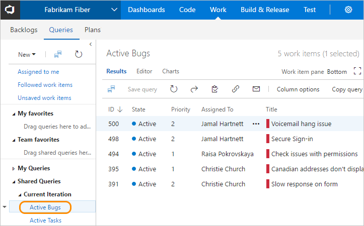

# View, run, or email a work item query  

[!INCLUDE [temp](../_shared/version-vsts-tfs-all-versions.md)]

To find work items assigned to you or your team, run a query. A number of work item queries are predefined with your process. Also, members of your team may have created shared queries that you can view and run. Oftentimes, it's easier to define a new query by building on the query definition that's already available to you. 

[!INCLUDE [temp](../_shared/prerequisites-queries.md)]

## Open Queries 

[!INCLUDE [temp](../_shared/open-queries.md)] 

## Run a query 

To run any query, expand a folder and choose the title of the query. The view opens to display the query **Results**.

> [!TIP]    
> The **Queries** page, as with other web portal pages, remembers the view you last navigated to and returns you to that view.
	
::: moniker range=">= azure-devops-2019"
0. Choose **All** to open the page where you can view all queries you've defined or that are shared within your project. 

	> [!div class="mx-imgBorder"]  
	>   

0. Choose **My Queries** as needed. 
	- To view all work items assigned to you, choose **Assigned to me**. This query uses the **@Me**  macro to list all work items assigned to you.  
	- To view all work items you are following, choose **Followed work items**. This query uses the **@Follows**  macro (ID in @Follows) to list all work items you've elected to follow. To learn more, see [Follow a work item or pull request](../work-items/follow-work-items.md).  

0. Choose **Shared Queries** to expand the folder and access queries saved as shared queries. 

0. Choose a folder within a breadcrumb to open a query folder. 
	> [!div class="mx-imgBorder"]  
	> 

::: moniker-end

::: moniker range=">= azure-devops-2019"

 

## Tips for working with the directory-focused **Queries** pages 

The **Queries** page now contains a directory-focused view which you can filter to find specific queries of interest. Previously, the **Queries** page presented the queries folders, query editor, and query results all within the same view. 

With this change, some functionality has been added and some has changed. Here are some tips to find the work items of interest:

### Where can I find work assigned to me or work that I'm following?

Open **Queries>All**. Under the **My Queries** section are two fully customizable queries: **Assigned to me** and **Followed work items**.    

### Where can I find recent work item activity? 

- Open **Boards>Work Items** and select the **Recently updated** view. See [View and add work items](../work-items/view-add-work-items.md).  

- You can also use the macros &mdash; **@Me**, **@Follows**, **MyRecentActivity**, **@RecentMentions**, **@RecentProjectActivity** &mdash; to create custom queries that can filter for work items assigned to you, that you are following, and so on. To learn more about these macros, see [Query macros and variables](query-operators-variables.md#macros). 

<a id="favorite" /> 

### How do I quickly navigate to queries I view frequently?  

- Favorite those queries and other artifacts that you view frequently. Choose the  star icon to favorite a query. 
- Favorited queries ( favorited icon) are listed in the **Queries>Favorites** page. Also, you can select one from the queries selector, as shown in the following image.  

	> [!div class="mx-imgBorder"]  
	>   
	Or, you can select from any of your favorited items by choosing the  inbox icon and choose **Favorites**.  

	  

### How do I quickly navigate to queries within the same query folder?  

When viewing a query, you can use the queries breadcrumb selector ( the breadcrumb icon changes to  a context menu selector) to view the queries defined within the folder. To open the queries folder, choose the folder name. 

> [!div class="mx-imgBorder"]  
>   

### Can I run several queries at the same time? 
 
Yes. Simply open a query in a new browser tab to run several queries at the same time.  

### How can I best use queries to monitor progress on a project or team?  

- [Define a chart for a query](../../report/dashboards/charts.md) and add it to a dashboard, or add the [Query Results widget](../../report/dashboards/widget-catalog.md#query-results-widget) to a dashboard. Each time you open the dashboard, the query will automatically run and refresh. 
- Periodically, [triage query results](triage-work-items.md) to review and update status.  

::: moniker-end

<a id="view-rename-delete" />

## View, rename, or delete a query

::: moniker range=">= azure-devops-2019"

From either the **Favorites** or **All** page, choose the  actions icon of a query to run, edit, rename, or delete the query. 

  

For shared queries, you can also choose to perform one of these tasks: 
- **Add to team queries**: Select the team to add the query as a team favorite
- **Security...**: to set permissions for the query. To learn more, see [Set query permissions](set-query-permissions.md).   
- **Add to dashboard**: Adds a Query tile widget to the team dashboard you select. To learn more, see [Add widgets to a dashboard](../../report/add-widget-to-dashboard.md). 

::: moniker-end

::: moniker range=">= tfs-2013 <= tfs-2018"

Choose the  context menu icon of a query to edit, rename, or delete the query.

::: moniker-end

::: moniker range=">= azure-devops-2019"

## Tasks you can perform from the Favorites or All pages

You can perform most tasks for viewing and running queries from each of the queries list pages as indicated in the following table. Only queries you save under **My Queries** and have favorited show up under **My Favorites**. Only queries saved under **Shared Queries** can be favorited by a team. 
  

> [!div class="mx-tdCol2BreakAll"]
> |Task |Favorites |All | 
> |-------------|----------|---------| 
> |View all favorited queries, yours or a team you belong to |  |  | 
> |View all your queries or shared queries for the current project |  |  | 
> |Run a query, open the context menu for a query  | | |
> |Expand or collapse container folders or query folders | | |
> |Filter the list of queries | | |
> |Favorite a query: Click  |  | | 
> |Unfavorite a query: Click  | | | 
> |Add a new query: Click  | | | 

For details on adding new queries, see [Create managed queries with the query editor](using-queries.md). 

::: moniker-end

::: moniker range=">= azure-devops-2019"

## Filter the list of queries

Enter a keyword into the filter box to filter the set of queries displayed on either the **Favorites** or **All** pages. 

::: moniker-end

<a id="email-query" />

## Email query items or share a query URL 

From the **Query Editor** or **Results** view, you can email a formatted list of query items or copy the query URL. 

::: moniker range=">= azure-devops-2019"

Choose the  actions icon to open the menu and select from the options listed, **Email query** or **Copy query URL**. 
 
> [!div class="mx-imgBorder"]  
>   
	You can only send the email to individual address for a project member that is recognized by the system. Adding a team group or security group to the to line isn't supported. If you add an email account that the system doesn't recognize, you receive a message that one or more recipients of your email don't have permissions to read the mailed work items.  

> [!NOTE]  
> To email a formatted list to people who aren't project members, you'll need to use the **Copy as HTML** option described in [Copy a list of work items](../backlogs/copy-clone-work-items.md#html). 

::: moniker-end

::: moniker range=">= tfs-2013 <= tfs-2018"
	
Choose **Copy query URL**. To email query items, see [Copy a list of work items](../backlogs/copy-clone-work-items.md#html).

  

> [!NOTE]
> With **Email query**, the system will email the formatted list to those team mates you select. To email a formatted list to people not part of the project, you'll need to use the **Copy as HTML** option described in [Copy a list of work items](../backlogs/copy-clone-work-items.md#html). For on-premises TFS, all email actions require an [SMTP server to be configured](/azure/devops/server/admin/setup-customize-alerts). If you don't have an SMTP server configured, you can work around this by using **Copy as HTML**. 
> 
::: moniker-end

## Try this next

> [!div class="nextstepaction"]
> [Perform an ad hoc search](search-box-queries.md) 

## Related articles

- [Create and save managed queries with the query editor](using-queries.md)
- [Change column options](../backlogs/set-column-options.md?toc=/azure/devops/boards/queries/toc.json&bc=/azure/devops/boards/queries/breadcrumb/toc.json)
- [Set personal or team favorites](../../project/navigation/set-favorites.md) 
- [Query keyboard shortcuts](queries-keyboard-shortcuts.md)
- [About access levels](../../organizations/security/access-levels.md)
