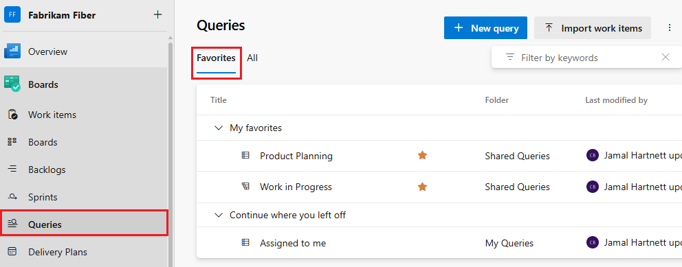
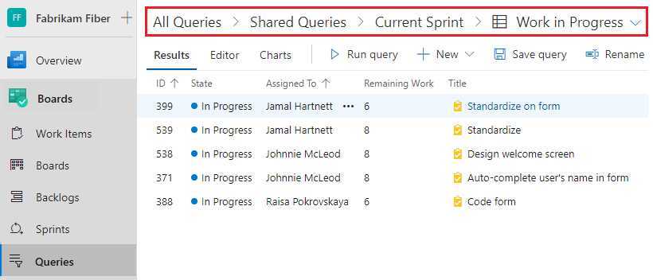
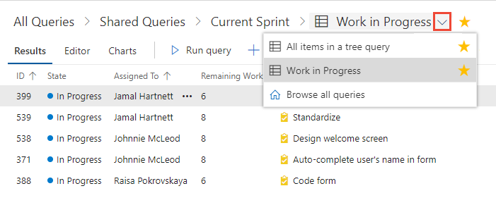
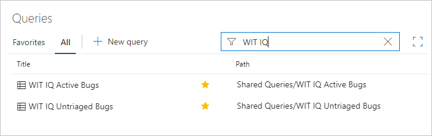
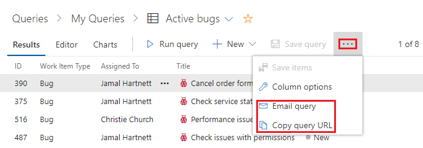

# View, run, or email a work item query  

[!INCLUDE [temp](../includes/version-all.md)]

To find work items assigned to you or your team, run a query. A number of work item queries are predefined with your process. Also, members of your team may have created shared queries that you can view and run. Oftentimes, it's easier to define a new query by building on the query definition that's already available to you. 

[!INCLUDE [temp](../includes/prerequisites-queries.md)]


## Open Queries 

[!INCLUDE [temp](../includes/open-queries.md)] 

## Run a query 

To run any query, expand a folder and choose the title of the query. The view opens to display the query **Results**. You can also run a query by using the Azure DevOps CLI.

#### [Browser](#tab/browser)

> [!TIP]    
> The **Queries** page, as with other web portal pages, remembers the view you last navigated to and returns you to that view.
	
::: moniker range=">= azure-devops-2019"
1. Choose **All** to open the page where you can view all queries you've defined or that are shared within your project. 

	> [!div class="mx-imgBorder"]  
	>   

1. Choose **My Queries** as needed. 
   - To view all work items assigned to you, choose **Assigned to me**. This query uses the <strong>@Me</strong>  macro to list all work items assigned to you.  
   - To view all work items you are following, choose **Followed work items**. This query uses the <strong>@Follows</strong>  macro (ID in @Follows) to list all work items you've elected to follow. To learn more, see [Follow a work item or pull request](../work-items/follow-work-items.md).  

2. Choose **Shared Queries** to expand the folder and access queries saved as shared queries. 

3. Choose a folder within a breadcrumb to open a query folder.
	> [!div class="mx-imgBorder"]  
	> 

::: moniker-end


#### [Visual Studio](#tab/visual-studio/)
 

- From the Team Explorer **Work Items**, page, open the context menu for the query (right-click with your mouse), and choose **View Results**. Or, double-click the query to open it. 

	:::image type="content" source="../media/team-explorer/open-query-from-team-explorer.png" alt-text="Screenshot of Team Explorer, open context menu for a query, choose View Results.":::


* * * 

## Run a query from the command line 

::: moniker range=">= azure-devops-2020"  

You can run a query in the CLI with the [az boards query](/cli/azure/boards#az_boards_query) command. To get started, see [Get started with Azure DevOps CLI](../../cli/index.md).

```azurecli 
az boards query [--id]
                [--org]
                [--path]
                [--project]
                [--wiql] 
``` 

#### Parameters

- **id**: The ID of an existing query. Required unless --path or --wiql is specified.
- **wiql**: The query in Work Item Query Language format. Ignored if --id or --path is specified.
- **path**: The path of an existing query. Ignored if --id is specified.
- **org**: Azure DevOps organization URL. You can configure the default organization using `az devops configure -d organization=ORG_URL`. Required if not configured as default or picked up using `git config`. Example: `--org https://dev.azure.com/MyOrganizationName/`.
- **project**: Name or ID of the project. You can configure the default project using `az devops configure -d project=NAME_OR_ID`. Required if not configured as default or picked up using `git config`.

#### Example

The following command runs a query with the specified ID and shows the result in table format.  

```azurecli
az boards query --id 6c286d74-26a5-4cce-bfcf-bf9123495bfe  --output table

Priority    Node Name         Work Item Type    Title                             Remaining Work
----------  ----------------  ----------------  --------------------------------  ----------------
1           Voice             Bug               Apply fix elsewhere as needed
2           CMMI              Bug               Slow response on form
1           Fiber             Bug               Check issues with permissions     0
2           Fiber             Bug               Voicemail hang issue              0
2           FabrikamBB        Bug               Research slow response time
1           FabrikamBB        Bug               Fix performance issues            0 
``` 

The following command runs a query with the specified WIQL and shows the result in table format.  

```azurecli 
az boards query --wiql "SELECT [Microsoft.VSTS.Common.Priority], [System.NodeName], [System.WorkItemType], [System.Title], [Microsoft.VSTS.Scheduling.RemainingWork], [System.AssignedTo], [System.State], [System.Tags], [System.AreaPath] FROM workitems WHERE [System.WorkItemType] = 'Bug' AND [System.AreaPath] = 'Fabrikam Fiber' ORDER BY [System.WorkItemType]" --output table

Priority    Node Name       Work Item Type    Title                  Remaining Work
----------  --------------  ----------------  ----------------       ----------------
2           Fabrikam Fiber  Bug               Slow response on form
2           Fabrikam Fiber  Bug               Check permissions
2           Fabrikam Fiber  Bug               Fix performance issue
2           Fabrikam Fiber  Bug               Secure Sign-in 
``` 
::: moniker-end
 


::: moniker range=">= azure-devops-2019"

<a id="tips-queries-hub"> </a> 

## Query directory, query folders, and breadcrumbs 


#### [Browser](#tab/browser)

The **Queries** page  contains a directory-focused view which you can filter to find specific queries of interest. 
When working in the **Queries** pages, you can navigate to a subfolder, folder, or page.



Also, you can choose a query that you've favorited from the selector menu, Or, you can choose to browse all queries which returns you to the **All Queries** page. 
  
> [!div class="mx-imgBorder"]  
>  

::: moniker-end


#### [Visual Studio](#tab/visual-studio/)
 
The **Work Items** page contains a directory-focused view of all queries defined for a project. 

You can drag and drop queries from one folder to another. 

* * *

For more information, see [Query FAQs, Navigate and Folders](query-faqs.yml).


::: moniker range=">= azure-devops-2019"

<a id="favorites" />

## All and Favorites supported tasks  

You can perform most tasks for viewing and running queries from each of the queries list pages as indicated in the following table. Only queries you save under **My Queries** and have favorited show up under **My Favorites**. Only queries saved under **Shared Queries** can be favorited by a team. 
  

> [!div class="mx-tdCol2BreakAll"]
> |<br/>Task |Favorites<br/>(Browser) |All<br/>(Browser) | Work Items<br/>(Team Explorer)
> |-------------|----------|---------| 
> |View all favorited queries, yours or a team you belong to | ✔️ |  | ✔️ |  
> |View all your queries or shared queries for the current project |  | ✔️ |✔️|  
> |Run a query, open the context menu for a query |✔️ |✔️|✔️|  
> |Expand or collapse container folders or query folders |✔️ |✔️|✔️|  
> |Filter the list of queries |✔️ |✔️ |  |
> |Favorite a query: Choose  |  |✔️ |✔️|  
> |Unfavorite a query: Choose :::image type="icon" source="/azure/devops/media/icons/icon-favorited.png" border="false"::: |✔️ |✔️ |✔️|   
> |Add a new query: Choose :::image type="icon" source="/azure/devops/boards/media/icons/add-new-query.png" border="false"::: |✔️ |✔️ | ✔️|  

::: moniker-end	

::: moniker range=">= azure-devops-2019"

## Filter the list of queries

#### [Browser](#tab/browser/)

Enter a keyword into the filter box to filter the set of queries displayed on either the **Favorites** or **All** pages. To learn more about filtering, see [Filter backlogs, boards, queries, and plans](../backlogs/filter-backlogs-boards-plans.md).   

> [!div class="mx-imgBorder"]  
> 

For more information, see [Query FAQs, Navigate and Folders](query-faqs.yml). 

::: moniker-end


#### [Visual Studio](#tab/visual-studio/)

> [!NOTE]   
> The query filter function isn't a supported feature in Team Explorer.  

* * * 
 

<a id="email-query" />

## Email query items or share a query URL 

#### [Browser](#tab/browser/)

From the **Query Editor** or **Results** view, you can email a formatted list of query items or copy the query URL. 

::: moniker range=">= azure-devops-2019"

Choose the  :::image type="icon" source="../media/icons/actions-icon.png" border="false"::: actions icon to open the menu and select from the options listed, **Email query** or **Copy query URL**. 
 
> [!div class="mx-imgBorder"]  
>   
	You can only send the email to individual address for a project member that is recognized by the system. Adding a team group or security group to the to line isn't supported. If you add an email account that the system doesn't recognize, you receive a message that one or more recipients of your email don't have permissions to read the mailed work items.  

> [!NOTE]  
> To email a formatted list to people who aren't project members, you'll need to use the **Copy as HTML** option described in [Copy a list of work items](../backlogs/copy-clone-work-items.md#html). 

::: moniker-end

::: moniker range="<= tfs-2018"
	
Choose **Copy query URL**. To email query items, see [Copy a list of work items](../backlogs/copy-clone-work-items.md#html).

  

> [!NOTE]
> With **Email query**, the system will email the formatted list to those teammates you select. To email a formatted list to people not part of the project, you'll need to use the **Copy as HTML** option described in [Copy a list of work items](../backlogs/copy-clone-work-items.md#html). For on-premises Azure DevOps, all email actions require an [SMTP server to be configured](/azure/devops/server/admin/setup-customize-alerts). If you don't have an SMTP server configured, you can work around this by using **Copy as HTML**. 

::: moniker-end
 

#### [Visual Studio](#tab/visual-studio/)

You can email a formatted query list by choosing the **Send to Microsoft Outlook** option from the context menu.  

	:::image type="content" source="media/view-run-queries/send-to-outlook-team-explorer.png" alt-text="Screenshot of Team Explorer, choose Send to Microsoft Outlook query option.":::

> [!NOTE]
> This feature requires you to have Microsoft Outlook installed. For on-premises Azure DevOps, all email actions require an [SMTP server to be configured](/azure/devops/server/admin/setup-customize-alerts). If you don't have an SMTP server configured, you can work around this by using **Copy as HTML** from the web portal. 

* * * 

## Try this next

> [!div class="nextstepaction"]
> [Define a query](using-queries.md)

## Related articles

- [Manage queries and query folders](organize-queries.md)
- [Interactively filter backlogs, boards, queries, and plans](../backlogs/filter-backlogs-boards-plans.md)
- [Change column options](../backlogs/set-column-options.md)
- [Set personal or team favorites](../../project/navigation/set-favorites.md) 
- [Keyboard shortcuts](../../project/navigation/keyboard-shortcuts.md) 
