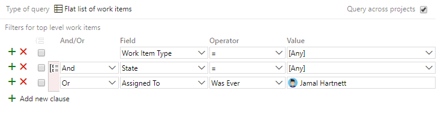
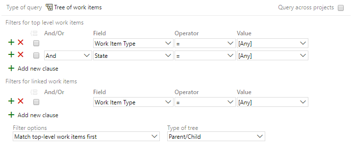
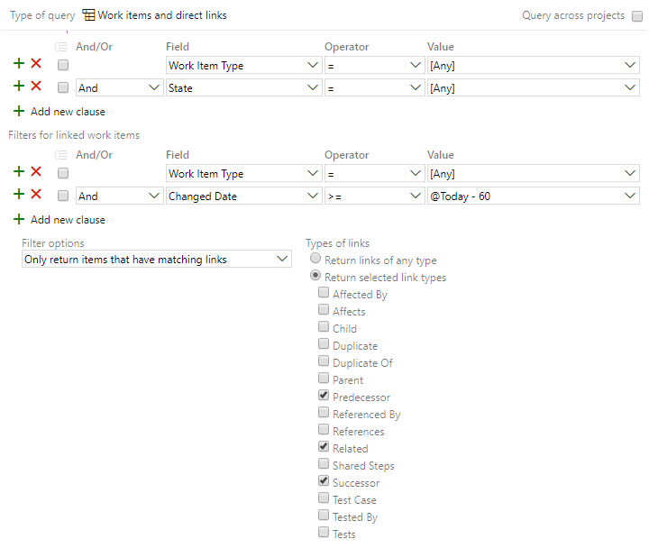

# Syntax for the Work Item Query Language (WIQL) 

[!INCLUDE [temp](../includes/version-all.md)]   

You can use the WIQL syntax to [define a query as a hyperlink](../../boards/queries/define-query-hyperlink.md) or when using the [Work Item Query Language (REST API)](/rest/api/azure/devops/wit/wiql).  

A query defined using the Work Item Query Language (WIQL) consists of a `SELECT` statement that lists the fields to be returned as columns in the result set. You can further qualify the result set by using a logical expression. You can specify a sort order. Use an `ASOF` clause to state that a query is evaluated as of a previous time.

> [!IMPORTANT] 
> The WIQL syntax is used to execute the [Query By Wiql REST API](/rest/api/azure/devops/wit/wiql/query%20by%20wiql). Currently, there is no way to call the API to return the detailed work item information from a WIQL query directly. No matter which fields you include in the SELECT statement, the API only returns the work item IDs. To get the full information, you need to perform  two steps: (1) get the ID of the work items from a WIQL, and (2) get the work items via [Get a list of work items by ID and for specific fields](/rest/api/azure/devops/wit/work-items/list). 

## Prerequisites

A query returns only those work items for which you have the **View work items** or **View work items in this node** permission. Typically, these permissions are granted to members of the **Readers** and **Contributors** groups for each team project. For more information, see [Permissions and groups](../../organizations/security/permissions.md).  


## Query language

The work item query language has five parts shown in the following syntax snippet and described in the following table. 

> [!div class="tabbedCodeSnippets"]
```WIQL
SELECT [State], [Title] 
FROM WorkItems
WHERE [Work Item Type] = 'User Story'
ORDER BY [State] Asc, [Changed Date] Desc
ASOF '6/15/2010'
```

The WIQL syntax is not case-sensitive.


> [!NOTE] 
> You can only construct queries using the WIQL syntax in the Query Editor by installing the [Wiql Editor Marketplace extension](https://marketplace.visualstudio.com/items?itemName=ottostreifel.wiql-editor). 

### Limits on WIQL length  

The WIQL length of queries made against Azure Boards must not exceed 32K characters. The system won't allow you to create or run queries that exceed that length.   

<table>
<tr>
<th width="15%">Clause</th>
<th width="85%">Example</th>
</tr>
<tbody valign="top">
<tr>
<td><code>SELECT</code></td>
<td>Identifies the fields to return for each work item returned by the query. You can specify either the friendly name or reference name. You must use square brackets ([]) if the name contains blanks or periods.</td>
</tr>
<tr>
<td><code>FROM</code></td>
<td>Indicates whether you want the query to find work items or links between work items.
<ul>
<li>Use <code>FROM WorkItems</code> to return work items.</li>  
<li>Use <code>FROM workItemLinks</code> to return links between work items. For more information, see <a href="#linked-work-items">Queries for links between work items</a> later in this article. </li> 
</ul>
</td>
</tr>
<tr>
<td><code>WHERE</code></td>
<td>Specifies the filter criteria for the query. For more information, see <a href="#where-clause">Filter conditions (WHERE)</a> in the next section. </td>
</tr>
<tr>
<td><code>ORDER BY</code></td>
<td>Specifies the sort order of the work items returned. You can specify Ascending (Asc) or Descending (Desc) for one or more fields. For example: <br/>
<code>ORDER BY [State] Asc, [Changed Date] Desc</code>
</td>
</tr>
<tr>
<td><code>ASOF</code></td>
<td>Specifies a historical query by indicating a date or point in time at which the filter is to be applied. For example, this query returns all user stories that existed on June 15, 2019.<br/>
<code>ASOF '6/15/2019'</code></td>
</tr>
</tbody>
</table>


<!---

> [!WARNING]  
> You can use a WorkItem that was returned by a query to get the value of a Field, even if the query did not return the value. If you do this, another round trip to the server will occur. For more information, see Performance Considerations.

-->


<a id="where-clause" />

## Filter conditions (WHERE)

The `WHERE` clause specifies the filter criteria. The query returns only work items that satisfy the specified criteria. For example, the following example `WHERE` clause returns user stories that are active and that are assigned to you.

> [!div class="tabbedCodeSnippets"]
```WIQL
WHERE [Work Item Type] = 'User Story'
AND [State] = 'Active'
AND [Assigned to] = @Me
```

You can control the order in which logical operators are evaluated by enclosing them within parentheses to group the filter criteria. For example, to return work items that are either assigned to you or that you closed, change the query filter to match the following example.

> [!div class="tabbedCodeSnippets"]
```WIQL
WHERE [Work Item Type] = 'User Story'
AND [State] = 'Active'
AND ( [Assigned to] = @Me
OR [Closed by] = @Me )
```


### Filter conditions

Each filter condition is composed of three parts, each of which must conform to the following rules: 

- **Field**: You can specify either the  reference name or friendly name. The following examples are valid WIQL syntax:
	-  Reference name with spaces: `SELECT [System.AssignedTo]  ...`
	-  Friendly name with spaces: `SELECT [Assigned To]  ...`
	-  Names without spaces don't require square brackets: `SELECT ID, Title  ...`
- **Comparison operator**: Valid values are specified in the [Operators](#operators) section later in this article.
	- 
- **Field value**: You can specify one of the following three values depending on the field specified.  
	- A *literal value* must match the data type of the field value. 
	- A *variable or macro* which indicates a certain value. For example, @Me indicates the person who is running the query. For more information, see [Macros and variables](#macros) later in this article.
	- The name of another *field*. For example, you can use `[Assigned to] = [Changed by]` to find work items that are assigned to the person who changed the work item most recently.

For a description and reference names of all system-defined fields, see [Work item field index](../work-items/guidance/work-item-field.md).


<a id="operators" />

### Operators 

Queries use logical expressions to qualify result sets. These logical expressions are formed by one or more conjoined operations.

Some simple query operations are listed below.

> [!div class="tabbedCodeSnippets"]
```WIQL
WHERE [System.AssignedTo] = 'joselugo'  
WHERE [Adatum.CustomMethodology.Severity] >= 2
```

The table below summarizes all the supported operators for different field types. For additional information on each field type, see [Work item fields and attributes](../work-items/work-item-fields.md).  

The `=, <>, >, <, >=, and <=` operators work as expected. For instance, `System.ID > 100` queries for all work items with an **ID** greater than 100. `System.ChangedDate > '1/1/19 12:00:00'` queries for all work items changed after noon of January 1, 2019.

Beyond these basic operators, there are some behaviors and operators specific to certain field types.

> [!NOTE]   
> The operators available to you depend on your platform and version. For more information, see [Query quick reference](query-index-quick-ref.md).


<table>
<tr>
<th width="20%">Field type</th>
<th width="80%">Supported operators</th>
</tr>
<tbody valign="top">

<tr>
<td>Boolean</td>
<td>
<code>= , <> , =[Field] , <>[Field]</code>
</td>
</tr>
<tr>
<td>DateTime</td>
<td>
<code>= , &lt;&gt; , &gt; , &lt; , &gt;= , &lt;= , =[Field], &lt;&gt;[Field], &gt;[Field], &lt;[Field], &gt;=[Field], &lt;=[Field], In, Not In, Was Ever</code>
</td>
</tr>
<tr>
<td>Double, GUID, Integer</td>
<td>
<code>= , <> , > , < , >= , <= , =[Field], <>[Field], >[Field], <[Field], >=[Field], <=[Field], In, Not In, Was Ever</code>
</td>
</tr>
<tr>
<td>Identity</td>
<td>
<code>= , &lt;&gt; , &gt; , &lt; , &gt;= , &lt;= , =[Field], &lt;&gt;[Field], &gt;[Field], &lt;[Field], &gt;=[Field], &lt;=[Field], Contains, Does Not Contain, In, Not In, In Group, Not In Group, Was Ever</code>
</td>
</tr>
<tr>
<td>PlainText</td>
<td>
<code>Contains Words, Does Not Contain Words, Is Empty, Is Not Empty</code>
</td>
</tr>
<tr>
<td>String</td>
<td>
<code>= , &lt;&gt; , &gt; , &lt; , &gt;= , &lt;= , =[Field], &lt;&gt;[Field], &gt;[Field], &lt;[Field], &gt;=[Field], &lt;=[Field], Contains, Does Not Contain, In, Not In, In Group, Not In Group, Was Ever</code>
</td>
</tr>
<tr>
<td>TreePath</td>
<td>
<code>=, &lt;&gt;, In, Not In, Under, Not Under</code>
</td>
</tr>
</tbody>
</table>


### Logical groupings 

You can use the terms `AND` and `OR` in the typical Boolean sense to evaluate two clauses. You can use the terms `AND EVER` and `OR EVER` when specifying a WAS EVER operator. You can group logical expressions and further conjoin them, as needed. Examples are shown below.  

> [!div class="tabbedCodeSnippets"]
```WIQL
WHERE [System.State] =  'Active' 
    AND [System.AssignedTo] = 'joselugo' 
	AND ([System.CreatedBy] = 'linaabola' 
    OR [Adatum.CustomMethodology.ResolvedBy] = 'jeffhay') 
    AND [System.State] = 'Closed'
    WHERE [System.State] = 'Active'
    AND [System.State] EVER 'Closed'
```

You can negate the `contains, under,` and `in` operators by using `not`. You can't negate the `ever` operator. The examples below query for all work items that are not classified within the sub-tree of 'MyProject\Feature1'.

> [!div class="tabbedCodeSnippets"]
```WIQL
WHERE [System.AreaPath] not under 'MyProject\Feature1'
WHERE [System.AssignedTo] ever 'joselugo'
```

#### Example query, Was Ever Assigned To

The WIQL syntax is shown next for the following query constructed through the Query Editor. This example finds all work items that were ever assigned to *Jamal Hartnett*. 

> [!div class="mx-imgBorder"]  
>    

> [!div class="tabbedCodeSnippets"]
```WIQL
SELECT
    [System.Id],
    [System.WorkItemType],
    [System.Title],
    [System.AssignedTo],
    [System.State],
    [System.Tags]
FROM workitems
WHERE
    [System.WorkItemType] <> ''
    AND (
        [System.State] <> ''
        OR EVER [System.AssignedTo] = 'Jamal Hartnett <fabrikamfiber4@hotmail.com>'
    )
ORDER BY [System.Id]
```


<a id="macros" />

## Macros or variables

The following table lists the macros or variables you can use within a WIQL query. 

::: moniker range=">= azure-devops-2019"


|  Macro       |       Usage        |
|---------|-----|
|  <strong>@Me</strong>   | Use this variable to automatically search for the current user's alias in a field that contains user aliases. For example, you can find work items that you opened if you set the **Field** column to **Activated By**, the **Operator** column to **=**, and the **Value** column to <strong>@Me</strong>.   |
|                                                 <strong>@CurrentIteration</strong>                                                  |                                                                                                                    Use this variable to automatically filter for work items assigned to the current sprint for the selected team based on the selected team context.                                                                                                                    |
|                                                      <strong>@Project</strong>                                                      |                                                  Use this variable to search for work items in the current project. For example, you can find all the work items in the current project if you set the **Field** column to **Team Project**, the **Operator** column to **=**, and the **Value** column to <strong>@Project</strong>.                                                   |
| <strong>@StartOfDay</strong><br/><strong>@StartOfWeek</strong><br/><strong>@StartOfMonth</strong><br/><strong>@StartOfYear</strong> |                    Use these macros to filter DateTime fields based on the start of the current day, week, month, year or an offset to one of these. For example, you can find all items created in the last 3 months if you set the **Field** column to **Created Date**, the **Operator** column to **&gt;=**, and the **Value** column to **@StartOfMonth - 3**.                     |
|                                                       <strong>@Today</strong>                                                       | Use this variable to search for work items that relate to the current date or to an earlier date. You can also modify the <strong>@Today</strong> variable by subtracting days. For example, you can find all items activated in the last week if you set the **Field** column to **Activated Date**, the **Operator** column to **&gt;=**, and the **Value** column to **@Today - 7**. |
|                                                              **[Any]**                                                              |                                                                                                                                       Use this variable to search for work items that relate to any value that is defined for a particular field.                                                                                                                                       |

::: moniker-end


::: moniker range="< azure-devops-2019"


|      Macro     |                 Usage   |
|-----------------|----------------|
|        <strong>@Me</strong>        |                                       Use this variable to automatically search for the current user's alias in a field that contains user aliases. For example, you can find work items that you opened if you set the **Field** column to **Activated By**, the **Operator** column to **=**, and the **Value** column to <strong>@Me</strong>.                                       |
| <strong>@CurrentIteration</strong> |                                                                                                                    Use this variable to automatically filter for work items assigned to the current sprint for the selected team based on the selected team context.                                                                                                                    |
|     <strong>@Project</strong>      |                                                  Use this variable to search for work items in the current project. For example, you can find all the work items in the current project if you set the **Field** column to **Team Project**, the **Operator** column to **=**, and the **Value** column to <strong>@Project</strong>.                                                   |
|      <strong>@Today</strong>       | Use this variable to search for work items that relate to the current date or to an earlier date. You can also modify the <strong>@Today</strong> variable by subtracting days. For example, you can find all items activated in the last week if you set the **Field** column to **Activated Date**, the **Operator** column to **&gt;=**, and the **Value** column to **@Today - 7**. |
|             **[Any]**              |                                                                                                                                       Use this variable to search for work items that relate to any value that is defined for a particular field.                                                                                                                                       |

::: moniker-end


> [!NOTE]  
> Both the `@me` and `@today` macros have default values.


### @me macro

The `@me` macro substitutes the Windows Integrated account name of the user who runs the query. The example below shows how to use the macro and the equivalent static statement. Although the macro is intended for fields such as `Assigned To`, you can use it for any String field, although the result may not be meaningful.

```WIQL
[System.AssignedTo] = @Me
[System.AssignedTo] = 'joselugo'
```

### @today macro 

You can use the `@today` macro with any <strong>DateTime</strong> field. This macro substitutes midnight of the current date on the local computer that runs the query. You can also specify `@today+x` or `@today-y` using integer offsets for x days after `@today` and y days before `@today`, respectively. Note that a query that uses the `@today` macro can return different result sets depending on the time zone in which it is run. 

The examples below assumes that today is 1/3/19.

```WIQL
[System.CreatedDate] = @today
```

is the equivalent of:

```WIQL
[System.CreatedDate] = '1/3/19'
```

and

```WIQL
[System.CreatedDate] > @today-2
```

is the equivalent of:

```WIQL
[System.CreatedDate] > '1/1/19'
```


<a id="start-of" />


::: moniker range=">= azure-devops-2019"

### @StartOfDay, @StartOfWeek, @StartOfMonth, @StartOfYear macros 

You can use the `@StartOf...` macros with any <strong>DateTime</strong> field. This macro substitutes midnight of the current day, start of week, start of month, or start of year on the local computer that runs the query. 

::: moniker-end

::: moniker range="azure-devops-2019"

> [!NOTE]   
> Requires Azure DevOps Server 2019 Update 1 or later version. 

::: moniker-end

::: moniker range=">= azure-devops-2019"

These macros accept a modifier string that has a format of `(+/-)nn(y|M|w|d|h|m)`. Similar to the `@Today` macro, you can specify plus or minus integer offsets. If the time unit qualifier is omitted, it defaults to the natural period of the function, e.g. `@StartOfWeek("+1")` is the same as `@StartOfWeek("+1w")`. If the plus/minus (+/-) sign is omitted, plus is assumed.

This syntax allows you to nest modifiers and offset your query twice. For example, the following clause filters work items that have been closed last year and three months into the start of the current year.  

```WIQL
[Microsoft.VSTS.Common.ClosedDate] >=@StartOfYear('+3M') - 1
```


The following examples assume that today is 4/5/19. 

```WIQL
[Microsoft.VSTS.Common.CreatedDate] >= @StartOfMonth-3
```

is the equivalent of:

```WIQL
[Microsoft.VSTS.Common.CreatedDate] >= '1/1/19'
```

and

```WIQL
[Microsoft.VSTS.Scheduling.TargetDate] > @StartOfYear
```

is the equivalent of:

```WIQL
[Microsoft.VSTS.Scheduling.TargetDate]  > '1/1/19'
```

::: moniker-end

[!INCLUDE [date-time-pattern](../includes/date-time-pattern.md)]

### Custom macros 

WIQL also supports arbitrary custom macros. Any string prefixed by an '@' is treated as a custom macro and will be substituted. The substitute value for the custom macro is retrieved from the context parameter of the query method in the object model. The following method is the API used for macros: 

```csharp
public WorkItemCollection Query(string wiql, IDictionary context)
```

The context parameter contains key-value pairs for macros. For example, if the context contains a key-value pair of (project, MyProject), then '@project' will be replaced by 'MyProject' in the WIQL. This is how the work item query builder handles the @project macro in Visual Studio.


## Historical queries (ASOF) 

You can use an `ASOF` clause in a query to filter for work items that satisfy the specified filter conditions as they were defined on a specific date and time.

> [!NOTE] 
> You can’t create `ASOF` queries in the query builder in Visual Studio. If you create a query file (.wiq) that includes an `ASOF` clause, and then load that in Visual Studio, the `ASOF` clause is ignored.

For example, suppose a work item was classified under an iteration path of MyProject\ProjArea and assigned to 'Mark Hanson' on 3/17/16. However, the work item was recently assigned to 'Roger Harui' and moved to a new iteration path of Release. The following example query will return this work item because the query is based on the state of work items as of a past date and time. 

```WIQL
SELECT [System.Title] 
    FROM workitems 
    WHERE ([System.IterationPath] = 'MyProject\ProjArea' and [System.AssignedTo] = 'Mark Hanson') 
    ASOF '3/16/16 12:30'
```

> [!NOTE]  
> If no time is specified, WIQL uses midnight. If no time zone is specified, WIQL uses the time zone of the local client computer.


## Sort results (ORDER BY) 

You can use the `ORDER BY` clause to sort the results of a query by one or more fields in ascending or descending order. 

>[!NOTE]  
>The sorting preferences of the SQL server on the data tier determine the default sort order. However, you can use the `asc` or `desc` parameters to choose an explicit sort order. 

The following example sorts work items first by **Priority** in ascending order, and then by **Created Date** in descending order.

```WIQL
SELECT [System.Title] 
    FROM workitems 
    WHERE [System.State] =  'Active' and [System.AssignedTo] =  'joselugo' 
    ORDER BY [Microsoft.VSTS.Common.Priority] asc, [System.CreatedDate] desc
```


<a id="linked-work-items" />

## Query for links between work items

To return links between work items, you specify `FROM WorkItemLinks`. Filter conditions in the `WHERE` clause may apply to the links or to any work item that is the source or the target of a link. For example, the following query returns the links between user stories and their active child nodes.


> [!div class="tabbedCodeSnippets"]
```WIQL
SELECT [System.Id]
FROM WorkItemLinks
WHERE ([Source].[System.WorkItemType] = 'User Story')
  AND ([System.Links.LinkType] = 'Child')
  AND ([Target].[System.State] = 'Active')
MODE (MustContain)
```

The following table summarizes the differences between work item queries and queries for links between work items. 


<table>
<tr>
<th width="10%">Clause</th>
<th width="28%">Work items</th>
<th width="62%">Links between work items</th>
</tr>
<tbody valign="top">
<tr>
<td><code>FROM</code></td>
<td><code>FROM WorkItems</code></td>
<td><code>FROM WorkItemLinks</code></td>
</tr>
<tr>
<td><code>WHERE</code></td>
<td><code>[FieldName] = Value</code></td>
<td><code>Specify one or more of the following:<br/>
<code>[Source].[FieldName] = Value</code><br/>
<code>[Target].[FieldName] = Value</code><br/>
<code>[System.Links.LinkType] = 'LinkName'</code> 
</td>
</tr>
<tr>
<td><code>MODE</code></td>
<td>not applicable</td>
<td>Specify one of the following:<br/>
<ul>
<li><code>MODE (MustContain)</code>: (Default) Returns only WorkItemLinkInfo records where the source, target, and link criteria are all satisfied. </li>
<li><code>MODE (MayContain)</code>: Returns WorkItemLinkInfo records for all work items that satisfy the source and link criteria, even if no linked work item satisfies the target criteria.</li>
<li><code>MODE (DoesNotContain)</code>: Returns WorkItemLinkInfo records for all work items that satisfy the source, only if no linked work item satisfies the link and target criteria.
<li><code>MODE (Recursive)</code>: Use for Tree queries(`[System.Links.LinkType] = 'System.LinkTypes.Hierarchy-Forward'`). Link type must be Tree topology and forward direction. Returns WorkItemLinkInfo records for all work items that satisfy the source, recursively for target.  `ORDER BY` and `ASOF` aren't compatible with tree queries.</li>
</ul>
</td>
</tr>
<tr>
<td><code>RETURNS</code></td>
<td><a href="/rest/api/azure/devops/wit/wiql/query%20by%20wiql#workitemqueryresult"><code>WorkItemQueryResult</code></a> </td>
<td> <a href="/rest/api/azure/devops/wit/wiql/query%20by%20wiql#workitemlink"><code>WorkItemLink</code></a> 
</td>
</tr>
</tbody>
</table>


::: moniker range="azure-devops"
You can specify one of the following system link type names.  
::: moniker-end

::: moniker range="< azure-devops"
You can specify one of the system link type names, listed below, or [a custom link type you've defined with the On-premises XML process](../../reference/xml/link-type-element-reference.md). 
::: moniker-end

- `System.LinkTypes.Hierarchy-Forward`
- `System.LinkTypes.Related`
- `System.LinkTypes.Dependency-Predecessor`
- `System.LinkTypes.Dependency-Successor`
- `Microsoft.VSTS.Common.Affects-Forward` (CMMI process)

For additional information, see [Link type reference](link-type-reference.md). 

### Tree type query example

The following query returns all work item types define in the current project. The query as shown in the Query Editor appears as shown in the following image. 

> [!div class="mx-imgBorder"]  
>    

The equivalent WIQL syntax is shown below. 

> [!div class="tabbedCodeSnippets"]
```WIQL
SELECT
    [System.Id],
    [System.WorkItemType],
    [System.Title],
    [System.AssignedTo],
    [System.State],
    [System.Tags]
FROM workitemLinks
WHERE
    (
        [Source].[System.TeamProject] = @project
        AND [Source].[System.WorkItemType] <> ''
        AND [Source].[System.State] <> ''
    )
    AND (
        [System.Links.LinkType] = 'System.LinkTypes.Hierarchy-Forward'
    )
    AND (
        [Target].[System.TeamProject] = @project
        AND [Target].[System.WorkItemType] <> ''
    )
MODE (Recursive)
```

### Direct-link query example

The following query returns all work item types define in the current project. The query as shown in the Query Editor appears as shown in the following image. 

> [!div class="mx-imgBorder"]  
>    


The equivalent WIQL syntax is as shown. 

> [!div class="tabbedCodeSnippets"]
```WIQL
SELECT
    [System.Id],
    [System.WorkItemType],
    [System.Title],
    [System.AssignedTo],
    [System.State],
    [System.Tags]
FROM workitemLinks
WHERE
    (
        [Source].[System.TeamProject] = @project
        AND [Source].[System.WorkItemType] <> ''
        AND [Source].[System.State] <> ''
    )
    AND (
        [System.Links.LinkType] = 'System.LinkTypes.Dependency-Reverse'
        OR [System.Links.LinkType] = 'System.LinkTypes.Related-Forward'
        OR [System.Links.LinkType] = 'System.LinkTypes.Dependency-Forward'
    )
    AND (
        [Target].[System.TeamProject] = @project
        AND [Target].[System.WorkItemType] <> ''
        AND [Target].[System.ChangedDate] >= @today - 60
    )
ORDER BY [System.Id]
MODE (MustContain)
```


## Additional example queries 

The following typical WIQL query example uses reference names for the fields. The query selects work items (no work item type specified) with a **Priority=1**. The query returns the **ID** and **Title** of the return set as columns. The results are sorted by **ID** in ascending order.

> [!div class="tabbedCodeSnippets"]
```WIQL
SELECT System.ID, System.Title 
FROM workitems 
WHERE Priority=1 
ORDER BY System.ID asc
```

### Date-time pattern

You specify the date-time pattern according to one of two patterns: 
- The Date Pattern and Time Pattern you set under your personal profile settings ([Set personal preferences](../../organizations/settings/set-your-preferences.md)).
- The pattern specified by UTC which follows this pattern (with Z appended to the date-time):  

`AND System.ChangedDate >= '1/1/2019 00:00:00Z'`


### Example clauses

The following example statements show specific qualifying clauses.

<table width="80%">
<tbody valign="top">
<tr>
<th width="10%">Clause</th>
<th width="90%">Example</th>
</tr>
<tr>
<td><code>AND</code></td>
<td>
<pre><code>SELECT [System.Id], [System.Title]
   FROM WorkItems
   WHERE [System.TeamProject] = @project
   AND [System.AssignedTo] = 'Judy Lew'
</code></pre>
</td>
</tr>
<tr>
<td><code>OR</code></td>
<td>
<pre><code>SELECT [System.Id], [System.Title] 
   FROM WorkItems 
   WHERE [System.TeamProject] = @project 
   AND ( [System.AssignedTo] = 'Mark Steele'
   OR [System.AssignedTo] = 'Merav Sror' )
</code></pre>
</td>
</tr>
<tr>
<td><code>NOT</code></td>
<td>
<pre><code>SELECT [System.Id], [System.Title] 
   FROM WorkItems 
   WHERE [System.TeamProject] = @project 
   AND [System.AssignedTo] EVER 'Anne Wallace'
   AND [System.AssignedTo] NOT CONTAINS 'Danny Levin'
</code></pre>
</td>
</tr>
<tr>
<td><code>EVER</code></td>
<td>
<pre><code>SELECT [System.Id], [System.Title] 
   FROM WorkItems 
   WHERE [System.TeamProject] = @project 
   AND [System.AssignedTo] EVER 'Anne Wallace'
</code></pre>
</td>
</tr>
<tr>
<td><code>UNDER</code></td>
<td>
<pre><code>SELECT [System.Id], [System.Title] 
   FROM WorkItems 
   WHERE [System.TeamProject] = @project 
   AND [System.AssignedTo] EVER 'David Galvin'
   AND [System.AreaPath] UNDER 'Agile1\Area 0'
</code></pre>
</td>
</tr>
<tr>
<td><code>ORDER BY</code></td>
<td>
<pre><code>SELECT [System.Id], [System.Title] 
   FROM WorkItems 
   WHERE [System.TeamProject] = @project 
   AND [System.AssignedTo] = 'Jon Ganio'
   ORDER BY [System.Id] [asc | desc]
</code></pre>
</td>
</tr>
<tr>
<td><code>ASOF</code> (Time filter) </td>
<td>
<pre><code>SELECT [System.Title] 
   FROM workitems 
   WHERE [System.IterationPath] = 'MyProject\Beta' 
   AND [System.AssignedTo] = 'Jim Daly' 
   ASOF '3/16/19 12:30'
</code></pre>
</td>
</tr>


</tbody>
</table>


### DateTime

You must quote (single or double quotes are supported) DateTime literals used in comparisons. They must be in the .NET DateTime format of the local client computer running the query. Unless a time zone is specified, DateTime literals are in the time zone of the local computer.

```WIQL
WHERE [Adatum.Lite.ResolvedDate] >= '1/8/19 GMT' and [Resolved Date/Time] < '1/9/19 GMT'
WHERE [Resolved Date] >= '1/8/19 14:30:01'
```
When the time is omitted in a DateTime literal and the dayPrecision parameter equals false, the time is assumed to be zero (midnight). The default setting for the dayPrecision parameter is false.

### String and PlainText

You must quote string literals (single or double quotes are supported) in a comparison with a string or plain text field. String literals support all Unicode characters.

```WIQL
WHERE [Adatum.Lite.Blocking] = 'Not Blocking'
WHERE [Adatum.Lite.Blocking] <> 'Blocked'
```

You can use the contains operator to search for a substring anywhere in the field value. 

```WIQL
WHERE [System.Description] contains 'WIQL' 
```

### Area and Iteration (TreePath) 

You can use the `UNDER` operator for the Area and Iteration Path fields. The `UNDER` operator evaluates whether a value is within the sub-tree of a specific classification node. For instance, the expression below would evaluate to true if the Area Path were 'MyProject\Server\Administration', 'MyProject\Server\Administration\Feature 1', 'MyProject\Server\Administration\Feature 2\SubFeature 5', or any other node within the sub-tree.

```WIQL
WHERE [System.AreaPath] UNDER 'MyProject\Server\Administration'
```

### Modifiers and special operators

You can use some modifiers and special operators in a query expression.

Use the `IN` operator to evaluate whether a field value is equal to any of a set of values. This operator is supported for the String, Integer, Double, and DateTime field types. See the following example along with its semantic equivalent.

```WIQL
WHERE [System.CreatedBy] IN ('joselugo', 'jeffhay', 'linaabola')
WHERE [System.CreatedBy] = 'joselugo' OR [System.CreatedBy] = 'jeffhay' OR [System.CreatedBy] = 'linaabola'
```

The `EVER` operator is used to evaluate whether a field value equals or has ever equaled a particular value throughout all past revisions of work items. The String, Integer, Double, and DateTime field types support this operator. There are alternate syntaxes for the `EVER` operator. For example, the snippets below query whether all work items were ever assigned to 'joselugo'.

```WIQL
WHERE EVER ([Assigned To] =  'joselugo')
WHERE [Assigned To] EVER 'joselugo'
```


## Related articles 

- [Query fields, operators, values, and variables](query-operators-variables.md)  
- [Work item fields and attributes](../work-items/work-item-fields.md) 
- [About managed queries](about-managed-queries.md)  
- [Cross-service and enhanced query operations](query-support-integration-cross-service-extensions.md)
- [Define a query](using-queries.md)      


<!---
https://msdn.microsoft.com/library/bb130306.aspx
-->
