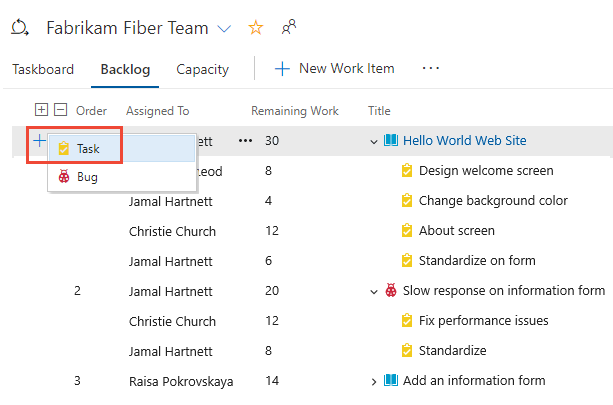
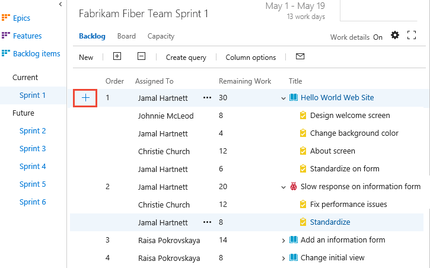
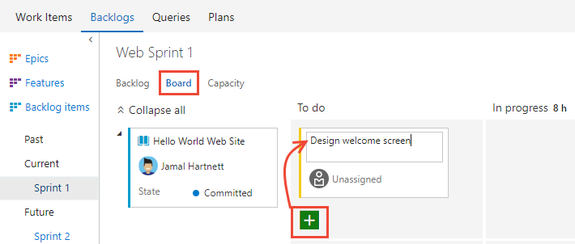
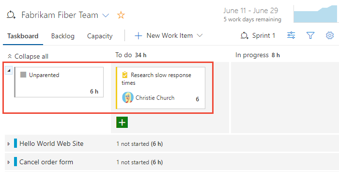

# 2. Add tasks to backlog items 

[!INCLUDE [temp](../_shared/version-vsts-tfs-all-versions.md)] 

You add tasks to backlog items when you want to track the work required to implement them and to estimate the work assigned to individual team members and the team. The capacity tool tells you how much work your team can commit to. However, to compare capacity with actually planned work, you need to define and estimate tasks for each backlog item.

In this article you'll learn how to:  

> [!div class="checklist"]
> * Select a sprint backlog for a team
> * Add tasks to backlog items from the sprint backlog or taskboard
> * Estimate work, set *Remaining Work*  

<!---Address how to parent unparented items --> 

Add as many tasks as needed to capture the work required to complete each item. Tasks can represent different work to be performed - such as design, code, test, content, sign off. Usually, each team member adds their own tasks and sets estimates for the work. However, a development lead could define the initial tasks for a story or requirement.

[!INCLUDE [temp](../_shared/prerequisites.md)]

## Open a Sprint backlog for a team 

::: moniker range=">= azure-devops-2019"

0. From your web browser, open your team's sprint backlog. (1) Check that you have selected the right project, (2) choose **Boards>Sprints**, (3) select the correct team from the team selector menu, and lastly (4), choose **Backlog**. 

	

	To choose another team, open the selector and select a different team or choose the  **Browse all sprints** option. Or, you can enter a keyword in the search box to filter the list of team backlogs for the project.

	> [!div class="mx-imgBorder"]  
	>  

0. To choose a different sprint than the one shown, open the sprint selector and choose the sprint you want. 

	> [!div class="mx-imgBorder"]  
	> 

	The system lists only those sprints that have been selected for the current team focus. If you don't see the sprints you want listed, then choose **New Sprint** from the menu, and then choose **Select existing iteration**. For details, see [Define iteration paths (aka sprints)](../../organizations/settings/set-iteration-paths-sprints.md). 

::: moniker-end

::: moniker range=">= tfs-2013 <= tfs-2018"

0. From your web browser, open your team's sprint backlog. (1) Select the team from the project/team selector, choose (2) **Work**, (3) **Backlogs**, and then (4) the product backlog, which is **Backlog items** (for Scrum), **Stories** (for Agile), or **Requirements** (for CMMI). 

	> [!div class="mx-imgBorder"]
	>  

	To choose another team, open the project/team selector and select a different team or choose the **Browse** option. 

	> [!div class="mx-imgBorder"]  
	>  

	The set of sprints selected for your team appears in the left pane. If you don't see any sprints listed, you can add sprints or select existing sprints for your team's use. To learn how, see [Define sprints](define-sprints.md). 

0. Choose the sprint you want to plan. 

	> [!div class="mx-imgBorder"]  
	> 

	The system lists only those sprints that have been selected for the current team focus. If you don't see the sprints you want listed, then see [Define iteration paths (aka sprints)](../../organizations/settings/set-iteration-paths-sprints.md). 

::: moniker-end

<a id="define-tasks" />
## Add tasks to backlog items

If you haven't yet assigned backlog items to your sprint, [do that now](assign-work-sprint.md). Also, you'll want to have [set the start and end dates for your sprint](define-sprints.md#quick-start-schedule). 

For each sprint backlog item, add a task. Adding tasks from the sprint backlog or board automatically links the task to its parent backlog item. 

> [!TIP]    
> You can quickly add several tasks on the taskboard by simply entering a title. You can then later bulk edit items to assign them or add additional details. You can also enter *Remaining Work* onto the card by making sure you [add that field to display on the taskboard](../../boards/boards/customize-cards.md#task-board). 

::: moniker range=">= azure-devops-2019"

You can add tasks from the sprint **Backlog** or **Taskboard**. 

From the **Backlog** view, choose the plus sign to open the work item form for a task.

> [!div class="mx-imgBorder"]
> 

Fill out the form as described in the next section. 

Another option, is to open the **Taskboard**, and add tasks as cards. Simply click the  plus icon, enter a title for the item, and then press Enter on your keyboard.   

> [!div class="mx-imgBorder"]
> 

> [!TIP]    
> You can quickly add tasks through the Taskboard by just specifying the title of the work item. To show fields on the card, see [Customize cards](../../boards/boards/customize-cards.md#task-board).   

::: moniker-end

::: moniker range=">= tfs-2013 <= tfs-2018"

You can add tasks from the sprint **Backlog** or **Board** (aka taskboard). 

From the **Backlog** view, choose the  plus icon to add a new task.  

> [!div class="mx-imgBorder"]
> 

Fill out the form as described in the next section. 

Another option, is to open the **Board**, and add tasks as cards. Simply click the  plus icon, enter a title for the item, and then press Enter on your keyboard.    

> [!div class="mx-imgBorder"]
> 

> [!TIP]    
> You can quickly add tasks through the Board by just specifying the title of the work item. To show fields on the card, see [Customize cards](../../boards/boards/customize-cards.md#task-board).  

::: moniker-end

## Fill out the task form 

Name the task and enter an estimate for *Remaining Work*. Also, if you know who'll perform the work, go ahead and assign the task to that team member.  

::: moniker range=">= azure-devops-2019"
> [!div class="mx-imgBorder"]  
> 
::: moniker-end	
::: moniker range=">= tfs-2017 <= tfs-2018"
<a id="task-form-team-services" /> 
<!--- Task form, new form -->
  
::: moniker-end
::: moniker range=">= tfs-2013 <= tfs-2015"
<a id="task-form-tfs-2015-13" /> 
<!--- Task form, old form -->

  	
::: moniker-end

At the planning stage, *Remaining Work* corresponds to an estimate of how long it will take to complete the task.  

A good rule of thumb is to size tasks to take no more than a day to complete. If a task is too large, the team should break it down. In some cases, you may not be able to estimate some tasks effectively until other tasks have been completed. Create the task now, but estimate it when you have enough information.  

During the sprint, team members update remaining work to continually reflect the time required to complete the task. This value can actually increase after work begins. For example, after working 4 hours on a task that was estimated to take 8 hours, the team member realizes he needs 16 hours over what he estimated. He would update the *Remaining Work* field with 20 (8-4+16).  As you perform a task, you might find that more time is required. Always update the task with your best estimate of remaining work. That way, you help accurately reflect the total amount of work remaining in the sprint.  

<table>
<thead>
<tr>
<th width="20%">Field</th>
<th width="80%">Usage</th>
</tr>
</thead>
<tbody valign="top">
<tr>
	<td>
[Original Estimate](../queries/query-numeric.md)
</td>
	<td>
The amount of estimated work required to complete a task. Typically, this field doesn't change after it is assigned.

You can specify work in hours or in days. There are no inherent time units associated with this field.

</td>
</tr>
<tr>
	<td width="18%">
[Remaining Work](../queries/query-numeric.md)
</td>
	<td>
The amount of work remaining to complete a task. As work progresses, update this field. It's used to calculate [capacity charts](set-capacity.md) and the [sprint burndown chart](sprint-burndown.md)You can specify work in any unit of measurement your team chooses.
</td></tr>
<tr>
	<td>
[Completed Work](../queries/query-numeric.md) 
</td>
	<td>
The amount of work spent implementing a task.
</td></tr>
<tr>
	<td>
[Activity](../queries/query-numeric.md) 
</td>
	<td>
Select the type of activity this task represents when your team estimates sprint capacity by activity.
</td></tr>
</tbody>
</table>  

## Unparented tasks

Tasks without links to parent backlog items or user stories appear at the top of the taskboard. You can track unparented tasks in similar ways to other tasks, or drag them to an existing backlog item to parent them. The Unparented card tracks the total of remaining work defined for all unparented tasks, however, it isn't associated with any work item.

::: moniker range=">= azure-devops-2019"
> [!div class="mx-imgBorder"]  
>  
::: moniker-end

::: moniker range=">= tfs-2013 <= tfs-2018"

::: moniker-end

## Try this next
> [!div class="nextstepaction"]
> [3. Set sprint capacity](set-capacity.md) 

