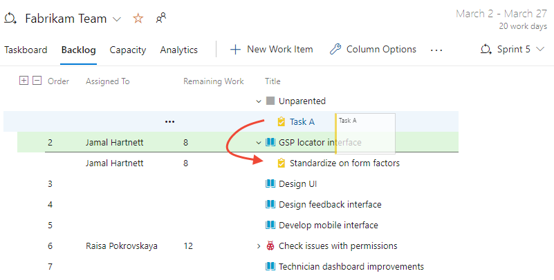
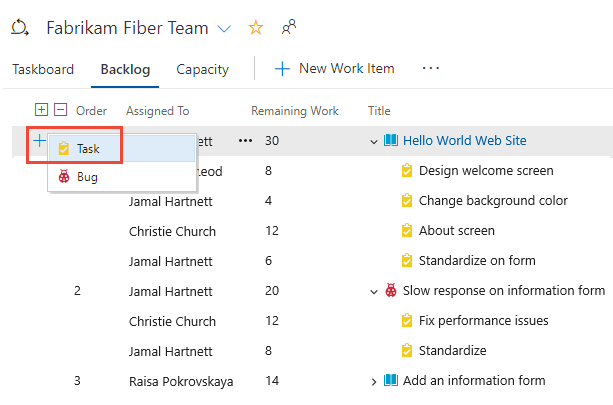
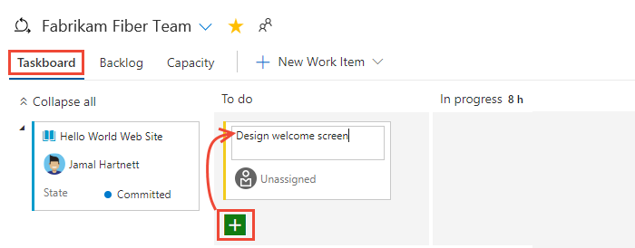
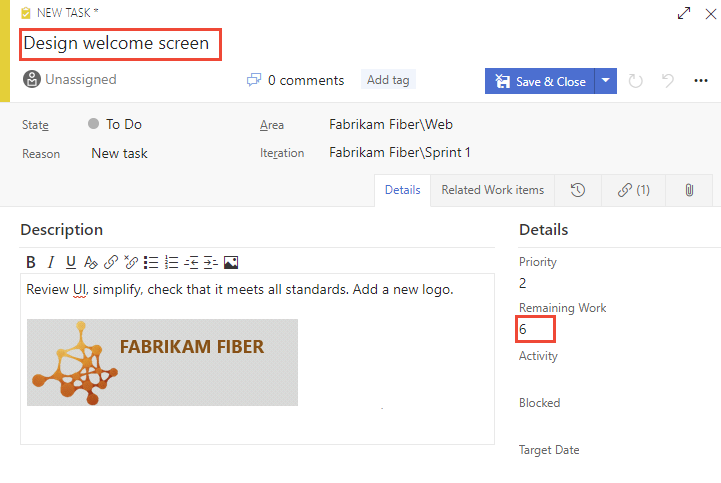
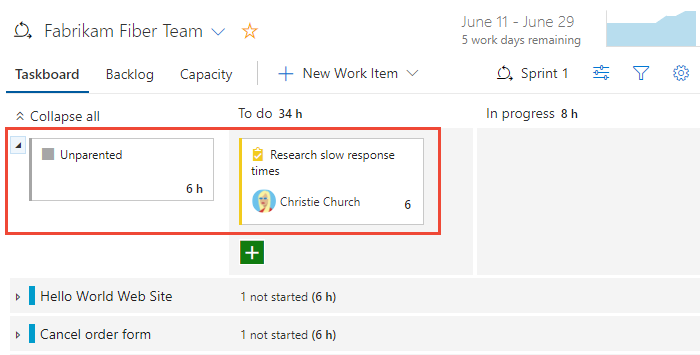

# Add tasks to backlog items for sprint planning

[!INCLUDE [version-lt-eq-azure-devops](../../includes/version-lt-eq-azure-devops.md)] 

Add tasks to backlog items to track the work needed to complete them and to estimate effort per team member. The [capacity tool](set-capacity.md) shows how much work the team can commit to — defining and estimating tasks for each backlog item lets you compare capacity with planned work.

- Add as many tasks as needed to capture design, coding, testing, content, or sign-off work.
- Team members typically add their own tasks and estimates, though a lead can define the initial set.

[!INCLUDE [ai-assistance-mcp-server-tip](../../includes/ai-assistance-mcp-server-tip.md)]

## Prerequisites

[!INCLUDE [temp](../includes/prerequisites.md)]

## Open a sprint backlog for a team 

1. From your project, select **Boards** > **Sprints**, select your team, and then select **Backlog**.

    > [!div class="mx-imgBorder"]  
    > 

    To switch teams, open the team selector and choose a different team, or select the :::image type="icon" source="../../media/icons/home-icon.png" border="false"::: **Browse all sprints** option. You can also enter a keyword to filter the list.

    > [!div class="mx-imgBorder"]  
    >  

1. To switch sprints, open the sprint selector and choose the sprint you want.

    > [!div class="mx-imgBorder"]  
    > 

    Only sprints selected for the current team appear. If the sprint you need isn't listed, select **New Sprint** > **Select existing iteration**. For more information, see [Define iteration (sprint) paths](../../organizations/settings/set-iteration-paths-sprints.md).

## Add existing work items to a sprint

If you don't have any work items assigned to a sprint, see [1. Assign backlog items to a sprint](assign-work-sprint.md).

If work items don't appear in your sprint backlog, check that:
- The **Area Path** matches one of the areas assigned to the team.
- The **Iteration Path** matches the sprint you selected.

For more information, see [Define Iteration Paths and configure team iterations](../../organizations/settings/set-iteration-paths-sprints.md). 
 
If tasks don't appear as children of a backlog item, you can reparent them. Unparented tasks appear at the top of the backlog under the **Unparented** group — drag the task onto the work item you want to parent it to.

> [!div class="mx-imgBorder"]
> 

## Add tasks to backlog items

Before you start, ensure you [assigned backlog items to your sprint](assign-work-sprint.md) and [set the sprint dates](define-sprints.md#quick-start-schedule).

Add a task for each backlog item. Tasks added from the sprint backlog or board are automatically linked to their parent backlog item and assigned to the sprint's **Iteration Path**.

> [!TIP]    
> To add tasks quickly, enter just the title on the taskboard and bulk edit later to assign them or add estimates. To show *Remaining Work* on the card, see [Customize a sprint Taskboard](customize-taskboard.md).

**From the Backlog** — Select the plus sign next to a backlog item to open the task form.

> [!div class="mx-imgBorder"]
> 

**From the Taskboard** — Select the :::image type="icon" source="../../media/icons/add-icon.png" border="false"::: plus icon, enter a title, and press Enter.

> [!div class="mx-imgBorder"]
> 

To filter sprint views, select **Filter** :::image type="icon" source="../../media/icons/filter-icon.png" border="false"::: and specify a keyword, field value, or tag. For more information, see [Interactively filter backlogs, boards, queries, and plans](../backlogs/filter-backlogs-boards-plans.md).

## Complete the task form 

Enter the task name, an estimate for *Remaining Work*, and optionally assign the task to a team member.

> [!div class="mx-imgBorder"]  
> 

Size tasks to take no more than a day. If a task is too large, break it down. If you can't estimate a task yet, create it now and add the estimate later.

During the sprint, update *Remaining Work* to reflect actual time needed. This value can increase — for example, if you estimated 8 hours, worked 4, and then realize you need 16 more, update the field to 20 (8-4+16). Accurate updates keep the [sprint burndown chart](../../report/dashboards/configure-sprint-burndown.md) reliable.

:::row:::
   :::column span="1":::
   **Field**
   :::column-end:::
   :::column span="3":::
   **Usage**
   :::column-end:::
:::row-end:::
---
:::row:::
   :::column span="1":::
   [Original Estimate](../queries/query-numeric.md)

   :::column-end:::
   :::column span="3":::
   The amount of approximate work required to complete a task. Typically, this field doesn't change after it's set. You can specify work in hours or days — no inherent time unit is associated with this field.

   :::column-end:::
:::row-end:::
:::row:::
   :::column span="1":::
   [Remaining Work](../queries/query-numeric.md)

   :::column-end:::
   :::column span="3":::
   The amount of work remaining to complete a task. As work progresses, update this field. It's used to calculate [capacity charts](set-capacity.md) and the [sprint burndown chart](../../report/dashboards/configure-sprint-burndown.md). You can specify work in any unit of measurement your team chooses.

   :::column-end:::
:::row-end:::
:::row:::
   :::column span="1":::
   [Completed Work](../queries/query-numeric.md) 

   :::column-end:::
   :::column span="3":::
   The amount of work spent implementing a task.

   :::column-end:::
:::row-end:::
:::row:::
   :::column span="1":::
   [Activity](../queries/query-numeric.md) 

   :::column-end:::
   :::column span="3":::
   Select the type of activity this task represents when your team plans sprint capacity by activity.

   :::column-end:::
:::row-end:::

## Unparented tasks

Tasks without a parent backlog item appear at the top of the Taskboard. You can track them like other tasks or drag them onto a backlog item to parent them. The unparented card shows the total remaining work for all unparented tasks but isn't associated with a work item.

> [!div class="mx-imgBorder"]  
>  

## Unparent a work item

To remove a task's parent association:

1. On the **Taskboard**, select the task card to open its details.
1. In the **Links** section, find the parent link and select **Remove** (trash can icon).
1. Save the work item.

The task moves to the **Unparented** group at the top of the Taskboard.

> [!TIP]
> To unparent multiple tasks at once, use **Bulk edit** — select the tasks, choose **Edit**, and remove the parent links.

## Use AI to add and manage sprint tasks

If you have the [Azure Boards MCP Server](../../mcp-server/mcp-server-overview.md) connected to your AI agent in agent mode, you can use natural language prompts to create and manage sprint tasks.

| Task | Example prompt |
|------|----------------|
| Add tasks to a user story | `Add three tasks (Design, Implement, Test) to user story #1234 and set remaining work to 4 hours each` |
| Create tasks in bulk | `For each active user story in Sprint 12, add a Code Review task assigned to <me> with 2 hours remaining work` |
| List sprint tasks | `List all tasks in Sprint 12 for <Contoso Team> grouped by parent work item` |
| Update task estimates | `Set remaining work to 0 for all completed tasks in Sprint 11 in project <Contoso>` |
| Identify missing tasks | `Which user stories in Sprint 12 have no child tasks yet? List them so I can add tasks` |
| Rebalance task assignments | `Show total remaining work per team member in Sprint 12 and suggest which tasks to reassign to balance the load` |
| Find overloaded stories | `List user stories in the current sprint where total child task hours exceed 16 hours` |
| Track incomplete tasks from last sprint | `Find all tasks in Sprint 11 that are still active or in progress and move them to Sprint 12` |
| Generate a task breakdown | `Break user story #2045 into tasks for front-end, back-end, unit testing, and documentation with 4-hour estimates each` |
| Audit task completion | `Show me tasks in Sprint 12 where the state is Active but remaining work is 0, so I can verify if they should be closed` |

> [!NOTE]
> Agent mode and the MCP Server use natural language, so you can adjust these prompts or ask follow-up questions to refine the results.

## Next step

> [!div class="nextstepaction"]
> [3. Set sprint capacity](set-capacity.md)

## Related content

- [Assign backlog items to a sprint](assign-work-sprint.md)  
- [Create and manage your backlog](../backlogs/create-your-backlog.md)  
- [Define iteration (sprint) paths and configure team iterations](../../organizations/settings/set-iteration-paths-sprints.md)   
- [Interactively filter backlogs, boards, queries, and plans](../backlogs/filter-backlogs-boards-plans.md)
