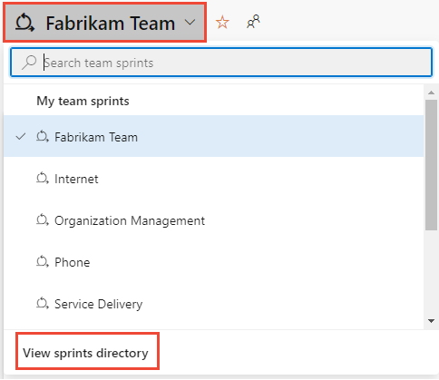

# Add tasks to backlog items for sprint planning

[!INCLUDE [version-lt-eq-azure-devops](../../includes/version-lt-eq-azure-devops.md)] 

Adding tasks to backlog items is essential for tracking the work required to implement them. Tasks also help estimate the effort assigned to individual team members and the team as a whole. The capacity tool indicates how much work your team can commit to. To effectively compare capacity with planned work, define and estimate tasks for each backlog item.

- **Define comprehensive tasks:**
  - Add as many tasks as needed to capture all aspects of completing each backlog item.
  - Tasks can represent various activities such as design, coding, testing, content creation, or sign-offs.

- **Assign and estimate effort:**
  - **Individual tasks:** Team members typically add their own tasks and set estimates for their workload.
  - **Initial tasks:** Alternatively, a development lead can define the initial tasks for a story or requirement.

When you add and manage tasks, your team gains a clear understanding of the importance and required effort for each item. This action ensures better workload distribution and project planning.

[!INCLUDE [temp](../includes/prerequisites.md)]

## Open a sprint backlog for a team 

::: moniker range=">= azure-devops-2020"

1. From your web browser, open your team's sprint backlog. (1) Check that you selected the right project, (2) choose **Boards>Sprints**, (3) select the correct team from the team selector menu, and lastly (4), choose **Backlog**. 

    > [!div class="mx-imgBorder"]  
    > 

    To choose another team, open the selector and select a different team or choose the :::image type="icon" source="../../media/icons/home-icon.png" border="false"::: **Browse all sprints** option. Or, you can enter a keyword in the search box to filter the list of team backlogs for the project.

    > [!div class="mx-imgBorder"]  
    >  

2. To choose a different sprint than the one shown, open the sprint selector and choose the sprint you want. 

    > [!div class="mx-imgBorder"]  
    > 

    The system lists only those sprints selected for the current team focus. If you don't see the sprints you want listed, then choose **New Sprint** from the menu, and then choose **Select existing iteration**. For more information, see [Define iteration (sprint) paths](../../organizations/settings/set-iteration-paths-sprints.md). 

::: moniker-end

::: moniker range="azure-devops-2019"

1. From your web browser, open your team's sprint backlog. (1) Check that you selected the right project, (2) choose **Boards>Sprints**, (3) select the correct team from the team selector menu, and lastly (4), choose **Backlog**. 

    

    To choose another team, open the selector and select a different team or choose the :::image type="icon" source="../../media/icons/home-icon.png" border="false"::: **Browse all sprints** option. Or, you can enter a keyword in the search box to filter the list of team backlogs for the project.

    > [!div class="mx-imgBorder"]  
    >  

2. To choose a different sprint than the one shown, open the sprint selector and choose the sprint you want. 

    > [!div class="mx-imgBorder"]  
    > 

    The system lists only those sprints selected for the current team focus. If you don't see the sprints you want listed, then choose **New Sprint** from the menu, and then choose **Select existing iteration**. For more information, see [Define iteration (sprint) paths](../../organizations/settings/set-iteration-paths-sprints.md). 

::: moniker-end

## Add existing work items to a sprint

If you don't have any work items assigned to a sprint, see [1. Assign backlog items to a sprint](assign-work-sprint.md).

If you added work items and they don't appear in your sprint backlog, check their area and iteration paths. 
- The Area Path must match one of the areas assigned to the team
- The Iteration Path must match the iteration of the sprint that you selected. 

For details on assigning iteration paths to teams, see [Define Iteration Paths and configure team iterations](../../organizations/settings/set-iteration-paths-sprints.md). 
 
If you added task work items, but they don't appear as a child of a product backlog item, you can parent them from the sprint backlog.  

Unparented tasks assigned to the selected sprint appear at the top of the backlog under the Unparented group. Drag and drop the task on top of the work item you want to parent it to. 

> [!div class="mx-imgBorder"]
> 

## Add tasks to backlog items

If you don't have any backlog items assigned to your sprint, [do that now](assign-work-sprint.md). Also, [set the start and end dates for your sprint](define-sprints.md#quick-start-schedule). 

For each sprint backlog item, add a task. Adding tasks from the sprint backlog or board automatically links the task to its parent backlog item. 

> [!TIP]    
> You can quickly add several tasks on the taskboard by simply entering a title. You can then later bulk edit items to assign them or add additional details. You can also enter *Remaining Work* onto the card by making sure you [add that field to display on the taskboard](customize-taskboard.md). 

You can add tasks from the sprint **Backlog** or **Taskboard**. All items you add automatically get assigned to the **Iteration Path** of the selected sprint.

From the **Backlog** view, choose the plus sign to open the work item form for a task.

> [!div class="mx-imgBorder"]
> 

Complete the form as described in the next section. 

Another option is to open the **Taskboard**, and add tasks as cards. Select the :::image type="icon" source="../../media/icons/add-icon.png" border="false"::: plus icon, enter a title for the item, and then press Enter on your keyboard.   

> [!div class="mx-imgBorder"]
> 

> [!TIP]    
> You can quickly add tasks through the **Taskboard** by just specifying the title of the work item. To show fields on the card, see [Customize a sprint Taskboard](customize-taskboard.md).   

To interactively filter sprint views, choose **Filter** :::image type="icon" source="../../media/icons/filter-icon.png" border="false":::, and then specify a keyword or select a value for a field or tag. For more information, see [Interactively filter backlogs, boards, queries, and plans](../backlogs/filter-backlogs-boards-plans.md).

## Complete the task form 

Name the task and enter an estimate for *Remaining Work*. Also, if you know who's doing the work, assign the task to that team member.  

> [!div class="mx-imgBorder"]  
> 

At the planning stage, *Remaining Work* corresponds to an estimate of how long it takes to complete the task.  

A good rule of thumb is to size tasks to take no more than a day to complete. If a task is too large, the team should break it down. In some cases, you might not estimate some tasks effectively until other tasks get completed. Create the task now, but estimate it when you have enough information.  

During the sprint, team members update remaining work to continually reflect the time required to complete the task. This value can actually increase after work begins. For example, after working 4 hours on a task that was estimated to take 8 hours, you realize you need 16 hours over what you estimated. You would update the *Remaining Work* field with 20 (8-4+16). As you complete a task, you might find that more time is required. Always update the task with your best estimate of remaining work. That way, you help accurately reflect the total amount of work remaining in the sprint.  

:::row:::
   :::column span="1":::
   **Field**
   :::column-end:::
   :::column span="3":::
   **Usage**
   :::column-end:::
:::row-end:::
---
:::row:::
   :::column span="1":::
   [Original Estimate](../queries/query-numeric.md)

   :::column-end:::
   :::column span="3":::
   The amount of approximate work required to complete a task. Typically, this field doesn't change after it gets assigned.

   You can specify work in hours or in days. There are no inherent time units associated with this field.

   :::column-end:::
:::row-end:::
:::row:::
   :::column span="1":::
   [Remaining Work](../queries/query-numeric.md)

   :::column-end:::
   :::column span="3":::
   The amount of work remaining to complete a task. As work progresses, update this field. It's used to calculate [capacity charts](set-capacity.md) and the [sprint burndown chart](../../report/dashboards/configure-sprint-burndown.md). You can specify work in any unit of measurement your team chooses.

   :::column-end:::
:::row-end:::
:::row:::
   :::column span="1":::
   [Completed Work](../queries/query-numeric.md) 

   :::column-end:::
   :::column span="3":::
   The amount of work spent implementing a task.

   :::column-end:::
:::row-end:::
:::row:::
   :::column span="1":::
   [Activity](../queries/query-numeric.md) 

   :::column-end:::
   :::column span="3":::
   Select the type of activity this task represents when your team plans sprint capacity by activity.

   :::column-end:::
:::row-end:::

## Unparented tasks

Tasks without links to parent backlog items or user stories appear at the top of the Taskboard. You can track unparented tasks in similar ways to other tasks. You can also drag them to an existing backlog item to parent them. The unparented card tracks the total of remaining work defined for all unparented tasks. However, it isn't associated with any work item.

> [!div class="mx-imgBorder"]  
>  

## Unparent a work item

Unparenting a work item removes its association with a parent backlog item or user story. This action is useful for reorganizing tasks or when a work item's parent is no longer relevant.

1. From your project, select **Boards** > **Taskboard**.
2. Find the task you want to unparent in the Taskboard.
3. Select the task card to open its details pane.
4. In the work item's details, locate the **Links** section and find the parent link under **Parent** or **Related Work**.
5. Select **Remove** (trash can icon) next to the parent link to delete the association.
6. **Save** the work item.

   The task should appear as an unparented task at the top of the Taskboard.
7. Confirm that the task is no longer associated with any parent backlog item or user story.

### Tips

- **Bulk unparenting:** To unparent multiple tasks, consider using the **Bulk edit** feature. Select the tasks you want to unparent, choose **Edit**, and remove the parent links as needed.
- **Using queries:**
  - Create a query to list all unparented tasks for easier management.
  - Go to **Queries**, create a new query, and set the criteria to filter tasks without a parent.
- **Drag and drop:** Alternatively, you can drag the task directly on the Taskboard to the **Unparented** section if your board configuration supports it.

## Next steps

> [!div class="nextstepaction"]
> [3. Set sprint capacity](set-capacity.md)

## Related articles

- [Assign backlog items to a sprint](assign-work-sprint.md)  
- [Setup your Backlogs & Boards](../backlogs/set-up-your-backlog.md)  
- [Define iteration (sprint) paths and configure team iterations](../../organizations/settings/set-iteration-paths-sprints.md)   
- [Interactively filter backlogs, boards, queries, and plans](../backlogs/filter-backlogs-boards-plans.md)
