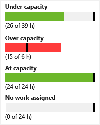
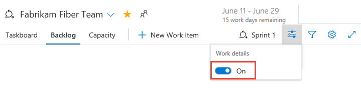
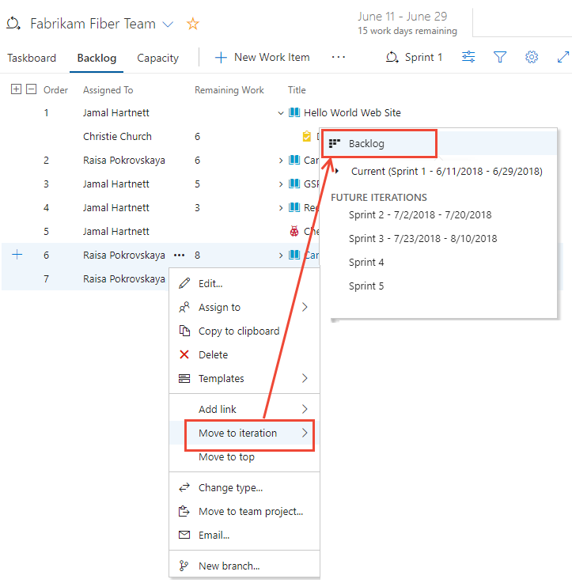
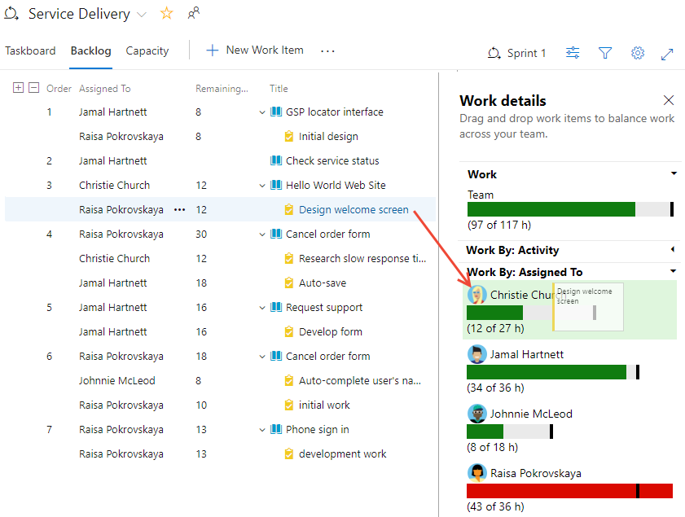
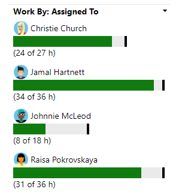

# Adjust work to fit sprint capacity

[!INCLUDE [version-lt-eq-azure-devops](../../includes/version-lt-eq-azure-devops.md)] 

After you define tasks for your sprint backlog items, check the team's capacity. Add items if the team is under capacity, or remove items if over capacity. Then check individual capacity bars to see if any team member is overloaded or has no work assigned. If you haven't [set capacity](set-capacity.md) yet, do that first.

  

## Prerequisites

[!INCLUDE [temp](../includes/prerequisites.md)]

[!INCLUDE [ai-assistance-mcp-server-tip](../../includes/ai-assistance-mcp-server-tip.md)]

## Open a sprint backlog for a team 

::: moniker range="<=azure-devops"

1. From your project, select **Boards** > **Sprints**, select your team, and then select **Backlog**.

    > [!div class="mx-imgBorder"]  
    > 

    To switch teams, open the team selector and choose a different team, or select the :::image type="icon" source="../../media/icons/home-icon.png" border="false"::: **Browse all sprints** option. You can also enter a keyword to filter the list.

    > [!div class="mx-imgBorder"]  
    >  

1. To switch sprints, open the sprint selector and choose the sprint you want.

    > [!div class="mx-imgBorder"]  
    > 

    Only sprints selected for the current team appear. If the sprint you need isn't listed, select **New Sprint** > **Select existing iteration**. For more information, see [Define iteration (sprint) paths](../../organizations/settings/set-iteration-paths-sprints.md). 

::: moniker-end

## Check your team capacity 

Turn on **Work details** to view capacity charts for the sprint.

::: moniker range="<=azure-devops"

> [!div class="mx-imgBorder"]  
> 

::: moniker-end

## Move items out of a sprint

If your team is over capacity, move items back to the product backlog or into the next sprint. All child tasks move with the backlog item. Moving to the backlog resets the Iteration Path to the team default.

::: moniker range="<=azure-devops"

Select the items to move, open the :::image type="icon" source="../../media/icons/actions-icon.png" border="false"::: actions menu, choose **Move to iteration**, and then select **Backlog**.

> [!div class="mx-imgBorder"]  
> 

> [!TIP]    
> You can also open the **Planning** pane and drag items to the backlog or another sprint — child tasks move automatically. Multi-select is supported. Users with **Stakeholder** access can't drag and drop work items. For more information, see [Assign work to a sprint](assign-work-sprint.md#drag-drop).

::: moniker-end

## Balance work across the team

To reassign tasks, drag a task onto the new assignee's capacity bar. Capacity bars update automatically.

::: moniker range="<=azure-devops"

The following example reassigns work from *Raisa Pokrovskaya* to *Christie Church*.

> [!div class="mx-imgBorder"]  
>    

> [!div class="mx-imgBorder"]  
>    

::: moniker-end

## Use AI to adjust sprint work

If you have the [Azure Boards MCP Server](../../mcp-server/mcp-server-overview.md) connected to your AI agent in agent mode, you can use natural language prompts to identify and adjust work across your sprint.

| Task | Example prompt |
|------|----------------|
| Find overloaded members | `Which team members are over capacity in Sprint 12 for <Contoso Team>? Show assigned work vs. capacity` |
| Reassign tasks | `Reassign task #5678 from <Jamal> to <me> in project <Contoso>` |
| Move excess items to backlog | `Move the lowest-priority user stories from Sprint 12 back to the backlog in <Contoso>` |
| Check sprint balance | `Show remaining capacity per team member for the current sprint in <Contoso Team>` |
| Identify at-risk items | `Which work items in Sprint 12 have remaining work greater than the days left in the sprint?` |
| Suggest scope cuts | `List the lowest-priority items in Sprint 12 that could be deferred to free up 16 hours of capacity` |
| Split oversized stories | `Find user stories in Sprint 12 with more than 20 hours of remaining task work and suggest how to split them` |
| Compare planned vs. actual | `Compare the original estimated hours vs. current remaining work for each team member in Sprint 12` |
| Redistribute after absence | `<Raisa> is out for the rest of Sprint 12. Show her active tasks and suggest team members to reassign them to based on capacity` |
| Mid-sprint health check | `We're halfway through Sprint 12. Summarize completion percentage, remaining work, and flag any items with no progress` |

> [!NOTE]
> Agent mode and the MCP Server use natural language, so you can adjust these prompts or ask follow-up questions to refine the results.

## Next step
> [!div class="nextstepaction"]
> [5. Share your sprint plan](share-plan.md)
