# Customize cards on a sprint taskboard in Azure Boards 

[!INCLUDE [version-lt-eq-azure-devops](../../includes/version-lt-eq-azure-devops.md)]  

Sprint taskboards display work items as cards rather than lists. You can customize the cards, add or rename columns, and apply style rules to highlight cards by criteria. For a comparison of taskboards and boards, see [What is Azure Boards?](../get-started/what-is-azure-boards.md)

> [!NOTE] 
> This article covers sprint taskboard customization. To customize a board, see [Manage and configure team tools](../../organizations/settings/manage-teams.md).

## Prerequisites

| Category | Requirements |
|--|--|
| **Taskboard** | A sprint taskboard. When you add a team, the system creates a taskboard for every sprint you select for that team. For more information, see [About teams and Agile tools](../../organizations/settings/about-teams-and-settings.md). |
| **Permissions** | [Team Administrator](../../organizations/settings/add-team-administrator.md) role or member of the [**Project Administrators** group](../../organizations/security/change-project-level-permissions.md). |

## Taskboard customization options  

To add or remove columns, select **Column Options**. Configure all other options through the **Settings** dialog.

[!INCLUDE [temp](../../includes/version-selector.md)] 

| Option | Description |
|--|--|
| **[Show bugs](#show-bugs)** | Manage bugs on the Taskboard similar to tasks. |
| **[Customize columns](#add-columns)** | Add or remove columns shown on the Taskboard. |
| **[Fields](#choose-fields)** | Add or remove fields from cards, including the **Parent** field. |
| **[Styles](#style-rule)** | Add styling rules to change card color and title style based on field criteria. |

> [!NOTE]   
> Each team customizes its own Taskboard columns and cards. Teams don't inherit Taskboard settings from other teams, even if they share area paths.

## Understand the Taskboard customization sequence 

Complete these tasks before you configure your Taskboard to avoid revisiting your configuration.  

**Process Administrator**: 
1. Add custom work item types that you want to appear on your Taskboard. For more information, see [Add and manage work item types](../../organizations/settings/work/customize-process-work-item-type.md).
2. Customize your iteration backlog to include all work item types that should appear on Taskboards. For more information, see [Customize backlogs & boards](../../organizations/settings/work/customize-process-backlogs-boards.md). 
3. Customize each work item type to include any custom fields you want to show. For more information, see [Customize a workflow](../../organizations/settings/work/add-custom-field.md).

> [!NOTE]  
> Customizing a work item type (adding fields, changing the workflow, adding custom rules) is different from customizing the card displayed on the Taskboard. You can also add custom work item types and custom backlog levels. For more information, see [Customize an inheritance process](../../organizations/settings/work/inheritance-process-model.md).

**Team Administrator**:
1. Determine with your team how to manage bugs - as requirements or tasks.  
2. [Add tags](../queries/add-tags-to-work-items.md) to work items that you want to use for styling rules.

## Show bugs on your Taskboard 

To show bugs on your Taskboard, change your team settings. For more information, see [Show bugs on backlogs and boards](../../organizations/settings/show-bugs-on-backlog.md).

## Add columns

You can add or rename columns on your Taskboard. The column titles and choices depend on the [process](../work-items/guidance/choose-process.md) used to create your project and whether your team [treats bugs as requirements or tasks](../../organizations/settings/show-bugs-on-backlog.md). Changes apply to all sprint Taskboards for the selected team.

> [!NOTE] 
> Columns you add to a Taskboard don't have corresponding fields, unlike board columns which map to the Board Column field. 

1. Open your team's sprint Taskboard as described in [Update and monitor your Taskboard](task-board.md). Only [team or project administrators](../../organizations/settings/add-team-administrator.md) can customize the Taskboard.

1. Select **Column Options**. 

	> [!div class="mx-imgBorder"]
	> 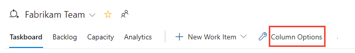

1. In the **Customize Columns** dialog, select the column you want to rename, or select **Add Column**.

	The following example adds a column named *Review* and sets the **Task** state to *In Progress*. 

	> [!div class="mx-imgBorder"]
	> 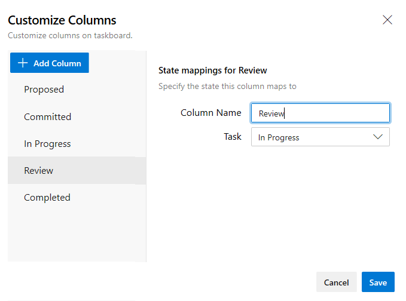

	Each column must map to a category state: *Proposed*, *Committed*, *In Progress*, or *Completed*. At least one column must map to *Proposed* and one to *Completed*. For more information, see [Workflow states and state categories](../work-items/workflow-and-state-categories.md).

1. To reorder columns, hover over a column and drag the :::image type="icon" source="../media/icons/grabber.png" border="false"::: grabber icon up or down in the list.   

	> [!div class="mx-imgBorder"]
	> 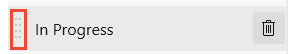

1. To delete a column, first move any work items to another column. Then hover over the column and select the :::image type="icon" source="../media/icons/trash-can.png" border="false"::: delete icon.

	> [!div class="mx-imgBorder"]
	> 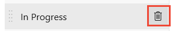

## Add fields to cards on a sprint taskboard 

Customize the fields that appear on taskboard cards to provide at-a-glance information for your team. You can also update fields directly from the card without opening the work item, and apply style rules to highlight cards by criteria.

[!INCLUDE [temp](../includes/setup-backlogs-boards.md)]

The following example shows a task card with these customizations:
- Core fields: ID, Assigned To, Remaining Work, Tags
- Additional field: Priority  
- Style rule: tasks with Priority=1 display as green

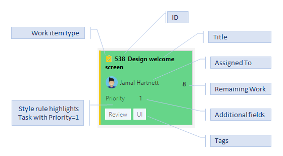

Show fields based on what your team frequently references or updates on the taskboard. You can also add fields that support board filtering. If you're new to these tools, see [Sprint planning](../../boards/sprints/assign-work-sprint.md). 

### Add or remove fields from cards on the Taskboard

Change how cards appear on the Taskboard in the same way you change card appearance on boards, but start from the Taskboard.

1. [Open the Taskboard](task-board.md) for the sprint you want to customize. Only [team or project administrators](../../organizations/settings/add-team-administrator.md) can customize the Taskboard.

2. Select the  :::image type="icon" source="../../media/icons/blue-gear.png" border="false":::  gear icon to open the **Settings** dialog. 

   > [!div class="mx-imgBorder"]  
   > 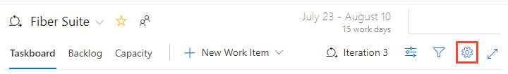  

3. Select **Fields** and then select a work item type to see available settings. 

4. Select the checkbox for each field you want to show on the card. 

	> [!div class="mx-imgBorder"]  
	> 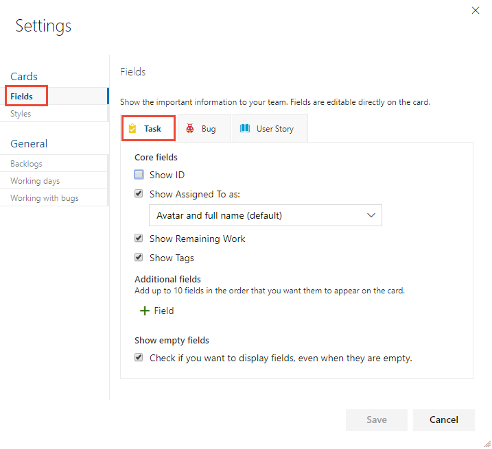  

	Repeat for each work item type. Options vary by type. For example, **Show Remaining Work** applies to tasks and bugs but not to user stories or product backlog items.  

5. To add a field, select the :::image type="icon" source="../media/icons/green_plus_icon.png" border="false"::: plus icon and enter the field name.
 
6. To remove a field, select the :::image type="icon" source="../../media/icons/delete-icon.png" border="false"::: delete icon next to the field.

7. Select **Save**.

### Update fields from cards

You can update most fields shown on a card without opening the work item. Drag cards between columns to update status, or drag cards up and down within a column to change stack ranking.

For example, moving a card from *In Progress* to *Done* updates the State field from *Doing* to *Done*.

You can also update fields directly on the card. The following example reassigns a task.

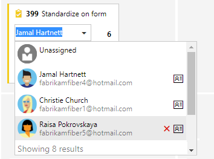

To change the title, select the  :::image type="icon" source="../../media/icons/actions-icon.png" border="false"::: actions icon, and then select **Edit title**. 

> [!div class="mx-imgBorder"]
> 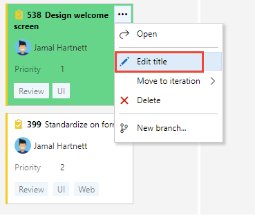

To add tags, double-click the work item to open it. You can't change work item IDs from the card or the form.

  

## Define style rules to highlight cards  

Style rules change card color when work items meet criteria you set. The following example highlights Priority 1 tasks in green. 

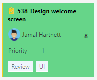

### Example styling rules 

> [!div class="mx-tdCol2BreakAll"]
> | Work items | Criteria |
> |--|--|
> | High priority items | `Priority = 1` |
> | High effort items | `Remaining Work>=12`  |
> | Stale items unchanged in the last 5 days | `Changed Date @Today-5` |
> | Title contains a key word | `Title Contains Yes` |
> | Severity 1 bugs | `Severity = 1 - Critical   AND   Work Item Type = Bug` |
> | High value business items | `Business Value 50` |
> | Items assigned to specific feature area  | `Area Path Under Fabrikam Fiber\Phone` |
> | Contains specific tag   | `Tags Contain RTM` |
> | Blocked tasks (Scrum process only) | `Blocked = Yes` |

### Add or remove a style rule  

1. [Open the Taskboard](task-board.md) that you want to customize.  

2. Select the  :::image type="icon" source="../../media/icons/blue-gear.png" border="false":::  gear icon to open the **Settings** dialog. 

3. Select **Styles**, and then select the :::image type="icon" source="../../media/icons/green_plus_icon.png" border="false"::: plus icon to add a style. Choose the color and define the criteria for the rule. 

	> [!div class="mx-imgBorder"]  
	> 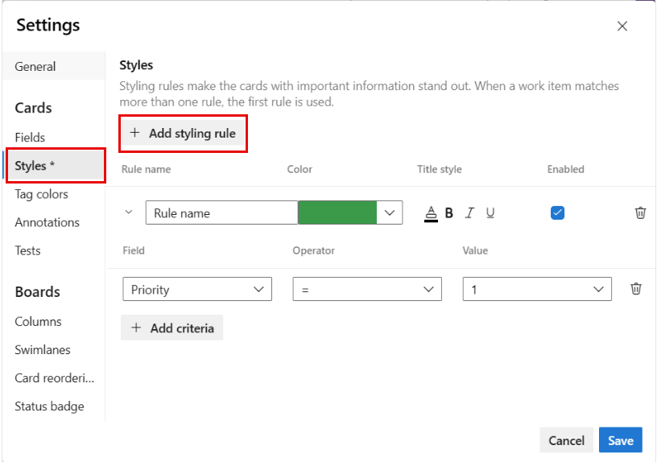

	Follow these rules when creating style rules:
   - Criteria works similarly to [constructing a query](../queries/using-queries.md). 
   - All clauses are AND clauses - grouping isn't supported.  
   - Rules apply to all work items that meet the criteria.  
   - Color applies in the order rules are listed. Place higher-priority rules first by dragging them into position.  
   - You can enable and disable rules without deleting them.     

     The following example highlights tasks that haven't changed in the last five days.

     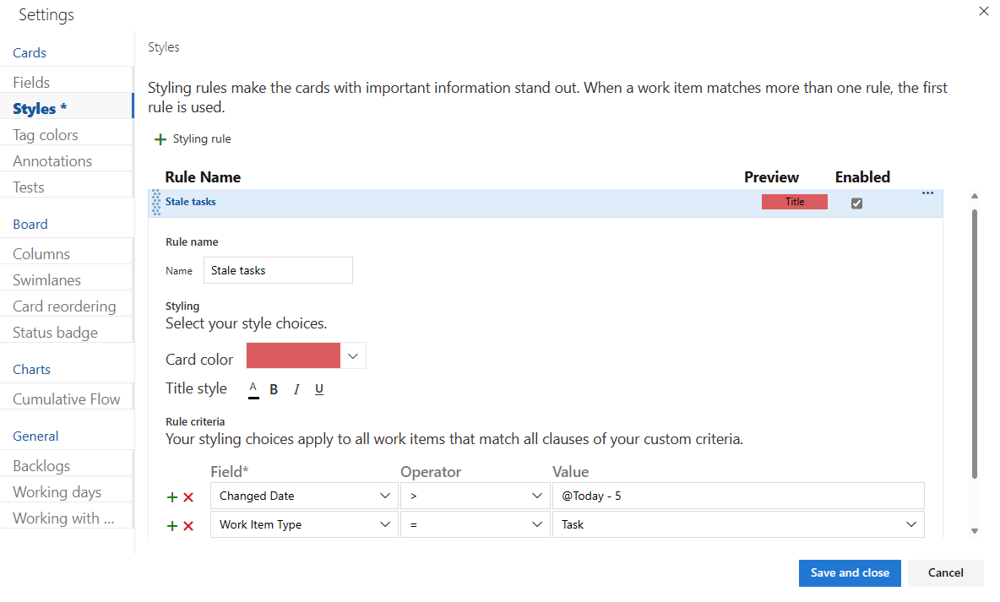   

4. To copy or delete a style rule, select the  :::image type="icon" source="../../media/icons/actions-icon.png" border="false"::: actions icon and select **Clone** or **Delete**.

	> [!div class="mx-imgBorder"]
	> 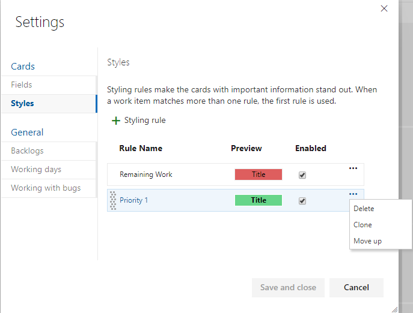

5. Select **Save**.

## Automatic Taskboard updates 

Your Taskboard automatically refreshes when changes occur in the background. As other team members move or reorder cards, the Taskboard updates without requiring a page refresh.

## Related content

- [Manage and configure team tools](../../organizations/settings/manage-teams.md)
- [Create your backlog](../backlogs/create-your-backlog.md)
- [Show bugs on backlogs and boards](../../organizations/settings/show-bugs-on-backlog.md)   
