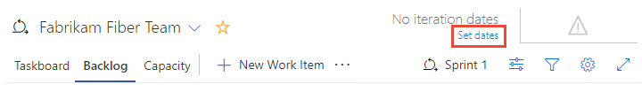
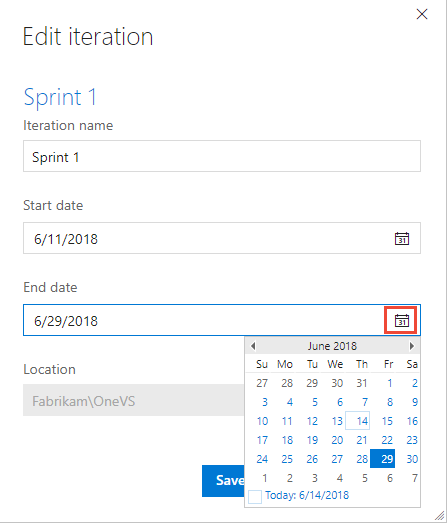
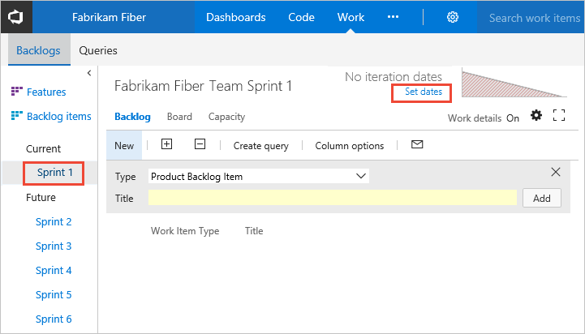
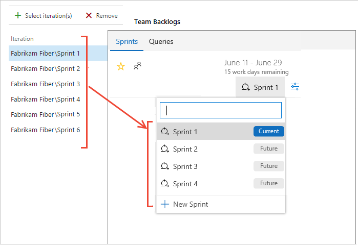

# Schedule sprints  

[!INCLUDE [temp](../_shared/version-vsts-tfs-all-versions.md)] 

With Scrum, teams plan and track work at regular time intervals, referred to as a sprint cadence. 
You define sprints to correspond to the cadence your team uses. 

Many teams choose a two or three week cadence. However, you can specify shorter or longer sprint cycles. Also, you can create a release schedule which encompasses several sprints.  

## Prerequisites

* You must connect to a project. If you don't have a project yet, [create one](/azure/devops/organizations/projects/create-project).
* To modify work tracking project configuration, you must be granted **Stakeholder** access or higher. For details, see [About access levels](/azure/devops/organizations/security/access-levels).
* You must be added to a project as a member of the **Project Administrators** security group. To get added, see [Set permissions at the project- or collection-level](../../security/set-project-collection-level-permissions.md). 
* Or, to add, edit, and manage Iteration Paths under a node, you must have one or more of the following permissions set to **Allow** for the node you want to manage: **Create child nodes**, **Delete this node**, and **Edit this node**, and **View permissions for this node**.  By default, the user who created the project has these permissions set. To learn more, see [Set permissions and access for work tracking](/azure/devops/organizations/security/set-permissions-access-work-tracking).  

## Quick start guide to scheduling sprints

To quickly get started, you can use the default sprints, also referred to as iterations, that were added when your project was created. Note, you must be a [member of the Project Administrators group](../../security/set-project-collection-level-permissions.md) in order to add sprints and schedule sprint dates. (If you created the project, you're a member.) 

::: moniker range=">= azure-devops-2019"

0. From your web browser, open your team's sprint backlog. (1) Check that you have selected the right project, (2) choose **Boards>Sprints**, (3) select the correct team from the team selector menu, and lastly (4), choose **Backlog**. 

	

0. To choose another team, open the selector and select a different team or choose the  **Browse all sprints** option. Or, you can enter a keyword in the search box to filter the list of team backlogs for the project.

	> [!div class="mx-imgBorder"]  
	>  

0. Choose **Set sprint dates**.  

	> [!div class="mx-imgBorder"]
	> 

2. Choose the calendar icon to select the start date, and then the end date of the sprint. 

	> [!div class="mx-imgBorder"]
	>  

3. Choose **Save and close**. You'll see the date listed. 

	> [!div class="mx-imgBorder"]
	> 

::: moniker-end

::: moniker range=">= tfs-2013 <= tfs-2018"

0. From your web browser, open your team's sprint backlog. (1) Select the team from the project/team selector, choose (2) **Work**, (3) **Backlogs**, and then (4) the product backlog, which is **Backlog items** (for Scrum), **Stories** (for Agile), or **Requirements** (for CMMI). 

	> [!div class="mx-imgBorder"]
	>  

	To choose another team, open the project/team selector and select a different team or choose the **Browse** option. 

	> [!div class="mx-imgBorder"]  
	>  

	The set of sprints selected for your team appears in the left pane. If you don't see any sprints listed, you can add sprints or select existing sprints for your team's use. To learn how, see [Define sprints](define-sprints.md). 

0. Choose the sprint you want to plan. 

	> [!div class="mx-imgBorder"]  
	> 

	The system lists only those sprints that have been selected for the current team focus. If you don't see the sprints you want listed, then see [Define iteration paths (aka sprints)](../../organizations/settings/set-iteration-paths-sprints.md).  

0. Choose the sprint listed under **Current** and then choose **Set dates**.  

	  

	> [!NOTE]
	> If you don't see any sprints listed or the **Set dates** link, then no sprints have been selected for the team context you've selected. To select sprints for the team context, see [Define iteration paths (aka sprints) and configure team iterations](../../organizations/settings/set-iteration-paths-sprints.md). To switch team context, see [Switch project or team focus](../../project/navigation/go-to-project-repo.md). 

2. Choose the calendar icon to select the start date, and then the end date of the sprint. 

	> [!div class="mx-imgBorder"]
	>  

::: moniker-end

That's it! You can now start [planning your first sprint](assign-work-sprint.md). 

Of course, if you have several teams, more complex release and sprint cadences to schedule, or want to create child iterations, then you'll need to read further. You define these through the settings context for the project.  

> [!NOTE]
> **Terminology note:** Your set of Agile tools uses the Iteration Path field to track sprints and releases. When you define sprints, you define the picklist of values available for the [Iteration Path](../../organizations/settings/set-area-paths.md) field. You use iterations to group work into sprints, milestones, or releases in which they'll be worked on or shipped. 

## Add and schedule new sprints for several teams and release cadences 
 
> [!NOTE]    
> Your sprint backlog and taskboard are designed to support your Scrum processes. In addition, you have access to product and portfolio backlogs and Kanban boards. For an overview of the features supported on each backlog and board, see [Backlogs, boards, and plans](../backlogs/backlogs-boards-plans.md).  

Your project comes with several sprints predefined. However, they aren't associated with any dates. For Scrum and sprint planning, you'll want to assign start and end dates for the sprints your team will use.   

Defining additional sprints is a two-step process. You first define the sprints for your project and then you select the sprints that each team will use&mdash;[Define iteration paths (aka sprints) and configure team iterations](../../organizations/settings/set-iteration-paths-sprints.md). In this way, the system supports teams that work on different sprint cadences.  

Each sprint that you select for your team provides access to a [sprint backlog, taskboard, and other sprint planning tools](scrum-sprint-planning-tools.md) for planning and tracking work. 

For example, by selecting Sprints 1 thru 6, the Fabrikam Fiber team gets access to six sprint backlogs. They also get access to capacity planning tools and a taskboard for each sprint. 

::: moniker range=">= azure-devops-2019"

::: moniker-end

::: moniker range="<= tfs-2018"

::: moniker-end

## Try this next
> [!div class="nextstepaction"]
> [Assign work to a sprint](assign-work-sprint.md) or [Define iteration paths (aka sprints) and configure team iterations](../../organizations/settings/set-iteration-paths-sprints.md)

## Related articles 

If you work with several teams, and each team wants their own backlog view, you can [create additional teams](../../organizations/settings/add-teams.md). Each team then gets access to their own set of Agile tools. Each Agile tool filters work items to only include those assigned values under the team's[default area path and iteration path.  

