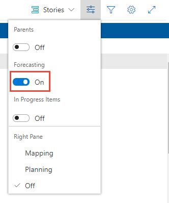
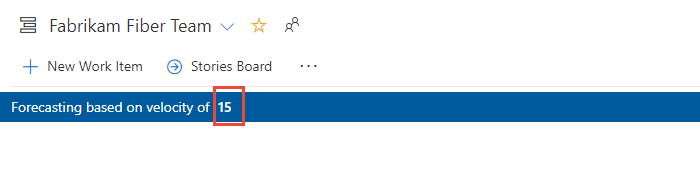

# Forecast your product backlog

[!INCLUDE [version-lt-eq-azure-devops](../../includes/version-lt-eq-azure-devops.md)] 

Teams can use the forecast tool to help in their sprint planning efforts. When you plug in a value for the [team velocity](../../report/dashboards/team-velocity.md), the forecast tool shows which items in the backlog can be completed within future sprints. Both tools are team-specific tools that rely on the team's ability to estimate backlog items. Once your team completes a sprint or two, they can use the team velocity to forecast how much of the backlog they can finish within the upcoming sprints. 

The forecast tool helps teams answer critical planning questions:
- **Sprint capacity planning**: How many backlog items can we complete in future sprints?
- **Release planning**: When can we expect to complete all items in our backlog?
- **Resource planning**: What velocity do we need to meet our target delivery dates?
- **Scope management**: Which features should we prioritize for upcoming releases?

Use this article to learn: 

> [!div class="checklist"]    
> * How to forecast upcoming sprints     
> * Required and recommended team activities to support forecasting
> * How to interpret and use forecast results effectively
> * Best practices for accurate forecasting

[!INCLUDE [temp](../includes/setup-backlogs-boards.md)]

## Prerequisites

::: moniker range="azure-devops"

| Category | Requirements |
|--------------|-------------|
| **Project membership** | [Project member](../../organizations/projects/create-project.md). |
| **Permissions** | Member of the **Contributors** security group. |
| **Access levels** | At least [**Basic** access](../../organizations/security/access-levels.md). |

> [!NOTE]  
> Users with **Stakeholder** access for a public project have full access to backlog and board features just like users with **Basic** access. For more information, see [Stakeholder access quick reference](../../organizations/security/stakeholder-access.md).

::: moniker-end

::: moniker range="< azure-devops"

* **Project membership**: Member of a [project](../../organizations/projects/create-project.md). 
* **Permissions**: Member of the **Contributors** security group. 
* **Access levels**: At least [**Basic** access](../../organizations/security/access-levels.md).

::: moniker-end 
 
## Understanding forecasting fundamentals

Before diving into the forecast tool, it's important to understand how forecasting works in Azure Boards:

### Forecasting principles

- **Velocity-based predictions**: The forecast tool uses your team's historical velocity to predict future capacity
- **Sprint consistency**: Forecasts assume consistent sprint lengths and team capacity
- **Work item estimation**: Accurate forecasts require consistent and reliable work item estimates
- **State-based filtering**: Only work items in specific states (Proposed, In Progress) are included in forecasts

### Forecasting limitations

- **Past performance indicator**: Forecasts are based on historical data and might not account for future changes
- **Team changes**: Forecasts don't automatically adjust for team composition changes
- **External dependencies**: The tool doesn't consider external blockers or dependencies
- **Estimation accuracy**: Forecast quality depends on the accuracy of work item estimates

## Required and recommended activities   

Here's what you need to have in place before you attempt to forecast your team's backlog.   

### Required setup
*	**[Define iteration paths (sprints) and configure team iterations](../../organizations/settings/set-iteration-paths-sprints.md)** 
    - Sprints should be of the same duration for accurate forecasting. 
    - Select enough future sprints to forecast your entire product backlog.
*	**[Define and estimate backlog items](../backlogs/create-your-backlog.md#estimates)**. If you work from your team's backlog, the items you create automatically get assigned to the current sprint (Iteration) and to your team's default Area Path.  
*	**Update work item status**: Update the status of backlog items once work starts and when completed. Only backlog items whose State maps to a state category of *Proposed* or *In Progress* appear on the velocity chart. (For more information, see [Workflow states and state categories](../work-items/workflow-and-state-categories.md)).

### Recommended practices
*	**[Minimize estimation variability](../../report/dashboards/team-velocity.md)**: Define and size backlog items to reduce variability in estimates.  
*	**[Configure bug tracking](../../organizations/settings/show-bugs-on-backlog.md)**: Determine how your team wants to treat bugs. If your team chooses to treat bugs like requirements, bugs appear on the backlog and are counted within the Velocity chart and forecasting. 
*	**[Set your team's area path](../../organizations/settings/set-area-paths.md)**: The forecast tool forecasts those items based on your team's default settings. These settings can specify to include items in area paths under the team's default or exclude them.     
*	**Maintain flat hierarchy**: Don't create a hierarchy of backlog items and bugs. The display of the leaf node, the last node in a same-category hierarchy, might only appear on boards, sprint backlogs, and Taskboards. For more information, see [Fix reordering and nesting issues, How backlogs and boards display hierarchical (nested) items](../backlogs/resolve-backlog-reorder-issues.md). Instead of nesting requirements, bugs, and tasks, maintain a flat list—only creating parent-child links one level deep between different-category items. Use [Features to group requirements or user stories](../backlogs/organize-backlog.md). You can quickly map stories to features. The map creates parent-child links in the background.  
*	**Complete sprint cleanup**: At the end of the sprint, update the status of those backlog items that the team completed. Move incomplete items back to the product backlog and consider them in a future sprint planning meeting.

### Team setup considerations

> [!NOTE]
> If you work with several teams, and each team wants to work with their own backlog, velocity chart, and forecast tool, you can [create more teams](../../organizations/settings/add-teams.md). Each team then gets access to their own set of Agile tools. Each Agile tool filters work items to only include items whose assigned area paths and iteration paths meet those set for the team. 

 

## Forecast upcoming sprints

Use the forecast tool to get an idea of how many items you can complete within a sprint. By plugging in a velocity, you can see which items are within scope for the set of sprints the team activated. 

To forecast your product backlog, complete the following actions:

1. Select **Boards** > **Backlogs** > select the correct team from the team selector menu. 

   > [!div class="mx-imgBorder"]  
   > 

    To select another backlog, open the selector and then choose a different team or select the **View Backlog directory** option. Or, enter a keyword in the search box to filter the list of team backlogs for the project.

   > [!div class="mx-imgBorder"]  
   > 

2. Check that you selected **Stories** (for Agile), **Issues** (for Basic), **Backlog items** (for Scrum), or **Requirements** (for CMMI) as the backlog level. 

    > [!div class="mx-imgBorder"]  
    >  

3. (Optional) To choose which columns should display and in what order, choose the  :::image type="icon" source="../../media/icons/actions-icon.png" border="false"::: actions icon and select **Column options**. For more information, see [Change column options](../backlogs/set-column-options.md). 

    > [!div class="mx-imgBorder"]  
    >  

4. Choose the :::image type="icon" source="../../media/icons/view-options-icon.png" border="false"::: view options icon and slide **Forecasting** to **On**. To keep things simple, turn the **Mapping** and **Planning** panes **Off**.  

    > [!div class="mx-imgBorder"]  
    > 

    Set **In Progress Items** to **Off** to hide those items that aren't counted in the forecast. The forecast tool ignores Scrum items set to *Committed* or *Done* and Agile and CMMI items set to *Active*, *Resolved*, or *Completed*. 

5. Enter your team's predicted velocity. 

    > [!div class="mx-imgBorder"]  
    > 

    > [!TIP]    
    > If your team has been working for several sprints, you can gain an idea of your team's velocity from the [Velocity widget](../../report/dashboards/team-velocity.md). Use your average velocity over the last 3-6 sprints for the most accurate forecast.

    The tool draws lines for each future sprint selected by the team. The Forecast lines show how much work your team can complete in future sprints. Typically, items above the first line are already in progress for the current sprint. Items that fall between the first and second forecast lines indicate what can be completed in the named sprint.

## Understanding forecast results 

### Reading the forecast visualization

The forecast tool displays your backlog with visual indicators that help you understand sprint capacity:

- **Forecast lines**: Horizontal lines that separate work items into sprint buckets
- **Sprint labels**: Each line is labeled with the sprint name and capacity
- **Velocity carryover**: Unused velocity from one sprint carries forward to the next
- **Item positioning**: Work items between lines represent what can be completed in that sprint

### Interpreting forecast data

When you review forecast results, consider these factors:

*	**Manual verification**: Check the results manually to understand discrepancies between what you expect and what the forecast tool displays.  
*	**Sprint capacity**: Check the amount of effort (Effort, Story Points, or Size) forecasted per sprint. 
*	**Large work items**: Question forecast results where the effort of an item is near to, or greater than, team velocity.  
*	**Velocity carryover**: Understand how unused capacity from previous sprints affects future projections.

### Example forecast interpretation

In this example, a Velocity of 20 is used. The forecast tool limits the number of items shown between the forecast lines to those items that can be completed within the sprint or using unused velocity points from the previous sprint. 

The forecast tool shows between two and four items can be worked on during Iterations 2 through 6 based on the number of Story Points assigned to each user story or bug. The forecast logic carries over velocity points from one sprint to the next. 

- **Iteration 2**: 13 Story Points, items 1 and 2 can be completed; 7 velocity points carry over to the next sprint
- **Iteration 3**: 24 Story Points, items 3 through 5 can be completed; 3 (=20+7-24) velocity points carry over to the next sprint   
- **Iteration 4**: 21 Story points, items 6 through 8 can be completed; 2 (=20+3-21) velocity points carry over to the next sprint   
- **Iteration 5**: 16 Story points, items 9 through 12 can be completed; 6 (=20+2-16) velocity points carry over to the next sprint   
- **Iteration 6**: 23 Story points, items 13 through 16 can be completed; 3 (=20+6-23) velocity points carry over to the next sprint   

    > [!div class="mx-imgBorder"]  
    > 

## Advanced forecasting scenarios

### Scenario 1: Determine required velocity for timeline

Another way to use the forecast tool is to enter different velocity values until all the backlog items are completed within a given set of sprints. This forecast provides an estimate of what velocity is required to complete your backlog of items. 

You can then assess the delta between the current team's velocity and the required velocity. The delta helps determine what other resources are required to meet production demands within a required time. 

#### Steps for velocity requirement analysis

1. **Count total backlog effort**: Sum the effort estimates for all backlog items
2. **Count available sprints**: Determine how many sprints you have until your target date
3. **Calculate required velocity**: Divide total effort by available sprints
4. **Compare with current velocity**: Identify the gap between current and required velocity
5. **Plan accordingly**: Determine if you need more team members, scope reduction, or timeline adjustment

### Scenario 2: Release planning with multiple teams

For organizations with multiple teams working toward a common release:

1. **Aggregate team forecasts**: Combine forecasts from all contributing teams
2. **Identify dependencies**: Map cross-team dependencies that might affect delivery
3. **Plan integration points**: Schedule integration activities between team deliveries
4. **Monitor progress**: Track actual progress against forecasted delivery dates

### Scenario 3: Capacity planning with changing team size

When team composition changes during a project:

1. **Adjust velocity proportionally**: Increase or decrease velocity based on team size changes
2. **Account for ramp-up time**: New team members typically need time to reach full productivity
3. **Monitor actual performance**: Compare actual velocity with adjusted forecasts
4. **Recalibrate regularly**: Update forecasts based on new velocity patterns

## Best practices for accurate forecasting

### Estimation practices
- **Use consistent estimation scales**: Ensure all team members understand and apply the same estimation criteria
- **Estimate collaboratively**: Use planning poker or similar techniques for team consensus
- **Break down large items**: Split large work items into smaller, more predictable pieces
- **Include all work**: Account for bugs, technical debt, and other work that affects capacity

### Velocity management
- **Track actual velocity**: Monitor real velocity over time and adjust forecasts accordingly
- **Use rolling averages**: Base forecasts on the average of the last 3-6 sprints for stability
- **Account for team changes**: Adjust velocity expectations when team composition changes
- **Consider external factors**: Account for holidays, training, and other capacity impacts

### Forecast maintenance
- **Update regularly**: Refresh forecasts at least once per sprint
- **Review assumptions**: Validate that underlying assumptions remain valid
- **Communicate changes**: Keep stakeholders informed of forecast updates and their implications
- **Learn from actuals**: Compare forecast predictions with actual results to improve accuracy

## Troubleshooting common forecasting issues

### Issue: Inaccurate forecasts

**Possible causes:**
- Inconsistent work item estimates
- Velocity calculations based on too few sprints
- Significant team composition changes
- External dependencies not accounted for

**Solutions:**
- Review and standardize estimation practices
- Use longer velocity history for calculations
- Adjust velocity for team changes
- Include dependency management in sprint planning

### Issue: Forecast tool not showing expected results

**Possible causes:**
- Work items in wrong state categories
- Incorrect team area path configuration
- Sprint configuration issues
- Missing work item estimates

**Solutions:**
- Verify work item states map to correct categories
- Check team settings for area paths and iterations
- Ensure sprints are properly configured and assigned
- Add estimates to all backlog items

### Issue: Large variance between forecasts and actuals

**Possible causes:**
- Unpredictable work item sizes
- Scope creep during sprints
- Technical challenges not accounted for in estimates
- External interruptions affecting capacity

**Solutions:**
- Improve work item decomposition
- Implement stronger scope management
- Include risk buffers in estimates
- Track and account for interrupt-driven work

## Next step

> [!div class="nextstepaction"]
> [Assign work to a sprint](assign-work-sprint.md)

## Related content

*	[Team velocity](../../report/dashboards/team-velocity.md)  
*	[Define iteration paths (sprints) and configure team iterations](../../organizations/settings/set-iteration-paths-sprints.md) 
*	Use the [taskboard](task-board.md) to track work during your sprint
*	Monitor the [sprint burndown chart](task-board.md) to determine if your team is on track to complete the sprint plan
*	[Configure and customize Azure Boards](../configure-customize.md)
*	[Agile process guidance](../work-items/guidance/agile-process.md)
