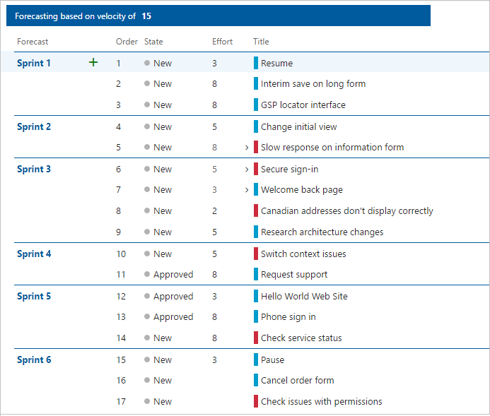

# Forecast your product backlog

[!INCLUDE [temp](../_shared/version-vsts-tfs-all-versions.md)] 

Teams use the forecast tool to help in their sprint planning efforts. By plugging in a value for the [team velocity](../../report/dashboards/velocity-chart-data-store.md), the forecast tool will show which items in the backlog can be completed within future sprints. Both tools are team-specific tools that rely on the team's ability to estimate backlog items. Once your team has completed a sprint or two, they can use the team velocity  to forecast how much of the backlog they can finish within the upcoming sprints. 

Use this article to learn: 

> [!div class="checklist"]    
> * How to forecast upcoming sprints     
> * Required and recommended team activities to support forecasting  

[!INCLUDE [temp](../_shared/setup-backlogs-boards.md)]

## Prerequisites

::: moniker range="azure-devops"

* You must connect to a project. If you don't have a project yet, [create one](/azure/devops/boards/get-started/sign-up-invite-teammates). 
* You must be added to a project as a member of the **Contributors** security group. If you're not on a project or team, [get added now](/azure/devops/organizations/security/add-users-team-project). 
* You must be granted **Basic** access or higher to use the forecast feature. For details, see [About access levels](/azure/devops/organizations/security/access-levels).

> [!NOTE]  
> Users with **Stakeholder** access for a public project have full access to backlog and board features just like users with **Basic** access. For details, see [About access levels](/azure/devops/organizations/security/access-levels).

::: moniker-end

::: moniker range="<= azure-devops-2019"

* You must connect to a project. If you don't have a project yet, [create one](/azure/devops/organizations/projects/create-project).
* You must be added to a project as a member of the **Contributors** security group. If you're not on a project or team, [get added now](/azure/devops/organizations/security/add-users-team-project). 
* You must be granted **Basic** access or higher to add or modify work items. For details, see [About access levels](/azure/devops/organizations/security/access-levels).

::: moniker-end 
 

## Required and recommended activities   

Here's what you need to have in place before you attempt to forecast your team's backlog.   

**Required:** 
*	[Define iteration paths (aka sprints) and configure team iterations](../../organizations/settings/set-iteration-paths-sprints.md) 
	- Sprints should be of the same duration. 
	- Select enough future sprints to forecast your entire product backlog.
*	[Define and estimate backlog items](../backlogs/create-your-backlog.md#estimates). If you work from your team's backlog, the items you create will automatically be assigned to the current sprint (Iteration) and to your team's default Area Path.  
*	Update the status of backlog items once work starts and when completed. Only backlog items whose State maps to a state category of *Proposed* or *In Progress* show up on the velocity chart. (for details, see [Workflow states and state categories](../work-items/workflow-and-state-categories.md)).

**Recommended:**  
*	Define and size backlog items to [minimize variability](../../report/dashboards/velocity-guidance.md#minimize-variability).  
*	Determine how your team wants to [treat bugs](../../organizations/settings/show-bugs-on-backlog.md). If your team chooses to treat bugs like requirements, bugs will show up on the backlog and be counted within the Velocity chart and forecasting. 
*	[Set your team's area path](../../organizations/settings/set-area-paths.md). The forecast tool will forecast those items based on your team's default settings. These settings can specify to include items in area paths under the team's default or exclude them.     
*	Don't  create a hierarchy of backlog items and bugs. The Kanban board, sprint backlog, and taskboard only show the last node in a hierarchy, called the leaf node. For example, if you link items within a hierarchy that is four levels deep, only the items at the fourth level appear on the Kanban board, sprint backlog, and taskboard.  Instead of nesting requirements, bugs, and tasks, we recommend that you maintain a flat list&mdash;only creating parent-child links one level deep between items. Use [Features to group requirements or user stories](../backlogs/organize-backlog.md). You can quickly map stories to features, which creates parent-child links in the background.  
*	At the end of the sprint, update the status of those backlog items that the team has fully completed. Incomplete items should be moved back to the product backlog and considered in a future sprint planning meeting.

> [!NOTE]
> If you work with several teams, and each team wants to work with their own backlog, velocity chart, and forecast tool, you can [create additional teams](../../organizations/settings/add-teams.md). Each team then gets access to their own set of Agile tools. Each Agile tool filters work items to only include those whose assigned area paths and iteration paths meet those set for the team. 

 

## Forecast upcoming sprints

You can use the forecast tool to get an idea of how many items you can complete within a sprint. By plugging in a velocity, you can see which items are within scope for the set of sprints the team has activated. 

To forecast your product backlog, perform the following actions.

::: moniker range=">= azure-devops-2019"

0. From your web browser, open your product backlog. (1) Check that you have selected the right project, (2) choose **Boards>Backlogs**, and then (3) select the correct team from the team selector menu. 

	

	To choose another team, open the selector and select a different team or choose the  **Browse all team backlogs** option. Or, you can enter a keyword in the search box to filter the list of team backlogs for the project.

	> [!div class="mx-imgBorder"]  
	>  

0. Check that you have selected **Backlog items** (for Scrum), **Stories** (for Agile), or **Requirements** (for CMMI) as the backlog level. You can only forecast a product backlog. You can't forecast a portfolio backlog such as Features or Epics.    

	> [!div class="mx-imgBorder"]  
	>  

0. (Optional) To choose which columns should display and in what order, choose the  actions icon and select **Column options**. You may want to add the Iteration Path to the set of columns that appear on your backlog. To learn more, see [Change column options](../backlogs/set-column-options.md). 

	> [!div class="mx-imgBorder"]  
	>  

0. Choose the  view options icon and slide **Forecasting** to **On**. To keep things simple, turn the **Mapping** and **Planning** panes **Off**.  

	> [!div class="mx-imgBorder"]  
	> 

	Set **In Progress Items** to **Off** to hide those items that won't be counted in the forecast. The forecast tool ignores Scrum items set to *Committed* or *Done* and Agile and CMMI items set to *Active*, *Resolved*, or *Completed*. 

3. Enter your team's predicted velocity. If the **Forecasting** bar doesn't appear.

	> [!div class="mx-imgBorder"]  
	> 

	> [!TIP]    
	> If your team has been working for several sprints, you can gain an idea of your team's velocity from the [Velocity widget](../../report/dashboards/team-velocity.md).

	The tool draws lines for each future sprint selected by the team. The Forecast lines show how much work your team should be able to complete in future sprints. Typically, items above the first line are already in progress for the current sprint. Items that fall between the first and second forecast lines indicate what can be completed in the named sprint.

::: moniker-end

::: moniker range="<= tfs-2018"

To forecast your product backlog, perform the following actions.

0. From your web browser, open your team's product backlog. (1) Select the team from the project/team selector, choose (2) **Work**, (3) **Backlogs**, and then (4) the product backlog, which is **Backlog items** (for Scrum), **Stories** (for Agile), or **Requirements** (for CMMI). 

	> [!div class="mx-imgBorder"]
	>  

	You can only forecast the product backlog of Stories, Backlog items, or Requirements.

	To choose another team, open the project/team selector and select a different team or choose the **Browse** option. 

	> [!div class="mx-imgBorder"]  
	>   

	> [!NOTE]
	> If you work with several teams, and each team wants to work with their own backlog, velocity chart, and forecast tool, you can [create additional teams](../../organizations/settings/add-teams.md). Each team then gets access to their own set of Agile tools. Each Agile tool filters work items to only include those whose assigned area paths and iteration paths meet those set for the team. 

0. (Optional) To choose which columns should display and in what order, choose **Column options**. You may want to add the Iteration Path to the set of columns that appear on your backlog. To learn more, see [Change column options](../backlogs/set-column-options.md). 

0. Set **Forecast** to **On** and enter your team's predicted velocity. If the Forecasting bar doesn't appear, set **Parents** to **Hide**. 

	

0. Set **In progress** items to **Hide** to hide those items that won't be counted in the forecast. The forecast tool ignores Scrum items set to Committed or Done and Agile and CMMI items set to Active, Resolved, or Completed. 

	The tool draws lines for each future sprint selected by the team. The Forecast lines show how much work your team should be able to complete in future sprints. Typically, items above the first line are already in progress for the current sprint. Items that fall between the first and second forecast lines indicate what can be completed in the named sprint.  

::: moniker-end

## Review the forecast results 
*	Check the results manually to understand discrepancies in what you expect and what the forecast tool displays.  
*	Check the amount of effort (Effort, Story Points, or Size) forecasted per sprint. 
*	Question forecast results where the effort of an item is near to, or greater than, team velocity.  

::: moniker range=">= tfs-2018" 

In this example, a Velocity of 20 is used. The forecast tool limits the number of items shown between the forecast lines to those that can be completed within the sprint or using unused velocity points from the previous sprint. 

The forecast tool shows between two and four items can be worked on during Iterations 2 through 6 based on the amount of Story Points assigned to each user story or bug. The forecast logic carries over velocity points from one sprint to the next. 

- **Iteration 2**: 13 Story Points, items 1 and 2 can be completed; 7 velocity points are carried over to the next sprint
- **Iteration 3**: 24 Story Points, items 3 through 5 can be completed; 3 (=20+7-24) velocity points are carried over to the next sprint   
- **Iteration 4**: 21 Story points, items 6 through 8 can be completed; 2 (=20+3-21) velocity points are carried over to the next sprint   
- **Iteration 5**: 16 Story points, items 9 through  12 can be completed; 6 (=20+2-16) velocity points are carried over to the next sprint   
- **Iteration 6**: 23 Story points, items 13 through 16 can be completed; 3 (=20+6-23) velocity points are carried over to the next sprint   

	> [!div class="mx-imgBorder"]  
	> 
	
::: moniker-end

::: moniker range="tfs-2017"
<!--- ### TFS 2017.2 and TFS 2017.3  -->

> [!NOTE]  
> The forecast logic changed for TFS 2017.2. Previously, the forecast tool limited the number of items shown between the forecast lines to those that could be completed within the sprint or using unused velocity points from the previous sprint. 
>
> Now, all items listed between the lines can be started in the sprint labeled by the first line, but may not be completed within the sprint. The amount of effort (Effort, Story Points, Size) that can't be completed in one sprint are carried over to the next sprint. For example, for a velocity of 15, if Item 1 has 35 Effort points, 20 Effort points are carried over to next sprint, then again 5 Effort points are carried over to the sprint after that.

In this example, a Velocity of 15 is used. The forecast tool shows between two and four items can be started or completed during the first six sprints based on the amount of Effort assigned to each work item. The forecast logic carries over effort points from one sprint to the next. 

- **Sprint 1**: 19 Effort points, items 1 and 2 can be completed and item 3 can be started; 4 Effort points are carried over into the next sprint.
- **Sprint 2**: 13 Effort points, item 3 from the previous sprint can be completed, item 4 can be completed, and item 5 can be started; 2 Effort points are carried over into the next sprint.
- **Sprint 3**: 15 Effort points, item 5 from the previous sprint and items 6 through 8 can be completed, and item 9 can be started; 2 Effort points are carried over into the next sprint. 
- **Sprint 4**: 13 Effort points, item 9 from the previous sprint and items 10 and 11 can be completed; no Effort points are carried over into the next sprint.
- **Sprint 5**: 19 Effort points, items 12 and 13 can be completed and item 14 can be started; 4 Effort points are carried over into the next sprint.

  

::: moniker-end

::: moniker range="<= tfs-2015"
<!--- ### TFS 2013 - TFS 2017.1 -->

The forecast tool shows only those work items that can be completed within a sprint between the forecast lines. Unused velocity points from one sprint are considered in the forecast of the following sprint. The forecasted sprint is listed along with the last item that can be completed during that sprint. 

In this example, a velocity of 20 is used. The first two items with a total of 13 Effort points can be completed in Sprint 2.

In summary:  
- **Sprint 2**: 13 Effort points, items 1 and 2 can be completed; 7 velocity points are carried over to the next sprint  
- **Sprint 3**: 24 Effort points, items 3 through 5 can be completed; 3 (=20+7-24) velocity points are carried over to the next sprint  
- **Sprint 4**: 21 Effort points, items 6 through 8 can be completed; 2 (=20+3-21) velocity points are carried over to the next sprint     
- **Sprint 5**: 16 Effort points, items 9 through  12 can be completed; 6 (=20+2-16) velocity points are carried over to the next sprint    
- **Sprint 6**: 19 Effort points, items 13 through 15 can be completed; 3 (=20+6-23) velocity points are carried over to the next sprint     

  

::: moniker-end

## Determine the velocity needed to complete all items in the backlog
Another way to use the forecast tool is to enter different velocity values until all the backlog items are completed within a given set of sprints. This provides an estimate of what velocity is required to complete your backlog of items. 

You can then assess the delta between the current team's velocity and the required velocity to determine what additional resources are required to meet production demands within a required time. 

 
## Try this next
Now that you understand how to work with forecasting, you can use this tool to support your team's [sprint planning activities](assign-work-sprint.md).

## Related articles

*	[Team velocity](../../report/dashboards/velocity-chart-data-store.md)  
*	[Define iteration paths (aka sprints) and configure team iterations](../../organizations/settings/set-iteration-paths-sprints.md) 
*	Use the [taskboard](task-board.md) to track work during your sprint
*	Monitor the [sprint burndown chart](task-board.md) to determine if your team is on track to complete the sprint plan

 