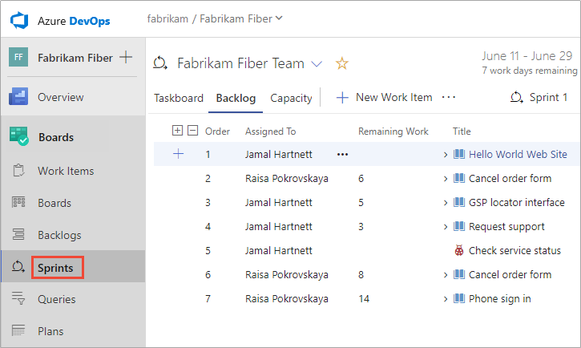
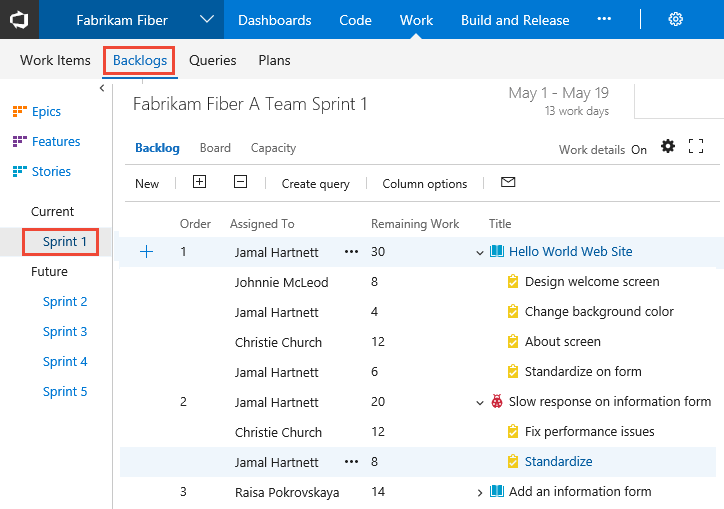
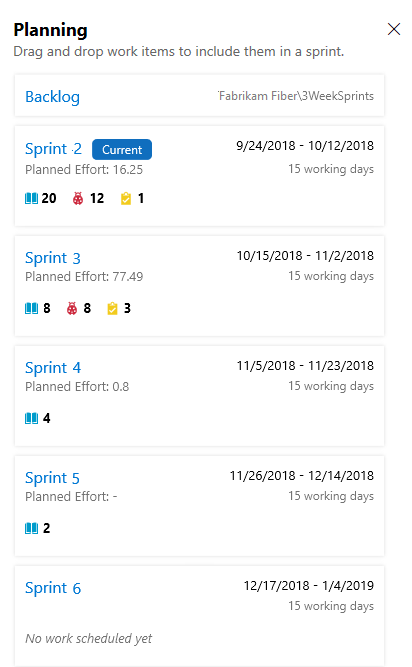
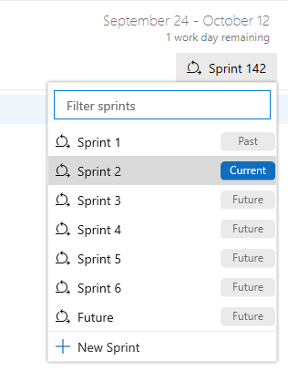
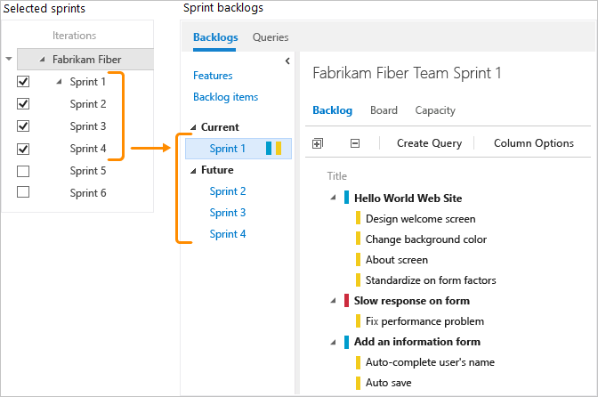

# About Sprints, Scrum and project management 

[!INCLUDE [temp](../_shared/version-vsts-tfs-all-versions.md)] 

The Scrum method uses Iteration Paths, also referred to as sprints, to plan work to perform by a team within a specific time period and cadence. To get started, several sprints are predefined for your team. If you're new to Scrum, get an overview from [What is Scrum?](/azure/devops/learn/agile/what-is-scrum).  

[!INCLUDE [temp](../_shared/setup-backlogs-boards.md)]

## Implement Scrum using Azure Boards 

The general sequence of steps for implementing Scrum using Azure Boards is as follows: 

### Configure teams and sprints

1. [Define project-level Iteration Paths and set dates](../../organizations/settings/set-iteration-paths-sprints.md)
1. (Optional) [Add project-level Area Paths](../../organizations/settings/set-area-paths.md) (Or,  add an area path when you configure each team) 
1. [Add teams](../../organizations/settings/add-teams.md) 
1. [Select team-level Iteration Paths](../../organizations/settings/set-iteration-paths-sprints.md#activate).

### Create team backlog 

1. [Create and prioritize your team backlog](../backlogs/create-your-backlog.md).
1. (Optional) [Forecast your team backlog](forecast.md).

### Implement a sprint 

You can quickly assign work items to a sprint by dragging and dropping them from the product backlog to the sprint. 

1. [Assign backlog items to a sprint](assign-work-sprint.md)  
2. [Add tasks to backlog items](add-tasks.md)  
3. [Set sprint capacity](set-capacity.md)  
4. [Adjust work to fit sprint capacity](adjust-work.md)  
5. (Optional) [Share your sprint plan](share-plan.md)  
6. [Update the Taskboard](task-board.md) 
7. [Monitor your sprint burndown](sprint-burndown.md) 

## Sprint backlogs and taskboards

Sprint backlogs and taskboards provide a filtered view of work items a team has assigned to a specific iteration path, or sprint. Sprints are defined for a project and then selected by teams. From your backlog, you can map work to an iteration path using drag-and-drop, and then view that work in a separate **sprint backlog**. 

::: moniker range=">= azure-devops-2019"
    
::: moniker-end

::: moniker range=">= tfs-2017 <= tfs-2018"

::: moniker-end

::: moniker range="<= tfs-2015"

::: moniker-end

## How selected sprints show up on the backlog
 
Each sprint that you select for your team provides access to a sprint backlog, taskboard, and other Agile tools for planning and tracking work. 

<a id="ts-sprints" /> 

::: moniker range=">= azure-devops-2019"

0. You can gain an overview of your sprint planning by turning the **Planning** view option on. From the product backlog or any sprint backlog, choose the  view options icon and select **Planning**.

	> [!div class="mx-imgBorder"]
	> 

	The set of sprints selected for your team appears. If you don't see any sprints listed, you can add sprints or select existing sprints for your team's use. To learn how, see [Define sprints](define-sprints.md). 

0. To select a sprint backlog, you can choose one of the sprint links from the **Planning** pane, or from a Sprint backlog, choose a sprint from the sprint selector.  

	> [!div class="mx-imgBorder"]
	> 

::: moniker-end

::: moniker range=">= tfs-2017 <= tfs-2018"  

For example, by selecting Sprints 1 thru 6, the Fabrikam Fiber team gets access to six sprint backlogs. They also get access to capacity planning tools and a taskboard for each sprint.  

::: moniker-end  

::: moniker range="<= tfs-2015"  

<a id="tfs2015-sprints" />

For example, by selecting Sprints 1 thru 4, the Fabrikam Fiber team gets access to four sprint backlogs. They also get access to capacity planning tools and a taskboard for each sprint.  

::: moniker-end  

## Try this next

> [!div class="nextstepaction"]
> [Schedule sprints](define-sprints.md) 

## Related articles 

- [Sprints and Scrum key concepts](scrum-key-concepts.md) 
- [Web portal navigation](../../project/navigation/index.md) 
- [Backlogs, portfolios, and Agile project management](../backlogs/backlogs-overview.md) 
- [About work items](../work-items/about-work-items.md)  

 

