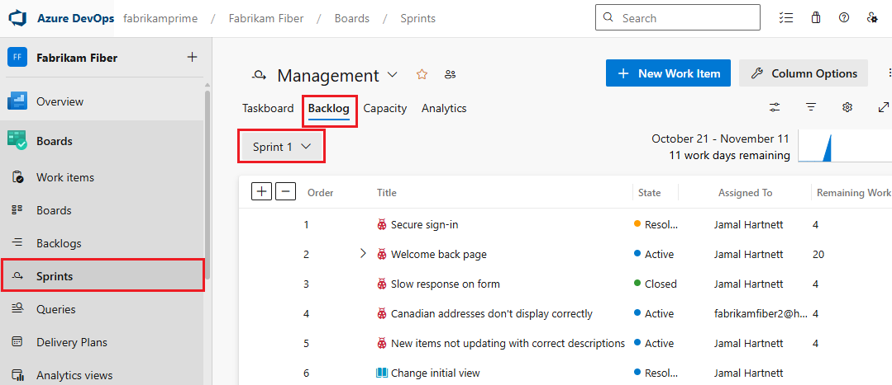
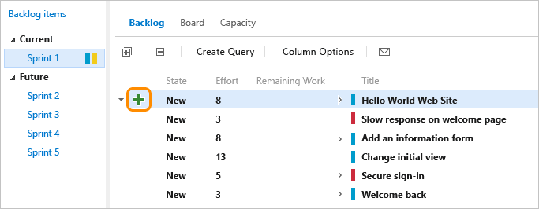
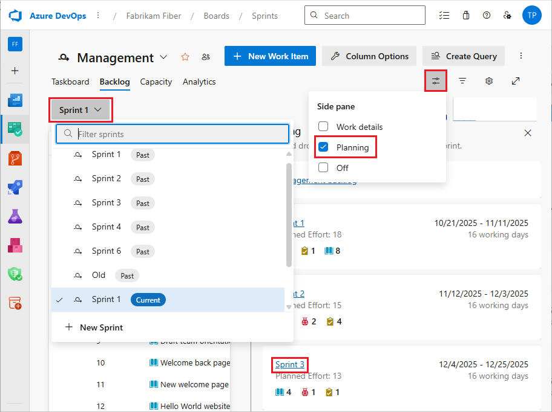
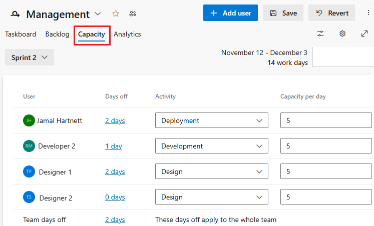
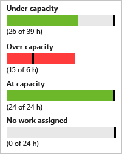
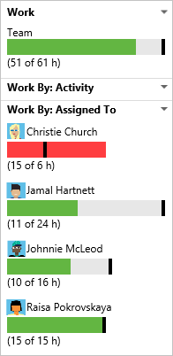
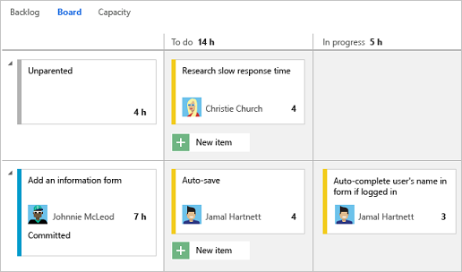
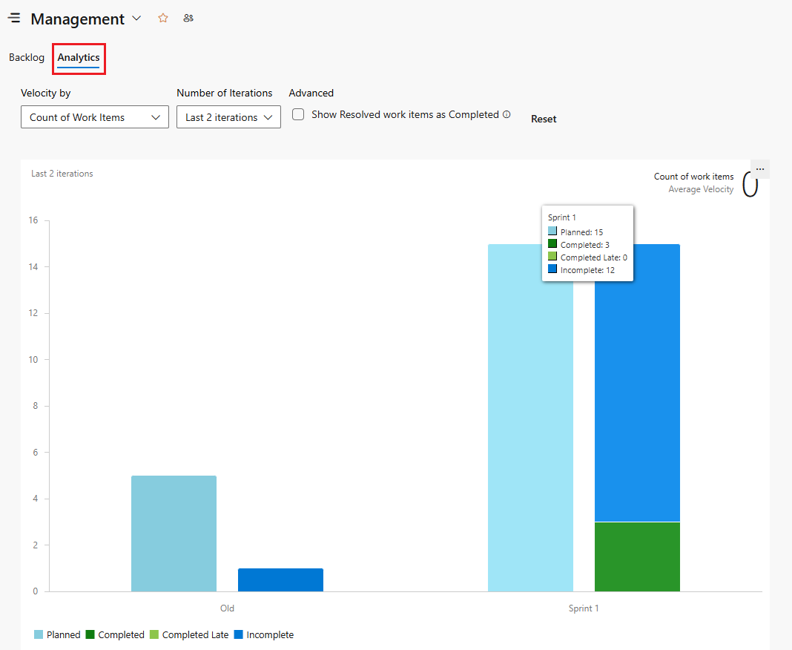
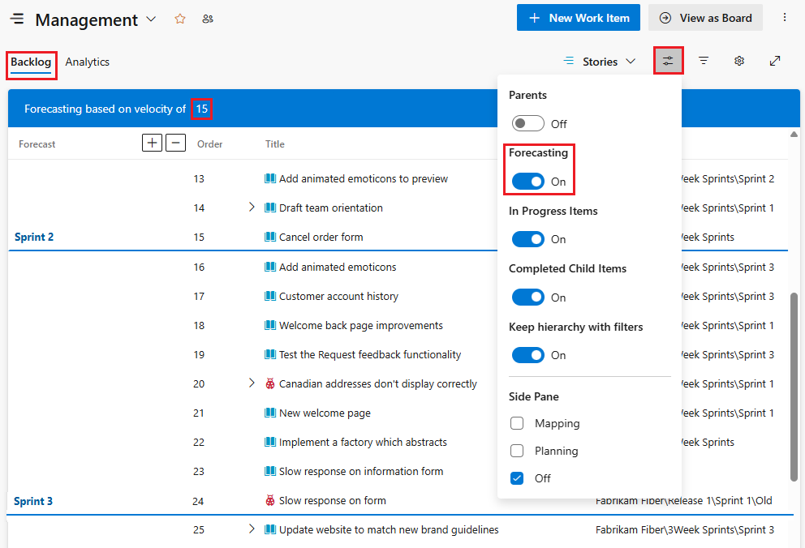

# About Sprints, Scrum and project management 

[!INCLUDE [temp](../includes/version-all.md)] 

Your Sprints tools includes a filtered backlog based on an Iteration Path, and a similarly filtered Taskboard. These tools are useful for implementing Scrum practices. With Scrum, you can schedule and plan sprints, update your taskboard, and monitor your sprint burndown. 

Scrum methods use Iteration Paths, also referred to as sprints, to plan work to be performed by a team within a specific time period and cadence. To get started, several sprints are predefined for your team. If you're new to Scrum, get an overview from [What is Scrum?](/devops/plan/what-is-scrum).  

[!INCLUDE [temp](../includes/setup-backlogs-boards.md)]

## Implement Scrum using Azure Boards 

The general sequence of steps for implementing Scrum using Azure Boards is as follows: 

### Configure teams and sprints

1. [Define project-level Iteration Paths and set dates](../../organizations/settings/set-iteration-paths-sprints.md)
1. (Optional) [Add project-level Area Paths](../../organizations/settings/set-area-paths.md) (Or,  add an area path when you configure each team) 
1. [Add teams](../../organizations/settings/add-teams.md) 
1. [Select team-level Iteration Paths](../../organizations/settings/set-iteration-paths-sprints.md#activate).

### Create team backlog 

1. [Create and prioritize your team backlog](../backlogs/create-your-backlog.md).
1. (Optional) [Forecast your team backlog](forecast.md).

### Implement a sprint 

You can quickly assign work items to a sprint by dragging and dropping them from the product backlog to the sprint. 

1. [Assign backlog items to a sprint](assign-work-sprint.md)  
2. [Add tasks to backlog items](add-tasks.md)  
3. [Set sprint capacity](set-capacity.md)  
4. [Adjust work to fit sprint capacity](adjust-work.md)  
5. (Optional) [Share your sprint plan](share-plan.md)  
6. [Update the Taskboard](task-board.md) 
7. [Monitor your sprint burndown](../../report/dashboards/configure-sprint-burndown.md) 

## Sprint backlogs and taskboards

Sprint backlogs and taskboards provide a filtered view of work items a team has assigned to a specific iteration path, or sprint. Sprints are defined for a project and then selected by teams. From your backlog, you can map work to an iteration path using drag-and-drop, and then view that work in a separate **sprint backlog**. 

::: moniker range=">= azure-devops-2019"
> [!div class="mx-imgBorder"]  
>     

::: moniker-end

::: moniker range=">= tfs-2017 <= tfs-2018"
> [!div class="mx-imgBorder"]  
> ["Web portal, choose Boards>Backlogs, Sprint](../work-items/media/view-add/view-sprint-backlog.png)

::: moniker-end

::: moniker range="<= tfs-2015"

::: moniker-end

## How selected sprints show up on the backlog
 
Each sprint that you select for your team provides access to a sprint backlog, taskboard, and other Agile tools for planning and tracking work. 

<a id="ts-sprints" /> 

::: moniker range=">= azure-devops-2019"

1. You can gain an overview of your sprint planning by turning the **Planning** view option on. From the product backlog or any sprint backlog, choose the :::image type="icon" source="../../media/icons/view-options-icon.png" border="false"::: view options icon and select **Planning**.

	> [!div class="mx-imgBorder"]
	> 

	> [!NOTE]   
	> The Planning pane will only show the current sprint and the next 10 future sprints in the list, even if more have been selected for the team. 

	The set of sprints selected for your team appears. If you don't see any sprints listed, you can add sprints or select existing sprints for your team's use. To learn how, see [Define sprints](define-sprints.md). 

1. To select a sprint backlog, you can choose one of the sprint links from the **Planning** pane, or from a Sprint backlog, choose a sprint from the sprint selector.  

	> [!div class="mx-imgBorder"]
	> 

::: moniker-end

::: moniker range=">= tfs-2017 <= tfs-2018"  

For example, by selecting Sprints 1 thru 6, the Fabrikam Fiber team gets access to six sprint backlogs. They also get access to capacity planning tools and a taskboard for each sprint.  

::: moniker-end  

::: moniker range="<= tfs-2015"  

<a id="tfs2015-sprints" />

For example, by selecting Sprints 1 thru 4, the Fabrikam Fiber team gets access to four sprint backlogs. They also get access to capacity planning tools and a taskboard for each sprint.  

::: moniker-end  

## Track team capacity

Once you've [defined iteration (sprint) paths and configured team iterations](../../organizations/settings/set-iteration-paths-sprints.md), you can start using the following tools to plan your sprint.  

At the start of each sprint, you'll want to plan the work that your team can commit to. The three Agile tools that support this work include the sprint backlog, capacity planning, and capacity bars. The sprint backlog contains a filtered subset of backlog items whose iteration path corresponds to the current sprint. 

<table valign="top" > 
<tr valign="top" > 
<td width="35%">

<b>Team capacity planning tool</b>

By setting team capacity, the team knows exactly the total number of work hours or days the team has for each sprint. With this tool, you set individual team member capacity as well as days off. And, conveniently, you can set holidays or shared days off taken by the entire team. 

Setting capacity for each team member working during a sprint causes the capacity bar for that individual to appear. 

You <a href="../../organizations/settings/set-working-days.md" data-raw-source="[set recurring days off](../../organizations/settings/set-working-days.md)">set recurring days off</a>, such as weekends, through team settings.

</td>
<td>
 
</td>
</tr>
<tr valign="top" > 
<td>

<b>Individual and team capacity bars</b>

With capacity bars, you can quickly see who is over, at, or under capacity. Capacity bars update with each of these activities: 

<ul>
<li>

Tasks are assigned with non-zero remaining work

</li>
<li>

Change in remaining work

</li>
<li>

Date change within the sprint cycle. Individual and team capacity always reflects their capacity from the current day till the end of the sprint.  

</li>
</ul>

Here&#39;s how to interpret the capacity colors:

</td>
<td width="455px">

</td>
</tr>
</table>

##  Update tasks, monitor burndown 

During a sprint, your team can use the taskboard and sprint burndown chart to track their progress. Your sprint burndown chart provides you with an at-a-glance visual to determine if your team is on track to meet their sprint plan.  
 
<table valign="top">
<tr valign="top" > 
<td width="35%">

<b>Taskboard</b>

Your <a href="task-board.md" data-raw-source="[Taskboard](task-board.md)">Taskboard</a> provides an interactive progress board for work required to complete the sprint backlog. During your sprint you&#39;ll want to update the status of tasks and the remaining work for each task. 

Updating tasks daily or several times a week yields a smoother burndown chart. 

</td>
<td width="520px">

</td>
</tr>
<tr valign="top" > 
<td>

<b>Sprint burndown chart</b>

You use the <a href="../../report/dashboards/configure-sprint-burndown.md" data-raw-source="[sprint burndown chart](../../report/dashboards/configure-sprint-burndown.md)">sprint burndown chart</a> to mitigate risk and check for scope creep throughout your sprint cycle. The burndown chart reflects the progress made by your team in completing all the work they estimated during their sprint planning meeting. 

The ideal trend line always indicates a smooth and steady burndown. The blue area, however, represents what&#39;s actually going on. It shows the buildup of work as team members add tasks and the reduction of work as team members complete those tasks.

</td>
<td>

</td>
</tr>
</table>

##  Velocity and forecast 

While you use sprint planning and tracking tools for each sprint, you use the velocity and forecast tools to estimate work that can be completed in future sprints.  

Velocity provides a useful metric for gaining insight into how much work your team can complete during a sprint cycle. And, the forecast tool provides a means for determining how much work your team can complete within a sprint based on a specified team velocity.  

After your team has worked several sprints, they can use the [Velocity chart](../../report/dashboards/team-velocity.md) and [Forecast tool](forecast.md) tool to estimate work that can be accomplished in future sprints.  
 

---
:::row:::
   :::column span="1":::
      **Velocity chart**  
      Each team is associated with one and only one velocity chart. The green bar within the chart indicates the total estimated effort (story points or size) of backlog items (user stories or requirements) completed within the sprint. (Blue corresponds to the estimated effort of items not yet completed.)   
      Velocity will vary depending on team capacity, sprint over sprint. However, over time, the velocity should indicate a reliable average that can be used to forecast the full backlog.  
      By minimizing the variability of backlog item size&mdash;effort or story points&mdash;you gain more reliable velocity metrics.
   :::column-end::: 
   :::column span="1":::
      
   :::column-end:::
:::row-end:::
---
:::row:::
   :::column span="1":::
      **Forecast tool**  
      You can use the forecast tool to get an idea of how many and which items you can complete within a sprint.  
      By plugging in a velocity, you can see which items are within scope for the set of sprints the team has selected. As shown here, a velocity of 15 indicates that it will take three sprints to complete the work shown.*
   :::column-end::: 
   :::column span="1":::
      
   :::column-end:::
:::row-end:::
---

<a id="sprint-scope-change" />

## Sprint scope change  

There isn't a sprint scope change chart or widget. However, you can query for work items added to a sprint  or moved out of a sprint after the start of the sprint. Use the steps provided next. 

## List work items added after the start of the sprint

1. [Open the velocity chart](../../report/dashboards/team-velocity.md) for the team and choose the **Planned** bar for the sprint of interest. You can use the Planned bar for a velocity chart widget or the team backlog velocity chart. 

	:::image type="content" source="media/overview/velocity-chart.png" alt-text="Screenshot of team velocity chart, choose a planned work bar.":::

2. The Query Results page opens with a list of work items defined for the sprint at the start of the sprint, the first day of the sprint. This list is an itemized list of work item IDs. 

3. Choose the Editor page to edit the query. 

4. To list those items that were added to the sprint after the start of the sprint, change the query to add and change the following clauses:  

	- Add a clause at the top to specify the Work Item Types of interest
	- Change the Operator for the ID Field to Not In.
	- Add the Iteration Path for the sprint of interest.
	- Add the Area Path for the team. 

	The updated query should look similar to the following image. 

	:::image type="content" source="media/overview/query-for-added-work-items-to-sprint.png" alt-text="Screenshot of Query Editor, Work Items added to a sprint after the start of the sprint.":::

5. Add **Created Date** as a column option, and sort by that field. You can then view the existing work items that were added to the sprint and what newly created work items were added.

## List work items moved out of the sprint  

1. [Open the velocity chart](../../report/dashboards/team-velocity.md) for the team and choose the **Planned** bar for the sprint of interest. You can use the Planned bar for a velocity chart widget or the team backlog velocity chart. 

	:::image type="content" source="media/overview/velocity-chart.png" alt-text="Screenshot of team velocity chart, choose a planned work bar, second instance.":::

2. The Query Results page opens with a list of work items defined for the sprint at the start of the sprint, the first day of the sprint. This list is an itemized list of work item IDs. 

3. Choose the Editor page to edit the query. 

4. To list those items that were moved out of the sprint after the start of the sprint, change the query to add and change the following clauses:  

	- Add a clause at the top to specify the Work Item Types of interest 
	- Add the Iteration Path for the sprint of interest, specify **Not Under** operator 
	- Add the Area Path for the team. 

	The updated query should look similar to the following image. 

	:::image type="content" source="media/overview/query-for-work-items-moved-out-of-sprint.png" alt-text="Screenshot of Query Editor, Work Items moved out of a sprint":::

For other options to determine changes to the sprint scope, see [Query by date or current iteration, List work items moved out of a sprint](../queries/query-by-date-or-current-iteration.md#list-work-items-moved-out-sprint).  

## Try this next

> [!div class="nextstepaction"]
> [Schedule sprints](define-sprints.md) 

## Related articles 

If you work with several teams, and each team wants their own backlog view, you can [create additional teams](../../organizations/settings/add-teams.md). Each team then gets access to their own set of Agile tools. Each Agile tool filters work items to only include those assigned values under the team's default area path and iteration path. 

- [Scrum concepts](scrum-key-concepts.md) 
- [Web portal navigation](../../project/navigation/index.md) 
- [Backlogs, portfolios, and Agile project management](../backlogs/backlogs-overview.md) 
- [About work items](../work-items/about-work-items.md)  
- [What is Scrum?](/devops/plan/what-is-scrum)
- [What is Agile development?](/devops/plan/what-is-agile-development) 
 

