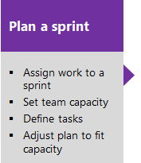

# About Sprints, Scrum and project management 

[!INCLUDE [temp](../_shared/version-vsts-tfs-all-versions.md)] 

The Scrum method uses sprints to plan work to perform by a team within a specific time period and cadence. To get started, several sprints are predefined for your team.  If you're new to Scrum, get an overview from [What is Scrum?](/azure/devops/learn/agile/what-is-scrum). 

## Sprint backlogs and task boards

Sprint backlogs and taskboards provide a filtered view of work items a team has assigned to a specific iteration path, or sprint. Sprints are defined for a project and then selected by teams. From your backlog, you can map work to an iteration path using drag-and-drop, and then view that work in a separate **sprint backlog**. 

# [New navigation](#tab/new-nav)
::: moniker range="vsts"
    
::: moniker-end

::: moniker range=">= tfs-2013 <= tfs-2018"
[!INCLUDE [temp](../_shared/new-agile-hubs-feature-not-supported.md)] 
::: moniker-end 

# [Previous navigation](#tab/previous-nav)

::: moniker range=">= tfs-2017"

::: moniker-end
::: moniker range=">= tfs-2013 <= tfs-2015"

::: moniker-end

---

## Implement Scrum 

You can quickly assign work items to a sprint by dragging and dropping them from the product backlog to the sprint. 

## Try this next
> [!div class="nextstepaction"]
> [Schedule sprints](define-sprints.md) 

## Related articles 
- [Web portal navigation](../../project/navigation/index.md) 
- [Backlogs, portfolios, and Agile project management](../backlogs/backlogs-overview.md) 
- [About work items](../work-items/about-work-items.md)  

 

