# 3. Determine and set sprint capacity

[!INCLUDE [temp](../includes/version-all.md)] 

As a next step, you'll want to determine your team's actual capacity. While velocity correlates to how your team estimates requirements, capacity correlates to actual task time. Time is calculated in either hours or days. Capacity takes into consideration the variation in work hours by team members. It also considers holidays, vacation days, and non-working days. 

Because days off and time available for each team member may vary from sprint to sprint, set capacity for each sprint. The capacity tool helps you make sure your team isn't over or undercommitted for the sprint. Also, as you work day-to-day, you'll see if your team is on track.

> [!div class="checklist"]   
> * Set team capacity for a sprint
> * Copy capacity from the previous sprint to the current sprint  
> * Track capacity when performing multiple activities  
> * Add or remove user accounts from capacity planning for a sprint  
> * Track capacity when working on more than one team  

If you haven't set up sprints yet for your team, see the [Manage sprint timelines while working in Scrum](define-sprints.md) article.

## Prerequisites

* Connect to a project. If you don't have a project yet, [create one](../../organizations/projects/create-project.md).
* You must be added to a project as a member of the **Contributors** or **Project Administrators** security group. To get added, [Add users to a project or team](../../organizations/security/add-users-team-project.md).  
* To view or set capacity, you must be granted **Basic** access or higher. Users with **Stakeholder** access can't view or set capacity. For details, see [Stakeholder access quick reference](../../organizations/security/stakeholder-access.md). 
* To set capacity, you must be a member of the team. For details, see [Add users to a project or team](../../organizations/security/add-users-team-project.md#add-users-to-a-team). 

 

## About the Activity or Discipline pick-list items

::: moniker range="azure-devops"

The values displayed for **Activity** (Agile, Basic, or Scrum) or **Discipline** (CMMI) reflect a union of all values defined for the [Activity or Discipline](../queries/query-numeric.md#fields-used-to-estimate-and-track-work) fields in all projects within the organization. 

To change the **Activity** or **Discipline** menu selections, see [Add and manage fields](../../organizations/settings/work/customize-process-field.md). 

::: moniker-end

::: moniker range="< azure-devops"

The values displayed for **Activity** (Agile, Basic, or Scrum) or **Discipline** (CMMI) reflect a union of all values defined for the [Activity or Discipline](../queries/query-numeric.md#fields-used-to-estimate-and-track-work) fields in all projects within the project collection. Or, if your project has been customized, with the field assigned to [`type="Activity" within the ProcessConfiguration file`](../../reference/xml/process-configuration-xml-element.md#assign-agile-tool-fields). 

To change the **Activity** or **Discipline** menu selections, see [Add or modify a field, customize a picklist](../../reference/add-modify-field.md). 

::: moniker-end

## Capacity per day entries 
 
Most teams specify capacity in hours. You can also specify it in days or any other units your team chooses. For example, 0.5 days would correspond to 4 hours for a typical 8 hour day. Choose the same unit your team uses to estimate and track their time. For example, the entries they'll make to the [Original Estimate or Remaining Work](../queries/query-numeric.md#fields-used-to-estimate-and-track-work) fields.  

## Open a sprint backlog for a team 

::: moniker range=">= azure-devops-2019"

1. From your web browser, open your product backlog. (1) Check that you've selected the right project, (2) choose **Boards>Sprints**, (3) select the correct team from the team selector menu, and lastly (4), choose **Capacity**. 

	> [!div class="mx-imgBorder"]  
	> 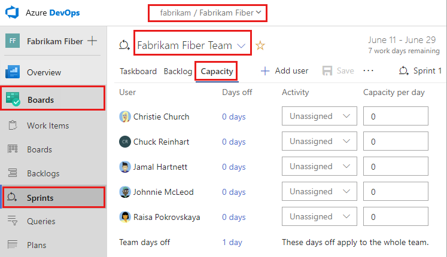

	To choose another team, open the selector and select a different team or choose the **Browse all sprints** option. Or, you can enter a keyword in the search box to filter the list of team backlogs for the project.

	> [!div class="mx-imgBorder"]  
	> 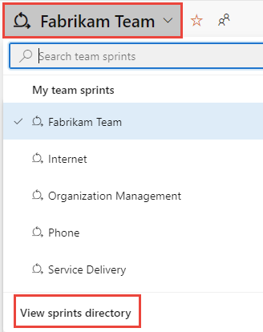 

1. To choose a different sprint than the one shown, open the sprint selector and choose the sprint you want. 

	> [!div class="mx-imgBorder"]  
	> 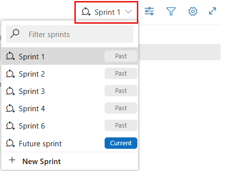

	The system lists only those sprints that have been selected for the current team focus. If you don't see the sprints you want listed, then choose **New Sprint** from the menu, and then choose **Select existing iteration**. For details, see [Define iteration (sprint) paths](../../organizations/settings/set-iteration-paths-sprints.md). 

::: moniker-end

::: moniker range=">= tfs-2013 <= tfs-2018"

1. From your web browser, open your team's product backlog. (1) Select the project/team from the project/teams selector, choose (2) **Work**, (3) **Backlogs**, and then (4) the product backlog, which is **Backlog items** (for Scrum), **Stories** (for Agile), or **Requirements** (for CMMI). 

	> [!div class="mx-imgBorder"]
	> 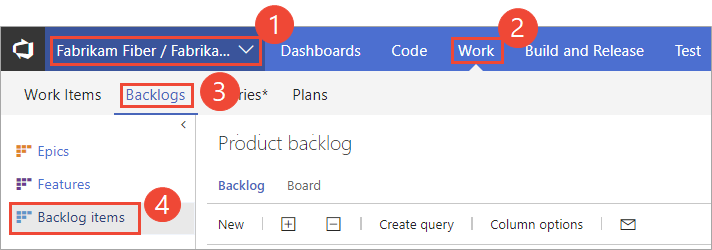 

	To choose another team, open the project/team selector and select a different team or choose the **Browse** option. 

	> [!div class="mx-imgBorder"]  
	>  

	The set of sprints selected for your team appears in the left pane. If you don't see any sprints listed, you can add sprints or select existing sprints for your team's use. To learn how, see [Define sprints](define-sprints.md). 

1. Choose the sprint you want to plan. 

	> [!div class="mx-imgBorder"]  
	> 

	The system lists only those sprints that have been selected for the current team focus. If you don't see the sprints you want listed, then see [Define iteration (sprint) paths](../../organizations/settings/set-iteration-paths-sprints.md). 

::: moniker-end

 

## Set capacity for the team and team members 

From the **Capacity** page, you can add team members, enter the team time off, and set capacity and days off for each team member.  

::: moniker range=">= azure-devops-2019"

1. If you don't see your team members listed, add them. Choose the  :::image type="icon" source="../../media/icons/actions-icon.png" border="false"::: action icon and select **Add all team members**. For this feature to work, [team members will have been added to the team](../../organizations/settings/add-teams.md#add-team-members).  

	> [!div class="mx-imgBorder"]
	> 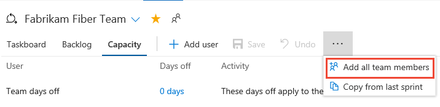 

	> [!NOTE]  
	> The **Add all team members** action retrieved a maximum of 100 team members. If you have more team members to add, then you can add them one by one by choosing **Add user**.

1. If you need to add other contributors to your project, choose the :::image type="icon" source="../../media/icons/blue-add-icon.png" border="false"::: **Add user**.  

2. Next, set any time off that a team member will take. For the entire team days off, choose the **0 days** link as shown.  

	> [!div class="mx-imgBorder"]
	>  

	In the **Days off for** dialog, select the start and end days during the sprint that the team member or team will take off. 

	> [!NOTE]
	> Your sprint planning and tracking tools automatically consider days off when calculating capacity and sprint burndown. You only have to indicate planned days off for the team. You set weekend days or other recurring days off under your team's [Settings, Working days](../../organizations/settings/set-working-days.md) page. 

3. Now, set the **Activity/Discipline** and **Capacity** per day for each team member. If you track capacity simply by team member, you can leave the Activity or Discipline selection unassigned. 

	For example, Christie Church's capacity is 6 hours/day for design work. 

	> [!div class="mx-imgBorder"]  
	> 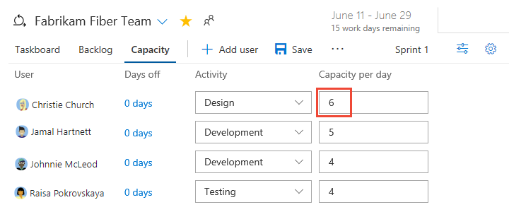

::: moniker-end

::: moniker range=">= tfs-2015 <= tfs-2018"

1. If you don't see your team members listed, add them. Choose the :::image type="icon" source="media/capacity/capacity-add-users.png" border="false"::: **Add missing team members** icon. For this feature to work, [team members will have been added to the team](../../organizations/settings/add-teams.md#add-team-members).  

	> [!div class="mx-imgBorder"]
	> 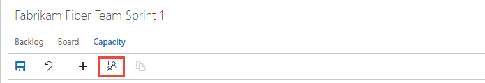  

2. If you need to add other contributors to your project, choose the :::image type="icon" source="../media/icons/add-light-icon.png" border="false"::: **Add user** icon.  

3. Next, set any time off that a team member will take. For the entire team days off, choose the **0 days** link as shown.  

	> [!div class="mx-imgBorder"]
	> 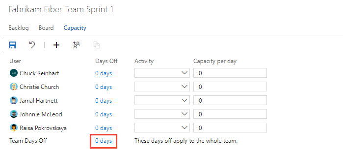 

	In the Days off for the entire team dialog, select the start and end days during the sprint that the team will take off. 

	> [!NOTE]
	> Your sprint planning and tracking tools automatically consider days off when calculating capacity and sprint burndown. Leave those days of the week that your team doesn't work unchecked in your team's Settings, [Working days](../../organizations/settings/set-working-days.md) page.  

4. Now, set the **Activity/Discipline** and **Capacity** per day for each team member. If you track capacity simply by team member, you can leave the Activity or Discipline selection unassigned. 

	For example, Christie Church's capacity is 6 hours/day for design work. 

	> [!div class="mx-imgBorder"]  
	> 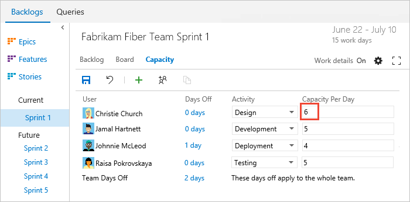

	#### TFS 2015.1  
	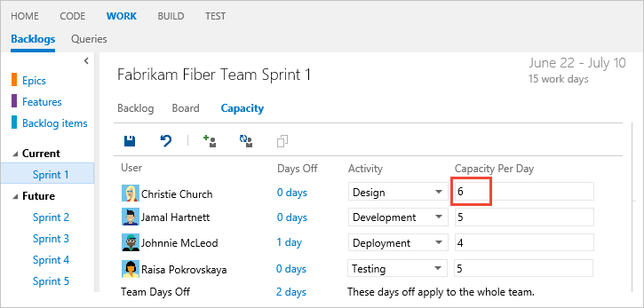

	#### TFS 2015, TFS 2013  

	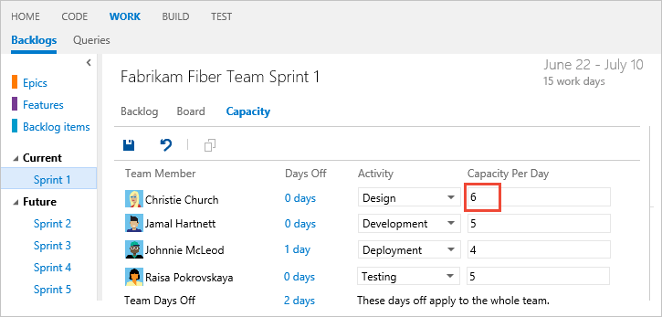"   

::: moniker-end  

::: moniker range=">= tfs-2015"

## Copy capacity planning from the previous sprint 

By copying the capacity from the previous sprint, you save time. With the basics defined, all you have to do is adjust the capacity based on individual and team days off and capacity allocation per activity.  

> [!NOTE]    
> This feature is available from TFS 2015.1 and later versions.

Notice that only the capacity-per-day value and activity value are copied over. Individual and team days off remain unset. The copy operation always copies the latest updates made to the previous sprint. So you can repeat the copy operation if you've made changes to the previous sprint that you want to copy to the latest sprint. 

::: moniker-end

::: moniker range=">= azure-devops-2019"

> [!div class="mx-imgBorder"]  
> 

::: moniker-end

::: moniker range="<= tfs-2018"

For example, here we choose Sprint 2 and copy the capacity set for Sprint 1. 
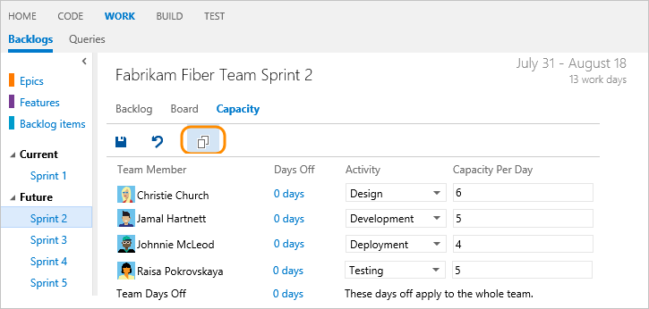

::: moniker-end

::: moniker range=">= tfs-2015"

## Remove a user from capacity 

To remove a user, choose the option from the users  :::image type="icon" source="../../media/icons/actions-icon.png" border="false"::: action menu. This action won't remove the user from the team.

::: moniker-end

::: moniker range="tfs-2015"

> [!NOTE]    
> This feature is available from TFS 2015.1 and later versions.

::: moniker-end

::: moniker range=">= azure-devops-2019"

> [!div class="mx-imgBorder"]  
> 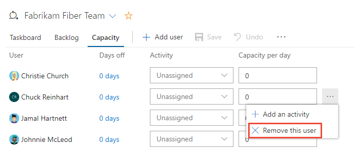

::: moniker-end

::: moniker range=">= tfs-2015 <= tfs-2018"
 

::: moniker-end

## Review capacity charts 

As you define tasks and estimate the work, you'll see capacity charts start to fill in for each team member. Capacity bars track the remaining work against the capacity for each team member and the entire team.  

You'll also see a roll-up of the remaining work required to complete each requirement or bug.  

::: moniker range=">= azure-devops-2019"

> [!div class="mx-imgBorder"]  
> 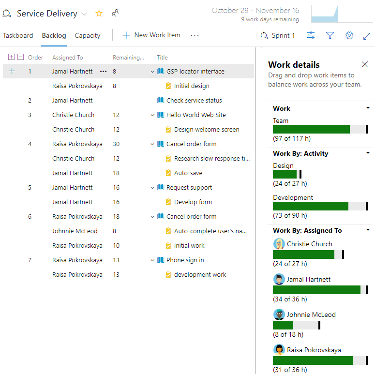   

::: moniker-end

::: moniker range="<= tfs-2018"

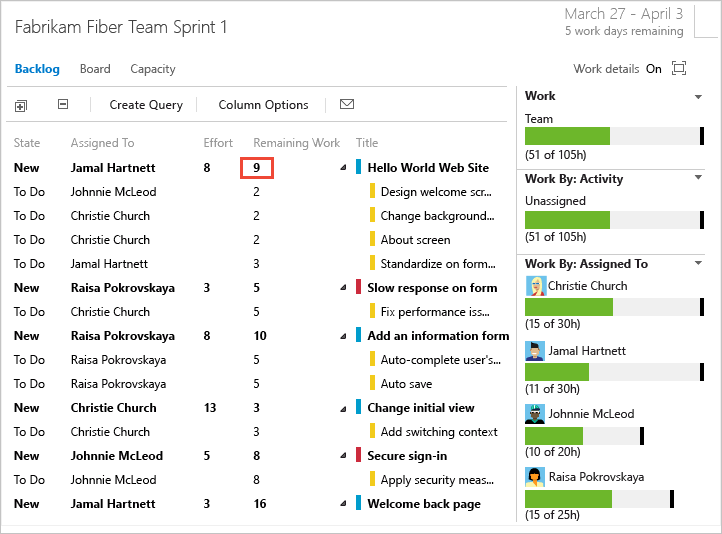  

::: moniker-end

From this view, you can easily see which individuals are at or near capacity. Teams can determine if work needs to be moved out of the sprint or to reassign tasks.  

::: moniker range=">= azure-devops-2019"

> [!TIP]  
> Define tasks that take a day or less to complete. This helps mitigate the risks that come from poor estimates.
>
> Also, don't divide tasks into subtasks. If you do divide a task into subtasks, specify Remaining Work only for the subtasks, as the system rolls up summary values to the parent task. 

::: moniker-end

::: moniker range="<= tfs-2018"

> [!TIP]  
> Define tasks that take a day or less to complete. This helps mitigate the risks that come from poor estimates.
>
> Also, don't divide tasks into sub-tasks as [taskboards only show leaf node tasks](../backlogs/resolve-backlog-reorder-issues.md). If you do divide a task into sub-tasks, specify Remaining Work only for the sub-tasks, as the system rolls up summary values to the parent task. 

::: moniker-end

::: moniker range=">= tfs-2015"

## Track capacity when completing multiple activities

Because individual team members have different sets of skills and duties, you can track their activity and capacity for each activity and for each sprint. 

Here, Jamal divides time between Deployment and Development. 

> [!div class="mx-imgBorder"]  
>  

::: moniker-end

::: moniker range="tfs-2015"

> [!NOTE]    
> This feature is available from TFS 2015.1 and later versions.

::: moniker-end

## Track capacity when working on more than one team

If you work on more than one team, you'll want to specify your sprint capacity for each team. For example, both Christie and Raisa split their time between the Web and Phone teams. As such, give 3 hours a day to the Web team, and 3 hours a day to the Phone team.  

> [!div class="mx-imgBorder"]  
> 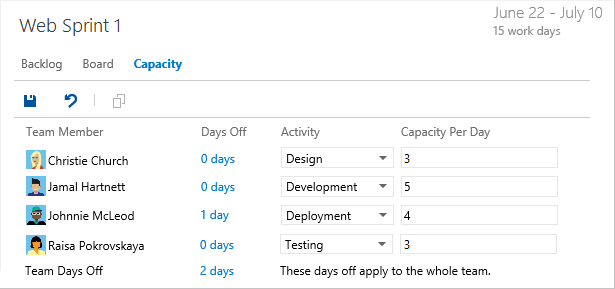
 
> [!div class="mx-imgBorder"]  
> 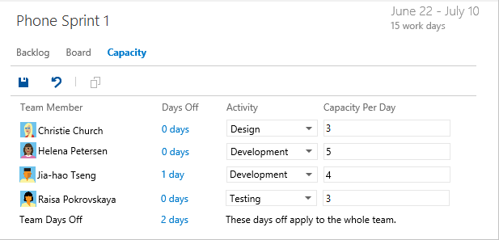
 
If your name isn't listed in the capacity view, you need to be added as a team member. 

## Next step

> [!div class="nextstepaction"]
> [4. Adjust work](adjust-work.md) 

## Related articles

Setting capacity and [estimating remaining work for each task](assign-work-sprint.md) provides you with the tools you need to track the amount of work and resources you have given sprint over sprint.  

- [Sprint burndown](../../report/dashboards/configure-sprint-burndown.md)
- [Velocity](../../report/dashboards/team-velocity.md)  
- [Forecasting](../sprints/forecast.md)    
- [Manage teams and configure team tools](../../organizations/settings/manage-teams.md)