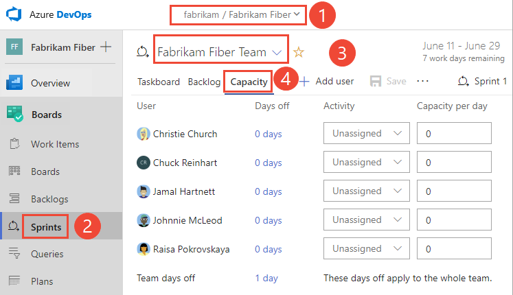

# 3. Set sprint capacity

[!INCLUDE [temp](../_shared/version-vsts-tfs-all-versions.md)] 

As a next step, you'll want to determine your team's actual capacity. Whereas velocity correlates to how your team estimates requirements, capacity correlates to actual task time - either hours or days. Capacity takes into consideration the variation in work hours by team members as well as holidays, vacation days, and non-working days. 

Because days off and time available for each team member can vary from sprint to sprint, you can set capacity for each sprint. The capacity tool helps you make sure your team isn't over or under committed for the sprint. Also, as you work day-to-day, you'll be able to see if your team is on track.

> [!div class="checklist"]   
> * Set team capacity for a sprint
> * Copy capacity from the previous sprint to the current sprint  
> * Track capacity when performing multiple activities  
> * Add or remove user accounts from capacity planning for a sprint  
> * Track capacity when working on more than one team  

If you haven't set up sprints yet for your team, go [here to do that now](define-sprints.md).

## Prerequisites

* You must connect to a project. If you don't have a project yet, [create one](/azure/devops/organizations/projects/create-project).
* You must be added to a project as a member of the **Contributors** or **Project Administrators** security group. To get added, [Add users to a project or team](/azure/devops/organizations/security/add-users-team-project).  
* To view or set capacity, you must be granted **Basic** access or higher. For details, see [About access levels](/azure/devops/organizations/security/access-levels). Users with **Stakeholder** access can't view or set capacity.

## Open a Sprint backlog for a team 

::: moniker range=">= azure-devops-2019"

0. From your web browser, open your product backlog. (1) Check that you have selected the right project, (2) choose **Boards>Sprints**, (3) select the correct team from the team selector menu, and lastly (4), choose **Capacity**. 

	> [!div class="mx-imgBorder"]  
	> 

	To choose another team, open the selector and select a different team or choose the  **Browse all sprints** option. Or, you can enter a keyword in the search box to filter the list of team backlogs for the project.

	> [!div class="mx-imgBorder"]  
	>  

0. To choose a different sprint than the one shown, open the sprint selector and choose the sprint you want. 

	> [!div class="mx-imgBorder"]  
	> 

	The system lists only those sprints that have been selected for the current team focus. If you don't see the sprints you want listed, then choose **New Sprint** from the menu, and then choose **Select existing iteration**. For details, see [Define iteration paths (aka sprints)](../../organizations/settings/set-iteration-paths-sprints.md). 

::: moniker-end

::: moniker range=">= tfs-2013 <= tfs-2018"

0. From your web browser, open your team's product backlog. (1) Select the project/team from the project/teams selector, choose (2) **Work**, (3) **Backlogs**, and then (4) the product backlog, which is **Backlog items** (for Scrum), **Stories** (for Agile), or **Requirements** (for CMMI). 

	> [!div class="mx-imgBorder"]
	>  

	To choose another team, open the project/team selector and select a different team or choose the **Browse** option. 

	> [!div class="mx-imgBorder"]  
	>  

	The set of sprints selected for your team appears in the left pane. If you don't see any sprints listed, you can add sprints or select existing sprints for your team's use. To learn how, see [Define sprints](define-sprints.md). 

0. Choose the sprint you want to plan. 

	> [!div class="mx-imgBorder"]  
	> 

	The system lists only those sprints that have been selected for the current team focus. If you don't see the sprints you want listed, then see [Define iteration paths (aka sprints)](../../organizations/settings/set-iteration-paths-sprints.md). 

::: moniker-end

 
## Set capacity for the team and team members 

From the **Capacity** page, you can enter the team time off, and set capacity and days off for each member of your team. If your team tracks capacity by activity, then also select the Activity for each team member.  

::: moniker range=">= azure-devops-2019"

0. If you don't see your team members listed, add them. Choose the  action icon and select **Add all team members**. For this feature to work, [team members will have been added to the team](../../organizations/settings/add-teams.md#add-team-members).  

	> [!div class="mx-imgBorder"]
	>  

0. If you need to add other contributors to your project, choose the  **Add user**.  

0. Next, set any time off that the team will take. Choose the **0 days** link as shown.  

	> [!div class="mx-imgBorder"]
	>  

	In the Days off for the entire team dialog, select the start and end days during the sprint that the team will take off. 

	> [!NOTE]
	> Your sprint planning and tracking tools automatically consider days off when calculating capacity and sprint burndown. You only have to indicate planned days off for the team. You set weekend days or other recurring days off under your team's [Settings, Working days](../../organizations/settings/set-working-days.md) page. 

0. Now, set the **Activity** and **Capacity** per day for each team member. 

	Most teams specify capacity in terms of hours, however, you can also specify it in days. For example, .5 days would correspond to 4 hours for a typical 8 hour day. Choose the same unit you will use to estimate the time a task will take to complete. You only have to indicate planned days off. You [manage weekend days or other recurring days off](../../organizations/settings/set-working-days.md) under team settings.

	For example, Christie Church's capacity is 6 hours/day for design work. 

	> [!div class="mx-imgBorder"]  
	> 

::: moniker-end

::: moniker range=">= tfs-2015 <= tfs-2018"

0. If you don't see your team members listed, add them. Choose the  **Add missing team members** icon. For this feature to work, [team members will have been added to the team](../../organizations/settings/add-teams.md#add-team-members).  

	> [!div class="mx-imgBorder"]
	>   

0.  If you need to add other contributors to your project, choose the  **Add user** icon.  
::: moniker-end  

0. Set any time off that the team will take. Choose the **0 days** link as shown.

	> [!div class="mx-imgBorder"]
	>  

	In the Days off for the entire team dialog, select the start and end days during the sprint that the team will take off. 

	> [!NOTE]
	> Your sprint planning and tracking tools automatically consider days off when calculating capacity and sprint burndown. Leave those days of the week that your team doesn't work unchecked in your team's Settings, [Working days](../../organizations/settings/set-working-days.md) page.  

0. Now, set the **Activity** and **Capacity** per day for each team member. 

	Most teams specify capacity in terms of hours, however, you can also specify it in days. For example, .5 days would correspond to 4 hours for a typical 8 hour day. Choose the same unit you will use to estimate the time a task will take to complete. You only have to indicate planned days off. You [manage weekend days or other recurring days off](../../organizations/settings/set-working-days.md) under team settings.

	For example, Christie Church's capacity is 6 hours/day for design work. 
	::: moniker range=">= tfs-2017"  
	> [!div class="mx-imgBorder"]  
	> 
	::: moniker-end  
	::: moniker range=">= tfs-2013 <= tfs-2015"  
	#### TFS 2015.1  
	
	#### TFS 2015, TFS 2013  
	"   
	::: moniker-end  

	  

	::: moniker range="azure-devops"  

	> [!NOTE]    
	> Customizing the picklist of the [Activity](../queries/query-numeric.md) (Basic, Agile, or Scrum) or [Discipline](../queries/query-numeric.md) (CMMI) fields isn't supported at this time.  

	::: moniker-end

	::: moniker range="azure-devops-2019"  
	> [!NOTE]    
	> If you the On-premises XML process model to customize work tracking, you can add to or modify the items listed for the [Activity](../queries/query-numeric.md) (Agile, or Scrum) or [Discipline](../queries/query-numeric.md) (CMMI) fields by [customizing its picklist](../../reference/add-modify-field.md). The set of values listed corresponds to the combined set of all values defined for the field across all projects in the collection.  If you use the Inheritance process model, customization of the picklist isn't supported at this time. 

	::: moniker-end

	::: moniker range="<= tfs-2018"  

	> [!NOTE]    
	> You can add to or modify the items listed for the [Activity](../queries/query-numeric.md) (Agile or Scrum) or [Discipline](../queries/query-numeric.md) (CMMI) fields by [customizing its picklist](../../reference/add-modify-field.md). The set of values listed corresponds to the combined set of all values defined for the field across all projects in the collection.  

	::: moniker-end

::: moniker range=">= tfs-2015"

## Copy capacity planning from the previous sprint 

By copying the capacity from the previous sprint, you save time. With the basics defined, all you have to do is adjust the capacity based on individual and team days off and capacity allocation per activity.  

::: moniker-end

::: moniker range="tfs-2015"
> [!NOTE]    
> This feature is available from TFS 2015.1 and later versions.

Notice that only the capacity per day and activity are copied over. Individual and team days off remain unset. The copy operation always copies the latest updates made to the previous sprint. So you can repeat the copy operation if you've made changes to the previous sprint that you want to copy to the latest sprint. 

::: moniker-end

::: moniker range=">= azure-devops-2019"

> [!div class="mx-imgBorder"]  
> 

::: moniker-end

::: moniker range="<= tfs-2018"

For example, here we choose Sprint 2 and copy the capacity set for Sprint 1. 

::: moniker-end

::: moniker range=">= tfs-2015"

## Remove a user from capacity 

To remove a user, choose the option from the users  action menu. 

::: moniker-end

::: moniker range="tfs-2015"
> [!NOTE]    
> This feature is available from TFS 2015.1 and later versions.
::: moniker-end

::: moniker range=">= azure-devops-2019"

> [!div class="mx-imgBorder"]  
> 

::: moniker-end

::: moniker range=">= tfs-2015 <= tfs-2018"
 
::: moniker-end

## Review capacity charts 

As you define tasks and estimate the work, you'll see capacity charts start to fill in for each team member. Capacity bars track the remaining work against the capacity for each team member as well as the entire team.  

You'll also see a roll-up of the remaining work required to complete each requirement or bug.  

::: moniker range=">= azure-devops-2019"
> [!div class="mx-imgBorder"]  
>    
::: moniker-end

::: moniker range="<= tfs-2018"
  
::: moniker-end

From this view, you can easily see which individuals are at or near capacity. Teams can determine if work needs to be moved out of the sprint or to reassign tasks.  

::: moniker range=">= azure-devops-2019"

> [!TIP]  
> Define tasks that take a day or less to complete. This helps mitigate the risks that come from poor estimates.
>
> Also, don't divide tasks into subtasks. If you do divide a task into subtasks, specify Remaining Work only for the subtasks, as the system rolls up summary values to the parent task. 

::: moniker-end

::: moniker range="<= tfs-2018"
> [!TIP]  
> Define tasks that take a day or less to complete. This helps mitigate the risks that come from poor estimates.
>
> Also, don't divide tasks into subtasks as the [taskboard will only show leaf node tasks](../backlogs/resolve-backlog-reorder-issues.md?toc=/azure/devops/boards/sprints/toc.json&bc=/azure/devops/boards/sprints/breadcrumb/toc.json#bugs-as-tasks). If you do divide a task into subtasks, specify Remaining Work only for the subtasks, as the system rolls up summary values to the parent task. 

::: moniker-end

::: moniker range=">= tfs-2015"

## Track capacity when performing multiple activities

Because individual team members have different sets of skills and duties, you can track their activity and capacity for each activity and for each sprint. 

Here, Jamal divides his time between Deployment and Development. 

> [!div class="mx-imgBorder"]  
>  

::: moniker-end

::: moniker range="tfs-2015"
> [!NOTE]    
> This feature is available from TFS 2015.1 and later versions.
::: moniker-end

## Track capacity when working on more than one team
If you work on more than one team, you'll want to specify your sprint capacity for each team. For example, both Christie and Raisa split their time between the Web and Phone teams. They therefore allocate 3 hours a day to the Web team, and 3 hours a day to the Phone team.  

> [!div class="mx-imgBorder"]  
> 
 
> [!div class="mx-imgBorder"]  
> 
 
If your name isn't listed in the capacity view, you need to be added as a team member. 

## Try this next
> [!div class="nextstepaction"]
> [4. Adjust work](adjust-work.md) 

## Related articles
Setting capacity and [estimating remaining work for each task](assign-work-sprint.md) provides you with the tools you need to track the amount of work and resources you have allocated sprint over sprint.  

- [Sprint burndown](../sprints/sprint-burndown.md)
- [Velocity](../../report/dashboards/velocity-chart-data-store.md)  
- [Forecasting](../sprints/forecast.md)    
- [Manage teams and configure team tools](../../organizations/settings/manage-teams.md)

