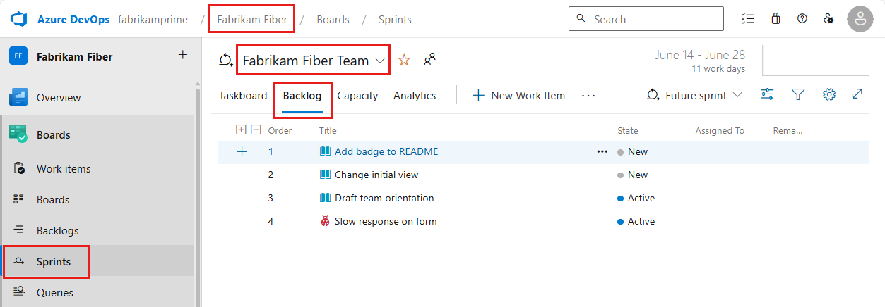
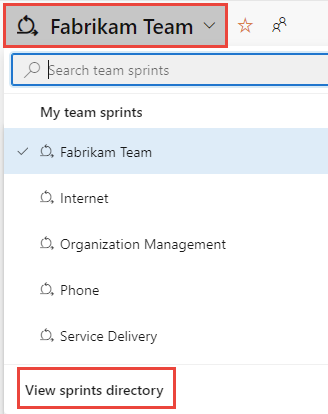
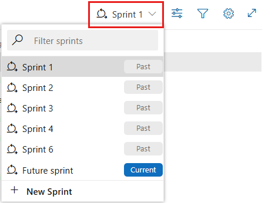
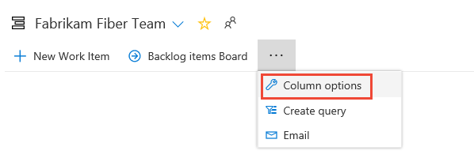
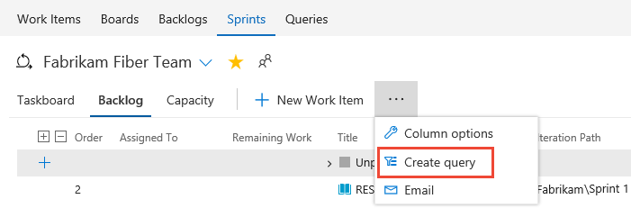
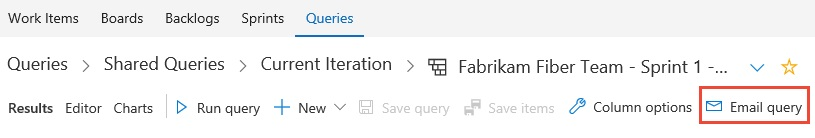

# 5. Share your sprint plan

[!INCLUDE [version-lt-eq-azure-devops](../../includes/version-lt-eq-azure-devops.md)] 
 

After you complete your sprint plan, share it with your team and organization.
Stakeholders with project access can view the plan directly from the sprint backlog URL.
You can also distribute the plan by email or print a copy.

[!INCLUDE [ai-assistance-mcp-server-tip](../../includes/ai-assistance-mcp-server-tip.md)]

## Open a sprint backlog for a team 

::: moniker range="<=azure-devops"

1. From your web browser, open your project, select **Boards** > **Sprints**, select the correct team, and then select **Backlog**.

    > [!div class="mx-imgBorder"]  
    > 

   To switch teams, open the team selector and select a different team, or select the :::image type="icon" source="../../media/icons/home-icon.png" border="false"::: **Browse all sprints** option.
   You can also enter a keyword in the search box to filter the list of team backlogs.

   > [!div class="mx-imgBorder"]  
   >   

2. To select a different sprint, open the sprint selector and select the sprint you want.

	> [!div class="mx-imgBorder"]  
	> 

	Only sprints selected for the current team's focus appear in the list.
	If the sprint you want isn't listed, select **New Sprint** from the menu, and then select **Select existing iteration**.
	For more information, see [Define iteration (sprint) paths](../../organizations/settings/set-iteration-paths-sprints.md). 

::: moniker-end

## Create query for your sprint plan 

::: moniker range="<=azure-devops"

1. (Optional) To change which columns display and their order, select the :::image type="icon" source="../../media/icons/actions-icon.png" border="false"::: actions icon, and then select **Column options**.
   For more information, see [Change column options](../backlogs/set-column-options.md).

	> [!div class="mx-imgBorder"]  
	>  

2. To email your sprint plan, create a query from the sprint backlog and save it.

	> [!div class="mx-imgBorder"]  
	>  

3. Open the query and select the email icon.

   > [!div class="mx-imgBorder"]  
   >  

4. In the form that appears, enter the names of users who have access to the project.

   > [!IMPORTANT]     
   > You can only send email to individual addresses for project members recognized by the system. Adding a team group or security group to the **To** line isn't supported. If you add an unrecognized email account, you receive a message that one or more recipients don't have permissions to read the mailed work items.  

::: moniker-end

Alternatively, select all items in the list, select **Copy as HTML**, and paste the formatted list into an email or Word document.

## Use AI to review your sprint plan

If you connect the [Azure Boards MCP Server](../../mcp-server/mcp-server-overview.md) to your AI agent in agent mode, you can use natural language prompts to review and summarize your sprint plan.

| Task | Example prompt |
|------|----------------|
| Summarize sprint plan | `Summarize the Sprint 12 backlog for <Contoso Team> including item count, total story points, and assignees` |
| Export sprint data | `List all work items in Sprint 12 for <Contoso Team> with title, assignee, state, and story points` |
| Check sprint readiness | `Are there any user stories in Sprint 12 for <Contoso Team> that have no tasks assigned?` |
| Compare sprints | `Compare planned work in Sprint 11 vs. Sprint 12 for <Contoso Team> by total story points and item count` |
| Identify workload imbalances | `Which team members in Sprint 12 for <Contoso Team> have the most and fewest story points assigned?` |
| Find at-risk items | `Show any work items in Sprint 12 for <Contoso Team> that are still in the New or Active state with no remaining days in the sprint` |
| Generate a stakeholder update | `Draft a brief status summary of Sprint 12 progress for <Contoso Team> including completed, in-progress, and not-started items` |

> [!NOTE]
> Agent mode and the MCP Server use natural language, so you can adjust these prompts or ask follow-up questions to refine the results.

## Next step

> [!div class="nextstepaction"]
> [6. Update the taskboard](task-board.md) 

## Related content

- [Send email with work items](../work-items/email-work-items.md)
