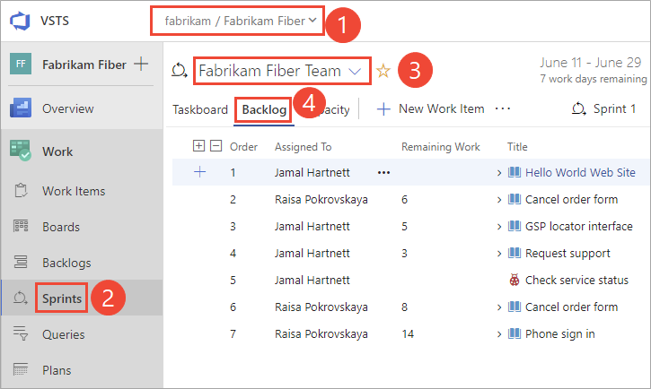
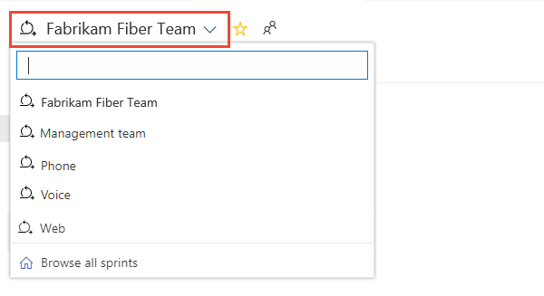
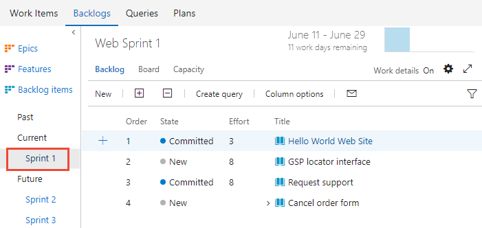
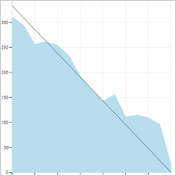

# Monitor sprint burndown 
 
[!INCLUDE [temp](../_shared/version-vsts-tfs-all-versions.md)] 

Throughout your sprint, you can monitor the sprint burndown chart to determine if your team is on track to complete its [sprint plan](assign-work-sprint.md). 

::: moniker range=">= azure-devops-2019"

> [!NOTE]  
> To add the current sprint's chart to a dashboard, add the [Sprint burndown widget](../../report/dashboards/widget-catalog.md#sprint-burndown). For additional burndown and burnup widgets available through the Analytics service, see [Configure a Burndown or Burnup widget](../..//report/dashboards/configure-burndown-burnup-widgets.md). 

::: moniker-end

::: moniker range=">= tfs-2015 <= tfs-2018"

> [!NOTE]  
> To add the current sprint's chart to a dashboard, add the [Sprint burndown widget](../../report/dashboards/widget-catalog.md#sprint-burndown).  

::: moniker-end

Use this article to learn:

> [!div class="checklist"]      
> * How to view current and past sprint burndowns 
> * Required and recommended activities to support sprint burndown    

For usage guidance, see [Burndown guidance](../../report/dashboards/burndown-guidance.md).

> [!NOTE]    
> The system automatically builds a sprint burndown chart based on the tasks and Remaining Work estimates you define and update throughout the sprint cycle. For details, see [Sprint planning](assign-work-sprint.md) and [taskboard](task-board.md).  To open the sprint burndown chart, jump to the section [Open sprint burndown chart](#open-chart).   

<table>
<tr valign="top">
<td width="35%">

A healthy sprint burndown chart will look something like this. The *Ideal Trend* line connects the two points: 

-	**(1)** Team's total capacity at the start of the sprint     
-	**(2)** 0 Remaining Work at the end of the sprint.  

The slope represents the rate at which the team needs to burn down work to finish the sprint on time. 

The actual graph, the blue area, represents the total amount of planned sprint work and how it changes throughout the course of the sprint. The blue area corresponds to the sum of all Remaining Work set for all sprint tasks, and possibly bugs, that have the current sprint as their iteration path.  

</td>
<td>

</td>
</tr>
</table>
 
 

## Open the Sprint backlog for your team 

::: moniker range=">= azure-devops-2019"

1. From your web browser, open your team's sprint backlog. (1) Check that you have selected the right project, (2) choose **Boards>Sprints**, (3) select the correct team from the team selector menu, and lastly (4), choose **Backlog**. 

	

	To choose another team, open the selector and select a different team or choose the  **Browse all sprints** option. Or, you can enter a keyword in the search box to filter the list of team backlogs for the project.

	> [!div class="mx-imgBorder"]  
	>  

2. To choose a different sprint than the one shown, open the sprint selector and choose the sprint you want. 

	> [!div class="mx-imgBorder"]  
	> 

	The system lists only those sprints that have been selected for the current team focus. If you don't see the sprints you want listed, then choose **New Sprint** from the menu, and then choose **Select existing iteration**. For details, see [Define iteration paths (aka sprints)](../../organizations/settings/set-iteration-paths-sprints.md). 

::: moniker-end

::: moniker range=">= tfs-2013 <= tfs-2018"

0. From your web browser, open your team's sprint backlog. (1) Select the team from the project/team selector, choose (2) **Work**, (3) **Backlogs**, and then (4) the product backlog, which is **Backlog items** (for Scrum), **Stories** (for Agile), or **Requirements** (for CMMI). 

	> [!div class="mx-imgBorder"]
	>  

	To choose another team, open the project/team selector and select a different team or choose the **Browse** option. 

	> [!div class="mx-imgBorder"]  
	>  

	The set of sprints selected for your team appears in the left pane. If you don't see any sprints listed, you can add sprints or select existing sprints for your team's use. To learn how, see [Define sprints](define-sprints.md). 

0. Choose the sprint whose burndown chart you want to view. 

	> [!div class="mx-imgBorder"]  
	> 

	The system lists only those sprints that have been selected for the current team focus. If you don't see the sprints you want listed, then see [Define iteration paths (aka sprints)](../../organizations/settings/set-iteration-paths-sprints.md). 

::: moniker-end

## Open the sprint burndown chart 

Choose the chart to display it in a larger view. 

::: moniker range=">= azure-devops-2019"
> [!div class="mx-imgBorder"]  
> 

::: moniker-end

::: moniker range=">= tfs-2017 <= tfs-2018"
> [!div class="mx-imgBorder"]  
> 
::: moniker-end

::: moniker range="<= tfs-2015"
> [!div class="mx-imgBorder"]  
> 
::: moniker-end

> [!NOTE]    
> You can't add the system-generated sprint burndown chart to a dashboard. However, you can add the [Sprint burndown widget](../../report/dashboards/widget-catalog.md#sprint-burndown-widget), which captures the same information for the current sprint, to a dashboard. 

In particular you can review your sprint burndown charts to show the team patterns in execution. The burndown charts maintain a record of the team's ability to plan and estimate.  

| Sprint 1   |  Sprint 2  | Sprint 3 | 
|------------|------------|----------| 
| |  | |

Teams may find it useful to review this record periodically during their sprint retrospectives. It may spark useful discussions and lead to setting one or more sprint goals, such as: 
*	How does our projected velocity match up to our actual velocity? 
*	How can we more accurately determine how much we will be able to accomplish in a sprint? 
*	How can we complete work at a more regular pace throughout the sprint?

## Required and recommended activities   

In order to access the sprint burndown chart and use it to monitor your sprint progress, your team must perform the following actions.  

### Required activities: 
*	[Schedule sprints for your team](define-sprints.md).  
*	[Define and estimate tasks](add-tasks.md#define-tasks) for each product backlog item you're working on in the sprint. If you work from your team's backlog and taskboard, the items you create will automatically be assigned to the current sprint (Iteration) and to your team's default Area Path.  
*	[Update Remaining Work for each sprint task](task-board.md#update-tasks) as work progresses.  

### Recommended activities:
*	Define tasks that take a day or less to complete to lessen the impact of poor estimates.  
*	Don't divide tasks into subtasks. If you divide a task into subtasks, specify hours only for the subtasks. These hours are rolled up as summary values for the parent task.   
*	Update Remaining Work daily or several times within a week to support monitoring and achieve a smoother burndown chart.  
*	At the end of the sprint, update the task status of completed tasks and determine how to handle incomplete tasks.  

### Empty sprint burndown chart 
If your sprint burndown chart appears empty, check the following:
- Have you assigned tasks to the sprint associated with the chart?
- Have you assigned remaining work to the tasks assigned to the sprint? 
- Are the parent work items of the tasks assigned to the same sprint? If not, the tasks may appear in another sprint associated with the parent item. 

##Current and past sprint burndown charts
As you complete each sprint, the system maintains a history of your activity. 

::: moniker range=">= azure-devops-2019"
To view a past sprint and its burndown chart, select the sprint from the Sprint selector.  
> [!div class="mx-imgBorder"]  
>  

::: moniker-end

::: moniker range=">= tfs-2017 <= tfs-2018"

To view a past sprint and its burndown chart, choose the sprint listed under the **Past** section of the sidebar.  

> [!div class="mx-imgBorder"]  
>  
::: moniker-end

::: moniker range=">= tfs-2013 <= tfs-2015"
To view a past sprint and its burndown chart, choose the sprint listed under the **Past** section of the sidebar.  
  
::: moniker-end

##Try this next
In addition to the sprint burndown chart, teams can review the velocity at which they work sprint over sprint. The velocity chart tracks how many backlog items your team works on in a sprint.  

You can use your team [velocity](../../report/dashboards/velocity-chart-data-store.md) as input into the [forecast](forecast.md) tool to help plan your sprints.   

## Related articles

You can learn more about defining, planning, and executing your sprints from these topics:  
*	[Schedule sprints](define-sprints.md)  
*	[Sprint planning](assign-work-sprint.md)  
*	[taskboard](task-board.md)  

And, from these industry resources:  
*	[Understanding the Scrum Burndown Chart](http://www.methodsandtools.com/archive/scrumburndown.php)  
*	[Task sizing in Agile software development](http://www.solutionsiq.com/task-sizing-in-agile-software-development/)  

<!---
TBD - Other types of burndown charts, Release burndown 
-->

::: moniker range="<= azure-devops-2019"

For on-premises deployments, you can [specify the format that appears&mdash;**h** for hours or **d** for days&mdash;for the remaining work field](../../reference/xml/process-configuration-xml-element.md#fields).  

::: moniker-end

 