# 6. Update and monitor your Taskboard

[!INCLUDE [version-lt-eq-azure-devops](../../includes/version-lt-eq-azure-devops.md)]

Adding tasks to backlog items tracks the work required and estimates effort for each team member.
The capacity tool shows how much work your team can commit to.
To compare capacity with planned work effectively, define and estimate tasks for each backlog item.

- Add as many tasks as needed to capture all the work for each backlog item.
- Create separate tasks for different activities like design, coding, testing, content creation, and sign-offs.
- Team members typically add their own tasks and set estimates.
- A development lead can define initial tasks for a story or requirement.
- Set effort estimates to gauge total work and align with your team's available capacity.

[!INCLUDE [ai-assistance-mcp-server-tip](../../includes/ai-assistance-mcp-server-tip.md)]

## Prerequisites

| Category | Requirements |
|--------------|-------------|
| Project access | [Project member](../../organizations/security/add-users-team-project.md). |
| Permissions | - Member of the **Contributors** or **Project Administrators** security group. To get added, see [Add users to a project or team](../../organizations/security/add-users-team-project.md).   - To view or modify work items: **View work items in this node** and **Edit work items in this node** permissions set to **Allow**. By default, the **Contributors** group has this permission. For more information, see [Set permissions and access for work tracking](../../organizations/security/set-permissions-access-work-tracking.md). |
| Access levels | To add work items and exercise all board features: At least [**Basic** access](../../organizations/security/access-levels.md). |
| Sprint backlog | [Tasks on your sprint backlog](add-tasks.md). |

::: moniker range=">= azure-devops-2022"

> [!NOTE]  
> Users assigned **Stakeholder** access can't update fields displayed on cards or use the **Planning** pane to change the sprint assignment.  

::: moniker-end

## Open the sprint taskboard for your team

1. From your project, select **Boards** > **Sprints**, select the correct team, and then select **Taskboard**.

	> [!div class="mx-imgBorder"]
	> 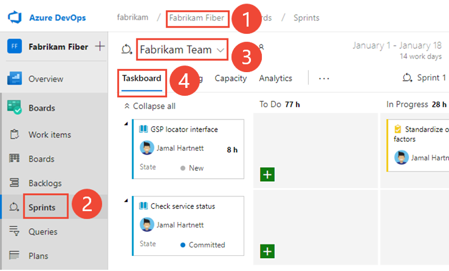

	To switch teams, open the team selector and select a different team, or select **Browse all sprints**.
	You can also enter a keyword in the search box to filter the list of team backlogs.

	> [!div class="mx-imgBorder"]
	> 

2. To select a different sprint, open the sprint selector and select the sprint you want.

	> [!div class="mx-imgBorder"]
	> 

	Only sprints selected for the current team's focus appear in the list.
	If the sprint you want isn't listed, select **New Sprint** from the menu, and then select **Select existing iteration**.
	For more information, see [Define iteration (sprint) paths](../../organizations/settings/set-iteration-paths-sprints.md).

## Customize the taskboard

Each team can customize their **Taskboard** in the following ways:

- [Add or rename columns](customize-taskboard.md#add-columns).
- [Customize cards](customize-taskboard.md#choose-fields) to show other fields or change card color based on field criteria.
- [Show bugs on the Taskboard](../../organizations/settings/show-bugs-on-backlog.md), either as backlog items or as tasks.
  When you track bugs as tasks, they appear on sprint backlogs and Taskboards at the same level as tasks.

An administrator can customize the **Taskboard** for all teams:

- [Add a custom workflow state to the task WIT for a process](../../organizations/settings/work/customize-process-workflow.md)
- [Add a custom work item type to the Taskboard for a process](../../organizations/settings/work/customize-process-backlogs-boards.md)

## Taskboard controls

| Control               | Function                                    |
|-----------------------|---------------------------------------------|
| Backlog               | [Switch to sprint backlog view](assign-work-sprint.md) |
| Board                 | Switch to Taskboard view                   |
| Capacity              | [Switch to capacity planning](assign-work-sprint.md) |
| Group by Stories/People | Switch grouping of cards by backlog items or team members |
| Person                | Filter tasks to show items assigned to all or a selected team member |
|  | [Open board settings](../../boards/boards/customize-cards.md) |
| 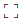/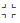 | Enter or exit full screen mode |

For more information, see [Backlog keyboard shortcuts](../../project/navigation/keyboard-shortcuts.md).

## Review progress in daily scrum meetings

During your daily Scrum, filter your **Taskboard** to focus on items of interest.
-	Group by **Backlog items** or **Stories** to monitor progress of your product backlog items, stories, requirements, or bugs.
-	Group by **People** to monitor progress of individual team members.

::: moniker range="<=azure-devops"
> [!NOTE]
> Your Taskboard automatically refreshes when changes occur.
> As other team members move or reorder cards, the Taskboard updates in the background.
::: moniker-end

Use the **Person** filter to focus on work assigned to individual team members.

> [!TIP]
> If you discover tasks that don't belong to your team, check that you [selected the correct team](../../project/navigation/go-to-project-repo.md?toc=/azure/devops/boards/sprints/toc.json).

## Show progress on items

This view shows which items are nearing completion and which items haven't started.

1. To show cards based on their backlog-to-task groupings, select :::image type="icon" source="../../media/icons/view-options-icon.png" border="false"::: **View options** and select **Stories** (for Agile), **Issues** (for Basic), **Backlog items** (for Scrum), or **Requirements** (for CMMI).

	> [!div class="mx-imgBorder"]
	> 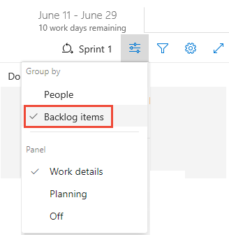

2. Select **Collapse All** or **Expand All** rows. To focus on a particular item and its tasks, selectively expand  and collapse  a row.

   > [!div class="mx-imgBorder"]
   > 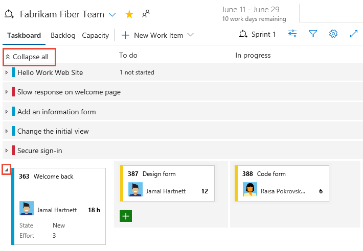

## Show a team member's progress

This view displays each team member's completed and remaining work, helping you identify who might need help with their sprint tasks.

To filter tasks for a specific team member, select the :::image type="icon" source="../../media/icons/filter-icon.png" border="false"::: filter icon, and then select their name from the **Assigned to** filter box.

> [!div class="mx-imgBorder"]
> 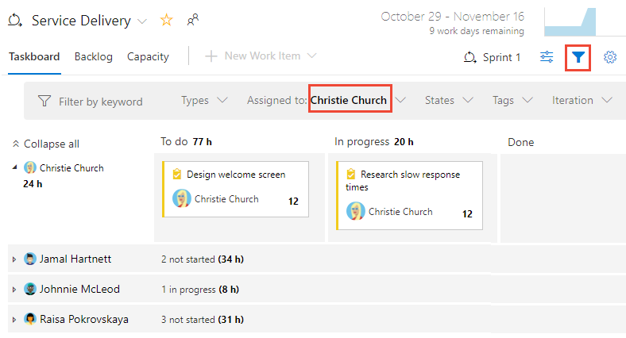

## Group tasks by team members

This view shows all tasks associated with each team member.
Backlog items don't appear, only individual tasks.

1. Select the :::image type="icon" source="../../media/icons/view-options-icon.png" border="false"::: view options icon and select **People**.

	Only team members with tasks assigned to them appear.
	Their tasks display as cards under each column state.

	> [!div class="mx-imgBorder"]
	> 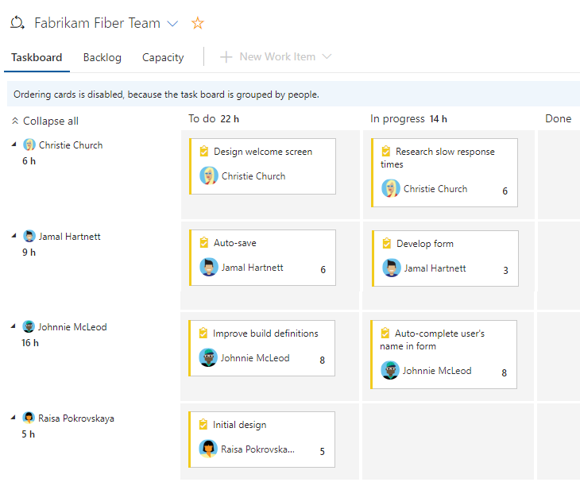

2. To filter tasks for a specific team member, select **Filter** :::image type="icon" source="../../media/icons/filter-icon.png" border="false":::, and then select their name from the **Assigned to** filter box.
	For more information, see [Interactively filter backlogs, boards, queries, and plans](../backlogs/filter-backlogs-boards-plans.md).

	> [!div class="mx-imgBorder"]
	> 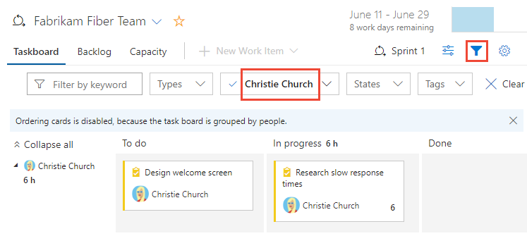

## Update tasks during the sprint cycle

The **Taskboard** makes it easy to update both task status and remaining work.

### Update a task's status

Drag tasks to a downstream column to show whether they're in progress or completed.

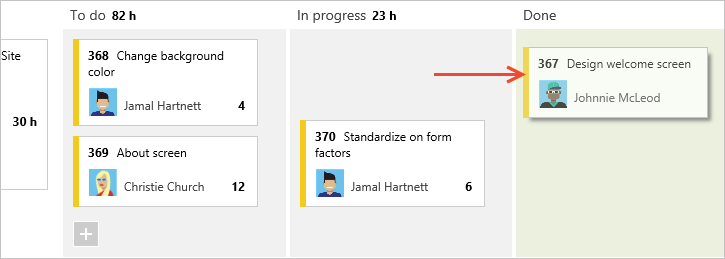

When you move a task to the **Done** or **Completed** column, the system automatically sets **Remaining Work** to 0 in all processes except CMMI.
If more work remains, change the State back to **In progress** or **To do** and enter a value for **Remaining Work**.

### Update remaining work

Update **Remaining Work** before the daily Scrum meeting to keep the team informed and ensure a smoother burndown chart.

Each team member reviews their tasks and estimates the work remaining.
If a task takes longer than expected, increase the **Remaining Work** value.
**Remaining Work** should always reflect the team member's current estimate of effort remaining.

> [!div class="mx-imgBorder"]
> 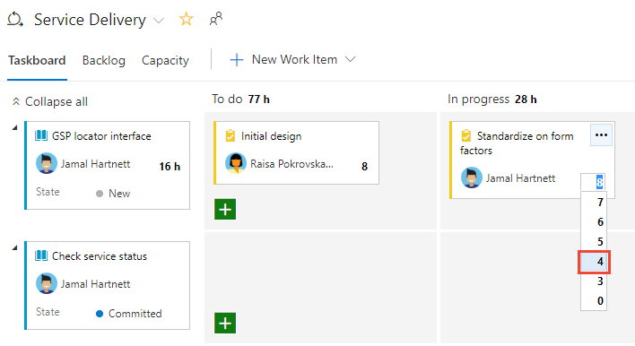

## Close out a sprint and update your taskboard

At the end of the sprint, complete these final tasks:
- Set **Remaining Work** to zero for all completed tasks.
- Update the status of all completed backlog items.
- Drag incomplete backlog items and tasks to the next sprint or back to the product backlog.

When you drag an incomplete item to the product backlog or a future sprint, you update the iteration path of all unfinished child tasks to match the new iteration path.

For more information, see [End of sprint activities](end-sprint-activities.md).

## Reduce the number of items on the Taskboard

If you exceed the maximum number of items allowed on your Taskboard, a message prompts you to reduce the count.
The maximum includes work item types in the Requirement and Task categories.

Move items to the backlog or another sprint to reduce the count.
When you move a parent PBI or user story, all active child tasks (State not equal to Done or Closed) automatically move with the parent item.

- From the Taskboard, drag the PBI or user story from the first column onto the backlog or a future sprint.
- From the sprint backlog, multi-select the items to move, select the context menu, and then select the target iteration.

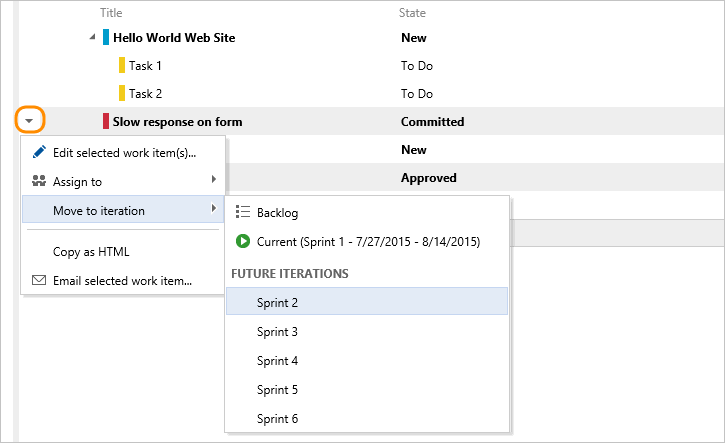

::: moniker range="< azure-devops"
Or, if your project uses an On-premises XML process, you can [increase the maximum number of allowed items](../../reference/customize-work.md#limits).
::: moniker-end

## Use AI to update sprint progress

If you connect the [Azure Boards MCP Server](../../mcp-server/mcp-server-overview.md) to your AI agent in agent mode, you can use natural language prompts to update and monitor sprint progress.

| Task | Example prompt |
|------|----------------|
| Update task state | `Move tasks #3001, #3002, and #3003 to Done in project <Contoso>` |
| Update remaining work | `Set remaining work to 2 hours for task #3004 in project <Contoso>` |
| Sprint progress report | `Show a summary of task states (To Do, In Progress, Done) for Sprint 12 on <Contoso Team>` |
| Find stale tasks | `List all tasks in the current sprint for <Contoso Team> that are still in To Do state and were created more than 3 days ago` |

> [!NOTE]
> Agent mode and the MCP Server use natural language, so you can adjust these prompts or ask follow-up questions to refine the results.

## Next step

> [!div class="nextstepaction"]
> [End of sprint activities](end-sprint-activities.md) 

## Related content

- [Assign backlog items to a sprint](assign-work-sprint.md)
- [Interactively filter backlogs, boards, queries, and plans](../backlogs/filter-backlogs-boards-plans.md)
- [Scrum best practices](best-practices-scrum.md)
- [Sprint planning](assign-work-sprint.md)
- [Schedule sprints](define-sprints.md)
- [Sprint burndown](../../report/dashboards/configure-sprint-burndown.md)
- [Customize a sprint Taskboard](customize-taskboard.md)
- [Capacity planning](../sprints/set-capacity.md)
