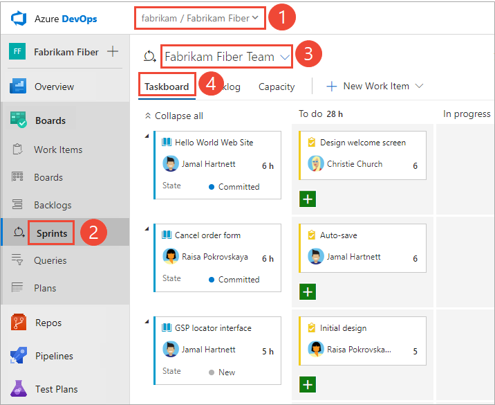
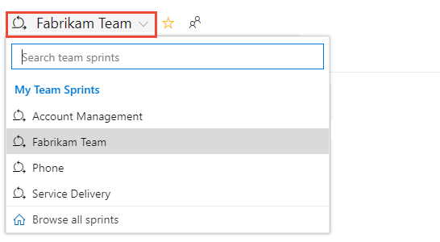

# 6. Update and monitor your Taskboard

[!INCLUDE [temp](../_shared/version-vsts-tfs-all-versions.md)]

Once you have your [sprint plan](assign-work-sprint.md) in place, you'll execute that plan for the duration of the sprint. In your daily Scrum meetings, your team can view progress made to backlog items and tasks from the sprint **Taskboard**.

Your **Taskboard** provides a visualization of flow and status of each sprint task. With it, you can focus on the status of backlog items as well as work assigned to each team member. It also summarizes the total amount of remaining work to complete for a task or within a column.

In this article you'll learn how to:

> [!div class="checklist"]
> * Open the sprint **Taskboard** for your team
> * Customize your **Taskboard**
> * Use your **Taskboard** to review progress during daily scrum meetings
> * Filter and group work items on your **Taskboard**
> * Update the status of tasks through drag-and-drop
> * Update remaining work
> * Close out a sprint

If you haven't yet [added tasks to your sprint backlog](add-tasks.md), do that now.

> [!NOTE]
> Your **Taskboard** is one of two types of boards available to you. For an overview of the features supported on each backlog and board, see [Backlogs, boards, and plans](../backlogs/backlogs-boards-plans.md).

## Prerequisites

* You must connect to a project. If you don't have a project yet, [create one](/azure/devops/organizations/projects/create-project).
* You must be added to a project as a member of the **Contributors** or **Project Administrators** security group. To get added, [Add users to a project or team](/azure/devops/organizations/security/add-users-team-project).  
* To add work items and exercise all board features, you must be granted **Basic** access or higher. For details, see [About access levels](/azure/devops/organizations/security/access-levels).
* To view or modify work items, you must have your **View work items in this node** and **Edit work items in this node** permissions set to **Allow**.  By default, the **Contributors** group has this permission set. To learn more, see [Set permissions and access for work tracking](/azure/devops/organizations/security/set-permissions-access-work-tracking).  

> [!NOTE]  
> Users with **Stakeholder** access can't exercise these **Taskboard** features: add tasks, update fields displayed on cards, or drag-and-drop tasks to update status or change sprint assignment.  

## Open the sprint Taskboard for your team

::: moniker range=">= azure-devops-2019"

0. From your web browser, open the sprint backlog for your team. (1) Check that you have selected the right project, (2) choose **Boards>Sprints**, (3) select the correct team from the team selector menu, and lastly (4), choose (4) **Taskboard**.

	> [!div class="mx-imgBorder"]
	> 

	To choose another team, open the selector and select a different team or choose the  **Browse all sprints** option. Or, you can enter a keyword in the search box to filter the list of team backlogs for the project.

	> [!div class="mx-imgBorder"]
	> 

0. To choose a different sprint than the one shown, open the sprint selector and choose the sprint you want.

	> [!div class="mx-imgBorder"]
	> 

	The system lists only those sprints that have been selected for the current team focus. If you don't see the sprints you want listed, then choose **New Sprint** from the menu, and then choose **Select existing iteration**. For details, see [Define iteration paths (aka sprints)](../../organizations/settings/set-iteration-paths-sprints.md).

::: moniker-end

::: moniker range="<= tfs-2018"

0. From your web browser, open your team's product backlog. (1) Select the team from the project/team selector, choose (2) **Work**, (3) **Backlogs**, and then (4) the product backlog, which is **Backlog items** (for Scrum), **Stories** (for Agile), or **Requirements** (for CMMI).

	> [!div class="mx-imgBorder"]
	> 

	To choose another team, open the project/team selector and select a different team or choose the **Browse** option.

	> [!div class="mx-imgBorder"]
	> 

	The set of sprints selected for your team appears in the left pane. If you don't see any sprints listed, you can add sprints or select existing sprints for your team's use. To learn how, see [Define sprints](define-sprints.md).

0. Choose the sprint you want to plan, and then choose **Board**.

	> [!div class="mx-imgBorder"]
	> 

	The system lists only those sprints that have been selected for the current team focus. If you don't see the sprints you want listed, then see [Define iteration paths (aka sprints)](../../organizations/settings/set-iteration-paths-sprints.md).

::: moniker-end

## Customize the taskboard
Each team can customize their **Taskboard** in the following ways:
- [Customize cards](../../boards/boards/customize-cards.md) that appear on the **Taskboard** to show additional fields.
- [Show bugs on the Taskboard](../../organizations/settings/show-bugs-on-backlog.md), your team can choose to manage bugs similar to product backlog items, as shown in this article, or manage them similar to tasks. When you track bugs similar to tasks, they'll show up on your sprint backlogs and **Taskboards** at the same level as tasks.

Unlike the Kanban board for a product backlog, you can't add additional columns to the **Taskboard** via a team configuration setting. Instead, you need to modify the workflow definitions for the task work item type used by the project. This would  update the columns for the **Taskboard** for all teams within the project.

::: moniker range="azure-devops"  
An administrator can customize the **Taskboard** for all teams in the following ways:  
- [Add a custom workflow state to the task WIT for a process](../../organizations/settings/work/customize-process-workflow.md)
- [Add a custom work item type to the Taskboard for a process](../../organizations/settings/work/customize-process-backlogs-boards.md)
::: moniker-end

::: moniker range="azure-devops-2019"
An administrator can customize the **Taskboard** for all teams in the following ways based on the process model selected for the project:
**Inherited process model:**
- [Add a custom workflow state to the task WIT for a process](../../organizations/settings/work/customize-process-workflow.md)
- [Add a custom work item type to the Taskboard for a process](../../organizations/settings/work/customize-process-backlogs-boards.md)

**On-prem XML process model:** 
- [Add a custom workflow state to the task WIT for a process](../../organizations/settings/work/customize-process-workflow.md)
- [Add a custom work item type to the Taskboard for a process](../../organizations/settings/work/customize-process-backlogs-boards.md)
::: moniker-end

::: moniker range="<= tfs-2018"
An administrator can customize the **Taskboard** for all teams in the following ways:  
- [Modify the workflow for the task WIT definition](../../reference/xml/change-workflow-wit.md).
- [Add a work item type to a backlog or board](../../reference/add-wits-to-backlogs-and-boards.md).
::: moniker-end

## Review progress in daily scrum meetings
During your daily Scrum, you can filter your **Taskboard** to help focus on items of interest.
*	Group by Backlog items or Group by stories to monitor progress of your product backlog items, stories, requirements, or bugs.
*	Group by People when you want to monitor progress of individual team members.

Use the Person filter when you want to focus on work assigned to individual team members.

> [!TIP]
>If you're seeing tasks that don't belong to your team, check that you've [selected the correct team](../../project/navigation/go-to-project-repo.md?toc=/azure/devops/boards/sprints/toc.json&bc=/azure/devops/boards/sprints/breadcrumb/toc.json).

## Show progress on items
With this view, you can quickly see which items are nearing completion and which have yet to be started.

::: moniker range=">= azure-devops-2019"

0. To show cards based on their backlog-to-task groupings, choose the  view options icon and select **Backlog items** (for Scrum), **Stories** (for Agile) and **Requirements** (for CMMI).

	> [!div class="mx-imgBorder"]
	> 

0.	You can **Collapse All** or **Expand All** rows, and selectively expand  and collapse  a row to focus on a particular item and its tasks.

	> [!div class="mx-imgBorder"]
	> 

::: moniker-end

::: moniker range=">= tfs-2015 <= tfs-2018" 
You can expand  and collapse  a row to focus on a particular item and its tasks.

::: moniker-end

::: moniker range=">= tfs-2013 <= tfs-2018"

::: moniker-end

## Show progress of individuals
With this view, you can focus on the work completed and the work remaining for each individual team member. You can quickly see who may need help to complete their sprint tasks. This view shows items and tasks assigned to the selected team member.

::: moniker range=">= azure-devops-2019"

To filter on the tasks for a specific team member, choose the  filter icon, and then select their name from the **Assigned to** filter box.

> [!div class="mx-imgBorder"]
> 

::: moniker-end

::: moniker range="<= tfs-2018"

Choose the **Group by People** option, and then select a specific team member, or **All**.

::: moniker-end

## Group by team members
With this view, you can quickly see all the tasks associated with each team member. Backlog items don't appear in this view, only the tasks associated with each individual.

::: moniker range=">= azure-devops-2019"

0. Choose the  view options icon and select **People**.

	Only those team members with tasks assigned to them are listed. All their tasks are shown as cards under their column state.

	> [!div class="mx-imgBorder"]
	> 

0. To filter on the tasks for a specific team member, choose the  filter icon, and then select their name from the **Assigned to** filter box.

	> [!div class="mx-imgBorder"]
	> 

::: moniker-end

::: moniker range=">= tfs-2013 <= tfs-2018"

Choose the **Group by People** option, and then select a specific team member, or **All**.

::: moniker-end

## Update tasks during the sprint cycle
The **Taskboard** makes quick work of updating both task status and remaining work.

### Update task status
Simply drag tasks to a downstream column to reflect if they are in progress or completed.

When you move a task to the Done or Completed column, the system automatically updates the *Remaining Work* field to 0. If you discover more work is remaining, change the State back to In progress or To do and enter a value for the remaining work.

### Update remaining work
Updating *Remaining Work*, preferably prior to the daily Scrum meeting, helps the team stay informed of the progress being made. It also ensures a smoother burndown chart.

Each team member can review the tasks they've worked on and estimate the work remaining. If they've discovered that it's taking longer than expected to complete, they should increase the remaining work for the task. *Remaining Work* should always reflect exactly how much work the team member estimates is remaining to complete the task.

::: moniker range=">= azure-devops-2019"
> [!div class="mx-imgBorder"]
> 
::: moniker-end

::: moniker range="<= tfs-2018"

::: moniker-end

## Close out a sprint, update your Taskboard
At the end of the sprint, you'll want to perform these final tasks:
*	Zero out *Remaining Work* of all completed tasks  
*	Update the status of all completed backlog items  
*	Drag incomplete backlog items and tasks to the next sprint or back to the product backlog.

Dragging an incomplete item to the product backlog or to a future sprint updates the Iteration Path of all uncompleted child tasks to correspond to the product backlog iteration path or future sprint.

::: moniker range=">= tfs-2017 <= tfs-2018"
You can [drag-and-drop work items onto a sprint from any backlog or board](assign-work-sprint.md#drag-drop).
::: moniker-end
::: moniker range="tfs-2015"
You can [drag-and-drop work items onto a sprint from any backlog or board](assign-work-sprint.md#drag-drop). Requires TFS 2015.1 or later version.
::: moniker-end

##Try this next

Work with [sprint burndown](sprint-burndown.md) charts to monitor progress, manage scope creep, and mitigate risks.

## Related articles
As you can see, the taskboard provides a lot of support for your Scrum activities. For related topics, see:

*	[Scrum best practices](best-practices-scrum.md)
*	[Sprint planning](assign-work-sprint.md)
*	[Schedule sprints](define-sprints.md)
*	[Customize cards on the taskboard](../../boards/boards/customize-cards.md#task-board)
*	[Capacity planning](../sprints/set-capacity.md)

<!---

### Taskboard controls

| Control               | Function                                    |
|-----------------------|---------------------------------------------|
| Backlog               | [Switch to sprint backlog view](assign-work-sprint.md)                         |
| Board                 | Switch to taskboard view                   |
| Capacity              | [Switch to Capacity planning](assign-work-sprint.md#set-capacity)   |
| Group by Stories/People   | Switch grouping of cards based on backlog items or team members                        |
| Person                    | Filter tasks to show items assigned to All or a selected team member            |
|     | [Open board settings](../../boards/boards/customize-cards.md)    |
| /     | Enter or exit full screen mode         |

See also [Backlog keyboard shortcuts](../backlogs/backlogs-keyboard-shortcuts.md).

-->

## Reduce the number of items on the taskboard

If you exceed the number of items allowed on your taskboard, you'll receive a message indicating that you need to reduce the number of items. The maximum number of items includes work item types included in the Requirement and Task categories.

You can reduce the number of items on the taskboard by moving them to the backlog or another sprint. When you move a parent PBI or user story, all active child tasks (State not equal to Done or Closed) automatically move with the parent item.

::: moniker range=">= tfs-2017"

- From the taskboard, drag the PBI or user story from the first column onto the backlog or future sprint. All child tasks automatically move with the parent item.
- From the sprint backlog, multi-select the items to move and then click the context menu for an item and select the iteration to move them to.

::: moniker-end

::: moniker range="tfs-2015"
Requires TFS 2015.1 or later version.
- From the taskboard, drag the PBI or user story from the first column onto the backlog or future sprint. All child tasks automatically move with the parent item.
- From the sprint backlog, multi-select the items to move and then click the context menu for an item and select the iteration to move them to.

   
::: moniker-end

::: moniker range="tfs-2013"
- From the taskboard, drag the PBI or user story from the first column onto the backlog or future sprint.

- From the sprint backlog, drag an item back to the backlog or to another sprint.

	

- If you need to move several items, you can create a query from the sprint backlog and then use the query to [bulk modify the iteration path](../backlogs/bulk-modify-work-items.md).
::: moniker-end

::: moniker range="<= azure-devops-2019"
Or, you can [increase the maximum number of allowed items](../../reference/customize-work.md#limits).
::: moniker-end