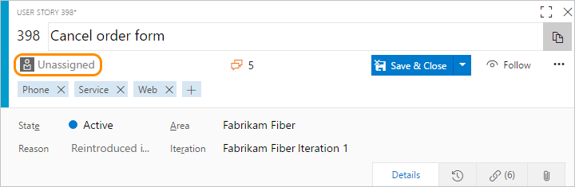

# Track work with user stories, issues, bugs, features, and epics 

[!INCLUDE [temp](../_shared/version-vsts-tfs-all-versions.md)]

You can use work items to track anything you need to track. Each work item represents an object stored in the work item data store. Each work item is based on a work item type and is assigned an identifier which is unique within an organization or project collection. The work item types available to you are based on the [process used when your project was created](guidance/choose-process.md) (Basic, Agile, Scrum, or CMMI).  

#### In a nutshell:

::: moniker range=">= tfs-2018"
- You use different [work item types (WITs)](#wit) to track different types of information. Specific tools 
	- [Add backlog items](../backlogs/create-your-backlog.md), such as Issues (Basic process), User Stories (Agile), Product Backlog Items (Scrum), Requirements (CMMI)
	- [Define Features and Epics](../backlogs/define-features-epics.md)
	- [Define, triage, and manage Bugs](../backlogs/manage-bugs.md)
	- [Add Tasks to backlog items](../sprints/add-tasks.md)
- You update the [work item form](#form) to add information, update status, reassign to another project member or sprint, and to link work items, attach files, and add comments  
- You can add and modify work items using the [web portal and other supported clients](#portal-clients)
- You can [assign a work item](#assign) to one and only one project member 
- You [assign work items to a sprint](#assign-to-sprint) via the iteration path
- You can use [ad hoc search or queries to find or list work items](#queries)  
- You can [use work item templates](#templates) to quickly fill in work item fields
- Teams can [choose how they track bugs](#track), either as requirements or as tasks
- You or a project administrator can [add and customize work item types](#customize)
- [To add or modify work items](#permissions-access), you need to be a project member with Contributor permissions and Basic or Stakeholder access.

::: moniker-end

::: moniker range="<= tfs-2017"

- You use different [work item types (WITs)](#wit) to track different types of information, such as user stories, bugs, and tasks
- You update the [work item form](#form) to add information, update status, reassign to another project member or sprint, and to link work items and attach files  
- You can add and modify work items using the [web portal and other supported clients](#portal-clients)
- You can [assign a work item](#assign) to one and only one project member 
- You [assign work items to a sprint](#assign-to-sprint) via the iteration path
- Teams can [choose how they track bugs](#track), either as requirements or as tasks
- You can use [ad hoc search or queries to find or list work items](#queries)  
- You can [use work item templates](#templates) to quickly fill in work item fields
- You can [add and customize work item types and your backlog](#customize)
- [To add or modify work items](#permissions-access), you need to be a project member with Contributor permissions and Basic or Stakeholder access. 

::: moniker-end

<a id="wit" />

## Work item types (WITs)

To track different types of work, different WITs are defined. The WITs available to you differ depending on the process or process template used to create your project.

For example, the following WITs are available to you when you choose the Agile process. 

> [!NOTE]  
> The WITs available to you depend on the process chosen to create your project&mdash;[Basic](../get-started/track-issues-tasks.md), [Agile](../work-items/guidance/agile-process.md), [Scrum](../work-items/guidance/scrum-process.md), or [CMMI](../work-items/guidance/cmmi-process.md). The items in your backlog may be called user stories, product backlog items (PBIs), or requirements. All three are similar: they describe the customer value to be delivered and the work to be performed.   

To learn more about processes and process templates, see [Choose a process](./guidance/choose-process.md).

<a id="form" />

## Work item form 

::: moniker range=">= tfs-2018" 

Each work item supports tracking data contained in work item fields. Also, it captures changes as updates are made within the **History** field and comments made in the **Discussion** section. To learn more about each field, see [Work item field index](./guidance/work-item-field.md). 

::: moniker-end

::: moniker range="<= tfs-2017" 

Each work item supports tracking data contained in work item fields. Also, it captures changes as updates are made within the **History** field. To learn more about each field, see [Work item field index](./guidance/work-item-field.md).

::: moniker-end

Each form contains a number of controls as shown below and described in [Work item form controls](work-item-form-controls.md). 

::: moniker range=">= tfs-2018"

::: moniker-end

::: moniker range="tfs-2017"

The new form and its corresponding features are available from the web portal. The new form is automatically available when you add projects to a new collection. For existing projects, an admin is required to [enable the new form](../../reference/manage-new-form-rollout.md).  

**New web form**

The new web form provides a number of experiences not provided with the old web form. To learn more, see [New work item experience](../../reference/process/new-work-item-experience.md). 

**Old web form** 

---

::: moniker-end

::: moniker range="<= tfs-2015"

::: moniker-end

  
## Track work in the web portal 
You can add and update work items from the web portal. To track work using other clients, see [Best tools for adding, updating, and linking work items](best-tool-add-update-link-work-items.md). 

## Web portal and clients that support tracking work items  
You can add and update work items from the web portal and various clients. For an overview of all clients that connect to your project, see [Tools and clients that connect to Azure DevOps Services and TFS](../../user-guide/tools.md). 

### Web portal 

Use the web portal to accomplish the following tasks. 

[!INCLUDE [temp](../_shared/page-work-item-tasks.md)] 

<a id="assign" />

## Assign work items to a project member

You can only assign a work item to one person at a time. The **Assigned To** field is a person-name field designed to hold an user identity recognizable by the system. Within the work item form, choose the **Assigned To** field to select a project member. Or, you can begin typing the name of a project member to quickly focus your search to a select few. 

  

Anyone who has write access to a project can assign work items, including users with [Basic and Stakeholder access](#permissions-access).   

**Note the following:**

- You can assign a work item only to users that have been [added a project or team](../../organizations/security/add-users-team-project.md)  
- You can assign a work item to one and only one user at a time. If work is split across two or more users, then you should consider creating additional work items that you'll assign to each user responsible for the work to be completed  
- Over time, the drop-down menu of person-name fields will display the names you have most recently selected  
- Some drop-down menus that support assignment from a team backlog or board are automatically limited to users assigned to the team   
- The system shows the display name and adds the user name when required to disambiguate identical display names  
- You can assign several work items at once from the backlog or query results, see [Bulk modify work items](../backlogs/bulk-modify-work-items.md) for details. 

::: moniker range="azure-devops" 

### Integration with Azure Active Directory 

When your system is configured with Azure Active Directory (Azure AD), then the system will synchronize person-name fields with these directories. Person-name fields include Activated By, Assigned To, Closed By, Created By, and Resolved By. 

You can grant access to a project by adding security groups that you created in Azure AD or by adding accounts to existing or custom groups defined from the collection setting **Security** pages. To learn more, see [Access with Azure Active Directory (Azure AD)](../../organizations/accounts/add-users-to-azure-ad.md).
::: moniker-end

::: moniker range="<= azure-devops-2019" 

### Integration with Active Directory

When TFS is configured with Active Directory (AD), then TFS will synchronize person-name fields with these directories. Person-name fields include Activated By, Assigned To, Closed By, Created By, and Resolved By. 

You can grant access to a project by adding security groups that you created in AD or by adding accounts to existing or custom groups defined from the collection setting **Security** pages. To learn more, see [Set up groups for use in TFS deployments](/azure/devops/server/admin/setup-ad-groups). 
::: moniker-end

 
::: moniker range="<= azure-devops-2019"

> [!NOTE]    
>To minimize the list of names that appear in the drop-down menus of person-name fields, you can scope the field to only those groups that you want to appear in the menu. You do this by adding one or more of the following child elements to the **FIELD** definition in the work item type definition: **ALLOWEDVALUES**, **PROHIBITEDVALUES**, and **VALIDUSER**. For details, see [Apply a field rule](../../reference/xml/apply-rule-work-item-field.md).

::: moniker-end

## Assign work items to a sprint 

To schedule work items to be worked on during a specific time period, you assign the **Iteration Path**. First, you define the Iteration Paths for use in the project, and then each team selects the Iteration Paths that they'll use. To learn more, see [Assign work to sprints](../sprints/assign-work-sprint.md). 

## Track bugs as requirements or tasks 

Many Scrum teams treat bugs the same as any backlog item or user story. Others see bugs as work that belongs to implementing a story, and therefore treat them as a task. Bugs, like product backlog items (PBIs) and user stories, represent work that needs doing. So, should you track your bugs along with other items in the product backlog items or as tasks linked to those backlog items? How does your team estimate work?  

Based on how your team answers these questions, they can choose how they want to track bugs from one of these three choices. To change the team setting, see [Show bugs on backlogs and boards](../../organizations/settings/show-bugs-on-backlog.md). 

For an overview of all team settings, see [Manage teams and configure team tools](../../organizations/settings/manage-teams.md).

<a id="queries" />
## Find or list work items 

You can use the search box to perform an ad hoc search to find specific work items based on select field criteria. Or, you can create a query to perform a managed search which will list work items based on your query criteria. With managed searches you can perform a number of other tasks, such as to triage work items, create a trend or status chart and add to the dashboard, and more. 

To learn more, see these topics: 
- [Create managed queries to list, update, or chart work items](../queries/example-queries.md)  
- [View, run, or email a query](../queries/view-run-query.md)  
- [Ad hoc vs managed queries](../queries/adhoc-vs-managed-queries.md)  
- [Work item query charts](../../report/dashboards/charts.md)  

<a id="templates" />
## Use work item templates to quickly fill in forms

With work item templates you can quickly create work items which have pre-populated values for your team's commonly used fields. For example, you can create a task template that will set the area path, iteration path, and discipline or activity whenever you use it to create a task.  

To learn more, see [Use templates to add and update work items](../backlogs/work-item-template.md).

Once you have a template defined, you can share it via email or a [dashboard](../../report/dashboards/add-markdown-to-dashboard.md).  

<a id="customize" />
## Customize a WIT 

::: moniker range="azure-devops"
You can add or modify the fields contained within a WIT or add a custom WIT. To learn more, see [Customize an inheritance process](../../organizations/settings/work/inheritance-process-model.md). 
::: moniker-end

::: moniker range="azure-devops-2019"
You can add or modify the fields contained within a WIT or add a custom WIT. To learn more, see:
- For project collections that use the Inheritance process model: [Customize an inheritance process](../../organizations/settings/work/inheritance-process-model.md).  
- For project collections that use the On-premises XML process model: [Customize the On-premises XML process model](../../reference/on-premises-xml-process-model.md). 
::: moniker-end

::: moniker range="< azure-devops-2019"
You can add or modify the fields contained within a WIT or add a custom WIT. To learn more, see [Customize the On-premises XML process model](../../reference/on-premises-xml-process-model.md). 
::: moniker-end

<a id="permissions-access" />
## Required permissions and access

As a member added to the Contributors group of a project, you can use most features provided under **Boards** or **Work**. Users with Basic access have full access to all features. Users with Stakeholder access are limited to certain features. For details, see [Work as a Stakeholder](../../organizations/security/access-levels.md#stakeholder-access). 

To learn more about permissions and access, see [Permissions and access for work tracking](../../organizations/security/permissions-access-work-tracking.md) and [About access levels](../../organizations/security/access-levels.md).  

To add users to a project, see [Add users to a project or team](../../organizations/security/add-users-team-project.md).

## Try this next 

> [!div class="nextstepaction"]
> [Add a work item](../backlogs/add-work-items.md?toc=/azure/devops/boards/work-items/toc.json&bc=/azure/devops/boards/work-items/breadcrumb/toc.json)

## Related articles 
- [Web portal navigation](../../project/navigation/index.md) 
- [Backlogs, portfolios, and Agile project management](../backlogs/backlogs-overview.md) 
- [About Kanban and Agile project management](../boards/kanban-overview.md) 
- [Keyboard shortcuts for work item forms and the Work Items page](work-item-form-keyboard-shortcuts.md)
- [Agile, Scrum, and CMMI processes](./guidance/choose-process.md)  
- [Work item field index](./guidance/work-item-field.md)  
