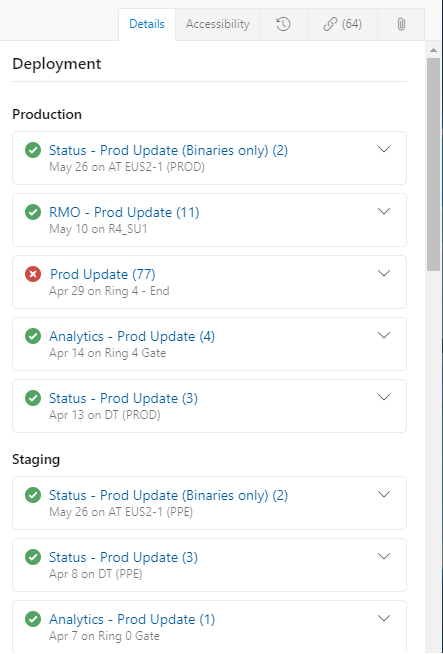

# About work items such as features, user stories, bugs, tasks in Azure Boards

[!INCLUDE [version-lt-eq-azure-devops](../../includes/version-lt-eq-azure-devops.md)]

Track the features and requirements you're developing, code defects or bugs, and other details using work items. Work items are similar to GitHub issues, but offer different types to track different types of information.

You use work items to track anything you need to track. Each work item represents an object stored in the work item data store. Each work item is based on a work item type. And, each work item is assigned a unique identifier within an organization or project collection. The available work item types depend on the [process you used when creating your project](guidance/choose-process.md).  

If you're just getting started, read the information provided in this article. To jump right in and start tracking work on a Kanban board, see [Plan and track work](../get-started/plan-track-work.md). For a quick reference to various work item tasks and key concepts, see [Work item quick reference](quick-ref.md).

<a id="wit" />

## Track features, requirements, user stories, and bugs  

To track different types of work, you choose a specific work item type. The work item types available to you differ depending on the [process used when your project was created](../../boards/work-items/guidance/choose-process.md)--**Agile**, **Basic**, **Scrum**, or **CMMI**--as illustrated in the following images. The items in your backlog might be called User Stories (Agile), Issues (Basic), Product Backlog Items (Scrum), or Requirements (CMMI). All four types are similar. They describe the customer value of the work and the work to do.    

[!INCLUDE [temp](../includes/work-item-types.md)]

Each work item type belongs to a category. Categories are used to group work item types and determine which types appear on backlogs and boards. 
  
|Category | Work item type | Controls backlogs/boards |
|----------|----------------|--------------------------|
|Epic  | Epic | Epic portfolio backlogs and boards |
|Feature   | Feature | Feature portfolio backlogs and boards |
|Requirement| User Story (Agile) Issue (Basic) Product Backlog Item (Scrum) Requirement (CMMI)| Product backlogs and boards and Sprints backlog  |
|Task   | Task | Sprints Taskboards  |
|Bug   | Bug | Dependent on [how bugs are tracked](#track)  | 
| N/A   | Issue (Agile and CMMI) Impediment (Scrum)| N/A. Used to track non-work project elements that can impact work getting done.  |

For a list of other work item types available, see [Work item types to track testing, reviews, and feedback ](#wit-other) later in this article. 

### Track bugs as requirements or tasks 

Many Scrum teams treat bugs the same as any backlog item or user story. Others see bugs as work that belongs to implementing a story, and then treat them as a task. Bugs, like product backlog items (PBIs) and user stories, represent work that needs doing. So, should you track your bugs along with other items in the product backlog items? Or, should you track your bugs as tasks linked to those backlog items? How does your team estimate work?  

Based on how your team answers these questions, they can choose how they want to track bugs from one of these three choices. To change the team setting, see [Show bugs on backlogs and boards](../../organizations/settings/show-bugs-on-backlog.md). 

For an overview of all team settings, see [Manage teams and configure team tools](../../organizations/settings/manage-teams.md).
 
 
<a id="form" />

## Work item form 

The work item form shows the fields used to track information related to the work item.  In general, you define and update a work item through it's work item form, although other methods are available to bulk import, export, update, and work items.  

Each work item form contains several tabs. The **Details** tab contains the common fields, other fields defined for the work item type, and the **Discussion** control.  

Common fields defined for all work item types display at the top of the work item form. As shown in the following image, these fields include the following fields: **Title**, **Assigned To**, **State**, **Reason**, **Area**, and **Iteration**.  You can update these fields at any time. 

:::image type="content" source="media/about-work-items/common-fields-basic.png" alt-text="Screenshot of common fields in work item form for all work item types.":::

[!INCLUDE [temp](../includes/common-work-item-fields.md)]   

|Field| Default | Description | 
|-----|--------|--------------|
|**ID**| System assigned |The unique identifier that Azure DevOps assigns to a work item. Work item IDs are unique across all projects defined for an organization or project collection. | 
|**Title**| Required |A short description that summarizes what the work item is and helps team members distinguish it from other work items in a list. | 
|**Assigned To**| None |The name of a team member who currently owns the work item. For more information, see [Assign work](#assign-work) later in this article. | 
|**State**| New (Agile) To Do (Basic) New (Scrum) Proposed (CMMI) |The current state of the work item. All newly created work items are assigned to the work flow state associated with the *Proposed* workflow category This field allows you to update the status of a work item as it progresses from new or active to a done, closed, or completed state. | 
|**Reason**| New (Agile) Added to backlog (Basic) New backlog item (Scrum) New (CMMI) |The reason why the work item is in the current state. Each transition from one workflow state to another is associated with a corresponding reason.  | 
|**Area** Path| user-dependent | Specifies a project-configured path used to group work items by product feature or team areas.  The default assignment depends on the web page used to define the work item. When created from a team backlog or board, then the team's default assignment is used.   | 
|**Iteration** Path| user-dependent | Specifies a project-configured path used to group work items by named sprints or time periods.  The default assignment depends on the web page used to define the work item. When created from a team backlog or board, then the team's default assignment is used. To learn more, see [Assign work to sprints](../sprints/assign-work-sprint.md).  |
|**Tags**| None | Tags are user-definable keywords or phrases that users can define or select from a list of added tags. Tags isn't a field similar to other fields, but a control available at the top of each work item form. To learn more, see [Add work item tags to categorize and filter lists and boards](../queries/add-tags-to-work-items.md).  | 

To learn more about each field, see [Work item field index](./guidance/work-item-field.md).  

 

### State, Workflow, and Reason  

Workflow states define how a work item progresses from its creation to closure. The four main states that are defined for the User Story (Agile process) describe a user story's progression. The workflow states are *New*, *Active*, *Resolved*, and *Closed*. The *Removed* state supports removing a work item from appearing on the backlog. To learn more, see [Move, change, or delete work items](../backlogs/remove-delete-work-items.md#remove).)

The following images illustrate the natural progressions and regressions for User Stories (Agile), Issues (Basic), Product Backlog Items (Scrum), or Requirements (CMMI). Similar progressions and regressions are defined for other work item types for each process.  
 
[!INCLUDE [temp](../includes/four-process-workflow.md)] 
 
<a id="assign" />

### Assign work 

You can only assign a work item to one person at a time. The **Assigned To** field is an identity field designed to hold a user identity that has been added to the project. Within the work item form, choose the **Assigned To** field to select a project member. Or, you can begin typing the name of a project member to quickly focus your search to a select few.  

  

**Note the following:**

- You can assign a work item only to users that have been [added to a project or team](../../organizations/security/add-users-team-project.md)  
- You can assign a work item to one and only one user at a time. If work is split across two or more users, consider creating separate work items that you'll assign to each user responsible for the work to complete. 
- Over time, the drop-down menu of identity fields display the names you have most recently selected.  
- Some drop-down menus that support assignment from a team backlog or board are automatically limited to users assigned to the team. 
- The system shows the display name and adds the user name when required to disambiguate identical display names.  
- You can assign several work items at once from the backlog or query results, see [Bulk modify work items](../backlogs/bulk-modify-work-items.md) for details. 

::: moniker range="azure-devops" 

When Azure DevOps is configured with Azure Active Directory (Azure AD), then the system will synchronize person-name fields with these directories. Person-name fields include Activated By, Assigned To, Closed By, Created By, and Resolved By. 

You can grant access to a project by adding security groups that you created in Azure AD or by adding accounts to existing or custom groups defined from the collection setting **Security** pages. For more information, see [Add or delete users using Azure Active Directory](/azure/active-directory/fundamentals/add-users-azure-active-directory).
::: moniker-end

::: moniker range="<= azure-devops-2019" 

When Azure DevOps Server is configured with Active Directory (AD), Azure DevOps synchronizes identity fields with these directories. Identity fields include Activated By, Assigned To, Closed By, Created By, and Resolved By. 

You can grant access to a project by adding security groups you create in AD or by adding accounts to existing or custom groups defined in the collection setting **Security** pages. To learn more, see [Set up groups for use in Azure DevOps Server deployments](/azure/devops/server/admin/setup-ad-groups). 
::: moniker-end

## Follow, Refresh, Revert, and Actions menu

The **Follow**, **Refresh**, **Revert changes**, and **Actions** menu controls appear on all work item forms. 

:::image type="content" source="media/about-work-items/follow-refresh-actions-menu.png" alt-text="Screenshot of Follow and Refresh icons, and Actions menu.":::
 
Choose **Follow** to get updates when changes are made to the work item. To learn more, see [Follow changes made to a user story, bug, or other work item or pull request](follow-work-items.md). 

Choose :::image type="icon" source="../media/icons/icon-refresh-wi.png" border="false"::: **Refresh**  to update the work item form with the latest changes that someone else may have made while you had the work item open. Choose the :::image type="icon" source="../media/icons/icon-undo-changes-wi.png" border="false":::  **Revert changes** to undo any changes you made to the work item form.  
To learn more about the tasks you can perform from the **Actions** menu, see the following articles: 

- [New linked work item](../backlogs/add-link.md)
- [Change type](../backlogs/move-change-type.md#change-the-work-item-type)
- [Move to team project](../backlogs/move-change-type.md#change-the-work-item-type)
- [Create copy of work item...](../backlogs/copy-clone-work-items.md)
- [Email work item](email-work-items.md) 
- [Delete](../backlogs/remove-delete-work-items.md) 
- [Templates](../backlogs/work-item-template.md)
- [New branch...](../backlogs/connect-work-items-to-git-dev-ops.md)  
- [Customize](../../organizations/settings/work/customize-process.md)

> [!NOTE]   
> Some menu options may not appear depending on your permission assignments. Also, additional options may appear based on Marketplace extensions added to your organization or other customizations made to the work item type. 

## Discussion control  

With the **Discussion** control, project members can  add and review comments made about the work being performed. The rich text editor tool bar displays below the text entry area. It appears when you click your cursor within each text box that supports text formatting. To learn more, see [View and add work items](view-add-work-items.md#capture-comments-in-the-discussion-section).

> [!div class="mx-imgBorder"]  
>    
 
::: moniker range=">= azure-devops-2019"

## Deployment, Development, and Related Work controls

The **Deployment**, **Development** and **Related Work** controls are special controls available in most work tracking forms. The following table provides a short description of each control. 

### Deployment control

The **Deployment** control provides a quick view of whether a feature or user story has been deployed and to what stage. You gain visual insight into the status of a work item as it is deployed to different release environments and quick navigation to each release stage and run. To learn more, see [Link work items to builds and deployments](work-item-deployments-control.md).

 

### Development control

The **Development** control records all Git development processes that support completion of the work item.  It also supports traceability, providing visibility into all the branches, commits, pull requests, and builds related to the work item. To learn more, see [Drive Git development from a work item ](../backlogs/connect-work-items-to-git-dev-ops.md).

### Related Work control

The **Related Work** control provides a quick view of linked work items, and supports adding a link to a parent work item. Can quickly add and remove linked work items.

  

::: moniker-end

::: moniker range="tfs-2018"

## Development and Related Work controls

The **Development** and **Related Work** controls are used to support common linking tasks to development objects or other work items. These controls are available in most work items used to track work. The following table provides a short description of each control.  

### Development control

The **Development** control records all Git development processes that support completion of the work item.  It also supports traceability, providing visibility into all the branches, commits, pull requests, and builds related to the work item. To learn more, see [Drive Git development from a work item ](../backlogs/connect-work-items-to-git-dev-ops.md).

### Related Work control

The **Related Work** control provides a quick view of linked work items, and supports adding a link to a parent work item. Can quickly add and remove linked work items.

  

::: moniker-end

## History, Links, and Attachment tabs

The **History**, **Links**, and **Attachment** tabs appear in all work item forms. They support auditing, traceability, and sharing information.  

### History: Review changes made to the work item 

The :::image type="icon" source="../media/icons/icon-history-tab-wi.png" border="false"::: **History** tab maintains a record of changes made to a work item over time. A record is made when changes are made to any of the [common fields](#common-fields), description or other rich-text fields, **Discussion** control entries, or addition or removal of links or attachments.  

The state change history diagram appears first. To see the entire history of state changes, choose **Show all**.

:::image type="content" source="../queries/media/state-change-history-diagram.png" alt-text="Screenshot of Work item form, Web portal, State change history diagram (web portal only).":::

Choose an entry in the left pane to view the details of changes made. To learn more, see [Query work item history and discussion fields](../queries/history-and-auditing.md). 

:::image type="content" source="../queries/media/hist-audit-wi-form.png" alt-text="Screenshot of Work item form, History tab, Web portal, Details.":::

### Links: Link work items to other work items or objects

From the :::image type="icon" source="../media/icons/icon-links-tab-wi.png" border="false"::: **Links** tab, you can add, remove, or view work items or other objects linked to the work item. Different link types are used to link to different objects, or to link to other work items. 

:::image type="content" source="media/about-work-items/links-tab.png" alt-text="Screenshot of Work item form, Links tab.":::

To learn more about linking, see the following articles: 
-  [Link user stories, issues, bugs, and other work items](../backlogs/add-link.md)
-  [Linking, traceability, and managing dependencies](../queries/link-work-items-support-traceability.md) 
-  [Link type reference](../queries/link-type-reference.md)
 

### Attachments: Attach files to a work item

From the :::image type="icon" source="../media/icons/icon-links-tab-wi.png" border="false"::: **Attachments** tab, you can add, remove, or view files or images added to the work item. You can add up to 100 attachments to a work item. Attachments are limited to 60 MB. To learn more, see [Share information within work items and social tools](../queries/share-plans.md). 
 

  

## Track work in the web portal 

You can add and update work items from the web portal. To track work using other clients, see [Best tools for adding, updating, and linking work items](best-tool-add-update-link-work-items.md). For an overview of all clients that connect to your project, see [Tools and clients that connect to Azure DevOps](../../user-guide/tools.md). 

Use the web portal to accomplish the following tasks. 

[!INCLUDE [temp](../includes/page-work-item-tasks.md)] 

<a id="templates" />

## Use work item templates to quickly fill in forms

With work item templates, you can quickly create work items that have pre-populated values for your team's commonly used fields. For example, create a task template that sets the area path, iteration path, and discipline or activity whenever you use it to create a task.  

To learn more, see [Use templates to add and update work items](../backlogs/work-item-template.md).

Once you have a template defined, you can share it via email or a [dashboard](../../report/dashboards/add-markdown-to-dashboard.md).  

<a id="customize" />

## Customize a work item type 

::: moniker range="azure-devops"
You can add or modify the fields contained within a work item type or add a custom work item type. To learn more, see [Customize an inheritance process](../../organizations/settings/work/inheritance-process-model.md). 
::: moniker-end

::: moniker range=">= azure-devops-2019 < azure-devops"
You can add or modify the fields contained within a work item type or add a custom work item type. To learn more, see:
- For project collections that use the Inheritance process model: [Customize an inheritance process](../../organizations/settings/work/inheritance-process-model.md).  
- For project collections that use the On-premises XML process model: [Customize the On-premises XML process model](../../reference/on-premises-xml-process-model.md). 
::: moniker-end

::: moniker range="tfs-2018"
You can add or modify the fields contained within a work item type or add a custom WIT. To learn more, see [Customize the On-premises XML process model](../../reference/on-premises-xml-process-model.md). 
::: moniker-end
 
<a id="wit-other" />

## Work item types to track testing, reviews, and feedback 
 
Along with the work items types that appear on backlogs and boards, there are work item types that track testing, reviews, and feedback. These types, listed in the following table by category, are available for most all processes.  

| Category and Work item type | Used to track specified types of work| 
|-----------------------------|--------------------------------------|
|Code Review Request|Tracks a code review request against code maintained in a [Team Foundation version control (TFVC) repository](../../repos/tfvc/index.yml). To learn more, see [Day in the life of a Developer: Suspend work, fix a bug, and conduct a code review](../../repos/tfvc/day-life-alm-developer-suspend-work-fix-bug-conduct-code-review.md). |
|Code Review Response|A code review response is created for each person who's requested to provide review comments.|
|Feedback Request|Feedback requests track requests for feedback generated through the feedback request form. See [Get feedback](../../project/feedback/get-feedback.md).|
|Feedback Response|A feedback response is created for each person and for each item for which feedback is provided through the Microsoft Feedback Client. See [Get feedback](../../project/feedback/get-feedback.md).|
|Shared Step|Shared steps are used to [repeat tests with different data](../../test/repeat-test-with-different-data.md).|
|Shared Parameter|Shared Parameters specify different data and parameters for running manual test cases. See [Repeat a test with different data](../../test/repeat-test-with-different-data.md).|
|Test Case|Each test case [defines a manual test](../../test/create-test-cases.md).|
|Test Plan|Test plan group test suites and individual test cases together. Test plans include static test suites, requirement-based suites, and query-based suites.To learn more, see [Create test plans and test suites](../../test/create-a-test-plan.md). |
|Test Suite|Test suites group test cases into separate testing scenarios within a single test plan. Grouping test cases makes it easier to see which scenarios are complete. See [Create test plans and test suites](../../test/create-a-test-plan.md). |
 

<a id="permissions-access" />

## Required permissions and access 

As a member added to the Contributors group of a project, you can use most features provided under the **Boards** or **Work** hub. To add users to a project, see [Add users to a project or team](../../organizations/security/add-users-team-project.md).

The following table summarizes the permissions that impact project member's ability to view and edit work items. 

| Level |  Permission | 
|-----|--------| 
|Area path | **View work items in this node**| 
|Area path | **Edit work items in this node**| 
|Project |   **Create tag definition**| 
|Project |   **Change work item type**|  
|Project |   **Move work items out of this project**|  
|Project |   **Delete and restore work items**|  
|Project |   **Permanently delete work items**|    

Users with Basic access have full access to all features. Users with Stakeholder access are limited to certain features. To learn more about work tracking permissions, see: 

- [Permissions and access for work tracking](../../organizations/security/permissions-access-work-tracking.md)  
- [Stakeholder access quick reference](../../organizations/security/stakeholder-access.md). 
 

## Try this next 

> [!div class="nextstepaction"]
> [Add a work item](../backlogs/add-work-items.md?toc=/azure/devops/boards/work-items/toc.json&bc=/azure/devops/boards/work-items/breadcrumb/toc.json)

## Related articles 

- [Web portal navigation](../../project/navigation/index.md) 
- [Backlogs, portfolios, and Agile project management](../backlogs/backlogs-overview.md) 
- [About Kanban and Agile project management](../boards/kanban-overview.md) 
- [Keyboard shortcuts](../../project/navigation/keyboard-shortcuts.md)
- [Agile, Scrum, and CMMI processes](./guidance/choose-process.md)  
- [Work item field index](./guidance/work-item-field.md)
- [Use categories to group work item types](../../reference/xml/use-categories-to-group-work-item-types.md)
