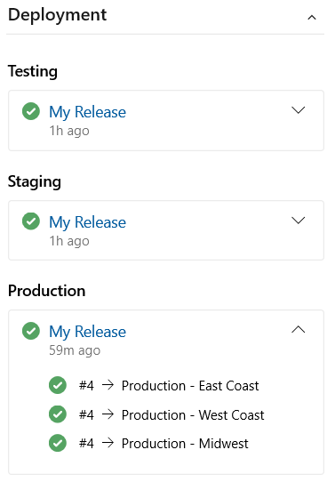
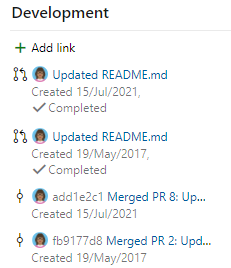
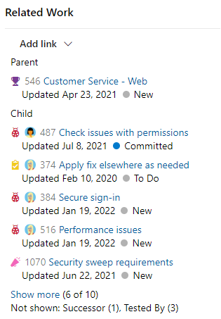

---
title: About work items and work item types
titleSuffix: Azure Boards
description: Learn how Azure Boards supports work items to plan, track, and collaborate with others when developing software applications in Azure DevOps. 
ms.custom: work-items, engagement-fy23
ms.service: azure-devops-boards
ms.author: chcomley
author: chcomley
ms.topic: overview
monikerRange: '<= azure-devops'
ms.date: 06/16/2026
ai-usage: ai-assisted
--- 

# About work items and work item types

[!INCLUDE [version-lt-eq-azure-devops](../../includes/version-lt-eq-azure-devops.md)]

A **work item** is a record in Azure Boards that represents a unit of work - a feature to build, a bug to fix, a task to complete, or an issue or risk to track. Teams use work items to plan delivery, assign ownership, capture discussion and history, and connect code changes to the work they support. Each work item receives a unique identifier within an organization or project collection and is stored in the work item data store.

Every work item uses a **work item type**, which determines the fields available for tracking information. The available work item types depend on the [process used when your project was created](../../boards/work-items/guidance/choose-process.md): **Agile**, **Basic**, **Scrum**, or **CMMI**. If you didn't create a project yet, your choice of process determines the work item types and workflows referenced throughout this article.

To start tracking work on a board, see [Plan and track work](../get-started/plan-track-work.md). For a quick reference to common work item tasks and concepts, see [Work item quick reference](quick-ref.md).

[!INCLUDE [ai-assistance-callout](../../includes/ai-assistance-callout.md)]

## Track work with different work item types

Choose a specific work item type to track different kinds of work. The following images show the default work item types for the four default processes. Your backlog items might appear as User Stories (Agile), Issues (Basic), Product Backlog Items (Scrum), or Requirements (CMMI). All these work item types describe customer value and expose fields for tracking related information.

[!INCLUDE [temp](../includes/work-item-types.md)]

Work item types form a hierarchy: Epics group Features, Features group Requirements (User Stories, Product Backlog Items, Issues, or Requirements), and Requirements group Tasks. You connect items across the hierarchy with parent-child links. For more information, see [Backlogs, portfolios, and Agile project management](../backlogs/backlogs-overview.md).

Each work item type belongs to a category. Categories group work item types and determine which types appear on backlogs and boards.

|Category | Work item type | Controls backlogs and boards |
|----------|----------------|------------------------------|
|Epic  | Epic | Epic portfolio backlogs and boards |
|Feature   | Feature | Feature portfolio backlogs and boards |
|Requirement| User Story (Agile) Issue (Basic) Product Backlog Item (Scrum) Requirement (CMMI)| Product backlogs and boards and Sprints backlog  |
|Task   | Task | Sprint backlogs and Taskboards  |
|Bug   | Bug | Dependent on [team configuration for tracking bugs](#track)  |

The Issue (Agile and CMMI) and Impediment (Scrum) work item types track nonwork project elements that can affect work delivery. By default, they don't appear on any backlog or board.

For other work item types, see [Work item types to track testing, reviews, and feedback ](#wit-other) later in this article.

### Track bugs as requirements or tasks

Teams choose how to track bugs. You can show bugs on the product backlog and board (track as requirements), track them like tasks (link to a user story or product backlog item), or not track them on backlogs. To configure this option, see [Show bugs on backlogs and boards](../../organizations/settings/show-bugs-on-backlog.md). For an overview of team settings, see [Manage teams and configure team tools](../../organizations/settings/manage-teams.md).

### Customize a work item type

Add or revise fields in a work item type, create a custom work item type, or adjust which types appear on backlogs and boards. Which customization options you can use depends on your project's process model. See:

::: moniker range="azure-devops" 
- [Customize your work tracking experience](../../organizations/settings/work/customize-process.md) 
- [About process customization and inherited processes](../../organizations/settings/work/inheritance-process-model.md) 
- [Hosted XML process model](../../organizations/settings/work/hosted-xml-process-model.md).
::: moniker-end

::: moniker range="< azure-devops" 
- [Customize your work tracking experience](../../organizations/settings/work/inheritance-process-model.md) 
- [On-premises XML process customization](../../reference/on-premises-xml-process-model.md).
::: moniker-end

## Work item form and Details tab

The work item form displays the fields you use to track information for each work item. Update a work item from its form or by using bulk import, export, or programmatic methods.

The **Details** tab contains common fields, other fields defined for the work item type, and the **Discussion** control. Common fields appear at the top of the form and include **Title**, **Assigned To**, **State**, **Reason**, **Area**, and **Iteration**—you can update these fields at any time.

:::image type="content" source="media/about-work-items/common-fields-basic.png" alt-text="Screenshot that shows common fields in the work item form for all work item types.":::

### Work item form controls

The form header and tabs include controls to copy, refresh, revert, expand, and navigate the work item.

| Control | Function |
|---------|----------|
|  | Copy the work item URL to the clipboard. The icon appears when you hover over the work item title. |
|  | Open the Discussions section. |
| :::image type="icon" source="../media/icons/icon-refresh-wi.png" border="false"::: | Refresh the work item with the latest changes. |
| :::image type="icon" source="../media/icons/icon-undo-changes-wi.png" border="false"::: | Revert changes to the work item. |
| :::image type="icon" source="../media/icons/icon-history-tab-wi.png" border="false"::: | Open the History tab. |
| :::image type="icon" source="../media/icons/icon-links-tab-wi.png" border="false"::: | Open the Links tab. |
| :::image type="icon" source="../backlogs/media/icon-attachments-tab-wi.png" border="false"::: | Open the Attachments tab. |
| :::image type="icon" source="../media/icons/fullscreen_icon.png" border="false"::: / :::image type="icon" source="../media/icons/exitfullscreen_icon.png" border="false"::: | Enter or exit full display mode for a section within the form. |
| :::image type="icon" source="../media/icons/collapse-wi-section.png" border="false"::: / :::image type="icon" source="../media/icons/expand-wi-section.png" border="false"::: | Collapse or expand a section within the form. |
| :::image type="icon" source="../media/icons/actions-icon.png" border="false"::: | Open the **Actions** menu. For the full list of Actions menu tasks, see [Follow updates and use the Actions menu](#follow-updates-and-use-the-actions-menu). |

### Copy the URL

From the web portal, copy the URL from the browser address bar or hover over the title and select the :::image type="icon" source="../../media/icons/copy-clone-icon.png" border="false"::: copy icon. For other options, see [Copy or clone work items](../backlogs/copy-clone-work-items.md).

:::image type="content" source="../backlogs/media/add-work-item-copy-URL.png" alt-text="Screenshot that shows how to copy the work item URL from the web portal.":::

### Common work tracking fields

The following common fields appear in the header area of most work item forms. The only required field for all work item types is **Title**. When you save the work item, the system assigns a unique **ID**. The form highlights required fields in yellow. For descriptions of other fields, see [Work item field index](../work-items/guidance/work-item-field.md).

> [!NOTE]   
> Other fields might be required depending on customizations made to your process and project.

|Field |   Usage |
|----------|------------------------|
|[Title](../queries/titles-ids-descriptions.md)   |Enter a description of 255 characters or less. You can modify the title later.|
|[Assigned To](#assign)   |Assign the work item to the team member responsible for the work. The drop-down lists team members or contributors depending on context.|
|[State](#workflow-states)   |When you create the work item, the **State** defaults to the first workflow state. Update it to reflect current progress.|
|[Reason](#workflow-states)   | Azure DevOps updates this automatically when you change the State. Each State has a default Reason.|
|[Area](../queries/query-by-area-iteration-path.md)   |Area paths group work items by product, feature, or team. Choose the area path associated with the product or team, or leave it blank until planning. To edit area paths, see [Define area paths and assign to a team](../../organizations/settings/set-area-paths.md).|
|[Iteration](../queries/query-by-area-iteration-path.md)|Iteration paths group work items by time-boxed delivery, such as a sprint or release. Choose the sprint or iteration for the work, or assign it later during planning. To edit iterations, see [Define iteration paths (sprints) and configure team iterations](../../organizations/settings/set-iteration-paths-sprints.md).|

 

### Track active, open, resolved, or closed work items

Workflow states describe how a work item moves from creation to closure. They also determine whether a work item appears on a backlog or board; see [How workflow category states are used in Azure Boards backlogs and boards](workflow-and-state-categories.md).

The User Story (Agile) uses states such as *New*, *Active*, *Resolved*, *Closed*, and *Removed*. The included images illustrate the typical state progressions for User Stories (Agile), Issues (Basic), Product Backlog Items (Scrum), and Requirements (CMMI).

[!INCLUDE [temp](../includes/four-process-workflow.md)]

> [!NOTE]
> - A work item can exist in only one state at a time.
> - When all work is complete, set the work item **State** to Closed.
> - Use boards and the Sprint Taskboard to view and update workflow states with drag and drop. See [Start using your board](../boards/kanban-quickstart.md) and [Update and monitor your Taskboard](../sprints/task-board.md).
> - Depending on the :::image type="icon" source="../media/icons/view-options-icon.png" border="false"::: **View Options** you select, work items in *Closed* or *Completed* states might not appear on the backlog.
> - The *Removed* state prevents a work item from appearing on the backlog. For details, see [Move, change, or delete work items](../backlogs/remove-delete-work-items.md#remove).
> - Query work items by **State** and other fields to list work in progress, resolved, or completed items. See [Query by assignment or workflow changes](../queries/query-by-workflow-changes.md).

### Assign work

You can assign a work item to only one person at a time. The **Assigned To** field stores the identity of a project member. In the work item form, open **Assigned To** to select a project member or start typing a name to narrow results.

:::image type="content" source="media/about-work-items/assigned-to-field.png" alt-text="Screenshot that shows the Assigned To field in the work item form.":::

> [!NOTE]
> - Assign work only to users who are [added to a project or team](../../organizations/security/add-users-team-project.md).
> - A work item can have only one assignee at a time. If multiple people share work, create separate work items for each responsible person.
> - The identity drop-down shows names you recently selected.
> - Assign multiple work items at once from the backlog or query results. See [Bulk modify work items](../backlogs/bulk-modify-work-items.md).
> - For details about identity fields, see [Query by assignment or workflow changes](../queries/query-by-workflow-changes.md).

When your account connects to Microsoft Entra ID or Active Directory, Azure DevOps synchronizes identity fields such as **Activated By**, **Assigned To**, **Closed By**, **Created By**, and **Resolved By**.

To grant project access, add security groups defined in Microsoft Entra ID or Active Directory. For details, see [Create, invite, and delete users in Microsoft Entra ID](/entra/fundamentals/how-to-create-delete-users) or [Set up groups for on-premises Azure DevOps Server deployments](/azure/devops/server/admin/setup-ad-groups).

### Use work item templates to quickly complete forms

Work item templates let you quickly create work items with prepopulated field values. For example, create a task template that sets Area Path, Iteration Path, and discipline whenever you create that task. See [Use templates to add and update work items](../backlogs/work-item-template.md).

### Categorize work items with tags

Tags are custom labels you add to work items to filter backlogs, queries, and boards. Apply one or more tags to any work item type - a single bug might use **regression** and **payment-flow**, while a user story might use **mobile** and **accessibility**. Tags work across work item types, so you can group related items that span features, requirements, and bugs.

Add tags from the work item form. To create new tag definitions, you need the **Create tag definition** permission. For more information, see [Add work item tags to categorize and filter](../queries/add-tags-to-work-items.md).

## Follow updates and use the Actions menu

The **Follow**, **Refresh**, **Revert changes**, and **Actions** menu controls appear on all work item forms. Use them to subscribe to changes, sync the form with the latest edits, undo your changes, and act on the work item.

:::row:::
   :::column span="1":::
      :::image type="content" source="media/about-work-items/follow-refresh-actions-menu.png" alt-text="Screenshot that shows the Follow and Refresh icons and the Actions menu.":::
   :::column-end:::
   :::column span="1":::
      - Choose **Follow** to get updates when someone changes the work item. For details, see [Follow changes made to a user story, bug, or other work item or pull request](follow-work-items.md). 
      - Choose :::image type="icon" source="../media/icons/icon-refresh-wi.png" border="false"::: **Refresh** to update the form with the latest changes someone made while you had the work item open. 
      - Choose :::image type="icon" source="../media/icons/icon-undo-changes-wi.png" border="false"::: **Revert changes** to undo any edits you made to the form. 
      - Use the **Actions** menu for tasks such as:
        - [New linked work item](../backlogs/add-link.md)
        - [Change type](../backlogs/move-change-type.md#change-the-work-item-type)
        - [Move to another project](../backlogs/move-change-type.md#move-a-work-item-to-another-project)
        - [Create copy of a work item](../backlogs/copy-clone-work-items.md)
        - [Send email with work item](email-work-items.md) 
        - [Delete](../backlogs/remove-delete-work-items.md) 
        - [Templates](../backlogs/work-item-template.md)
        - [New branch...](../backlogs/connect-work-items-to-git-dev-ops.md)  
        - [Customize](../../organizations/settings/work/customize-process.md)
   :::column-end:::
:::row-end:::

> [!NOTE]   
> Some menu options might not appear depending on your permissions. Marketplace extensions or process customizations can add extra options.

## Discussion control

Use the **Discussion** control to add and review comments about the work. The rich text editor toolbar appears when you focus the entry box. Each comment records an entry in the **History** field. For details, see [View and add work items](../backlogs/manage-work-items.md). To query Discussion or History, see [Query work item history and discussion fields](../queries/history-and-auditing.md).

In the comment box, type `@` to mention a project member, `#` to link to another work item, or `!` to link to a pull request. Mentioned users receive a notification. For more information, see [Use @mentions in work items and pull requests](../../organizations/notifications/at-mentions.md).

:::image type="content" source="../backlogs/media/discussion-section.png" alt-text="Screenshot that shows the Discussion section within a work item form." border="true":::

## Deployment, Development, and Related Work controls

The **Deployment**, **Development**, and **Related Work** controls appear in most work item forms.

:::row:::
   :::column span="1":::
      
   :::column-end:::
   :::column span="1":::
      
   :::column-end:::
   :::column span="1":::
        
   :::column-end:::
:::row-end:::

The **Deployment** control shows deployment stages and status for a feature or user story, and provides navigation to release runs. See [Link work items to deployments](../backlogs/add-link.md#link-work-items-to-deployments).

The **Development** control surfaces branches, commits, pull requests, and builds related to the work item so you can trace development. See [Drive Git development from a work item](../backlogs/connect-work-items-to-git-dev-ops.md).

The **Related Work** control shows linked work items and lets you add or remove links quickly. See [Link user stories, issues, bugs, and other work items](../backlogs/add-link.md).

## History, Links, and Attachments tabs

The :::image type="icon" source="../backlogs/media/icon-history-tab-wi.png" border="false"::: **History**, :::image type="icon" source="../backlogs/media/icon-links-tab-wi.png" border="false"::: **Links**, and :::image type="icon" source="../backlogs/media/icon-attachments-tab-wi.png" border="false"::: **Attachments** tabs support auditing, traceability, and sharing. Use them to review change history, manage links, and attach files.

### History: Review changes made to the work item

The :::image type="icon" source="../media/icons/icon-history-tab-wi.png" border="false"::: **History** tab records changes to a work item over time. Each change to common fields, rich-text fields, Discussion entries, links, or attachments creates a history entry.

The state-change history diagram appears first. Select **Show all** to see the full state history.

:::image type="content" source="../queries/media/state-change-history-diagram.png" alt-text="Screenshot that shows the state change history diagram in the work item form (web portal only).":::

Select an entry in the left pane to view change details. For more information, see [Query work item history and discussion fields](../queries/history-and-auditing.md).

:::image type="content" source="../queries/media/hist-audit-wi-form.png" alt-text="Screenshot that shows the History tab details in the work item form.":::

### Links: Link work items to other work items or objects

From the :::image type="icon" source="../media/icons/icon-links-tab-wi.png" border="false"::: **Links** tab, add, remove, or view work items and other objects linked to the current work item.

:::image type="content" source="media/about-work-items/links-tab.png" alt-text="Screenshot that shows the Links tab in the work item form.":::

For more, see [Link work items to other objects](../backlogs/add-link.md) and [Link type reference](../queries/link-type-reference.md).

### Attachments: Attach files to a work item

From the :::image type="icon" source="../backlogs/media/icon-attachments-tab-wi.png" border="false"::: **Attachments** tab, add, remove, or view files and images attached to the work item. Drag and drop files into the tab to attach them, or paste images directly into the **Discussion** control. You can add up to 100 attachments per work item, and each attachment is limited to 60 MB. For more information, see [Manage attachments to work items](manage-attachments.md).

  

## Track work in the web portal

Add and update work items from the web portal. For an overview of other clients, see [Tools and clients that connect to Azure DevOps](../../user-guide/tools.md). Use the web portal to perform the tasks listed here.

[!INCLUDE [temp](../includes/page-work-item-tasks.md)]

## Work item types to track testing, reviews, and feedback 
 
In addition to backlog/board types, Azure Boards provides work item types for testing, reviews, and feedback. The following table lists these types and typical uses:

| Category and Work item type | Used to track specified types of work| 
|-----------------------------|--------------------------------------|
|Code Review Request|Tracks a code review request against code maintained in a [TFVC repository](../../repos/tfvc/index.yml). See [Day in the life of a Developer](../../repos/tfvc/day-life-alm-developer-suspend-work-fix-bug-conduct-code-review.md). |
|Code Review Response|A response for each reviewer who provides review comments.|
|Feedback Request|Tracks feedback requests generated through the feedback form. See [Get feedback](/previous-versions/azure/devops/project/feedback/get-feedback).|
|Feedback Response|Creates a response for each person who provides feedback through the Microsoft Feedback Client. See [Get feedback](/previous-versions/azure/devops/project/feedback/get-feedback).|
|Shared Step|Use shared steps to [repeat tests with different data](../../test/repeat-test-with-different-data.md).|
|Shared Parameter|Define parameters for running manual test cases. See [Repeat a test with different data](../../test/repeat-test-with-different-data.md).|
|Test Case|Define manual tests. See [Create test cases](../../test/create-test-cases.md).|
|Test Plan|Group test suites and test cases. See [Create test plans and test suites](../../test/create-a-test-plan.md).|
|Test Suite|Group test cases into testing scenarios within a test plan. See [Create test plans and test suites](../../test/create-a-test-plan.md).|

## Required permissions and access 

Members of the Contributors group can use most features under the **Boards** hub. To add users to a project, see [Add users to a project or team](../../organizations/security/add-users-team-project.md).

The following permissions affect a member's ability to view and edit work items.

**Area path permissions**

- View work items in this node
- Edit work items in this node

**Project-level permissions**

- Create tag definition
- Change work item type
- Move work items out of this project
- Delete and restore work items
- Permanently delete work items

Users with Basic access have full access to work tracking features. Stakeholder access limits certain features. For more information, see [Set permissions and access for work tracking](../../organizations/security/set-permissions-access-work-tracking.md) and [Stakeholder access quick reference](../../organizations/security/stakeholder-access.md).

## Next step

> [!div class="nextstepaction"]
> [Add a work item](view-add-work-items.md)

## Related content 

- [Learn key concepts and work item tasks in Azure Boards](quick-ref.md)
- [Navigate the web portal](../../project/navigation/index.md)
- [Manage work items](../backlogs/manage-work-items.md)
- [Explore backlogs, portfolios, and Agile project management](../backlogs/backlogs-overview.md)
- [Understand Kanban and Agile project management](../boards/kanban-overview.md)
- [Choose between Agile, Scrum, and CMMI processes](./guidance/choose-process.md)
- [View the work item field index](./guidance/work-item-field.md)
