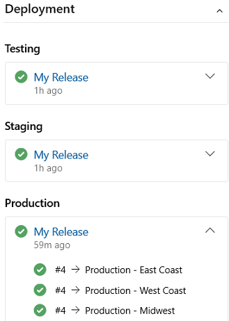

# About work items and work item types

[!INCLUDE [version-lt-eq-azure-devops](../../includes/version-lt-eq-azure-devops.md)]

You use work items to track features and requirements you're developing, code defects or bugs, and issues or risks to your project. Each work item is based on a work item type that determines the work item fields available for tracking information. The work item types available to you differ depending on the [process used when your project was created](../../boards/work-items/guidance/choose-process.md): **Agile**, **Basic**, **Scrum**, or **CMMI**.

Each work item represents an object stored in the work item data store, and is assigned a unique identifier within an organization or project collection. The available work item types depend on the [process you used when creating your project](guidance/choose-process.md).  

If you're just getting started, read this article. To jump right in and start tracking work on a Kanban board, see [Plan and track work](../get-started/plan-track-work.md). For a quick reference to various work item tasks and key concepts, see [Work item quick reference](quick-ref.md).

<a id="wit" />

## Track work with different work item types

To track different types of work, you choose a specific work item type. The following images show the default work item types available for the four default processes. The items in your backlog might be called User Stories (Agile), Issues (Basic), Product Backlog Items (Scrum), or Requirements (CMMI). All four types are similar. They describe the customer value of the work to do and provide fields to track information about that work.   

[!INCLUDE [temp](../includes/work-item-types.md)]

Each work item type belongs to a category. Categories are used to group work item types and determine which types appear on backlogs and boards. 
  
|Category | Work item type | Controls backlogs/boards |
|----------|----------------|--------------------------|
|Epic  | Epic | Epic portfolio backlogs and boards |
|Feature   | Feature | Feature portfolio backlogs and boards |
|Requirement| User Story (Agile) Issue (Basic) Product Backlog Item (Scrum) Requirement (CMMI)| Product backlogs and boards and Sprints backlog  |
|Task   | Task | Sprint backlogs and Taskboards  |
|Bug   | Bug | Dependent on [team configuration for tracking bugs](#track)  | 

The Issue (Agile and CMMI) and Impediment (Scrum) work item types are used to track nonwork project elements that can impact work getting done. By default, they don't appear on any backlog or board. 

For a list of other work item types, see [Work item types to track testing, reviews, and feedback ](#wit-other) later in this article. 

### Track bugs as requirements or tasks 

Your team can choose how to track bugs. They can track them along with requirements and have them show up on their product backlog and Kanban board. Or, they track them similar to tasks, in which case they typically link the bugs to a user story or product backlog item. A third option exists to not track them as requirements or tasks.  
 
To configure the team bug tracking option, see [Show bugs on backlogs and boards](../../organizations/settings/show-bugs-on-backlog.md). For an overview of all team settings, see [Manage teams and configure team tools](../../organizations/settings/manage-teams.md).
 

<a id="customize" />

### Customize a work item type 
 
You can add or modify the fields that are contained within a work item type, add a custom work item type, or change the work item types that appear on backlogs and boards. The method you use and what you can customize depends on the process model assigned to your project. For more information, see the following articles: 

::: moniker range="azure-devops" 
- [Customize your work tracking experience](../../organizations/settings/work/inheritance-process-model.md) 
- [About process customization and inherited processes](../../organizations/settings/work/inheritance-process-model.md) 
- [Hosted XML process model](../../organizations/settings/work/hosted-xml-process-model.md).
::: moniker-end

::: moniker range="< azure-devops" 
- [Customize your work tracking experience](../../organizations/settings/work/inheritance-process-model.md) 
- [On-premises XML process customization](../../reference/on-premises-xml-process-model.md).
::: moniker-end
 
<a id="form" />

## Work item form and Details tab

The work item form shows the fields used to track information related to each work item. In general, you define and update a work item through its work item form, although other methods are available to bulk import, export, update, and modify work items. For an overview of all form controls, see [Work item form controls](work-item-form-controls.md). 

Each work item form contains several tabs. The **Details** tab contains the common fields, other fields defined for the work item type, and the **Discussion** control. Common fields defined for all work item types display at the top of the work item form. As shown in the following image, these fields include the following fields: **Title**, **Assigned To**, **State**, **Reason**, **Area**, and **Iteration**.  You can update these fields at any time. 

:::image type="content" source="media/about-work-items/common-fields-basic.png" alt-text="Screenshot of common fields in work item form for all work item types.":::

<a id="common-fields" />

### Common work tracking fields  

The following common fields appear in most work items in the header area of the form. The only required field for all work item types is **Title**. When the work item is saved, the system assigns it a unique **ID**. The form highlights required field in yellow. For descriptions about other fields, see [Work item field index](../work-items/guidance/work-item-field.md).   

> [!NOTE]   
> Additional fields may be required depending on customizations made to your process and project.  

|Field |   Usage |
|----------|------------------------|
|[Title](../queries/titles-ids-descriptions.md)   |Enter a description of 255 characters or less. You can always modify the title later.|
|[Assigned To](#assign)   |Assign the work item to the team member responsible for performing the work. Depending on the context you're working in, the drop-down menu lists only team members or contributors to the project.|
|[State](#workflow-states)   |When the work item is created, the **State** defaults to the first state in the workflow. As work progresses, you update it to reflect the current state.|
|[Reason](#workflow-states)   | Automatically updates when the State is changed. Each State is associated with a default reason.|
|[Area](../queries/query-by-area-iteration-path.md)   |Choose the area path associated with the product or team, or leave blank until assigned during a planning meeting. To change the dropdown list of areas, see [Define area paths and assign to a team](../../organizations/settings/set-area-paths.md).|
|[Iteration](../queries/query-by-area-iteration-path.md)|Choose the sprint or iteration in which the work is to be completed, or leave it blank and assign it later, during a planning meeting. To change the drop-down list of iterations, see [Define iteration paths (sprints) and configure team iterations](../../organizations/settings//set-iteration-paths-sprints.md).|

 

### Track active, open, resolved, or closed work items

Workflow states define how a work item progresses from its creation to closure. Workflow states also determine whether a work item appears on a backlog or board as described in [How workflow category states are used in Azure Boards backlogs and boards](workflow-and-state-categories.md). 

The four main states that are defined for the User Story (Agile process) describe a user story's progression. The workflow states are *New*, *Active*, *Resolved*, *Closed*, and *Removed*. The following images illustrate the natural progressions and regressions for User Stories (Agile), Issues (Basic), Product Backlog Items (Scrum), or Requirements (CMMI). Similar progressions and regressions are defined for other work item types for each process.  
 
[!INCLUDE [temp](../includes/four-process-workflow.md)] 

> [!NOTE]
> - A work item can exist in one and only one state. 
> - When all work is complete, set the work item **State** to Closed.
> - The Kanban board and Sprint Taskboard support viewing and updating the workflow state of requirements or tasks, respectively, using drag and drop. For more information, see [Start using your Kanban board](../boards/kanban-quickstart.md) and [Update and monitor your Taskboard](../sprints/task-board.md). 
> - Depending on the :::image type="icon" source="../media/icons/view-options-icon.png" border="false"::: **View Options** you select, work items in a *Closed* or *Completed* state won't appear on the backlog. 
> - The *Removed* state supports removing a work item from appearing on the backlog. For more information, see [Move, change, or delete work items](../backlogs/remove-delete-work-items.md#remove). 
> - You can query work items by **State** and other fields to list work in progress, resolved, or completed. For more information, see [Query by assignment or workflow changes](../queries/query-by-workflow-changes.md).

<a id="assign" />

### Assign work 

You can only assign a work item to one person at a time. The **Assigned To** field is an identity field designed to hold a user identity that has been added to the project. Within the work item form, choose the **Assigned To** field to select a project member. Or, you can begin entering the name of a project member to quickly focus your search to a select few.  
 
:::image type="content" source="media/about-work-items/assigned-to-field.png" alt-text="Screenshot of Assigned To field in the work item form."::: 

> [!NOTE]
> - You can assign a work item only to users that have been [added to a project or team](../../organizations/security/add-users-team-project.md)
> - You can assign a work item to one and only one user at a time. If work is split across two or more users, consider creating separate work items that you'll assign to each user responsible for the work to complete. 
> - Over time, the drop-down menu of identity fields display the names you have most recently selected.
> - You can assign several work items at once from the backlog or query results, see [Bulk modify work items](../backlogs/bulk-modify-work-items.md) for details. 
> - To learn more about identity fields, see [Query by assignment or workflow changes](../queries/query-by-workflow-changes.md).
 

When configured with Azure Active Directory or Active Directory, Azure DevOps synchronizes identity fields with these directories. Identity fields include **Activated By**, **Assigned To**, **Closed By**, **Created By**, and **Resolved By**. 

You can grant access to a project by adding security groups that you created in Azure AD or Active Directory by adding accounts to existing or custom groups defined from the collection setting **Security** pages. For more information, see [Add or delete users using Azure Active Directory](/azure/active-directory/fundamentals/add-users-azure-active-directory) or [Set up groups for use in Azure DevOps Server deployments](/azure/devops/server/admin/setup-ad-groups). 
 

<a id="templates" />

### Use work item templates to quickly fill in forms

With work item templates, you can quickly create work items that have prepopulated values for your team's commonly used fields. For example, create a task template that sets the area path, iteration path, and discipline or activity whenever you use it to create a task. For more information, see [Use templates to add and update work items](../backlogs/work-item-template.md). 

## Follow, Refresh, Revert, and Actions menu

The **Follow**, **Refresh**, **Revert changes**, and **Actions** menu controls appear on all work item forms. 

:::row:::
   :::column span="1":::
      :::image type="content" source="media/about-work-items/follow-refresh-actions-menu.png" alt-text="Screenshot of Follow and Refresh icons, and Actions menu.":::
   :::column-end:::
   :::column span="1":::
      - Choose **Follow** to get updates when changes are made to the work item. For more information, see [Follow changes made to a user story, bug, or other work item or pull request](follow-work-items.md). 
      - Choose :::image type="icon" source="../media/icons/icon-refresh-wi.png" border="false"::: **Refresh**  to update the work item form with the latest changes that someone else may have made while you had the work item open. 
      - Choose  :::image type="icon" source="../media/icons/icon-undo-changes-wi.png" border="false"::: **Revert changes** to undo any changes you made to the work item form. 
      - To exercise a task available from the **Actions** menu, see the following articles: 
        - [New linked work item](../backlogs/add-link.md)
        - [Change type](../backlogs/move-change-type.md#change-the-work-item-type)
        - [Move to team project](../backlogs/move-change-type.md#change-the-work-item-type)
        - [Create copy of work item...](../backlogs/copy-clone-work-items.md)
        - [Email work item](email-work-items.md) 
        - [Delete](../backlogs/remove-delete-work-items.md) 
        - [Templates](../backlogs/work-item-template.md)
        - [New branch...](../backlogs/connect-work-items-to-git-dev-ops.md)  
        - [Customize](../../organizations/settings/work/customize-process.md)
   :::column-end:::
:::row-end:::

> [!NOTE]   
> Some menu options may not appear depending on your permission assignments. Also, additional options may appear based on Marketplace extensions added to your organization or other customizations made to the work item type. 

## Discussion control  

With the **Discussion** control, project members can  add and review comments made about the work being performed. The rich text editor tool bar displays below the text entry area when you select your cursor within each text box. Each comment added is recorded in the **History** field. For more information, see [View and add work items](view-add-work-items.md#capture-comments-in-the-discussion-section). To query the Discussion or History, see [Query work item history and discussion fields](../queries/history-and-auditing.md).

> [!div class="mx-imgBorder"]  
>    
 
::: moniker range=">= azure-devops-2019"

## Deployment, Development, and Related Work controls

The **Deployment**, **Development** and **Related Work** controls are special controls available in most work tracking forms.  

:::row:::
   :::column span="1":::
      
   :::column-end:::
   :::column span="1":::
      
   :::column-end:::
   :::column span="1":::
        
   :::column-end:::
:::row-end:::

The **Deployment** control provides a quick view of whether a feature or user story has been deployed and to what stage. You gain visual insight into the status of a work item as it is deployed to different release environments and quick navigation to each release stage and run. For more information, see [Link work items to builds and deployments](work-item-deployments-control.md).

::: moniker-end

::: moniker range="tfs-2018"

## Development and Related Work controls

The **Development** and **Related Work** controls are used to support common linking tasks to development objects or other work items. These controls are available in most work items used to track work. The following table provides a short description of each control.  
 
:::row:::
   :::column span="1":::
      
   :::column-end:::
   :::column span="1":::
        
   :::column-end:::
:::row-end:::

::: moniker-end

The **Development** control records all Git development processes that support completion of the work item.  It also supports traceability, providing visibility into all the branches, commits, pull requests, and builds related to the work item. For more information, see [Drive Git development from a work item ](../backlogs/connect-work-items-to-git-dev-ops.md).

The **Related Work** control provides a quick view of linked work items, and supports adding a link to a parent work item. Also, you can quickly add and remove linked work items. For more information, see [Link user stories, issues, bugs, and other work items](../backlogs/add-link.md). 
  
## History, Links, and Attachment tabs 

The :::image type="icon" source="../backlogs/media/icon-history-tab-wi.png" border="false"::: **History**, :::image type="icon" source="../backlogs/media/icon-links-tab-wi.png" border="false"::: **Links**, and :::image type="icon" source="../backlogs/media/icon-attachments-tab-wi.png" border="false"::: **Attachments** tabs support auditing, traceability, and sharing information.  These three tabs provide a history of changes, controls to add and remove links to work items, and controls to attach and remove files.  

### History: Review changes made to the work item 

The :::image type="icon" source="../media/icons/icon-history-tab-wi.png" border="false"::: **History** tab maintains a record of changes made to a work item over time. A record is made when changes are made to any of the [common fields](#common-fields), description or other rich-text fields, **Discussion** control entries, or addition or removal of links or attachments.  

The state change history diagram appears first. To see the entire history of state changes, choose **Show all**.

:::image type="content" source="../queries/media/state-change-history-diagram.png" alt-text="Screenshot of Work item form, Web portal, State change history diagram (web portal only).":::

Choose an entry in the left pane to view the details of changes made. For more information, see [Query work item history and discussion fields](../queries/history-and-auditing.md). 

:::image type="content" source="../queries/media/hist-audit-wi-form.png" alt-text="Screenshot of Work item form, History tab, Web portal, Details.":::

### Links: Link work items to other work items or objects

From the :::image type="icon" source="../media/icons/icon-links-tab-wi.png" border="false"::: **Links** tab, you can add, remove, or view work items or other objects linked to the work item. Different link types are used to link to different objects, or to link to other work items. 

:::image type="content" source="media/about-work-items/links-tab.png" alt-text="Screenshot of Work item form, Links tab.":::

To learn more about linking, see the following articles: 

-  [Link user stories, issues, bugs, and other work items](../backlogs/add-link.md)
-  [Linking, traceability, and managing dependencies](../queries/link-work-items-support-traceability.md) 
-  [Link type reference](../queries/link-type-reference.md)
 

### Attachments: Attach files to a work item

From the :::image type="icon" source="../media/icons/icon-links-tab-wi.png" border="false"::: **Attachments** tab, you can add, remove, or view files or images added to the work item. You can add up to 100 attachments to a work item. Attachments are limited to 60 MB. For more information, see [Share information within work items and social tools](../queries/share-plans.md). 
 

  

## Track work in the web portal 

You can add and update work items from the web portal. For an overview of all clients that connect to your project, see [Tools and clients that connect to Azure DevOps](../../user-guide/tools.md). Use the web portal to accomplish the following tasks. 

[!INCLUDE [temp](../includes/page-work-item-tasks.md)] 

<a id="wit-other" />

## Work item types to track testing, reviews, and feedback 
 
Along with the work items types that appear on backlogs and boards, there are work item types that track testing, reviews, and feedback. These types, listed in the following table by category, are available for most all processes.  

| Category and Work item type | Used to track specified types of work| 
|-----------------------------|--------------------------------------|
|Code Review Request|Tracks a code review request against code maintained in a [Team Foundation version control (TFVC) repository](../../repos/tfvc/index.yml). For more information, see [Day in the life of a Developer: Suspend work, fix a bug, and conduct a code review](../../repos/tfvc/day-life-alm-developer-suspend-work-fix-bug-conduct-code-review.md). |
|Code Review Response|A code review response is created for each person who's requested to provide review comments.|
|Feedback Request|Feedback requests track requests for feedback generated through the feedback request form. See [Get feedback](/previous-versions/azure/devops/project/feedback/get-feedback).|
|Feedback Response|A feedback response is created for each person and for each item for which feedback is provided through the Microsoft Feedback Client. See [Get feedback](/previous-versions/azure/devops/project/feedback/get-feedback).|
|Shared Step|Shared steps are used to [repeat tests with different data](../../test/repeat-test-with-different-data.md).|
|Shared Parameter|Shared Parameters specify different data and parameters for running manual test cases. See [Repeat a test with different data](../../test/repeat-test-with-different-data.md).|
|Test Case|Each test case [defines a manual test](../../test/create-test-cases.md).|
|Test Plan|Test plan group test suites and individual test cases together. Test plans include static test suites, requirement-based suites, and query-based suites.For more information, see [Create test plans and test suites](../../test/create-a-test-plan.md). |
|Test Suite|Test suites group test cases into separate testing scenarios within a single test plan. Grouping test cases makes it easier to see which scenarios are complete. See [Create test plans and test suites](../../test/create-a-test-plan.md). |
 

<a id="permissions-access" />

## Required permissions and access 

Members added to the Contributors group of a project can use most features provided under the **Boards** hub. To add users to a project, see [Add users to a project or team](../../organizations/security/add-users-team-project.md).

The following table summarizes the permissions that impact project member's ability to view and edit work items. 

| Level |  Permission | 
|-----|--------| 
|Area path | **View work items in this node**| 
|Area path | **Edit work items in this node**| 
|Project |   **Create tag definition**| 
|Project |   **Change work item type**|  
|Project |   **Move work items out of this project**|  
|Project |   **Delete and restore work items**|  
|Project |   **Permanently delete work items**|    

Users with Basic access have full access to all features. Users with Stakeholder access are limited to certain features. To learn more about work tracking permissions and feature access, see [Permissions and access for work tracking](../../organizations/security/permissions-access-work-tracking.md) and [Stakeholder access quick reference](../../organizations/security/stakeholder-access.md). 
 

## Next steps

> [!div class="nextstepaction"]
> [Add a work item](../backlogs/add-work-items.md?toc=/azure/devops/boards/work-items/toc.json)

## Related articles 

- [Key concepts and work item tasks in Azure Boards](quick-ref.md)
- [Web portal navigation](../../project/navigation/index.md) 
- [Work item form controls](work-item-form-controls.md)
- [Backlogs, portfolios, and Agile project management](../backlogs/backlogs-overview.md) 
- [About Kanban and Agile project management](../boards/kanban-overview.md)  
- [Agile, Scrum, and CMMI processes](./guidance/choose-process.md)  
- [Work item field index](./guidance/work-item-field.md) 
