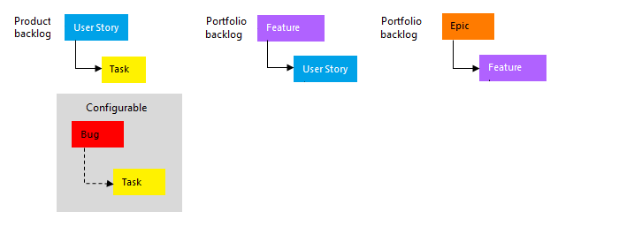

# Best tool to add, update, and link work items in Azure Boards

[!INCLUDE [version-lt-eq-azure-devops](../../includes/version-lt-eq-azure-devops.md)] 

Azure Boards provides you several tools&mdash;many designed to support a single task and others that support several tasks. This article provides a guide to the best tool for specific tasks that will help you work most efficiently. 

## Work item form 

If you want to make a single update to one work item, you can make an update from within the work item form. When you want to add or update several work items at a time, then you'll want to use a backlog or query. 

[Work item form controls](work-item-form-controls.md) | [Work item field index](guidance/work-item-field.md)

**Best tool for**: 
- [Updating a work item field for a single work item](../backlogs/add-work-items.md)  
- [Adding to the discussion, mentioning others in the discussion](view-add-work-items.md#capture-comments-in-the-discussion-section)
- [Choosing to follow or unfollow a work item](follow-work-items.md) 
- [Driving Git development, creating a branch](../backlogs/connect-work-items-to-git-dev-ops.md)
- [Adding a link to another work item or external object](../backlogs/add-link.md) 
- [Copying or cloning a work item](../backlogs/copy-clone-work-items.md) 
- [Deleting the work item](../backlogs/remove-delete-work-items.md#delete-work-items) 

**Additional supported tasks**: 

- [Share information](../queries/share-plans.md)
- [Copy the work item URL](../backlogs/copy-clone-work-items.md#copy-the-url)
- [Capturing the work item to use as a template](../backlogs/work-item-template.md#capture)
- [Updating fields of the work item by applying an existing template](../backlogs/work-item-template.md#apply) 

::: moniker range=">= azure-devops-2019" 

## Work Items  

Use the [Work Items](view-add-work-items.md) page to quickly focus on work items of interest to you. 

**Best tool for**: 
- Listing and filtering work items of interest to you, specifically work items that meet the following criteria: 
	- That are assigned to you
	- That you chose to follow
	- Where you were mentioned
	- That you've recently viewed or updated
	- That has been recently updated, completed, or created for the project. 

#### Other supported tasks: 

- [Add a work item](view-add-work-items.md)  
- [Restore work items from the recycle bin](../backlogs/remove-delete-work-items.md#restore-work-items)  
- [View work items through a mobile browser](../..//project/navigation/mobile-work.md)

::: moniker-end

## Boards 

The two types of Kanban boards, product backlog and portfolio backlogs, provide the quickest means for adding user stories and portfolio work item types. You can also quickly add and update the status of child items within a hierarchy. As shown in the following image for the Agile process, when you add tasks to user stories, users stories to features, or features to epics, you automatically create parent-child links between the work items.   

> [!div class="mx-imgBorder"]  
> 

[Product backlog board](../boards/kanban-quickstart.md) | [Features or Epics board](../boards/kanban-epics-features-stories.md) | [Customize cards](../boards/customize-cards.md)

**Best tool for**: 
- [Implementing Kanban methods](../boards/best-practices-kanban.md)  
- Viewing the flow of work from start to completion  
- Quickly adding [product backlog](../boards/kanban-quickstart.md) and [portfolio backlog](../boards/kanban-epics-features-stories.md) items 
- Updating the status of backlog items  
- Adding linked child items ([checklists](../boards/add-task-checklists.md), [user stories or features](../boards/kanban-epics-features-stories.md))  
- [Focusing the view based on assignment, tags, or other filter criteria](../backlogs/filter-backlogs-boards-plans.md) 
- Adding, running, and updating [inline test cases](../boards/add-run-update-tests.md))

**Additional supported tasks**:  
::: moniker range=">= azure-devops-2019" 
- [Assigning a work item, updating a field displayed on a card](../boards/kanban-quickstart.md#update-fields-from-the-card)  
- [Monitoring cumulative flow](../../report/dashboards/cumulative-flow.md)  
- [Monitoring lead time and cycle time control charts](../..//report/dashboards/cycle-time-and-lead-time.md)  
::: moniker-end  

::: moniker range="tfs-2018"  
- [Assigning a work item, updating a field displayed on a card](../boards/kanban-quickstart.md)  
- [Monitoring cumulative flow](../../report/dashboards/cumulative-flow.md)  
::: moniker-end  

[!INCLUDE [temp](../includes/setup-backlogs-boards.md)]

## Backlogs

You can quickly add and prioritize your product and portfolio backlogs, which list work items either as a flat or hierarchical list. You can also quickly add and reparent child items within a hierarchy.   

[Product backlog](../backlogs/create-your-backlog.md) | [Portfolio backlogs](../backlogs/define-features-epics.md) 

**Best tool for**: 
- [Managing your product backlog, developing your project plan](../backlogs/best-practices-product-backlog.md)
- Quickly adding [product](../backlogs/create-your-backlog.md) and [portfolio backlog items](../backlogs/define-features-epics.md)     
- [Moving backlog items in priority order](../backlogs/create-your-backlog.md#move-items-priority-order) 
- [Creating, viewing, and modifying a hierarchy of backlog items](../backlogs/define-features-epics.md) 
- [Organizing your backlog, linking or mapping backlog items to portfolio backlog items](../backlogs/organize-backlog.md)
- [Planning a sprint](../sprints/assign-work-sprint.md) 
- [Forecasting work](../sprints/forecast.md) 
- [Emailing a list of backlog items](email-work-items.md)
- [Focusing the list based on assignment, tags, or other filter criteria](../backlogs/filter-backlogs-boards-plans.md) 

**Additional supported tasks**:  
::: moniker range=">= azure-devops-2019" 
- [Bulk modifying work items](../backlogs/bulk-modify-work-items.md)  
	- [Change work item type](../backlogs/move-change-type.md#change-type)  
	- [Move work item to a different project](../backlogs/move-change-type.md#move)  
	- [Assign work items, change the iteration](../backlogs/bulk-modify-work-items.md#assign-to)  
	- [Add or remove tags](../queries/add-tags-to-work-items.md#bulk-add-or-remove-tags)
	- [Delete work items](../backlogs/remove-delete-work-items.md#delete)  
- [Creating a Git branch from one or more work items](../backlogs/connect-work-items-to-git-dev-ops.md)  
- [Monitoring team velocity](../../report/dashboards/team-velocity.md)  
::: moniker-end  

::: moniker range="tfs-2018"  
- [Bulk modifying work items](../backlogs/bulk-modify-work-items.md)
	- [Assign work items, change the iteration](../backlogs/bulk-modify-work-items.md#assign-to)
 	- [Delete work items](../backlogs/remove-delete-work-items.md#delete)  
 	- [Add or remove tags](../queries/add-tags-to-work-items.md#bulk-add-or-remove-tags)
- [Creating a Git branch from one or more work items](../backlogs/connect-work-items-to-git-dev-ops.md)
- [Restoring work items from the recycle bin](../backlogs/remove-delete-work-items.md#restore-work-items) 
- [Monitoring team velocity](../../report/dashboards/team-velocity.md) 
::: moniker-end  

## Sprint tools

Sprint tools provide teams a focused view of work items they've assigned to a specific sprint. You can add tasks to work items and prioritize your sprint backlog.  

[Sprint backlog](../sprints/add-tasks.md) | [Taskboard](../sprints/task-board.md) | [Capacity](../sprints/set-capacity.md)  
 
**Best set of tools for**: 
- [Implementing Scrum methods](../sprints/best-practices-scrum.md)  
- [Adding tasks to backlog items](../sprints/add-tasks.md)  
- [Configuring team capacity](../sprints/set-capacity.md)  
- [Monitoring and adjusting team capacity](../sprints/adjust-work.md)  
- [Updating remaining work, and task status](../sprints/task-board.md)  
- [Emailing or sharing a sprint plan](../sprints/share-plan.md)

**Additional supported tasks**: 
- [Monitoring sprint burndown](../../report/dashboards/configure-sprint-burndown.md)  
- [Bulk modifying work items](../backlogs/bulk-modify-work-items.md)  

## Queries

Queries enable you to filter work items within or across projects for the purposes of listing, updating, or sharing work items.

- [Queries](../queries/view-run-query.md) | [Query operators](../queries/query-operators-variables.md) 

**Best tool for**:  
- [Listing items to run bulk updates, assign, or reassign](../backlogs/bulk-modify-work-items.md)
- Listing a [tree of parent-child related work item](../queries/linking-attachments.md#tree) or [dependent work items](../queries/linking-attachments.md#dependents)
- [Triaging work items (review, set priority, update)](../queries/triage-work-items.md)
- [Creating simple progress and trend charts](../../report/dashboards/charts.md)
- [Emailing a list work items](email-work-items.md)

**Additional supported tasks**: 
- Create a chart and add it to a dashboard
- Create a chart to get a count of items or sum a field
- Create a chart that shows a burndown or burnup over time

## Plans 

When you want to review the schedule of stories or features your teams plan to deliver, use  [Delivery Plans](../plans/review-team-plans.md). Plans show scheduled work items that are assigned to sprints of selected teams against a calendar view. 

**Best tool for**: 
- [Viewing product or portfolio work items assigned to several teams against a calendar schedule](../plans/review-team-plans.md)  

**Additional supported tasks**: 
- [Moving a work item to a different iteration](../plans/review-team-plans.md)

## Office integration tools  

> [!NOTE]   
> Starting with Azure DevOps Server 2019 and Visual Studio 2019, the Team Foundation plug-in for Office is deprecating support for Office Project and Storyboarding with PowerPoint.  

Use [**Excel**](../backlogs/office/bulk-add-modify-work-items-excel.md) to complete the following tasks: 
- Add or update many work items and their fields
- Add or change hierarchical links between work items. 

<!--

:::row:::
   :::column span="1":::
   **Office application**
   :::column-end:::
   :::column span="3":::
   **Best tool for:**
   :::column-end:::
:::row-end:::
:::row:::
   :::column span="1":::
   [**Excel**](../backlogs/office/bulk-add-modify-work-items-excel.md) 
   :::column-end:::
   :::column span="3":::
    
   
   - Adding or updating many work items and their fields
   - Adding or changing hierarchical links between work items
   
   :::column-end:::
:::row-end:::
:::row:::
   :::column span="1":::
   [**Project**](/previous-versions/azure/devops/boards/backlogs/office/create-your-backlog-tasks-using-project) 
   :::column-end:::
   :::column span="3":::
   
    
   - Importing a project plan to a project
   - Adding tasks to Project and publishing them as work items
   - Creating or updating parent-child links or predecessor-successor links
   
   :::column-end:::
:::row-end:::
:::row:::
   :::column span="1":::
   [**Storyboarding with PowerPoint**](/previous-versions/azure/devops/boards/backlogs/office/storyboard-your-ideas-using-powerpoint)   
   :::column-end:::
   :::column span="3":::
    
   
   - Storyboarding features and user interface changes 
   - [Linking your storyboard to a work item](/previous-versions/azure/devops/boards/backlogs/office/storyboard-your-ideas-using-powerpoint#link-your-storyboard-to-a-backlog-item)
   - [Adding and sharing storyboard shapes](/previous-versions/azure/devops/boards/backlogs/office/add-share-storyboard-shapes)
   
   :::column-end:::
:::row-end:::

-->

## Test tools, test artifacts, and bugs

Testing tools used several work item types&mdash;such as test plans, test suites, test cases, and more. You create and manage them from **Test Plans/Test** or using one or more test tools. Several of these tools also support creating bugs.  

:::row:::
   :::column span="1":::
   **Test tool**
   :::column-end:::
   :::column span="3":::
   **Best tool for:**
   :::column-end:::
:::row-end:::
:::row:::
   :::column span="1":::
   [Test Plans](../../test/create-a-test-plan.md) 
   :::column-end:::
   :::column span="3":::
    
   
   - [Test Plans and Test Suites](../../test/create-a-test-plan.md)
   - [Test Cases](../../test/create-test-cases.md)
   - [Test Cases, grid view](../../test/create-test-cases.md#use-the-grid-view-to-edit-test-cases)
   - [Shared Steps, Shared Parameters](../../test/repeat-test-with-different-data.md)
   - [Delete test artifacts](../backlogs/delete-test-artifacts.md)
   
   **Additional supported tasks**:

   
   - [Track test status](../../test/track-test-status.md)
   - [Order manual tests within suites](/previous-versions/azure/devops/2016/jun-01-team-services#ordering-of-tests-in-test-hub)
   - [Export test plans and test suites](../../test/reference-qa.yml#testcases)
   - [Assign testers to test cases](../../test/user-acceptance-testing.md#assign-and-invite-testers)
   
   :::column-end:::
:::row-end:::
:::row:::
   :::column span="1":::
   [Test Runner](../../test/run-manual-tests.md)
   :::column-end:::
   :::column span="3":::
    
   
   - [Running tests, adding bugs](../../test/run-manual-tests.md) 
   
   :::column-end:::
:::row-end:::
:::row:::
   :::column span="1":::
   [Test &amp; Feedback extension](../../test/connected-mode-exploratory-testing.md) 
   :::column-end:::
   :::column span="3":::
    
   
   - [Exploratory testing, capture feedback in connected mode](../../test/connected-mode-exploratory-testing.md)
   - [Adding bugs, tasks, and test cases linked to a work item](../../test/explore-workitems-exploratory-testing.md)
   - [Requesting feedback](../../test/request-stakeholder-feedback.md)
   - [Providing feedback](../../test/provide-stakeholder-feedback.md)
   
   **Additional supported tasks**: 

   
   - [Updating existing bugs](../../test/add-to-bugs-exploratory-testing.md)
   - [Capture feedback in standalone mode](../../test/standalone-mode-exploratory-testing.md)
   - [Capture screen recordings of your app during testing](../../test/run-manual-tests.md)
   
   :::column-end:::
:::row-end:::

## Other tools 

:::row:::
   :::column span="1":::
   **Tool**
   :::column-end:::
   :::column span="3":::
   **Best tool for:**
   :::column-end:::

:::row-end:::

:::row:::
   :::column span="1":::
   [Adhoc search](../queries/search-box-queries.md) 
   :::column-end:::
   :::column span="3":::
    
   
   - Find a specific work item using its ID or a keyword
   - Find one or more work items across all projects in a fast, flexible manner
   - Run full text search across all work item fields
   - Review work items assigned to a specific team member
   - Search against specific work item fields to quickly narrow down a list of work items
   - Determine what key words will support a managed search.
   
   :::column-end:::
:::row-end:::

:::row:::
   :::column span="1":::
   [Work item templates](../backlogs/work-item-template.md) 
   :::column-end:::
   :::column span="3":::
    
   
   - Capture templates
   - Apply templates to update work items
   - Use templates to create work items
   - Manage work item templates.
   
   :::column-end:::
:::row-end:::
:::row:::
   :::column span="1":::
   **Request and capture feedback**
   :::column-end:::
   :::column span="3":::
    
   
   - [Request feedback](/previous-versions/azure/devops/project/feedback/get-feedback)
   - [Give feedback using Microsoft Feedback Client](/previous-versions/azure/devops/project/feedback/give-feedback)
   
   :::column-end:::
:::row-end:::
:::row:::
   :::column span="1":::
   **Notifications**
   :::column-end:::
   :::column span="3":::
    
   
   - [Manage personal notifications](../../organizations/notifications/manage-your-personal-notifications.md)
   - [Manage team and project notifications](../../organizations/notifications/manage-team-group-global-organization-notifications.md)
   - [Manage organization notifications](../../organizations/notifications/manage-team-group-global-organization-notifications.md)
   
   :::column-end:::
:::row-end:::
:::row:::
   :::column span="1":::
   **Favorites**
   :::column-end:::
   :::column span="3":::
    
   
   - [Set personal and team favorites](../../project/navigation/set-favorites.md)  
   
   :::column-end:::
:::row-end:::

## Marketplace extensions 

Other tools become available when you install one of the [Extensions for Azure DevOps, Boards category](https://marketplace.visualstudio.com/search?target=AzureDevOps&category=Boards&sortBy=Downloads). 

See also [Azure Boards extensions developed by Microsoft](../extensions/index.md).

## Related articles 

- [Set up your Backlogs and Boards](../backlogs/set-up-your-backlog.md)  
- [Navigate in the web portal](../../project/navigation/index.md)
- [Navigate in Team Explorer](../../user-guide/work-team-explorer.md)
- [Why use Azure Boards?](../get-started/why-use-azure-boards.md)
