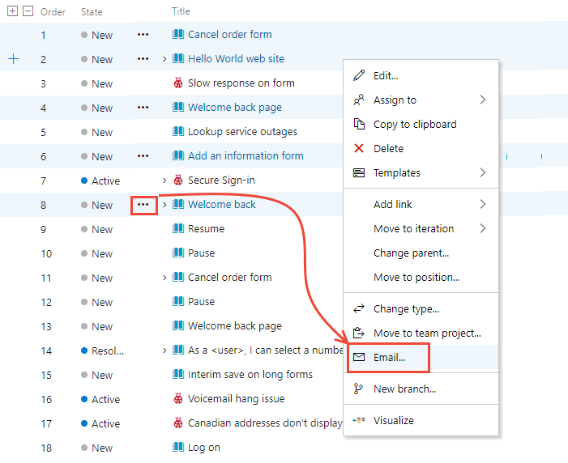
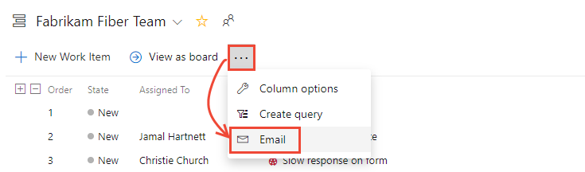
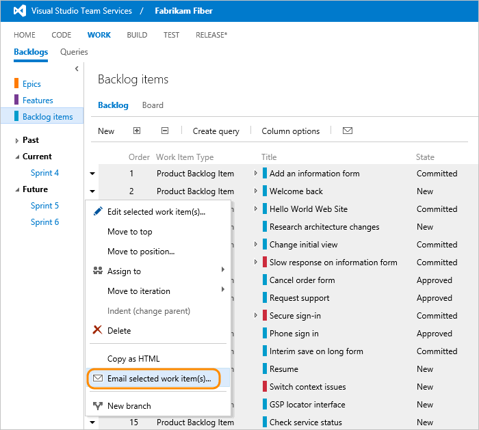
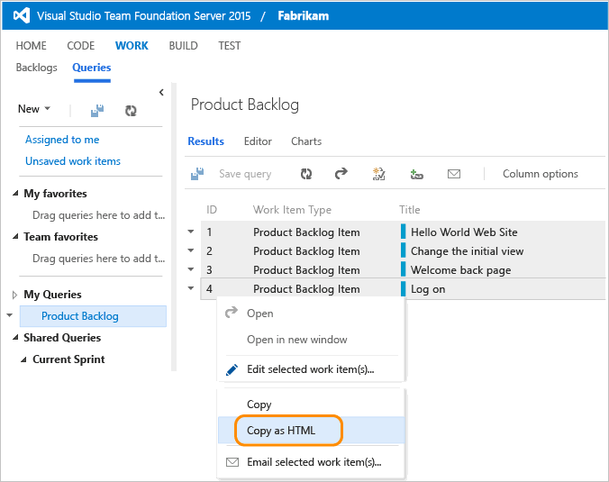
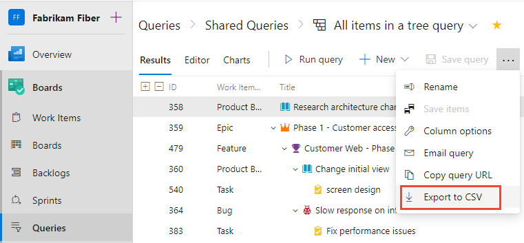

## Email summary lists with links to items  

Another way to share items is by emailing summary lists, such as a sprint summary plan or active bugs list. You can do this from a backlog or query results list.  

Depending on the option and client you choose, summary lists may or may not include a hyperlink to the work item ID.  

 
# [Browser](#tab/browser)

::: moniker range=">= tfs-2017"  

<a id="team-services-email-list" /> 
 

**To email items from the web portal**: Open a backlog or query and highlight the items from the list. Open the context menu for one of the selected items and select to email them.   
::: moniker-end  
::: moniker range=">= tfs-2018"

> [!div class="mx-imgBorder"]  
>    
::: moniker-end  

::: moniker range="tfs-2017"
 
::: moniker-end  

::: moniker range=">= tfs-2018"
If you want to mail a list of all items in the backlog or query, choose the  actions icon, and select the **Email** option. 

> [!div class="mx-imgBorder"]  
>   

::: moniker-end  

::: moniker range="tfs-2017"
If you want to mail a list of all items in the backlog or query, simply choose the  mail icon. 

  

::: moniker-end  

::: moniker range="<= tfs-2015"

**To email items from the web portal for TFS 2015**: Open a backlog or query and highlight the items from the list. Open the context menu for one of the selected items and select to email them.
    
  

If you want to mail a list of all items in the backlog or query, simply choose the  mail icon. 
 
  

::: moniker-end  

# [Visual Studio 2015](#tab/visual-studio) 

<a id="team-explorer-email-list" />

**To email items from Visual Studio**: Open a query, highlight the items from the list, choose the context menu, and select **Send selection to Microsoft Outlook** from the menu. This option requires that you configure Office Outlook on your client computer.  

   
 

# [Team Explorer Everywhere](#tab/tee) 

<a id="tee-email-list" />

**From Eclipse**: Open a query, highlight the items from the list, and then choose the Copy selected items to the clipboard from the context menu. Paste the clipboard contents to your email application.    
 
  
 
---

## Copy formatted list of work items  

With this option, you can copy an HTML formatted table of selected items. You can then email this list using your choice of email client.  

1.  From the web portal, open a backlog or a list of query results.  

2.  Select the work items you want to copy.   

      

    The formatted table contains a link to each work item included in your selected results list.  

3.  Paste the contents of the clipboard into your email client or other application. To open a linked work item, requires users to have read access to the project or area node for those work items.   

## Print items  

To print the details of a work item, open a query in Visual Studio that contains the work item(s) you want to print, and select or highlight those items that you want to print. Then, choose the print option from the context menu.   

   

## Copy the URL to a single work item  

> [!NOTE]   
> All URLs you copy, regardless of the client you use to copy them, opens the work item in the web portal. 

# [Browser](#tab/browser)

::: moniker range=">= tfs-2017"  

<a id="team-services-copy-url" />

**From the web portal**, simply copy the URL from the web browser address or hover over the title and then click the  copy-to-clipboard icon.

  

::: moniker-end  

::: moniker range=">= tfs-2013 <= tfs-2015" 

<a id="tfs-portal-copy-url" />

**From the web portal for an on-premises TFS**, open the work item and then from the context menu for the browser, choose the copy link option. 

 

::: moniker-end  

# [Visual Studio 2015](#tab/visual-studio)

<a id="team-explorer-copy-url" />

**From Visual Studio**, right-click the work item tab to copy the URL. The URL opens the work item in the web portal. 

   

# [Team Explorer Everywhere](#tab/tee) 

<a id="tee-copy-url" />

**From Eclipse**, open a query that contains the work item, and then open the context menu to Copy the URL for the selected work item. 

   

---

<a id="export" /> 

::: moniker range="azure-devops" 

## Export list as CSV 

From any query, you can export a list of work items as a comma-delimited list. Simply [open the query](../queries/view-run-query.md), choose the  actions icon, and choose <strong>Export to CSV</strong>.

> [!div class="mx-imgBorder"]  
>    

::: moniker-end  

## Related articles  

- [Use templates to add and update work items](../backlogs/work-item-template.md)  
- [Share information in work items and social tools](../queries/share-plans.md) 
- [Define the hyperlink for a work item](work-item-url-hyperlink.md)  
- [Configure an SMTP server](/azure/devops/server/admin/setup-customize-alerts)

 
